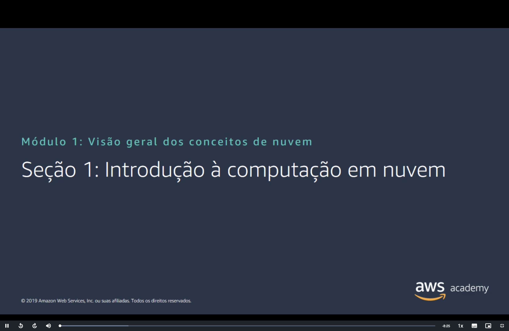
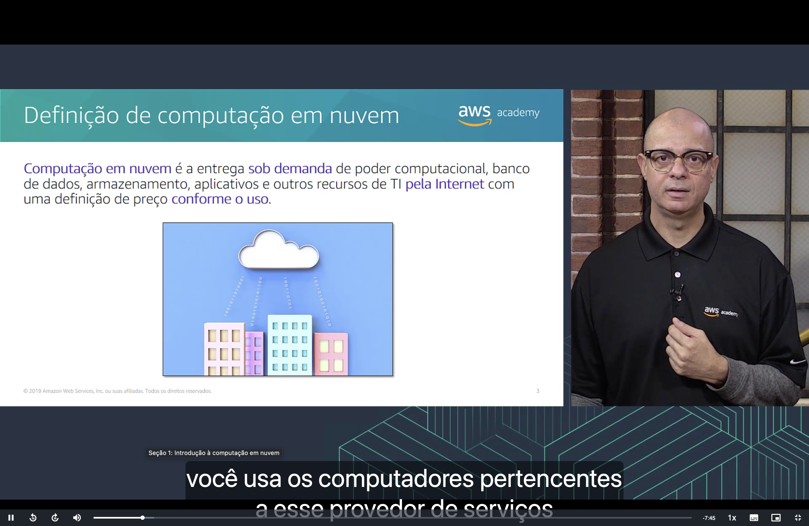
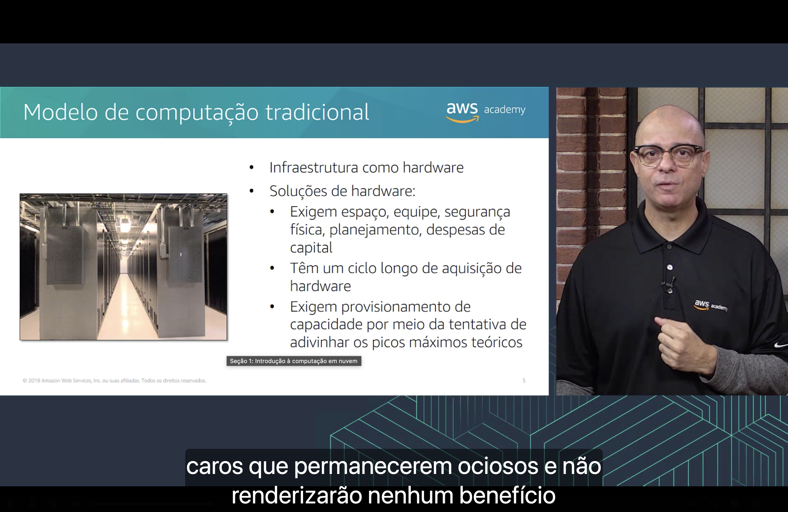
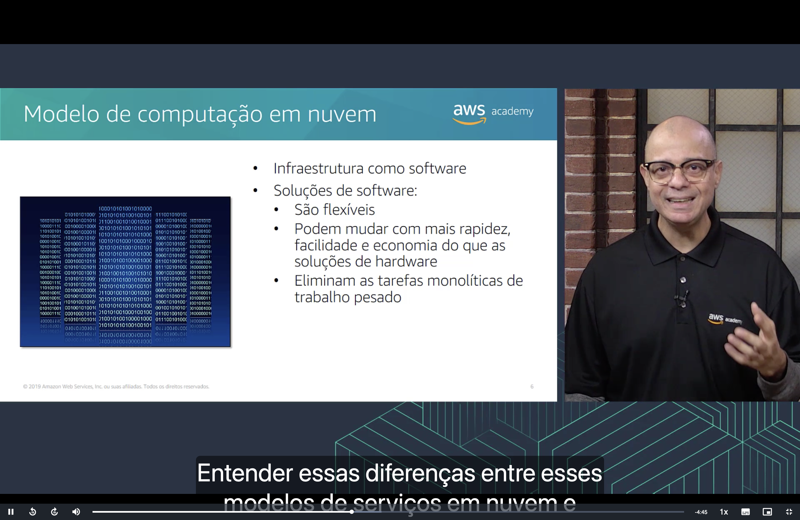
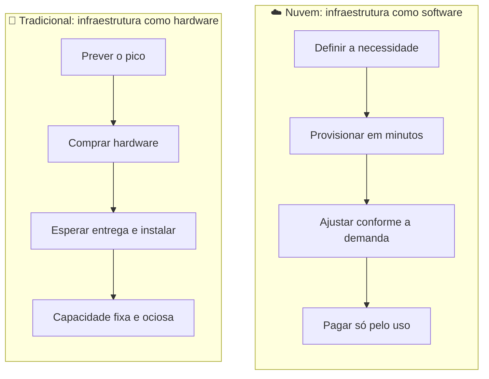
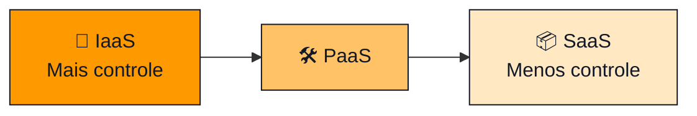
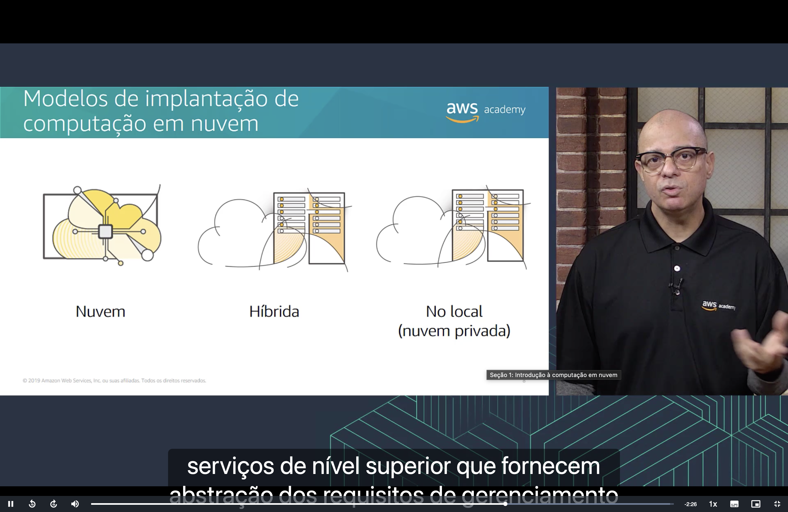
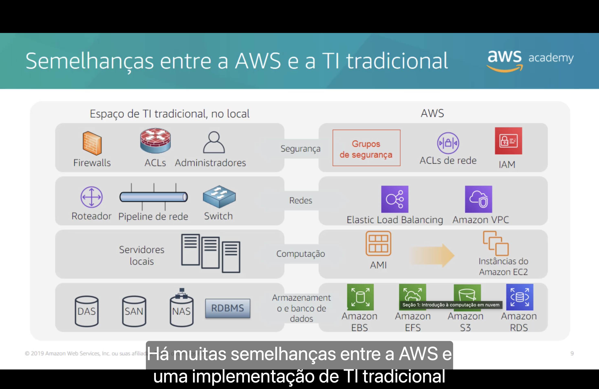

<h1 align="center">☁️ Seção 1 – Introdução à computação em nuvem</h1>

  
  
   
  
  

  <a href="../README.md">🏠 Início</a> &nbsp;•&nbsp;
  <a href="./Seção%202%20-%20Vantagens%20da%20Computação%20em%20Nuvem.md">Próxima: Vantagens da nuvem ➡️</a>

## 📑 Sumário

| # | Tópico |
|:---:|---|
| 1 | [💡 Definição de computação em nuvem](#definicao) |
| 2 | [🏢 Modelo de computação tradicional](#tradicional) |
| 3 | [☁️ Modelo de computação em nuvem](#nuvem) |
| 4 | [🧱 Modelos de serviço em nuvem](#servico) |
| 5 | [🗺️ Modelos de implantação](#implantacao) |
| 6 | [🔁 Semelhanças entre a AWS e a TI tradicional](#semelhancas) |
| 🎯 | [Principais conclusões](#conclusoes) |

---

## 1. 💡 Definição de computação em nuvem

> [!NOTE]
> **Computação em nuvem** é a entrega **sob demanda** de poder computacional, banco de dados, armazenamento, aplicativos e outros recursos de TI **pela Internet**, com uma definição de preço **conforme o uso**.

Em vez de comprar e manter servidores próprios, a empresa usa os computadores pertencentes a um provedor de serviços (como a AWS) e paga apenas pelo que consumir.

| ⚡ Sob demanda | 🌐 Pela Internet | 💳 Pagamento conforme o uso |
|---|---|---|
| Os recursos ficam disponíveis no momento em que são necessários, sem esperar a compra de hardware. | Tudo é acessado e gerenciado remotamente. | Não há investimento inicial alto; o custo acompanha o consumo real. |

## 2. 🏢 Modelo de computação tradicional

No modelo tradicional, a **infraestrutura é tratada como hardware**. As soluções de hardware:

- 🏗️ Exigem **espaço, equipe, segurança física, planejamento e despesas de capital** (CapEx).
- 🐢 Têm um **ciclo longo de aquisição** de hardware.
- 🎲 Exigem **provisionamento de capacidade por meio da tentativa de adivinhar os picos máximos teóricos**.

> [!WARNING]
> Para não faltar capacidade nos picos, a empresa compra servidores caros que passam boa parte do tempo **ociosos** e não geram nenhum benefício. Se a estimativa for baixa demais, faltam recursos e a aplicação fica lenta ou indisponível.

## 3. ☁️ Modelo de computação em nuvem

Na nuvem, a **infraestrutura é tratada como software**. As soluções de software:

- 🤸 São **flexíveis**.
- 🚀 Podem mudar com **mais rapidez, facilidade e economia** do que as soluções de hardware.
- 🧹 **Eliminam as tarefas monolíticas de trabalho pesado** (comprar, instalar, manter e substituir equipamentos físicos).

| | 🏢 Tradicional (hardware) | ☁️ Nuvem (software) |
|---|---|---|
| **Aquisição** | 🐢 Ciclo longo de compra | ⚡ Recursos em minutos |
| **Capacidade** | 🎲 Estimada pelo pico máximo | 📈 Ajustada à demanda real |
| **Custo** | 💰 Despesa de capital antecipada | 💳 Despesa variável, conforme o uso |
| **Manutenção** | 👷 Equipe própria, espaço e segurança física | 🤝 Responsabilidade do provedor |

## 4. 🧱 Modelos de serviço em nuvem

Existem três modelos principais. Quanto mais à direita, **menos controle** o cliente tem sobre os recursos de TI e **menos coisas precisa gerenciar**.

| Modelo | O que entrega | Exemplo |
|---|---|---|
| 🔧 **IaaS** – Infraestrutura como serviço | Os blocos básicos de TI (rede, computadores virtuais, armazenamento). Dá **mais controle** sobre os recursos e é o modelo mais parecido com a TI tradicional. | Amazon EC2 |
| 🛠️ **PaaS** – Plataforma como serviço | Elimina a necessidade de gerenciar a infraestrutura subjacente (hardware e sistema operacional). O cliente se concentra em implantar e gerenciar suas aplicações. | AWS Elastic Beanstalk |
| 📦 **SaaS** – Software como serviço | Um produto completo, executado e gerenciado pelo provedor. O usuário só usa o software, normalmente pelo navegador. | E-mail na web |

### 📊 Quem gerencia o quê?

| Camada | 🔧 IaaS | 🛠️ PaaS | 📦 SaaS |
|---|:---:|:---:|:---:|
| Aplicações e dados | 👤 Cliente | 👤 Cliente | ☁️ Provedor |
| Runtime, middleware e sistema operacional | 👤 Cliente | ☁️ Provedor | ☁️ Provedor |
| Virtualização, servidores, armazenamento e rede | ☁️ Provedor | ☁️ Provedor | ☁️ Provedor |

## 5. 🗺️ Modelos de implantação de computação em nuvem

| Modelo | Como funciona | Quando faz sentido |
|---|---|---|
| ☁️ **Nuvem** | A aplicação roda inteiramente na nuvem. Pode ter sido criada na nuvem ou migrada de uma infraestrutura existente, usando desde a infraestrutura básica até serviços de nível superior, que abstraem os requisitos de gerenciamento, escalabilidade e arquitetura. | Aproveitar todos os benefícios da nuvem. |
| 🔀 **Híbrida** | Conecta a infraestrutura e as aplicações na nuvem a recursos que continuam fora dela (no data center da empresa). | Estender a infraestrutura para a nuvem ou migrar aos poucos. |
| 🏢 **No local** (nuvem privada) | Os recursos são implantados no próprio data center da empresa, usando ferramentas de virtualização e gerenciamento. | Ter recursos dedicados, mesmo sem muitos dos benefícios da nuvem. |

## 6. 🔁 Semelhanças entre a AWS e a TI tradicional

Muitos conceitos da TI tradicional têm um equivalente direto na AWS, o que facilita a migração:

| Área | 🏢 TI tradicional (no local) | ☁️ AWS |
|---|---|---|
| 🔒 **Segurança** | Firewalls, ACLs, administradores | Grupos de segurança, ACLs de rede, IAM |
| 🌐 **Redes** | Roteador, pipeline de rede, switch | Elastic Load Balancing, Amazon VPC |
| 🖥️ **Computação** | Servidores locais | AMI → instâncias do Amazon EC2 |
| 💾 **Armazenamento e banco de dados** | DAS, SAN, NAS, RDBMS | Amazon EBS, Amazon EFS, Amazon S3, Amazon RDS |

---

## 🎯 Principais conclusões

- ✅ Computação em nuvem é a entrega **sob demanda** de recursos de TI **pela Internet**, com **pagamento conforme o uso**.
- ✅ Na nuvem, a infraestrutura deixa de ser hardware e passa a ser **software**, o que a torna mais flexível, rápida e econômica.
- ✅ Os três **modelos de serviço** são **IaaS, PaaS e SaaS**, com diferentes níveis de controle.
- ✅ Os três **modelos de implantação** são **nuvem, híbrida e no local (nuvem privada)**.
- ✅ Os serviços da AWS têm equivalentes na TI tradicional nas áreas de **segurança, redes, computação e armazenamento**.

---

  <a href="../README.md">🏠 Início</a> &nbsp;•&nbsp;
  <a href="./Seção%202%20-%20Vantagens%20da%20Computação%20em%20Nuvem.md">Próxima: Vantagens da nuvem ➡️</a>

