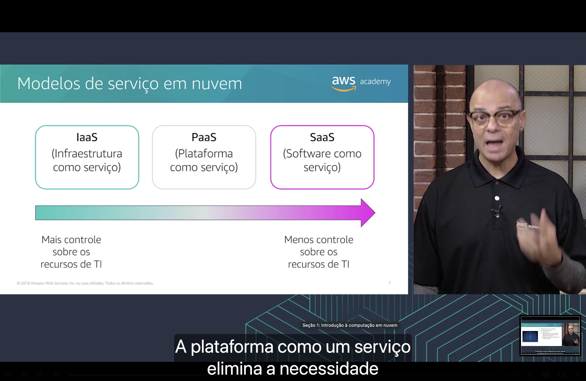

<h1 align="center">Seção 1 – Introdução à computação em nuvem</h1>


## 1. Definição de computação em nuvem


**Computação em nuvem** é a entrega **sob demanda** de poder computacional, banco de dados, armazenamento, aplicativos e outros recursos de TI **pela Internet**, com uma definição de preço **conforme o uso**.

Em vez de comprar e manter servidores próprios, a empresa usa os computadores pertencentes a um provedor de serviços (como a AWS) e paga apenas pelo que consumir.

- **Sob demanda:** os recursos ficam disponíveis no momento em que são necessários, sem esperar a compra de hardware.
- **Pela Internet:** tudo é acessado e gerenciado remotamente.
- **Pagamento conforme o uso:** não há investimento inicial alto; o custo acompanha o consumo real.

## 2. Modelo de computação tradicional


No modelo tradicional, a **infraestrutura é tratada como hardware**. As soluções de hardware:

- Exigem **espaço, equipe, segurança física, planejamento e despesas de capital** (CapEx).
- Têm um **ciclo longo de aquisição** de hardware.
- Exigem **provisionamento de capacidade por meio da tentativa de adivinhar os picos máximos teóricos**.

O resultado é que, para não faltar capacidade nos picos, a empresa compra servidores caros que passam boa parte do tempo **ociosos** e não geram nenhum benefício. Se a estimativa for baixa demais, faltam recursos e a aplicação fica lenta ou indisponível.

## 3. Modelo de computação em nuvem


Na nuvem, a **infraestrutura é tratada como software**. As soluções de software:

- São **flexíveis**.
- Podem mudar com **mais rapidez, facilidade e economia** do que as soluções de hardware.
- **Eliminam as tarefas monolíticas de trabalho pesado** (comprar, instalar, manter e substituir equipamentos físicos).

| | Tradicional (hardware) | Nuvem (software) |
|---|---|---|
| Aquisição | Ciclo longo de compra | Recursos em minutos |
| Capacidade | Estimada pelo pico máximo | Ajustada à demanda real |
| Custo | Despesa de capital antecipada | Despesa variável, conforme o uso |
| Manutenção | Equipe própria, espaço e segurança física | Responsabilidade do provedor |

## 4. Modelos de serviço em nuvem



Existem três modelos principais. Quanto mais à direita, **menos controle** o cliente tem sobre os recursos de TI e **menos coisas precisa gerenciar**.

- **IaaS – Infraestrutura como serviço:** oferece os blocos básicos de TI (rede, computadores virtuais, armazenamento). Dá **mais controle** sobre os recursos e é o modelo mais parecido com a TI tradicional. Ex.: Amazon EC2.
- **PaaS – Plataforma como serviço:** elimina a necessidade de gerenciar a infraestrutura subjacente (hardware e sistema operacional). O cliente se concentra em implantar e gerenciar suas aplicações. Ex.: AWS Elastic Beanstalk.
- **SaaS – Software como serviço:** entrega um produto completo, executado e gerenciado pelo provedor. O usuário só usa o software, normalmente pelo navegador. Ex.: e-mail na web.

```
IaaS ──────────────► PaaS ──────────────► SaaS
Mais controle                       Menos controle
sobre os recursos de TI         sobre os recursos de TI
```

## 5. Modelos de implantação de computação em nuvem


- **Nuvem:** a aplicação roda inteiramente na nuvem. Pode ter sido criada na nuvem ou migrada de uma infraestrutura existente. Pode usar desde a infraestrutura básica até serviços de nível superior, que abstraem os requisitos de gerenciamento, escalabilidade e arquitetura.
- **Híbrida:** conecta a infraestrutura e as aplicações na nuvem a recursos que continuam fora dela (no data center da empresa). É comum quando a organização quer estender sua infraestrutura para a nuvem ou migrar aos poucos.
- **No local (nuvem privada):** os recursos são implantados no próprio data center da empresa, usando ferramentas de virtualização e gerenciamento. Não tem muitos dos benefícios da nuvem, mas pode ser escolhida para ter recursos dedicados.

## 6. Semelhanças entre a AWS e a TI tradicional


Muitos conceitos da TI tradicional têm um equivalente direto na AWS, o que facilita a migração:

| Área | TI tradicional (no local) | AWS |
|---|---|---|
| **Segurança** | Firewalls, ACLs, administradores | Grupos de segurança, ACLs de rede, IAM |
| **Redes** | Roteador, pipeline de rede, switch | Elastic Load Balancing, Amazon VPC |
| **Computação** | Servidores locais | AMI → instâncias do Amazon EC2 |
| **Armazenamento e banco de dados** | DAS, SAN, NAS, RDBMS | Amazon EBS, Amazon EFS, Amazon S3, Amazon RDS |

## Principais conclusões

- Computação em nuvem é a entrega **sob demanda** de recursos de TI **pela Internet**, com **pagamento conforme o uso**.
- Na nuvem, a infraestrutura deixa de ser hardware e passa a ser **software**, o que a torna mais flexível, rápida e econômica.
- Os três **modelos de serviço** são **IaaS, PaaS e SaaS**, com diferentes níveis de controle.
- Os três **modelos de implantação** são **nuvem, híbrida e no local (nuvem privada)**.
- Os serviços da AWS têm equivalentes na TI tradicional nas áreas de **segurança, redes, computação e armazenamento**.