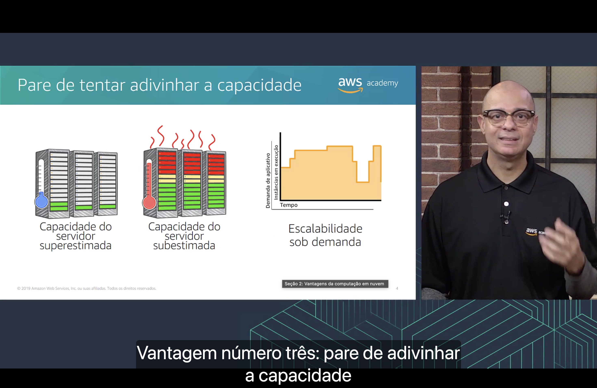

<h2 align="center">Seção 2 – Vantagens da computação em nuvem</h2>

A computação em nuvem oferece **seis vantagens** principais em relação ao modelo tradicional.

## 1. Troque despesas de capital por despesas variáveis

**Despesas de capital** (CapEx) são os fundos que uma empresa usa para adquirir, atualizar e manter ativos físicos, como prédios, equipamentos e servidores.

- **Modelo tradicional:** investimento em datacenter **com base em previsões**, feito antes de saber quanto realmente será usado.
- **Nuvem:** **pague somente pelo que consumir**. O custo passa a ser uma **despesa variável** (OpEx), que acompanha o uso real.

## 2. Beneficie-se de grandes economias de escala

Devido ao **uso agregado de todos os clientes**, a AWS consegue uma **grande economia de escala** e **repassa os descontos** para os clientes na forma de preços menores na fatura.

Ou seja, quanto mais clientes usam a nuvem, mais barato fica para cada um.

## 3. Pare de tentar adivinhar a capacidade

No modelo tradicional, a capacidade dos servidores é estimada com antecedência, o que gera dois problemas:

- **Capacidade superestimada:** servidores caros ficam **ociosos**, desperdiçando dinheiro.
- **Capacidade subestimada:** os servidores ficam **sobrecarregados** e a aplicação fica lenta ou indisponível.

Na nuvem há **escalabilidade sob demanda**: a quantidade de instâncias em execução **acompanha a demanda da aplicação** ao longo do tempo, aumentando ou diminuindo conforme necessário.

## 4. Aumente a velocidade e a agilidade

| Tradicional | Nuvem |
|---|---|
| **Semanas** para obter os recursos desejados (solicitação de compra, aprovações, pedido, entrega, instalação) | **Minutos** para obter os recursos desejados (basta clicar em "Executar") |

Como os recursos ficam disponíveis rapidamente, a empresa pode **experimentar e inovar** com custo e tempo muito menores.

## 5. Pare de gastar dinheiro com a operação e manutenção de datacenters

Manter um datacenter próprio envolve custos com **folha de pagamento, utilitários (energia, refrigeração), manutenção, ambientação e hardware**.

Com a nuvem, esse **investimento** deixa de ir para a infraestrutura e pode ser direcionado ao que realmente diferencia a empresa: **seus negócios e seus clientes**.

## 6. Tenha alcance global em minutos

Pelo console da AWS é possível implantar uma aplicação em **várias regiões do mundo** com apenas alguns cliques.

Como resultado, a empresa consegue oferecer **menor latência** e uma **melhor experiência** para clientes em qualquer lugar, com custo mínimo.

## Principais conclusões

- Trocar **despesas de capital** por **despesas variáveis**: pagar só pelo que usar.
- Aproveitar a **economia de escala** da AWS, que se traduz em preços menores.
- Parar de **adivinhar a capacidade**, escalando sob demanda.
- Ganhar **velocidade e agilidade**: recursos em minutos, não em semanas.
- Parar de gastar com **operação e manutenção de datacenters** e focar no negócio.
- Ter **alcance global em minutos**, com menor latência para os usuários.