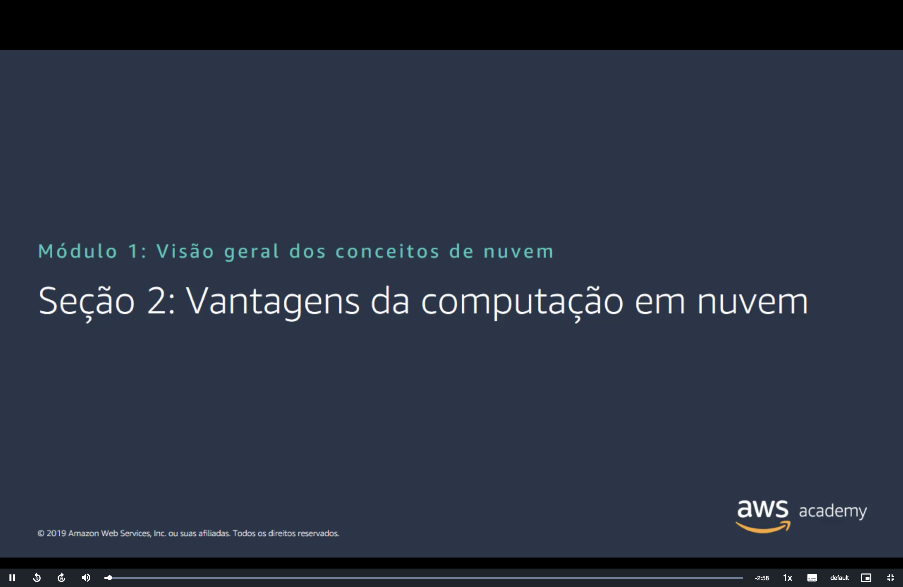
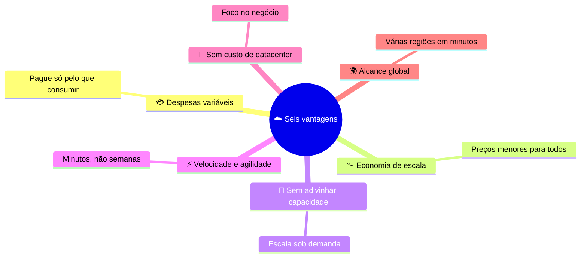
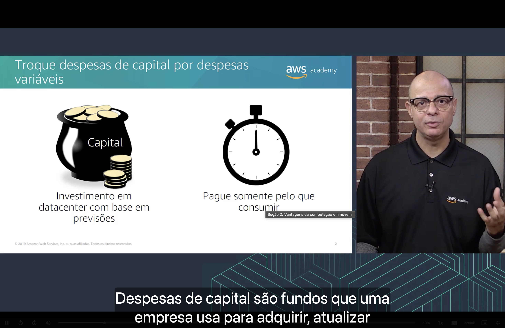
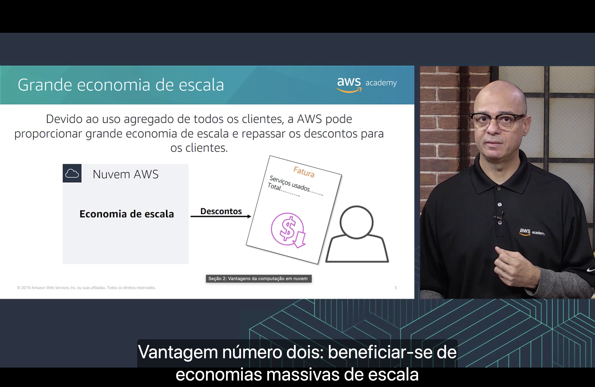
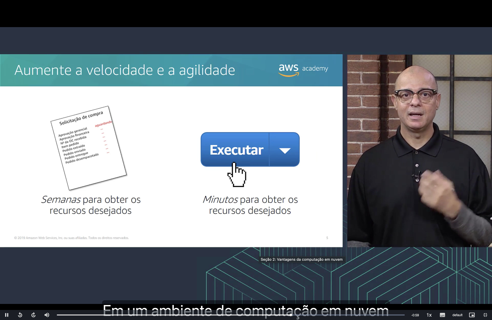
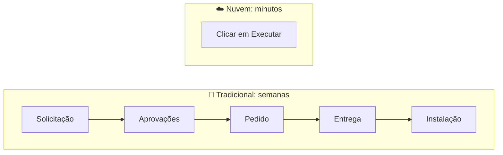
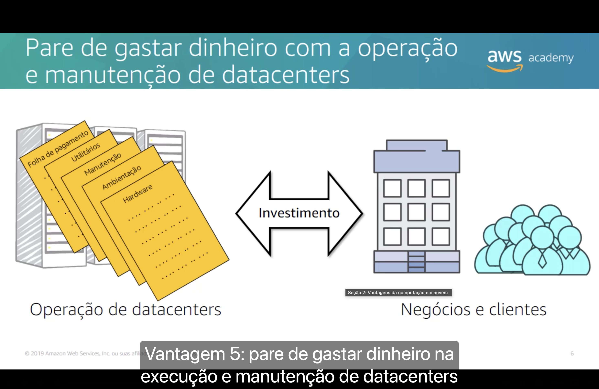
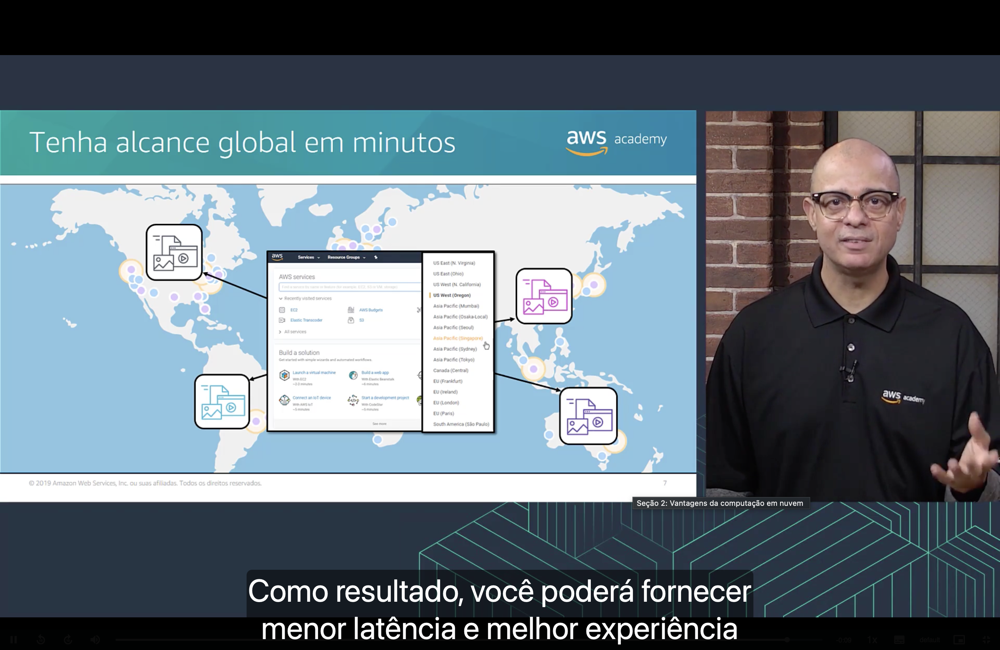

<h1 align="center">🚀 Seção 2 – Vantagens da computação em nuvem</h1>

  
  
   
  
  

  <a href="../README.md">🏠 Início</a> &nbsp;•&nbsp;
  <a href="./Seção%201%20-%20%20Introdução%20à%20computação%20em%20nuvem.md">⬅️ Anterior: Introdução à nuvem</a> &nbsp;•&nbsp;
  <a href="./Seção%203%20-%20Introdução%20à%20Amazon%20Web%20Services%20(AWS).md">Próxima: Introdução à AWS ➡️</a>

A computação em nuvem oferece **seis vantagens** principais em relação ao modelo tradicional.

## 📑 Sumário

| # | Vantagem | Ideia-chave |
|:---:|---|---|
| 1 | [💳 Troque despesas de capital por despesas variáveis](#despesas) | Pague só pelo que consumir |
| 2 | [📉 Beneficie-se de grandes economias de escala](#escala) | Uso agregado = preços menores |
| 3 | [🎯 Pare de tentar adivinhar a capacidade](#capacidade) | Escala sob demanda |
| 4 | [⚡ Aumente a velocidade e a agilidade](#agilidade) | Minutos, não semanas |
| 5 | [🏢 Pare de gastar com datacenters](#datacenters) | Invista no negócio |
| 6 | [🌍 Tenha alcance global em minutos](#global) | Menor latência para o usuário |
| 🎯 | [Principais conclusões](#conclusoes) | |

---

## 1. 💳 Troque despesas de capital por despesas variáveis

> [!NOTE]
> **Despesas de capital** (CapEx) são os fundos que uma empresa usa para adquirir, atualizar e manter ativos físicos, como prédios, equipamentos e servidores.

| 🏢 Modelo tradicional | ☁️ Nuvem |
|---|---|
| Investimento em datacenter **com base em previsões**, feito antes de saber quanto realmente será usado. | **Pague somente pelo que consumir**. O custo passa a ser uma **despesa variável** (OpEx), que acompanha o uso real. |

## 2. 📉 Beneficie-se de grandes economias de escala

Devido ao **uso agregado de todos os clientes**, a AWS consegue uma **grande economia de escala** e **repassa os descontos** para os clientes na forma de preços menores na fatura.

> [!TIP]
> Quanto mais clientes usam a nuvem, mais barato fica para cada um.

## 3. 🎯 Pare de tentar adivinhar a capacidade

No modelo tradicional, a capacidade dos servidores é estimada com antecedência, o que gera dois problemas:

| Cenário | Consequência |
|---|---|
| 📦 **Capacidade superestimada** | Servidores caros ficam **ociosos**, desperdiçando dinheiro. |
| 🔥 **Capacidade subestimada** | Os servidores ficam **sobrecarregados** e a aplicação fica lenta ou indisponível. |
| ☁️ **Escalabilidade sob demanda** (nuvem) | A quantidade de instâncias em execução **acompanha a demanda da aplicação** ao longo do tempo, aumentando ou diminuindo conforme necessário. ✅ |

## 4. ⚡ Aumente a velocidade e a agilidade

| 🏢 Tradicional | ☁️ Nuvem |
|---|---|
| 🐢 **Semanas** para obter os recursos desejados (solicitação de compra, aprovações, pedido, entrega, instalação) | ⚡ **Minutos** para obter os recursos desejados (basta clicar em "Executar") |

Como os recursos ficam disponíveis rapidamente, a empresa pode **experimentar e inovar** com custo e tempo muito menores.

## 5. 🏢 Pare de gastar dinheiro com a operação e manutenção de datacenters

Manter um datacenter próprio envolve custos com:

| 👷 Folha de pagamento | ⚡ Utilitários (energia, refrigeração) | 🔧 Manutenção | 🏠 Ambientação | 🖥️ Hardware |
|:---:|:---:|:---:|:---:|:---:|

> [!TIP]
> Com a nuvem, esse **investimento** deixa de ir para a infraestrutura e pode ser direcionado ao que realmente diferencia a empresa: **seus negócios e seus clientes**.

## 6. 🌍 Tenha alcance global em minutos

Pelo console da AWS é possível implantar uma aplicação em **várias regiões do mundo** com apenas alguns cliques.

Como resultado, a empresa consegue oferecer **menor latência** e uma **melhor experiência** para clientes em qualquer lugar, com custo mínimo.

---

## 🎯 Principais conclusões

| # | Vantagem | Resumo |
|:---:|---|---|
| 1 | 💳 **Despesas variáveis** | Trocar despesas de capital por despesas variáveis: pagar só pelo que usar. |
| 2 | 📉 **Economia de escala** | Aproveitar a economia de escala da AWS, que se traduz em preços menores. |
| 3 | 🎯 **Capacidade** | Parar de adivinhar a capacidade, escalando sob demanda. |
| 4 | ⚡ **Velocidade e agilidade** | Recursos em minutos, não em semanas. |
| 5 | 🏢 **Datacenters** | Parar de gastar com operação e manutenção de datacenters e focar no negócio. |
| 6 | 🌍 **Alcance global** | Implantar em minutos, com menor latência para os usuários. |

---

  <a href="../README.md">🏠 Início</a> &nbsp;•&nbsp;
  <a href="./Seção%201%20-%20%20Introdução%20à%20computação%20em%20nuvem.md">⬅️ Anterior: Introdução à nuvem</a> &nbsp;•&nbsp;
  <a href="./Seção%203%20-%20Introdução%20à%20Amazon%20Web%20Services%20(AWS).md">Próxima: Introdução à AWS ➡️</a>

