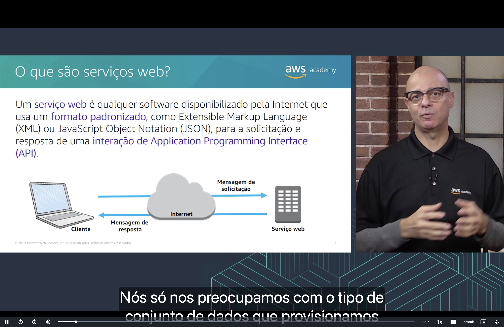
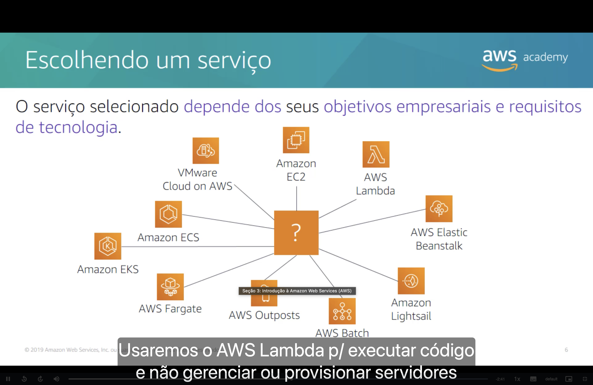
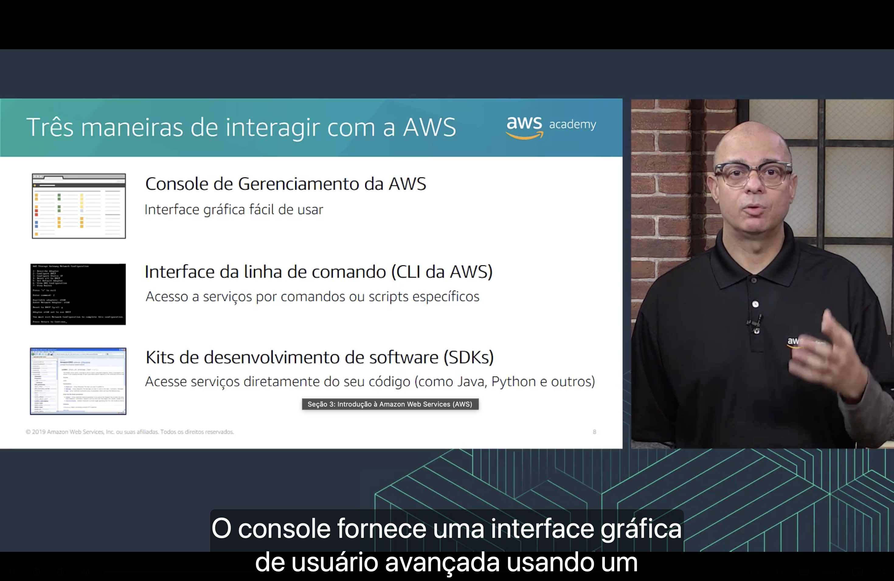

<h1 align="center">Seção 3 – Introdução à Amazon Web Services (AWS)</h1>


## 1. O que são serviços web?



Um **serviço web** é qualquer software disponibilizado **pela Internet** que usa um **formato padronizado**, como **XML** (Extensible Markup Language) ou **JSON** (JavaScript Object Notation), para a solicitação e a resposta de uma **interação de API** (Application Programming Interface).

O funcionamento segue um ciclo simples:

1. O **cliente** envia uma **mensagem de solicitação** pela Internet.
2. O **serviço web** processa o pedido.
3. O serviço devolve uma **mensagem de resposta** ao cliente.

```
Cliente ──── solicitação ────► Internet ────► Serviço web
Cliente ◄──── resposta ─────── Internet ◄──── Serviço web
```

Como a comunicação é padronizada, o cliente não precisa saber como o serviço foi construído por dentro; basta saber "conversar" com a API dele. É exatamente assim que os serviços da AWS são expostos e consumidos.

## 2. O que é a AWS?


- A AWS é uma **plataforma de nuvem segura** que oferece um **amplo conjunto de produtos globais baseados na nuvem**.
- Oferece **acesso sob demanda** a recursos de computação, armazenamento, rede, banco de dados e outros recursos de TI, além de ferramentas de gerenciamento.
- Oferece **flexibilidade**: é possível escolher apenas os serviços necessários e ajustá-los a qualquer momento.
- Você **paga apenas pelos serviços individuais de que precisa**, **pelo tempo que os utilizar**.
- Os serviços da AWS **funcionam juntos como componentes básicos**, que podem ser combinados para montar soluções completas.

## 3. Escolhendo um serviço



O serviço selecionado **depende dos seus objetivos empresariais e requisitos de tecnologia**. Só na área de computação, por exemplo, há várias opções para resolver problemas diferentes:

| Serviço | Quando faz sentido |
|---|---|
| **Amazon EC2** | Controle total sobre servidores virtuais (instâncias) |
| **AWS Lambda** | Executar código sem provisionar ou gerenciar servidores |
| **AWS Elastic Beanstalk** | Implantar aplicações sem se preocupar com a infraestrutura |
| **Amazon Lightsail** | Servidores virtuais simples, com preço fixo e configuração fácil |
| **AWS Batch** | Executar grandes volumes de tarefas em lote |
| **Amazon ECS / Amazon EKS** | Orquestrar contêineres (ECS é próprio da AWS; EKS usa Kubernetes) |
| **AWS Fargate** | Executar contêineres sem gerenciar servidores |
| **AWS Outposts** | Levar a infraestrutura da AWS para o data center local |
| **VMware Cloud on AWS** | Migrar ambientes VMware existentes para a AWS |

Ou seja, não existe um serviço "certo" universal: a escolha vem da necessidade do projeto.

## 4. Serviços abordados neste curso


| Categoria | Serviços |
|---|---|
| **Computação** | Amazon EC2, AWS Lambda, AWS Elastic Beanstalk, Amazon EC2 Auto Scaling, Amazon ECS, Amazon EKS, Amazon ECR, AWS Fargate |
| **Armazenamento** | Amazon S3, Amazon S3 Glacier, Amazon EFS, Amazon EBS |
| **Banco de dados** | Amazon RDS, Amazon DynamoDB, Amazon Redshift, Amazon Aurora |
| **Redes e entrega de conteúdo** | Amazon VPC, Amazon Route 53, Amazon CloudFront, Elastic Load Balancing |
| **Segurança, identidade e conformidade** | AWS IAM, Amazon Cognito, AWS Shield, AWS Artifact, AWS Key Management Service (KMS) |
| **Gerenciamento e governança** | AWS Trusted Advisor, AWS CloudWatch, AWS CloudTrail, AWS Well-Architected Tool, AWS Auto Scaling, CLI da AWS, AWS Config, Console de Gerenciamento da AWS, AWS Organizations |
| **Gerenciamento de custos** | Relatório de custos e uso da AWS, Orçamentos da AWS (AWS Budgets), AWS Cost Explorer |

## 5. Três maneiras de interagir com a AWS



- **Console de Gerenciamento da AWS:** interface gráfica, acessada pelo navegador, fácil de usar. Ideal para quem está começando ou para tarefas pontuais.
- **Interface da linha de comando (CLI da AWS):** acesso aos serviços por **comandos ou scripts** no terminal. Útil para automatizar tarefas repetitivas.
- **Kits de desenvolvimento de software (SDKs):** acesso aos serviços **diretamente do código** da aplicação (Java, Python, JavaScript e outras linguagens).

Por baixo, as três formas fazem a mesma coisa: chamam as **APIs** dos serviços web da AWS.

## Principais conclusões

- Um **serviço web** é um software disponibilizado pela Internet que se comunica por uma **API** usando formatos padronizados (**XML** ou **JSON**).
- A **AWS** é uma plataforma de nuvem segura, com **acesso sob demanda** a recursos de TI e **pagamento conforme o uso**.
- Os serviços da AWS funcionam como **componentes básicos** que se combinam entre si.
- A escolha do serviço **depende dos objetivos empresariais e dos requisitos técnicos**.
- Os serviços estão organizados em **categorias** (computação, armazenamento, banco de dados, redes, segurança, gerenciamento e custos).
- É possível interagir com a AWS pelo **Console**, pela **CLI** ou pelos **SDKs**.
