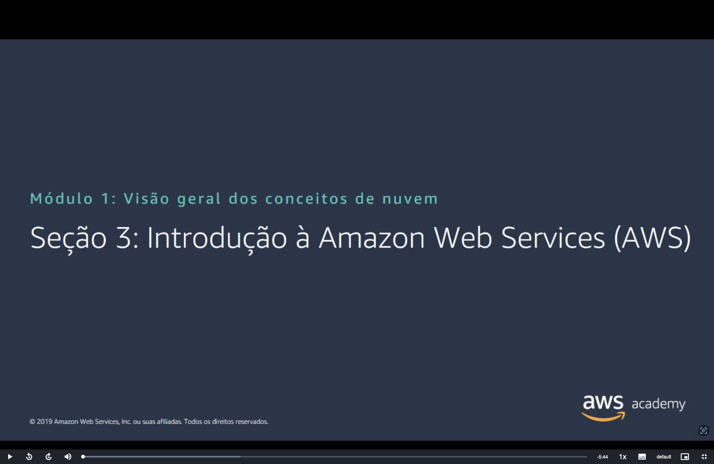
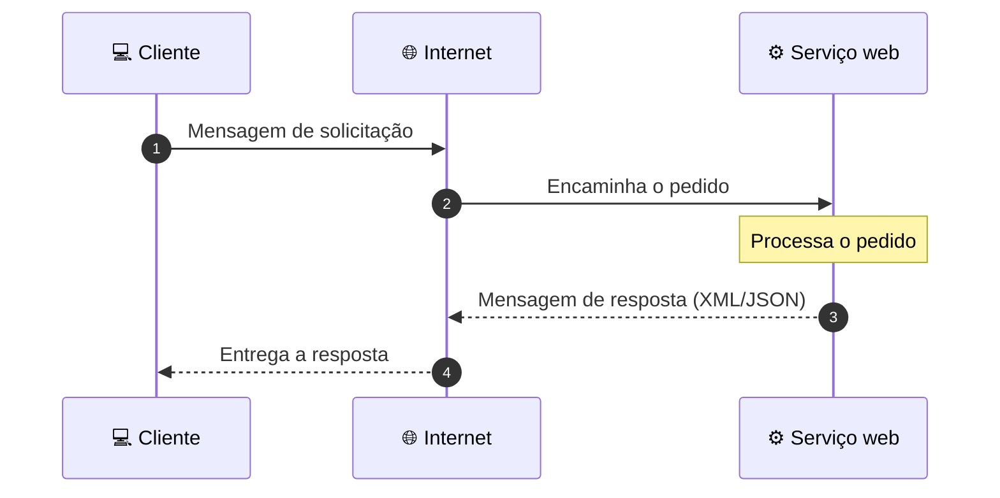
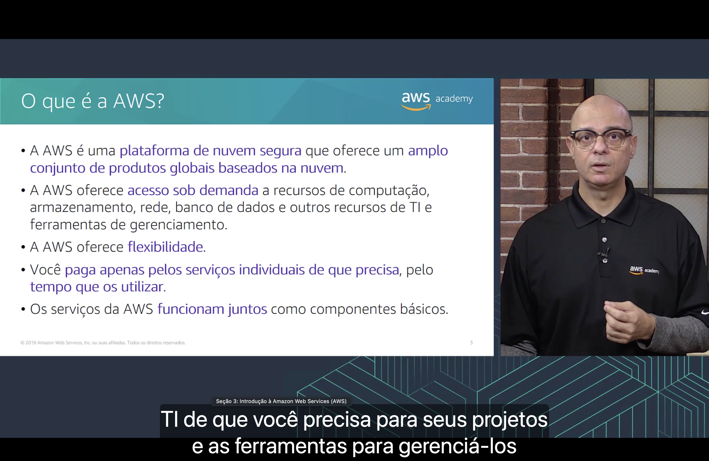
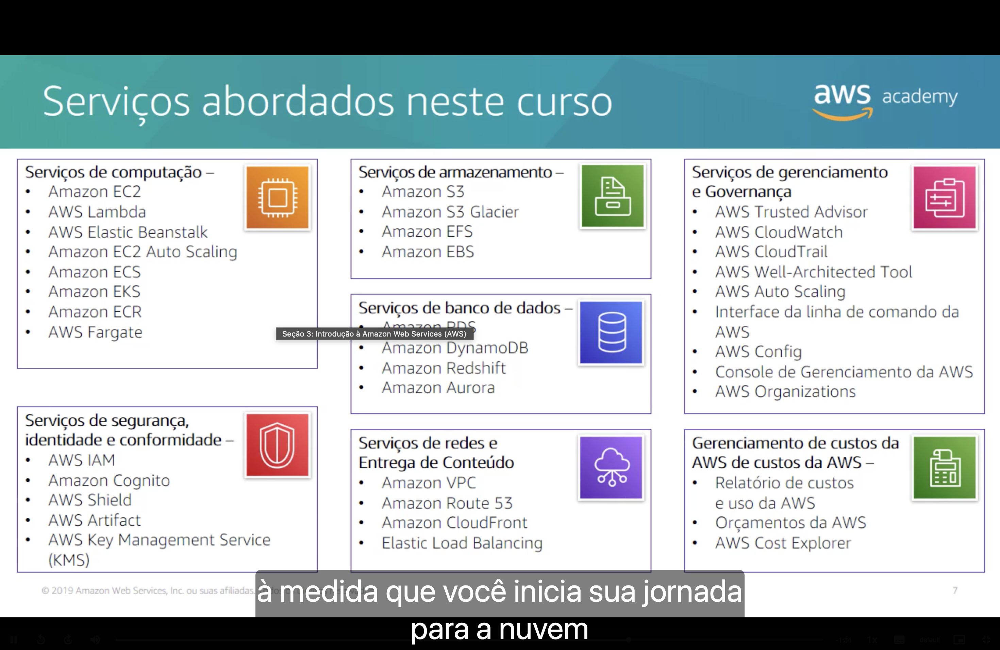
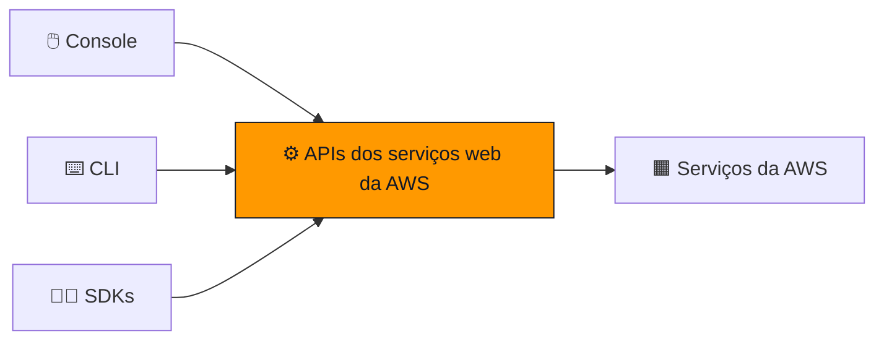

<h1 align="center">🟧 Seção 3 – Introdução à Amazon Web Services (AWS)</h1>

  
  
   
  
  

  <a href="../README.md">🏠 Início</a> &nbsp;•&nbsp;
  <a href="./Seção%202%20-%20Vantagens%20da%20Computação%20em%20Nuvem.md">⬅️ Anterior: Vantagens da nuvem</a> &nbsp;•&nbsp;
  <a href="./Seção%204%20-%20Mudança%20para%20a%20Nuvem%20AWS%20–%20AWS%20Cloud%20Adoption%20Framework%20(AWS%20CAF).md">Próxima: AWS CAF ➡️</a>

## 📑 Sumário

| # | Tópico |
|:---:|---|
| 1 | [🌐 O que são serviços web?](#servicos-web) |
| 2 | [🟧 O que é a AWS?](#o-que-e-aws) |
| 3 | [🧭 Escolhendo um serviço](#escolhendo) |
| 4 | [📚 Serviços abordados neste curso](#servicos-curso) |
| 5 | [🖱️ Três maneiras de interagir com a AWS](#interagir) |
| 🎯 | [Principais conclusões](#conclusoes) |

---

## 1. 🌐 O que são serviços web?

> [!NOTE]
> Um **serviço web** é qualquer software disponibilizado **pela Internet** que usa um **formato padronizado**, como **XML** (Extensible Markup Language) ou **JSON** (JavaScript Object Notation), para a solicitação e a resposta de uma **interação de API** (Application Programming Interface).

O funcionamento segue um ciclo simples:

> [!TIP]
> Como a comunicação é padronizada, o cliente não precisa saber como o serviço foi construído por dentro; basta saber "conversar" com a API dele. É exatamente assim que os serviços da AWS são expostos e consumidos.

## 2. 🟧 O que é a AWS?

| | Característica |
|:---:|---|
| 🔒 | Uma **plataforma de nuvem segura** que oferece um **amplo conjunto de produtos globais baseados na nuvem**. |
| ⚡ | **Acesso sob demanda** a recursos de computação, armazenamento, rede, banco de dados e outros recursos de TI, além de ferramentas de gerenciamento. |
| 🤸 | **Flexibilidade**: é possível escolher apenas os serviços necessários e ajustá-los a qualquer momento. |
| 💳 | Você **paga apenas pelos serviços individuais de que precisa**, **pelo tempo que os utilizar**. |
| 🧩 | Os serviços **funcionam juntos como componentes básicos**, que podem ser combinados para montar soluções completas. |

## 3. 🧭 Escolhendo um serviço

O serviço selecionado **depende dos seus objetivos empresariais e requisitos de tecnologia**. Só na área de computação, por exemplo, há várias opções para resolver problemas diferentes:

| Serviço | Quando faz sentido |
|---|---|
| 🖥️ **Amazon EC2** | Controle total sobre servidores virtuais (instâncias) |
| λ **AWS Lambda** | Executar código sem provisionar ou gerenciar servidores |
| 🌱 **AWS Elastic Beanstalk** | Implantar aplicações sem se preocupar com a infraestrutura |
| 💡 **Amazon Lightsail** | Servidores virtuais simples, com preço fixo e configuração fácil |
| 📦 **AWS Batch** | Executar grandes volumes de tarefas em lote |
| 🐳 **Amazon ECS / Amazon EKS** | Orquestrar contêineres (ECS é próprio da AWS; EKS usa Kubernetes) |
| 🚢 **AWS Fargate** | Executar contêineres sem gerenciar servidores |
| 🏢 **AWS Outposts** | Levar a infraestrutura da AWS para o data center local |
| 🔁 **VMware Cloud on AWS** | Migrar ambientes VMware existentes para a AWS |

> [!IMPORTANT]
> Não existe um serviço "certo" universal: a escolha vem da necessidade do projeto.

## 4. 📚 Serviços abordados neste curso

| Categoria | Serviços |
|---|---|
| 🖥️ **Computação** | Amazon EC2, AWS Lambda, AWS Elastic Beanstalk, Amazon EC2 Auto Scaling, Amazon ECS, Amazon EKS, Amazon ECR, AWS Fargate |
| 💾 **Armazenamento** | Amazon S3, Amazon S3 Glacier, Amazon EFS, Amazon EBS |
| 🗄️ **Banco de dados** | Amazon RDS, Amazon DynamoDB, Amazon Redshift, Amazon Aurora |
| 🌐 **Redes e entrega de conteúdo** | Amazon VPC, Amazon Route 53, Amazon CloudFront, Elastic Load Balancing |
| 🔒 **Segurança, identidade e conformidade** | AWS IAM, Amazon Cognito, AWS Shield, AWS Artifact, AWS Key Management Service (KMS) |
| 🧭 **Gerenciamento e governança** | AWS Trusted Advisor, AWS CloudWatch, AWS CloudTrail, AWS Well-Architected Tool, AWS Auto Scaling, CLI da AWS, AWS Config, Console de Gerenciamento da AWS, AWS Organizations |
| 💰 **Gerenciamento de custos** | Relatório de custos e uso da AWS, Orçamentos da AWS (AWS Budgets), AWS Cost Explorer |

## 5. 🖱️ Três maneiras de interagir com a AWS

| Ferramenta | Como funciona | Ideal para |
|---|---|---|
| 🖱️ **Console de Gerenciamento da AWS** | Interface gráfica, acessada pelo navegador, fácil de usar. | Quem está começando ou tarefas pontuais. |
| ⌨️ **Interface da linha de comando (CLI da AWS)** | Acesso aos serviços por **comandos ou scripts** no terminal. | Automatizar tarefas repetitivas. |
| 🧑‍💻 **Kits de desenvolvimento de software (SDKs)** | Acesso aos serviços **diretamente do código** da aplicação (Java, Python, JavaScript e outras linguagens). | Integrar a AWS às aplicações. |

> [!NOTE]
> Por baixo, as três formas fazem a mesma coisa: chamam as **APIs** dos serviços web da AWS.

---

## 🎯 Principais conclusões

- ✅ Um **serviço web** é um software disponibilizado pela Internet que se comunica por uma **API** usando formatos padronizados (**XML** ou **JSON**).
- ✅ A **AWS** é uma plataforma de nuvem segura, com **acesso sob demanda** a recursos de TI e **pagamento conforme o uso**.
- ✅ Os serviços da AWS funcionam como **componentes básicos** que se combinam entre si.
- ✅ A escolha do serviço **depende dos objetivos empresariais e dos requisitos técnicos**.
- ✅ Os serviços estão organizados em **categorias** (computação, armazenamento, banco de dados, redes, segurança, gerenciamento e custos).
- ✅ É possível interagir com a AWS pelo **Console**, pela **CLI** ou pelos **SDKs**.

---

  <a href="../README.md">🏠 Início</a> &nbsp;•&nbsp;
  <a href="./Seção%202%20-%20Vantagens%20da%20Computação%20em%20Nuvem.md">⬅️ Anterior: Vantagens da nuvem</a> &nbsp;•&nbsp;
  <a href="./Seção%204%20-%20Mudança%20para%20a%20Nuvem%20AWS%20–%20AWS%20Cloud%20Adoption%20Framework%20(AWS%20CAF).md">Próxima: AWS CAF ➡️</a>

