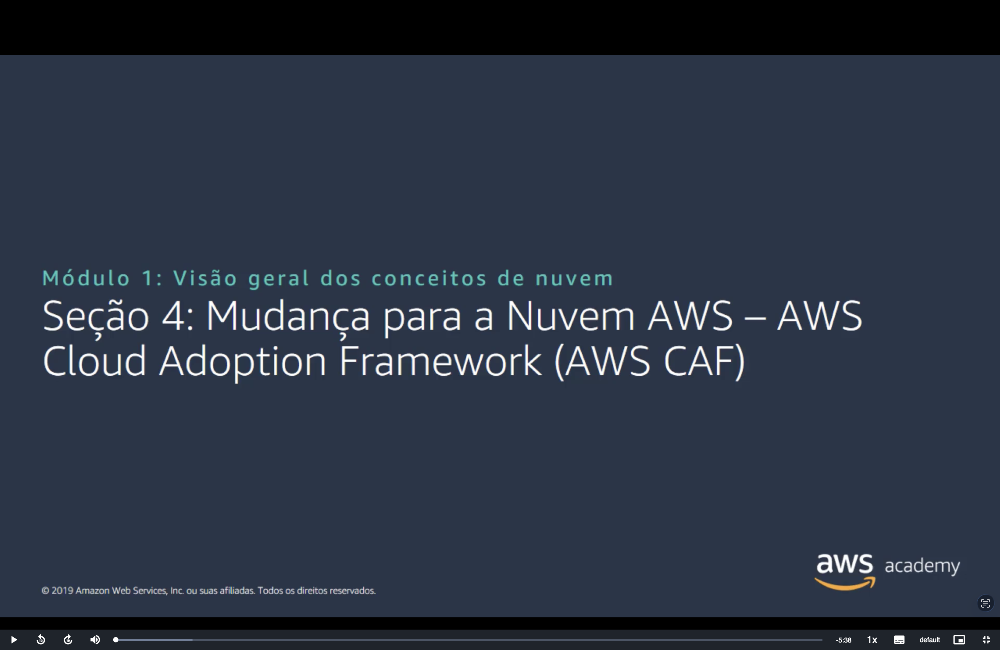
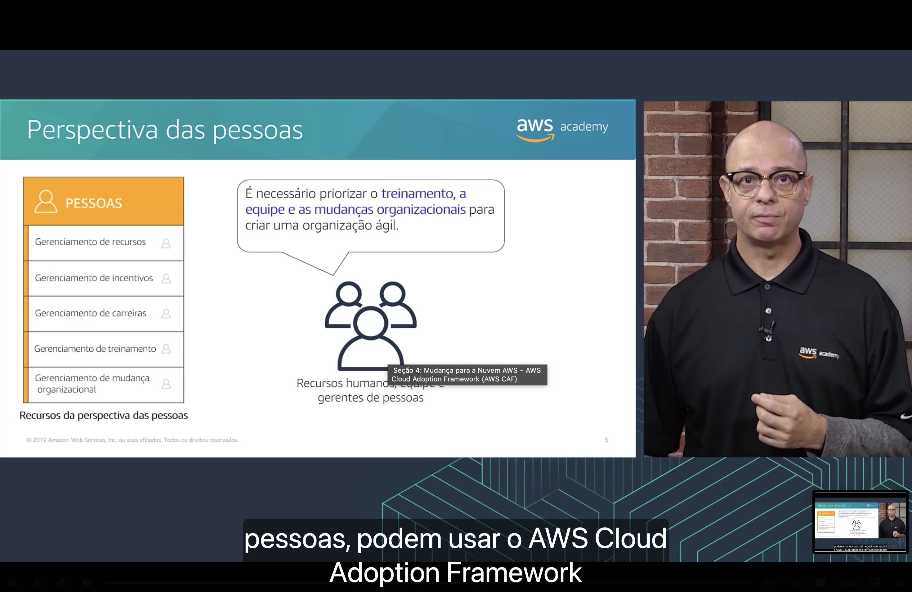
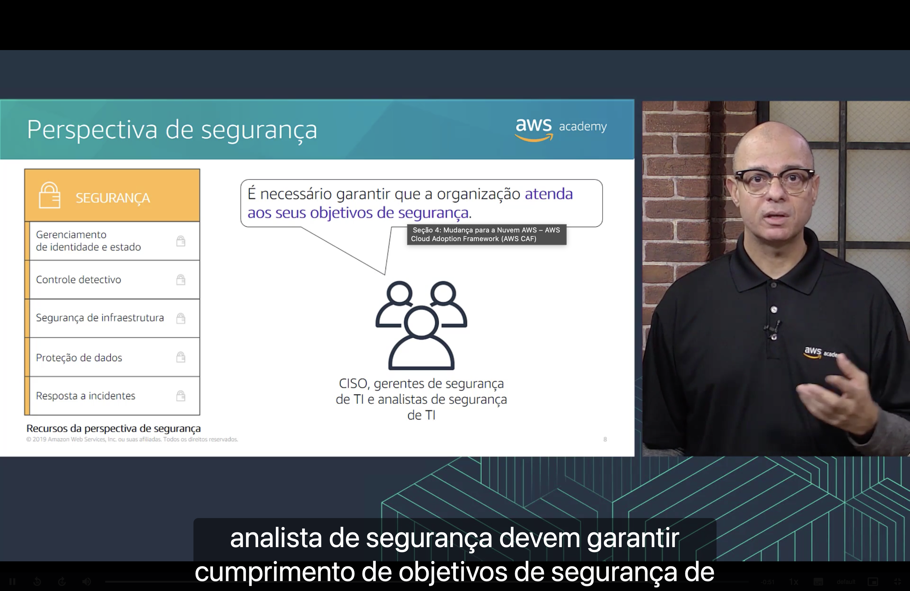

<h1 align="center">Seção 4 – Mudança para a Nuvem AWS – AWS Cloud Adoption Framework (AWS CAF)</h1>

## 1. O que é o AWS CAF?

Migrar para a nuvem não é só uma questão técnica: envolve pessoas, processos, orçamento e estratégia. O **AWS Cloud Adoption Framework (AWS CAF)** existe para organizar essa mudança.

- O AWS CAF oferece **orientação e melhores práticas** para ajudar as organizações a criar uma **abordagem abrangente** para a computação em nuvem, **em toda a organização** e **durante todo o ciclo de vida de TI**, para **acelerar a adoção bem-sucedida da nuvem**.
- O AWS CAF está organizado em **seis perspectivas**.
- Cada perspectiva consiste em um conjunto de **recursos** (capacidades), que indicam quem é responsável pelo quê e o que precisa ser preparado.

## 2. Seis perspectivas principais

As seis perspectivas se dividem em dois grupos:

| Foco nos recursos **empresariais** | Foco nos recursos **técnicos** |
|---|---|
| Negócios | Plataforma |
| Pessoas | Segurança |
| Governança | Operações |

Cada perspectiva tem uma **pergunta central** e um **público** (as partes interessadas), detalhados a seguir.

## 3. Perspectiva empresarial (Negócios)

> É necessário garantir que a **TI esteja alinhada com as necessidades empresariais** e que os investimentos em TI possam ser relacionados a **resultados comerciais demonstráveis**.

- **Partes interessadas:** gerentes de negócios, gerentes financeiros, proprietários de orçamento e partes interessadas da estratégia.
- **Recursos:**
  - Finanças de TI
  - Estratégia de TI
  - Realização de benefícios
  - Gerenciamento de riscos empresariais

Com essa perspectiva, a organização consegue montar um **caso de negócios** sólido para justificar a adoção da nuvem.

## 4. Perspectiva das pessoas

> É necessário priorizar o **treinamento, a equipe e as mudanças organizacionais** para criar uma **organização ágil**.

- **Partes interessadas:** recursos humanos (RH), equipe e gerentes de pessoas.
- **Recursos:**
  - Gerenciamento de recursos
  - Gerenciamento de incentivos
  - Gerenciamento de carreiras
  - Gerenciamento de treinamento
  - Gerenciamento de mudança organizacional

A ideia é preparar as pessoas para novas funções e habilidades que a nuvem exige.

## 5. Perspectiva da governança

> É necessário garantir que **as habilidades e os processos alinhem a estratégia e as metas de TI com a estratégia e as metas empresariais**, para que a organização possa **maximizar o valor empresarial** do investimento em TI e **minimizar os riscos empresariais**.

- **Partes interessadas:** CIO, gerentes de programas, arquitetos empresariais, analistas de negócios e gerentes de portfólio.
- **Recursos:**
  - Gerenciamento de portfólio
  - Gerenciamento de programas e projetos
  - Medição de desempenho empresarial
  - Gerenciamento de licenças

## 6. Perspectiva da plataforma

> É necessário **compreender e comunicar a natureza dos sistemas de TI e seus relacionamentos**. Devemos ter a capacidade de **descrever a arquitetura do ambiente de estado de destino** em detalhes.

- **Partes interessadas:** CTO, gerentes de TI e arquitetos de soluções.
- **Recursos:**
  - Provisionamento de computação
  - Provisionamento de rede
  - Provisionamento de armazenamento
  - Provisionamento de banco de dados
  - Arquitetura de sistemas e soluções
  - Desenvolvimento de aplicativos

Em resumo: definir **como** será a infraestrutura na nuvem, usando padrões arquitetônicos e modelos.

## 7. Perspectiva de segurança

> É necessário garantir que a organização **atenda aos seus objetivos de segurança**.

- **Partes interessadas:** CISO, gerentes de segurança de TI e analistas de segurança de TI.
- **Recursos:**
  - Gerenciamento de identidade e acesso
  - Controle detectivo
  - Segurança de infraestrutura
  - Proteção de dados
  - Resposta a incidentes

Esses recursos cobrem visibilidade, auditabilidade, controle e agilidade na segurança do ambiente em nuvem.

## 8. Perspectiva de operações

> Alinhamos e apoiamos as operações da empresa e **definimos como os negócios serão conduzidos a cada dia, trimestre e ano**.

- **Partes interessadas:** gerentes de operações de TI e gerentes de suporte de TI.
- **Recursos:**
  - Monitoramento de serviços
  - Monitoramento da performance do aplicativo
  - Gerenciamento do inventário de recursos
  - Gerenciamento de versões / gerenciamento de alterações
  - Relatórios e análises
  - Continuidade dos negócios / Recuperação de desastres
  - Catálogo de serviços de TI

## Resumo das perspectivas

| Perspectiva | Foco | Partes interessadas |
|---|---|---|
| **Negócios** | TI alinhada às necessidades e resultados do negócio | Gerentes de negócios e financeiros, donos de orçamento, estratégia |
| **Pessoas** | Treinamento, equipe e mudança organizacional | RH, equipe, gerentes de pessoas |
| **Governança** | Alinhar metas de TI às metas do negócio, maximizando valor e reduzindo riscos | CIO, gerentes de programas, arquitetos empresariais, analistas de negócios, gerentes de portfólio |
| **Plataforma** | Arquitetura e implementação da infraestrutura na nuvem | CTO, gerentes de TI, arquitetos de soluções |
| **Segurança** | Cumprir os objetivos de segurança | CISO, gerentes e analistas de segurança de TI |
| **Operações** | Executar, operar e recuperar as cargas de trabalho no dia a dia | Gerentes de operações e de suporte de TI |

## Principais conclusões

- A adoção da nuvem exige mudanças **em toda a organização**, não apenas na tecnologia.
- O **AWS CAF** fornece **orientação e melhores práticas** para planejar e acelerar essa adoção.
- O AWS CAF é organizado em **seis perspectivas**: **Negócios, Pessoas e Governança** (foco empresarial) e **Plataforma, Segurança e Operações** (foco técnico).
- Cada perspectiva é formada por um conjunto de **recursos** e envolve **partes interessadas** específicas.
