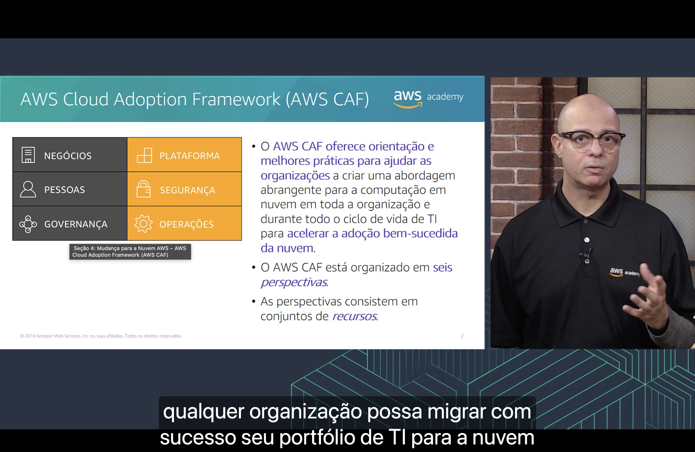
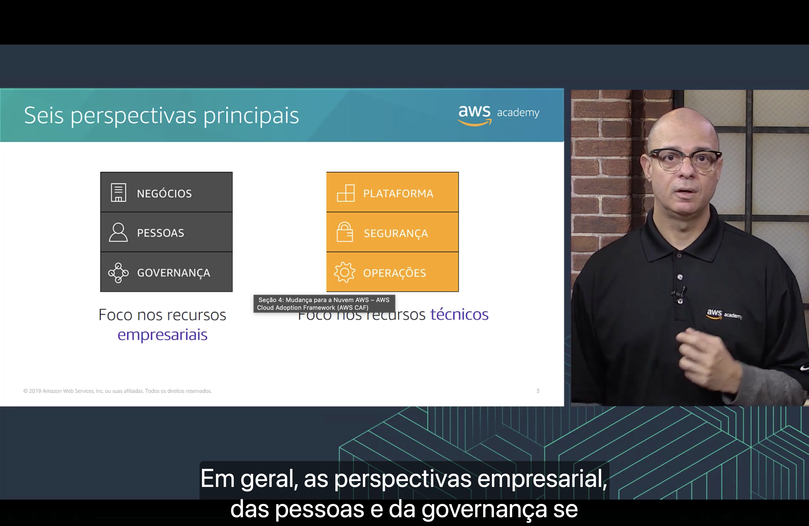
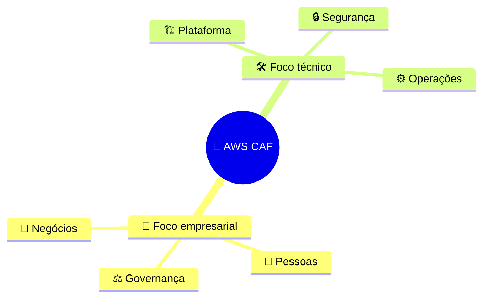
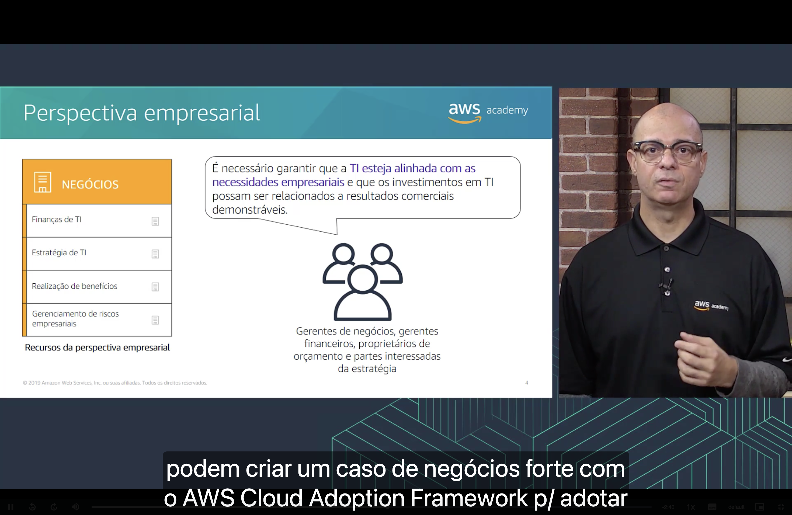
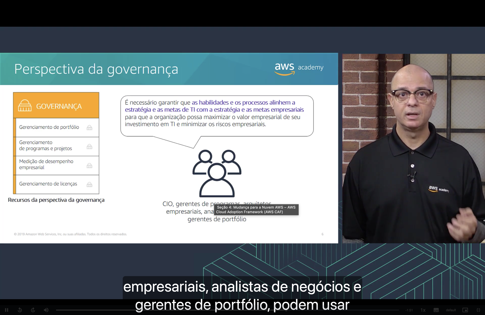
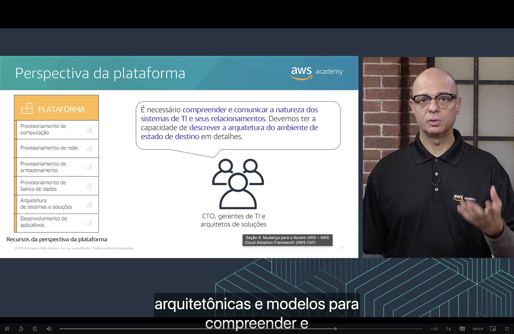
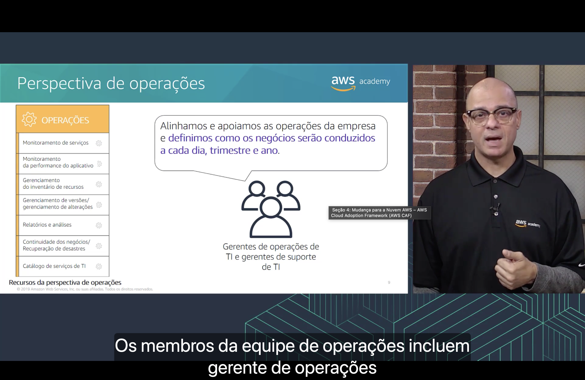

<h1 align="center">🧭 Seção 4 – Mudança para a Nuvem AWS – AWS Cloud Adoption Framework (AWS CAF)</h1>

  
  
   
  
  

  <a href="../README.md">🏠 Início</a> &nbsp;•&nbsp;
  <a href="./Seção%203%20-%20Introdução%20à%20Amazon%20Web%20Services%20(AWS).md">⬅️ Anterior: Introdução à AWS</a> &nbsp;•&nbsp;
  <a href="./Seção%205%20-%20Conclusão%20do%20Módulo%201.md">Próxima: Conclusão do Módulo 1 ➡️</a>

## 📑 Sumário

| # | Tópico |
|:---:|---|
| 1 | [❓ O que é o AWS CAF?](#o-que-e) |
| 2 | [🧩 Seis perspectivas principais](#seis-perspectivas) |
| 3 | [💼 Perspectiva empresarial (Negócios)](#negocios) |
| 4 | [👥 Perspectiva das pessoas](#pessoas) |
| 5 | [⚖️ Perspectiva da governança](#governanca) |
| 6 | [🏗️ Perspectiva da plataforma](#plataforma) |
| 7 | [🔒 Perspectiva de segurança](#seguranca) |
| 8 | [⚙️ Perspectiva de operações](#operacoes) |
| 📋 | [Resumo das perspectivas](#resumo) |
| 🎯 | [Principais conclusões](#conclusoes) |

---

## 1. ❓ O que é o AWS CAF?

Migrar para a nuvem não é só uma questão técnica: envolve pessoas, processos, orçamento e estratégia. O **AWS Cloud Adoption Framework (AWS CAF)** existe para organizar essa mudança.

> [!NOTE]
> O AWS CAF oferece **orientação e melhores práticas** para ajudar as organizações a criar uma **abordagem abrangente** para a computação em nuvem, **em toda a organização** e **durante todo o ciclo de vida de TI**, para **acelerar a adoção bem-sucedida da nuvem**.

- 🧩 O AWS CAF está organizado em **seis perspectivas**.
- 🛠️ Cada perspectiva consiste em um conjunto de **recursos** (capacidades), que indicam quem é responsável pelo quê e o que precisa ser preparado.

## 2. 🧩 Seis perspectivas principais

As seis perspectivas se dividem em dois grupos:

| 💼 Foco nos recursos **empresariais** | 🛠️ Foco nos recursos **técnicos** |
|---|---|
| 💼 Negócios | 🏗️ Plataforma |
| 👥 Pessoas | 🔒 Segurança |
| ⚖️ Governança | ⚙️ Operações |

Cada perspectiva tem uma **pergunta central** e um **público** (as partes interessadas), detalhados a seguir.

## 3. 💼 Perspectiva empresarial (Negócios)

> [!IMPORTANT]
> É necessário garantir que a **TI esteja alinhada com as necessidades empresariais** e que os investimentos em TI possam ser relacionados a **resultados comerciais demonstráveis**.

| 👤 Partes interessadas | 🛠️ Recursos |
|---|---|
| Gerentes de negócios Gerentes financeiros Proprietários de orçamento Partes interessadas da estratégia | Finanças de TI Estratégia de TI Realização de benefícios Gerenciamento de riscos empresariais |

Com essa perspectiva, a organização consegue montar um **caso de negócios** sólido para justificar a adoção da nuvem.

## 4. 👥 Perspectiva das pessoas

> [!IMPORTANT]
> É necessário priorizar o **treinamento, a equipe e as mudanças organizacionais** para criar uma **organização ágil**.

| 👤 Partes interessadas | 🛠️ Recursos |
|---|---|
| Recursos humanos (RH) Equipe Gerentes de pessoas | Gerenciamento de recursos Gerenciamento de incentivos Gerenciamento de carreiras Gerenciamento de treinamento Gerenciamento de mudança organizacional |

A ideia é preparar as pessoas para novas funções e habilidades que a nuvem exige.

## 5. ⚖️ Perspectiva da governança

> [!IMPORTANT]
> É necessário garantir que **as habilidades e os processos alinhem a estratégia e as metas de TI com a estratégia e as metas empresariais**, para que a organização possa **maximizar o valor empresarial** do investimento em TI e **minimizar os riscos empresariais**.

| 👤 Partes interessadas | 🛠️ Recursos |
|---|---|
| CIO Gerentes de programas Arquitetos empresariais Analistas de negócios Gerentes de portfólio | Gerenciamento de portfólio Gerenciamento de programas e projetos Medição de desempenho empresarial Gerenciamento de licenças |

## 6. 🏗️ Perspectiva da plataforma

> [!IMPORTANT]
> É necessário **compreender e comunicar a natureza dos sistemas de TI e seus relacionamentos**. Devemos ter a capacidade de **descrever a arquitetura do ambiente de estado de destino** em detalhes.

| 👤 Partes interessadas | 🛠️ Recursos |
|---|---|
| CTO Gerentes de TI Arquitetos de soluções | Provisionamento de computação Provisionamento de rede Provisionamento de armazenamento Provisionamento de banco de dados Arquitetura de sistemas e soluções Desenvolvimento de aplicativos |

Em resumo: definir **como** será a infraestrutura na nuvem, usando padrões arquitetônicos e modelos.

## 7. 🔒 Perspectiva de segurança

> [!IMPORTANT]
> É necessário garantir que a organização **atenda aos seus objetivos de segurança**.

| 👤 Partes interessadas | 🛠️ Recursos |
|---|---|
| CISO Gerentes de segurança de TI Analistas de segurança de TI | Gerenciamento de identidade e acesso Controle detectivo Segurança de infraestrutura Proteção de dados Resposta a incidentes |

Esses recursos cobrem visibilidade, auditabilidade, controle e agilidade na segurança do ambiente em nuvem.

## 8. ⚙️ Perspectiva de operações

> [!IMPORTANT]
> Alinhamos e apoiamos as operações da empresa e **definimos como os negócios serão conduzidos a cada dia, trimestre e ano**.

| 👤 Partes interessadas | 🛠️ Recursos |
|---|---|
| Gerentes de operações de TI Gerentes de suporte de TI | Monitoramento de serviços Monitoramento da performance do aplicativo Gerenciamento do inventário de recursos Gerenciamento de versões / gerenciamento de alterações Relatórios e análises Continuidade dos negócios / Recuperação de desastres Catálogo de serviços de TI |

---

## 📋 Resumo das perspectivas

| Grupo | Perspectiva | Foco | Partes interessadas |
|:---:|---|---|---|
| 💼 | **Negócios** | TI alinhada às necessidades e resultados do negócio | Gerentes de negócios e financeiros, donos de orçamento, estratégia |
| 💼 | **Pessoas** | Treinamento, equipe e mudança organizacional | RH, equipe, gerentes de pessoas |
| 💼 | **Governança** | Alinhar metas de TI às metas do negócio, maximizando valor e reduzindo riscos | CIO, gerentes de programas, arquitetos empresariais, analistas de negócios, gerentes de portfólio |
| 🛠️ | **Plataforma** | Arquitetura e implementação da infraestrutura na nuvem | CTO, gerentes de TI, arquitetos de soluções |
| 🛠️ | **Segurança** | Cumprir os objetivos de segurança | CISO, gerentes e analistas de segurança de TI |
| 🛠️ | **Operações** | Executar, operar e recuperar as cargas de trabalho no dia a dia | Gerentes de operações e de suporte de TI |

> 💼 = foco empresarial &nbsp;•&nbsp; 🛠️ = foco técnico

---

## 🎯 Principais conclusões

- ✅ A adoção da nuvem exige mudanças **em toda a organização**, não apenas na tecnologia.
- ✅ O **AWS CAF** fornece **orientação e melhores práticas** para planejar e acelerar essa adoção.
- ✅ O AWS CAF é organizado em **seis perspectivas**: **Negócios, Pessoas e Governança** (foco empresarial) e **Plataforma, Segurança e Operações** (foco técnico).
- ✅ Cada perspectiva é formada por um conjunto de **recursos** e envolve **partes interessadas** específicas.

---

  <a href="../README.md">🏠 Início</a> &nbsp;•&nbsp;
  <a href="./Seção%203%20-%20Introdução%20à%20Amazon%20Web%20Services%20(AWS).md">⬅️ Anterior: Introdução à AWS</a> &nbsp;•&nbsp;
  <a href="./Seção%205%20-%20Conclusão%20do%20Módulo%201.md">Próxima: Conclusão do Módulo 1 ➡️</a>

