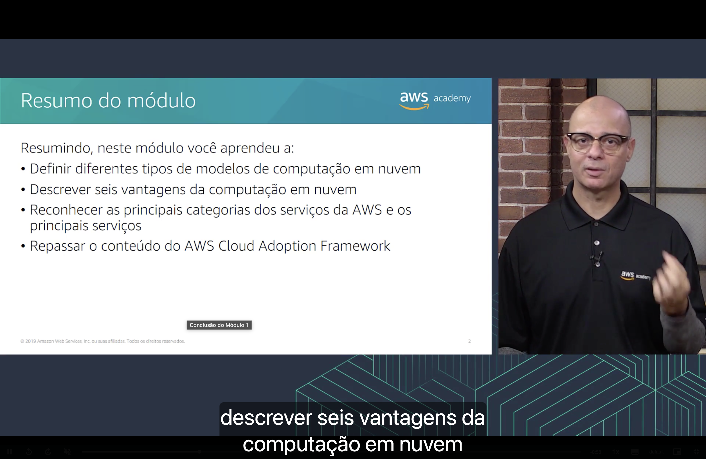
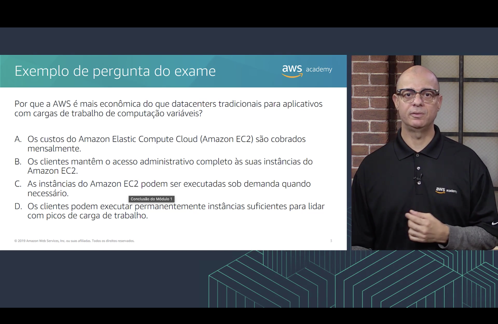
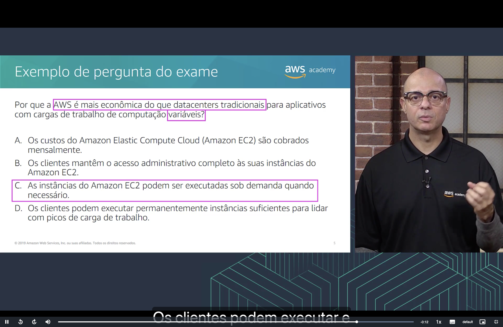

<h1 align="center">Seção 5 – Conclusão do Módulo 1</h1>

## 1. Resumo do módulo

Neste módulo, aprendemos a:

- **Definir** os diferentes tipos de **modelos de computação em nuvem** (modelos de serviço IaaS, PaaS e SaaS e modelos de implantação: nuvem, híbrido e local) – [Seção 1](./Seção%201%20-%20%20Introdução%20à%20computação%20em%20nuvem.md).
- **Descrever** as **seis vantagens** da computação em nuvem – [Seção 2](./Seção%202%20-%20Vantagens%20da%20Computação%20em%20Nuvem.md).
- **Reconhecer** as principais **categorias de serviços da AWS** e os principais serviços – [Seção 3](./Seção%203%20-%20Introdução%20à%20Amazon%20Web%20Services%20(AWS).md).
- **Revisar** o conteúdo do **AWS Cloud Adoption Framework (AWS CAF)** e suas seis perspectivas – [Seção 4](./Seção%204%20-%20Mudança%20para%20a%20Nuvem%20AWS%20–%20AWS%20Cloud%20Adoption%20Framework%20(AWS%20CAF).md).

## 2. Exemplo de pergunta do exame

> **Por que a AWS é mais econômica do que datacenters tradicionais para aplicativos com cargas de trabalho de computação variáveis?**

- **A.** Os custos do Amazon Elastic Compute Cloud (Amazon EC2) são cobrados mensalmente.
- **B.** Os clientes mantêm o acesso administrativo completo às suas instâncias do Amazon EC2.
- **C.** As instâncias do Amazon EC2 podem ser executadas sob demanda quando necessário.
- **D.** Os clientes podem executar permanentemente instâncias suficientes para lidar com picos de carga de trabalho.

### Resposta

As palavras-chave da pergunta são **"AWS é mais econômica do que datacenters tradicionais"** e **"variáveis"**.

✅ **Resposta correta: C.** As instâncias do Amazon EC2 podem ser executadas **sob demanda** quando necessário.

Por que as outras estão erradas:

| Alternativa | Por que não é a resposta |
|---|---|
| **A** | A forma de cobrança (mensal) não torna a AWS mais econômica; o que importa é pagar **só pelo que se usa**. |
| **B** | Acesso administrativo é uma questão de **controle**, não de custo. |
| **D** | Manter instâncias ligadas o tempo todo para o pico é justamente o problema do modelo tradicional: **capacidade superestimada** e recursos ociosos. |

Isso retoma duas vantagens da [Seção 2](./Seção%202%20-%20Vantagens%20da%20Computação%20em%20Nuvem.md): **trocar despesas de capital por despesas variáveis** e **parar de tentar adivinhar a capacidade**, escalando conforme a demanda.

## Principais conclusões

- A computação em nuvem é a **entrega sob demanda** de recursos de TI pela internet, com **pagamento conforme o uso**.
- Ela traz **seis vantagens** em relação ao modelo tradicional, entre elas custo variável, economia de escala e escalabilidade sob demanda.
- A **AWS** oferece uma ampla gama de serviços, organizados em **categorias**, acessíveis pelo console, pela CLI ou pelos SDKs.
- O **AWS CAF** orienta a adoção da nuvem em **toda a organização**, por meio de **seis perspectivas**.
- Para cargas de trabalho **variáveis**, a nuvem é mais econômica porque os recursos podem ser **executados sob demanda**, só quando necessário.