<h1 align="center">💲 Seção 1 – Fundamentos da definição de preço</h1>

  
  
   
  
  
  

  <a href="../README.md">🏠 Início</a> &nbsp;•&nbsp;
  <a href="../MÓDULO%201/Seção%205%20-%20Conclusão%20do%20Módulo%201.md">⬅️ Módulo anterior: Conclusão do Módulo 1</a> &nbsp;•&nbsp;
  <a href="./Seção%202%20-%20Custo%20total%20de%20propriedade.md">Próxima: Custo total de propriedade ➡️</a>

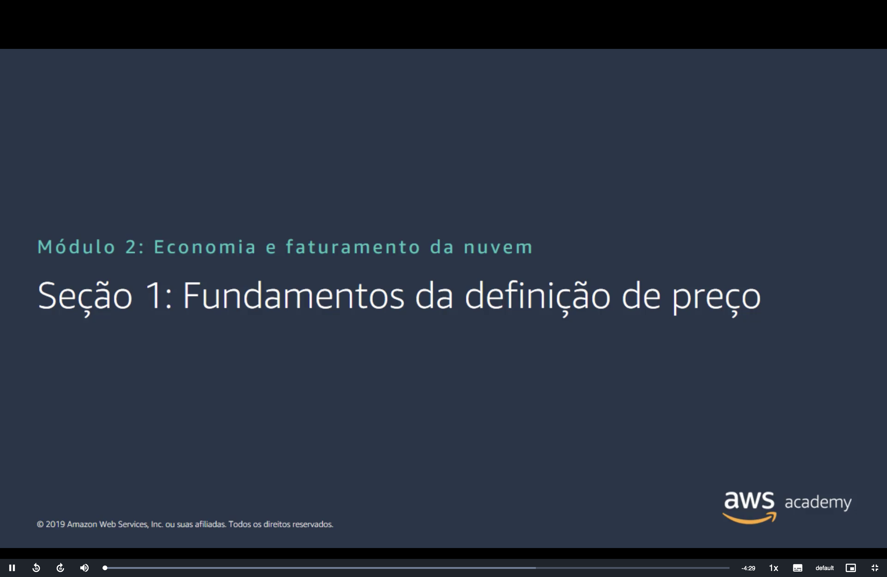

## 📑 Sumário

| # | Tópico |
|:---:|---|
| 1 | [🧮 Modelo de definição de preço da AWS](#modelo) |
| 2 | [💳 Como você paga pela AWS?](#como-paga) |
| 3 | [📊 Pague pelo que usar](#pague-uso) |
| 4 | [📅 Pague menos ao fazer reserva](#reserva) |
| 5 | [📦 Pague menos usando mais](#usando-mais) |
| 6 | [📈 Pague ainda menos com o crescimento da AWS](#crescimento) |
| 7 | [🤝 Definição de preço personalizada](#personalizado) |
| 8 | [🎁 Nível gratuito da AWS](#gratuito) |
| 9 | [🆓 Serviços sem custo](#sem-custo) |
| 🎯 | [Principais conclusões](#conclusoes) |

---

## 1. 🧮 Modelo de definição de preço da AWS

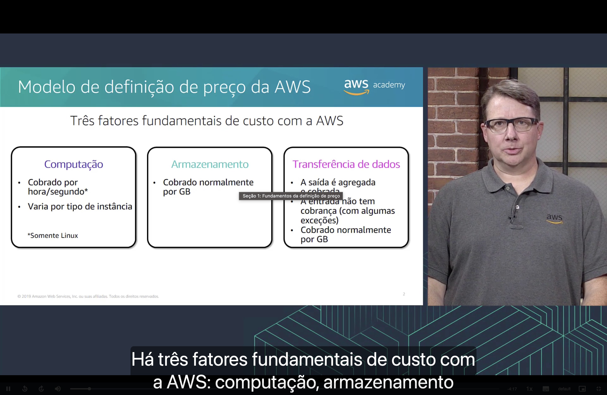

Na AWS, há **três fatores fundamentais de custo**:

| 🖥️ Computação | 💾 Armazenamento | 🔄 Transferência de dados |
|---|---|---|
| Cobrada **por hora ou por segundo** (por segundo somente para Linux) | Cobrado normalmente **por GB** | ⬆️ A **saída** (dados que saem da AWS) é agregada e cobrada |
| O preço **varia por tipo de instância** | | ⬇️ A **entrada** (dados que entram na AWS) **não tem cobrança**, com algumas exceções |
| | | Cobrada normalmente **por GB** |

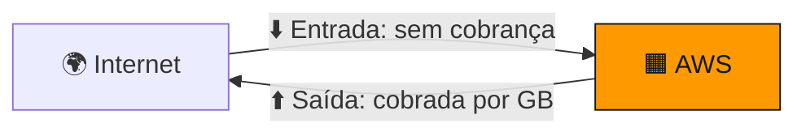

## 2. 💳 Como você paga pela AWS?

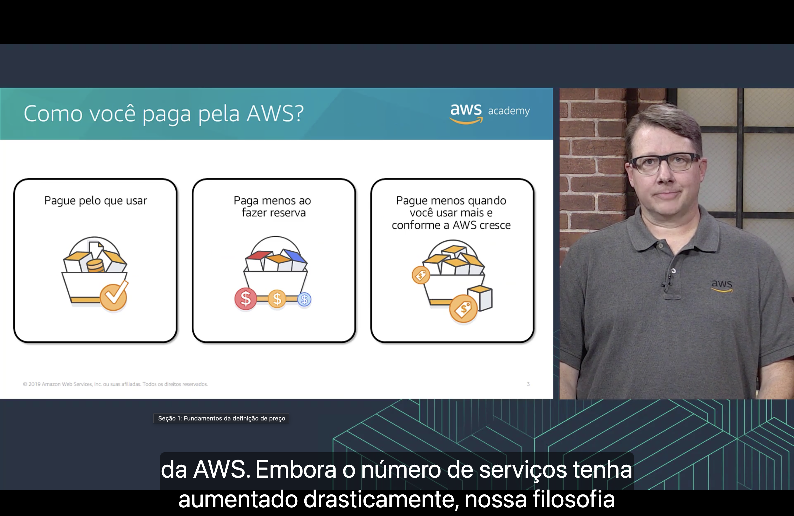

Embora o número de serviços tenha crescido muito, a filosofia de preço da AWS continua apoiada em **três pilares**:

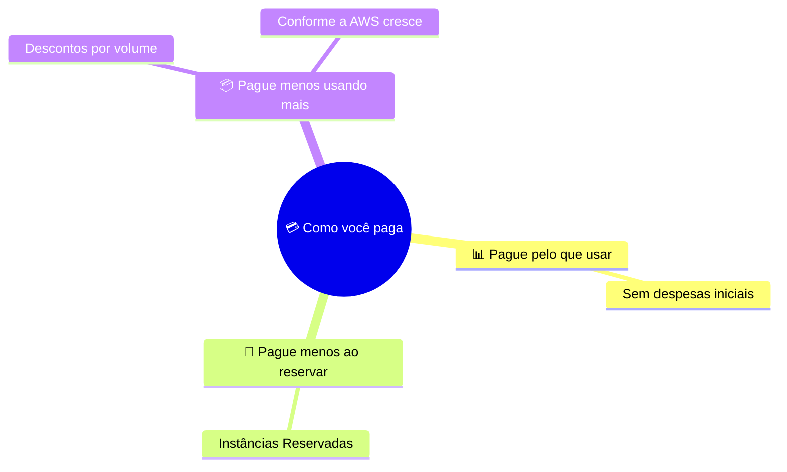

## 3. 📊 Pague pelo que usar

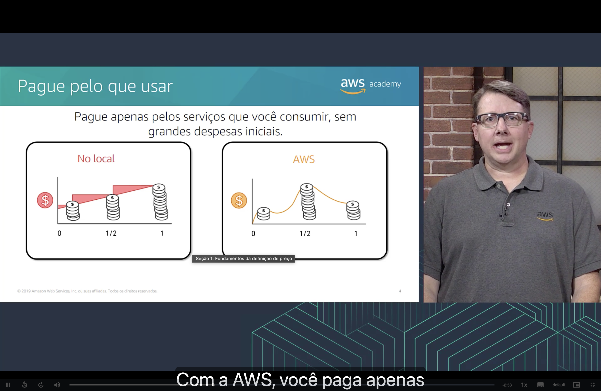

Pague **apenas pelos serviços que consumir**, **sem grandes despesas iniciais**.

| 🏢 No local (on-premises) | ☁️ AWS |
|---|---|
| O custo sobe em **degraus**. A empresa compra capacidade antecipadamente e paga por ela mesmo quando não a usa (a área vermelha do gráfico é dinheiro gasto em capacidade ociosa). | O custo **acompanha a demanda**, subindo nos picos e caindo quando o uso diminui. |

> [!TIP]
> Isso retoma a vantagem de **trocar despesas de capital por despesas variáveis**, vista na [Seção 2 do Módulo 1](../MÓDULO%201/Seção%202%20-%20Vantagens%20da%20Computação%20em%20Nuvem.md).

## 4. 📅 Pague menos ao fazer reserva

Para serviços como o **Amazon EC2** e o **Amazon RDS**, é possível **reservar capacidade** (por exemplo, com **Instâncias Reservadas**) em troca de um **desconto** em relação ao preço sob demanda. Quanto maior o pagamento antecipado, maior o desconto:

| Sigla | Significado | Pagamento adiantado | Desconto |
|:---:|---|---|---|
| **AURI** | All Upfront Reserved Instance | 💰💰💰 **Total** | 🟩🟩🟩 **Maior** |
| **PURI** | Partial Upfront Reserved Instance | 💰💰 **Parcial** | 🟩🟩⬜ **Intermediário** |
| **NURI** | No Upfront Reserved Instance | ➖ **Nenhum** | 🟩⬜⬜ **Menor** |

## 5. 📦 Pague menos usando mais

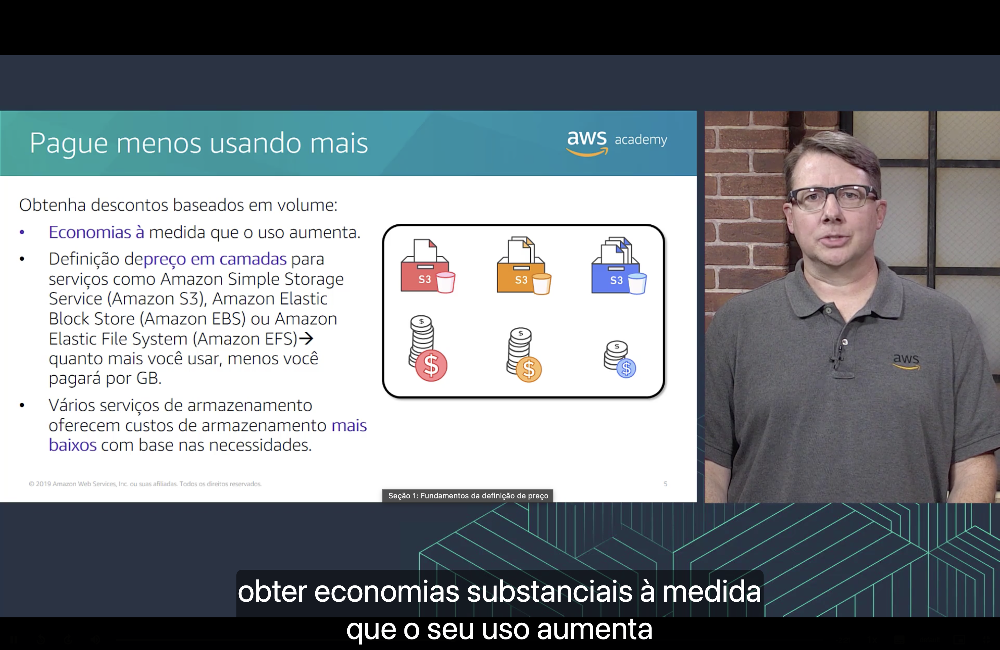

A AWS oferece **descontos baseados em volume**:

- 📉 As **economias aumentam à medida que o uso aumenta**.
- 🪜 Serviços como **Amazon S3**, **Amazon EBS** e **Amazon EFS** têm **definição de preço em camadas**: quanto mais você usa, **menos paga por GB**.
- 💾 Vários serviços de armazenamento oferecem **custos mais baixos** de acordo com as necessidades de cada carga de trabalho.

## 6. 📈 Pague ainda menos com o crescimento da AWS

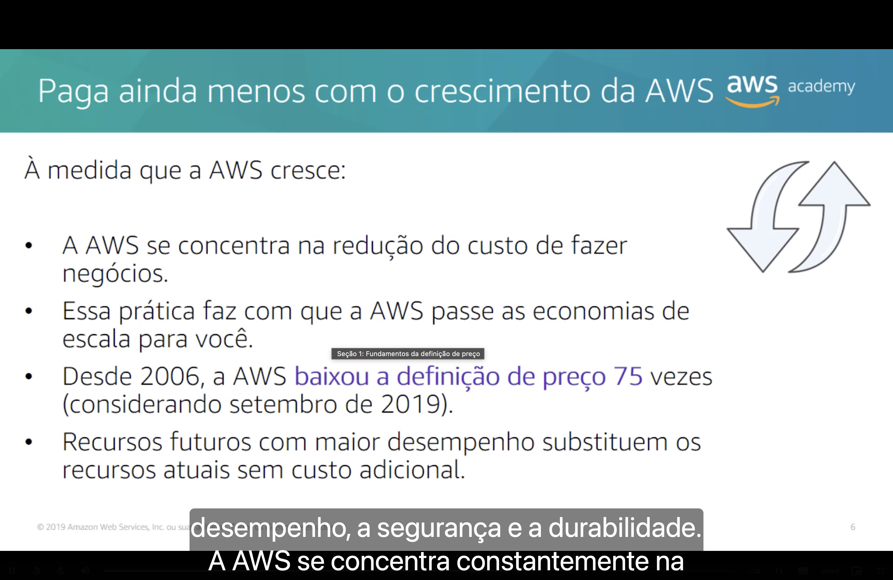

À medida que a AWS cresce:

| | O que acontece |
|:---:|---|
| 🎯 | A AWS se concentra em **reduzir o custo de fazer negócios**. |
| 🔁 | Com isso, ela **repassa as economias de escala** para os clientes. |
| 📉 | Desde 2006, a AWS **baixou seus preços 75 vezes** (dado de setembro de 2019). |
| 🚀 | **Recursos futuros com maior desempenho** substituem os atuais **sem custo adicional**. |

## 7. 🤝 Definição de preço personalizada

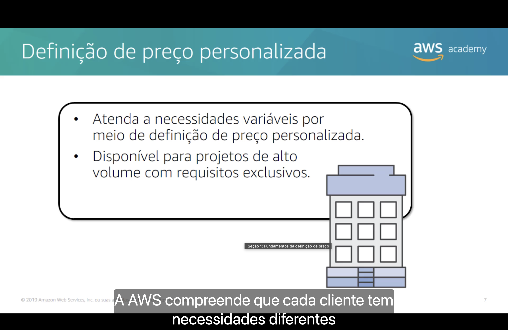

Cada cliente tem necessidades diferentes, por isso a AWS oferece **definição de preço personalizada**:

- 🎯 Atende **necessidades variáveis** com preços sob medida.
- 🏭 Disponível para **projetos de alto volume** com **requisitos exclusivos**.

## 8. 🎁 Nível gratuito da AWS

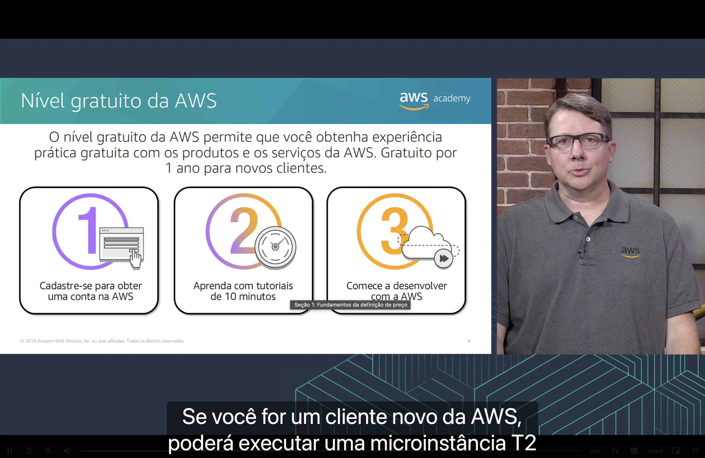

O **nível gratuito da AWS** (AWS Free Tier) permite obter **experiência prática gratuita** com produtos e serviços da AWS. Ele é **gratuito por 1 ano para novos clientes**. Um exemplo é poder executar uma **microinstância T2** do Amazon EC2 sem custo dentro dos limites do nível gratuito.

Para começar:

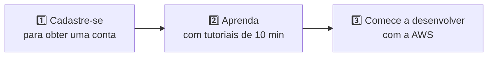

## 9. 🆓 Serviços sem custo

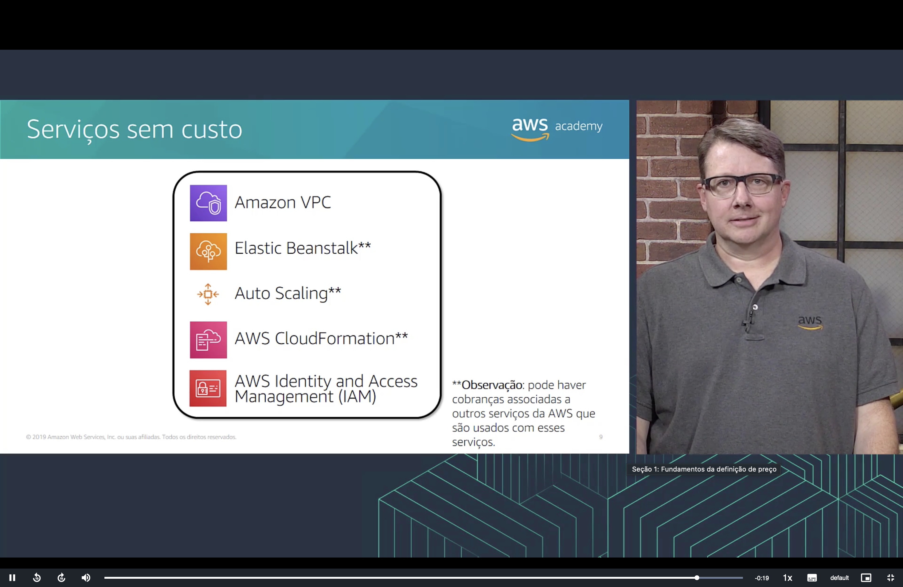

Alguns serviços da AWS **não têm custo próprio**:

| Serviço | Sem custo próprio |
|---|:---:|
| 🌐 **Amazon VPC** | ✅ |
| 🌱 **AWS Elastic Beanstalk\*** | ✅ |
| 📈 **Auto Scaling\*** | ✅ |
| 📜 **AWS CloudFormation\*** | ✅ |
| 🔑 **AWS Identity and Access Management (IAM)** | ✅ |

> [!WARNING]
> \* Pode haver cobranças pelos **outros serviços da AWS** usados junto com esses serviços. Por exemplo, o Elastic Beanstalk é gratuito, mas as instâncias do EC2 que ele cria são cobradas normalmente.

---

## 🎯 Principais conclusões

- ✅ Os **três fatores fundamentais de custo** da AWS são **computação**, **armazenamento** e **transferência de dados de saída**.
- ✅ A transferência de dados de **entrada** normalmente **não é cobrada**.
- ✅ **Pague pelo que usar**, sem grandes despesas iniciais.
- ✅ **Pague menos ao reservar** capacidade (AURI > PURI > NURI em desconto).
- ✅ **Pague menos usando mais**, com descontos por volume e preços em camadas.
- ✅ **Pague ainda menos conforme a AWS cresce**, já que ela repassa as economias de escala.
- ✅ Há **preço personalizado** para projetos de alto volume, um **nível gratuito** de 1 ano para novos clientes e **serviços sem custo** próprio, como VPC e IAM.

---

  <a href="../README.md">🏠 Início</a> &nbsp;•&nbsp;
  <a href="../MÓDULO%201/Seção%205%20-%20Conclusão%20do%20Módulo%201.md">⬅️ Módulo anterior: Conclusão do Módulo 1</a> &nbsp;•&nbsp;
  <a href="./Seção%202%20-%20Custo%20total%20de%20propriedade.md">Próxima: Custo total de propriedade ➡️</a>

