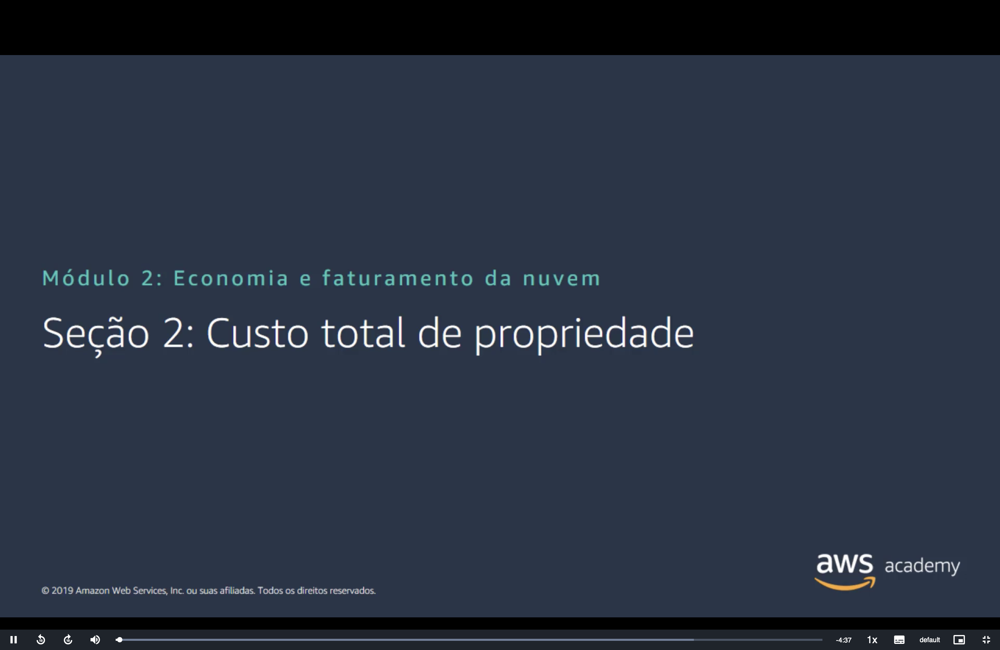
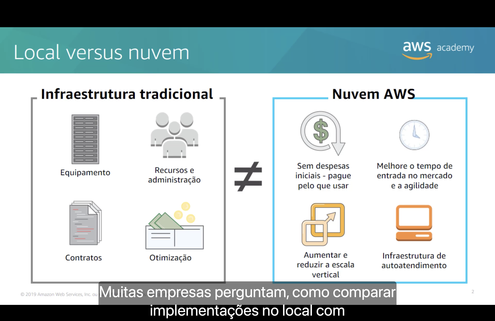
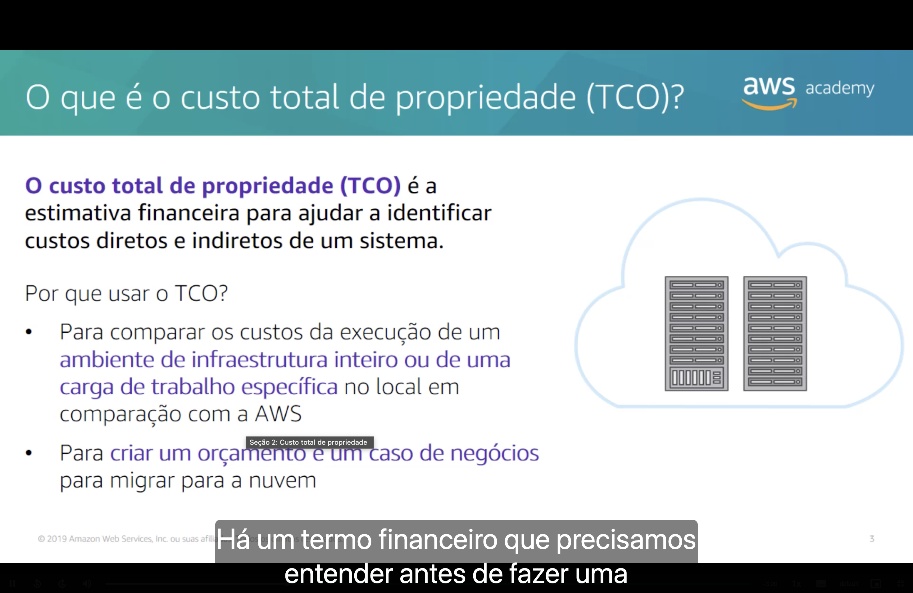
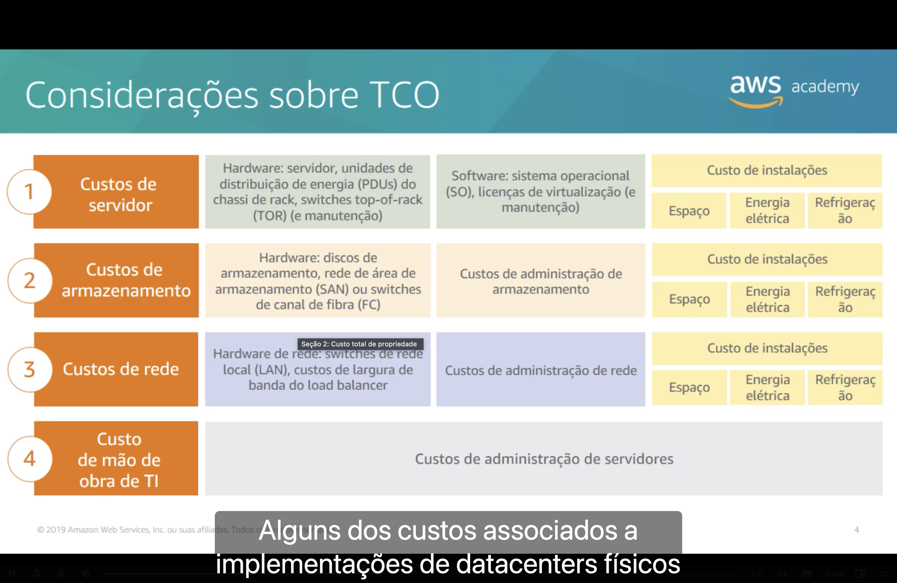
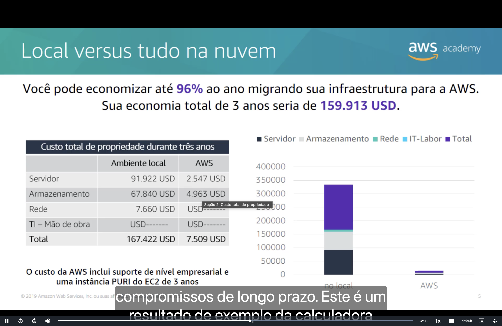
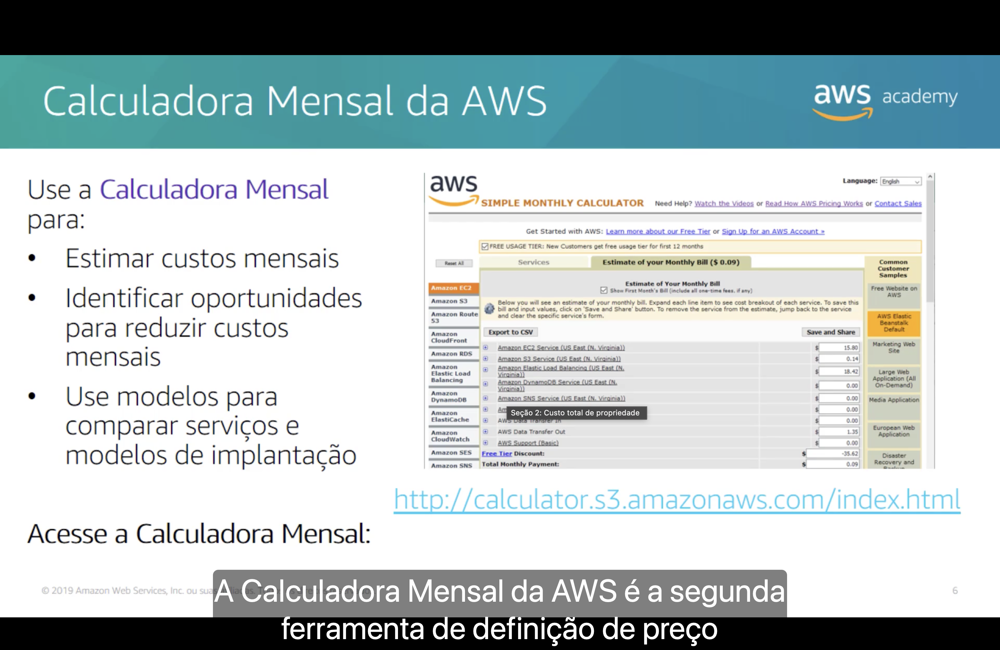

<h1 align="center">🧾 Seção 2 – Custo total de propriedade</h1>

  
  
   
  
  
  

  <a href="../README.md">🏠 Início</a> &nbsp;•&nbsp;
  <a href="./Seção%201%20-%20Fundamentos%20da%20definição%20de%20preço.md">⬅️ Anterior: Fundamentos de preço</a> &nbsp;•&nbsp;
  <a href="./Seção%203%20-%20AWS%20Organizations.md">Próxima: AWS Organizations ➡️</a>

## 📑 Sumário

| # | Tópico |
|:---:|---|
| 1 | [⚖️ Local versus nuvem](#local-vs-nuvem) |
| 2 | [🧾 O que é o custo total de propriedade (TCO)?](#tco) |
| 3 | [🔍 Considerações sobre TCO](#consideracoes) |
| 4 | [📊 Local versus tudo na nuvem](#tudo-na-nuvem) |
| 5 | [🧮 Calculadora Mensal da AWS](#calculadora) |
| 🎯 | [Principais conclusões](#conclusoes) |

---

## 1. ⚖️ Local versus nuvem

Muitas empresas se perguntam como comparar uma implementação **no local (on-premises)** com uma implementação na **nuvem AWS**. Os dois modelos têm estruturas de custo bem diferentes:

| 🏢 Infraestrutura tradicional | ☁️ Nuvem AWS |
|---|---|
| 🖥️ **Equipamento** (servidores, racks, hardware de rede) | 💳 **Sem despesas iniciais**: pague pelo que usar |
| 👷 **Recursos e administração** (equipe para operar e manter) | 🚀 **Melhor tempo de entrada no mercado** e mais **agilidade** |
| 📄 **Contratos** (licenças, manutenção, fornecedores) | 📈 **Aumentar e reduzir a escala** conforme a necessidade |
| 🔧 **Otimização** (ajuste constante da capacidade comprada) | 🛒 **Infraestrutura de autoatendimento** |

## 2. 🧾 O que é o custo total de propriedade (TCO)?

> [!NOTE]
> O **custo total de propriedade (TCO, Total Cost of Ownership)** é a **estimativa financeira** que ajuda a identificar os **custos diretos e indiretos** de um sistema.

Por que usar o TCO?

- ⚖️ Para **comparar os custos** da execução de um **ambiente de infraestrutura inteiro** ou de uma **carga de trabalho específica** no local com os custos na AWS.
- 💼 Para **criar um orçamento e um caso de negócios** para migrar para a nuvem.

## 3. 🔍 Considerações sobre TCO

Em um datacenter físico, o TCO envolve **quatro grupos de custo**:

| # | Custo | 🖥️ Hardware | 💿 Software / administração | 🏠 Instalações |
|:---:|---|---|---|---|
| **1** | 🖥️ **Servidor** | Servidor, unidades de distribuição de energia (PDUs) do chassi de rack, switches top-of-rack (TOR) e manutenção | Sistema operacional (SO), licenças de virtualização e manutenção | Espaço, energia elétrica, refrigeração |
| **2** | 💾 **Armazenamento** | Discos de armazenamento, rede de área de armazenamento (SAN) ou switches de canal de fibra (FC) | Administração de armazenamento | Espaço, energia elétrica, refrigeração |
| **3** | 🌐 **Rede** | Switches de rede local (LAN), largura de banda do load balancer | Administração de rede | Espaço, energia elétrica, refrigeração |
| **4** | 👷 **Mão de obra de TI** | – | Administração de servidores | – |

> [!IMPORTANT]
> Muitos desses custos são **indiretos** e ficam fora da conta quando se olha só o preço do hardware. O TCO serve justamente para colocá-los na comparação.

## 4. 📊 Local versus tudo na nuvem

Exemplo de resultado de uma calculadora de TCO, comparando **três anos** de operação:

| Custo | 🏢 Ambiente local | ☁️ AWS |
|---|---:|---:|
| 🖥️ Servidor | 91.922 USD | 2.547 USD |
| 💾 Armazenamento | 67.840 USD | 4.963 USD |
| 🌐 Rede | 7.660 USD | – |
| 👷 TI – mão de obra | – | – |
| **Total** | **167.422 USD** | **7.509 USD** |

### 📉 Visualizando a diferença (total em 3 anos)

| Ambiente | Custo relativo | Total |
|---|---|---:|
| 🏢 Local | 🟥🟥🟥🟥🟥🟥🟥🟥🟥🟥🟥🟥🟥🟥🟥🟥🟥🟥🟥🟥 | 167.422 USD |
| ☁️ AWS | 🟩 | 7.509 USD |
| 💰 **Economia** | 🟨🟨🟨🟨🟨🟨🟨🟨🟨🟨🟨🟨🟨🟨🟨🟨🟨🟨🟨 | **159.913 USD** |

- 💸 Migrando a infraestrutura para a AWS, seria possível **economizar até 96% ao ano**.
- 💰 A **economia total em 3 anos** seria de **159.913 USD**.
- 📅 O custo da AWS já inclui **suporte de nível empresarial** e uma **instância PURI do EC2 de 3 anos**, ou seja, uma Instância Reservada com pagamento parcial adiantado, vista na [Seção 1](./Seção%201%20-%20Fundamentos%20da%20definição%20de%20preço.md).

## 5. 🧮 Calculadora Mensal da AWS

A **Calculadora Mensal da AWS** (Simple Monthly Calculator) é outra ferramenta de definição de preço. Use-a para:

| 📅 Estimar | 🔍 Identificar | ⚖️ Comparar |
|---|---|---|
| **Estimar custos mensais**. | **Identificar oportunidades** para **reduzir custos mensais**. | Usar **modelos** para **comparar serviços e modelos de implantação**. |

> [!NOTE]
> O link mostrado no slide (`calculator.s3.amazonaws.com`) é da versão antiga. Hoje a Simple Monthly Calculator foi substituída pela **AWS Pricing Calculator**, disponível em [calculator.aws](https://calculator.aws/).

---

## 🎯 Principais conclusões

- ✅ Infraestrutura **local** e **nuvem** têm estruturas de custo diferentes: no local há equipamento, equipe, contratos e otimização; na AWS não há despesas iniciais e a escala acompanha a demanda.
- ✅ O **TCO** é uma **estimativa financeira** dos **custos diretos e indiretos** de um sistema.
- ✅ Ele serve para **comparar** o ambiente local com a AWS e para **montar o caso de negócios** da migração.
- ✅ No local, o TCO soma custos de **servidor**, **armazenamento**, **rede** e **mão de obra de TI**, incluindo **instalações** (espaço, energia e refrigeração).
- ✅ A **calculadora de preços da AWS** ajuda a **estimar custos mensais** e encontrar formas de **reduzi-los**.

---

  <a href="../README.md">🏠 Início</a> &nbsp;•&nbsp;
  <a href="./Seção%201%20-%20Fundamentos%20da%20definição%20de%20preço.md">⬅️ Anterior: Fundamentos de preço</a> &nbsp;•&nbsp;
  <a href="./Seção%203%20-%20AWS%20Organizations.md">Próxima: AWS Organizations ➡️</a>

