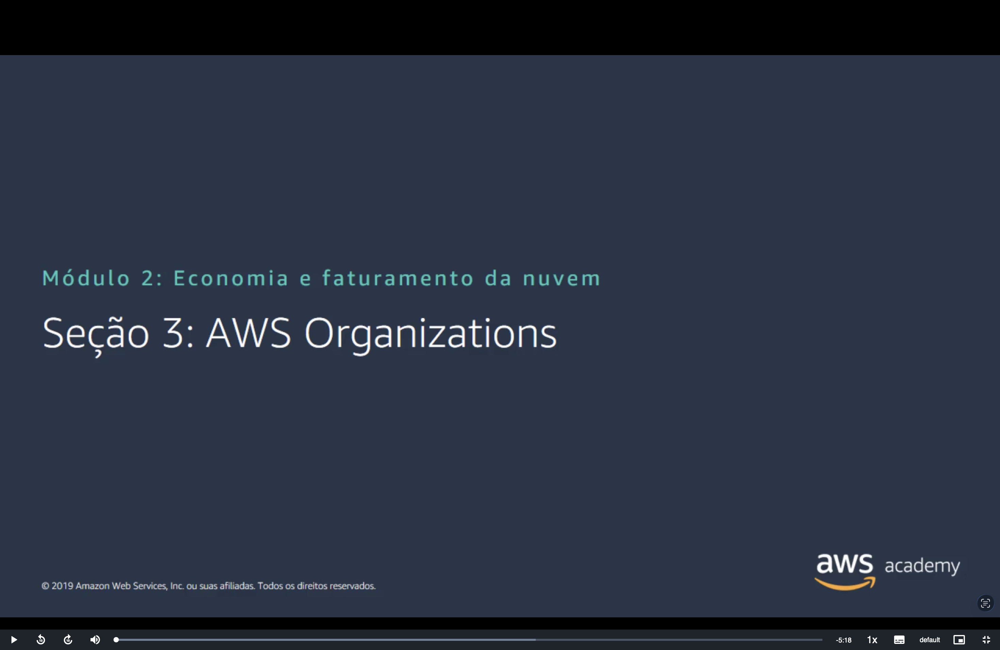
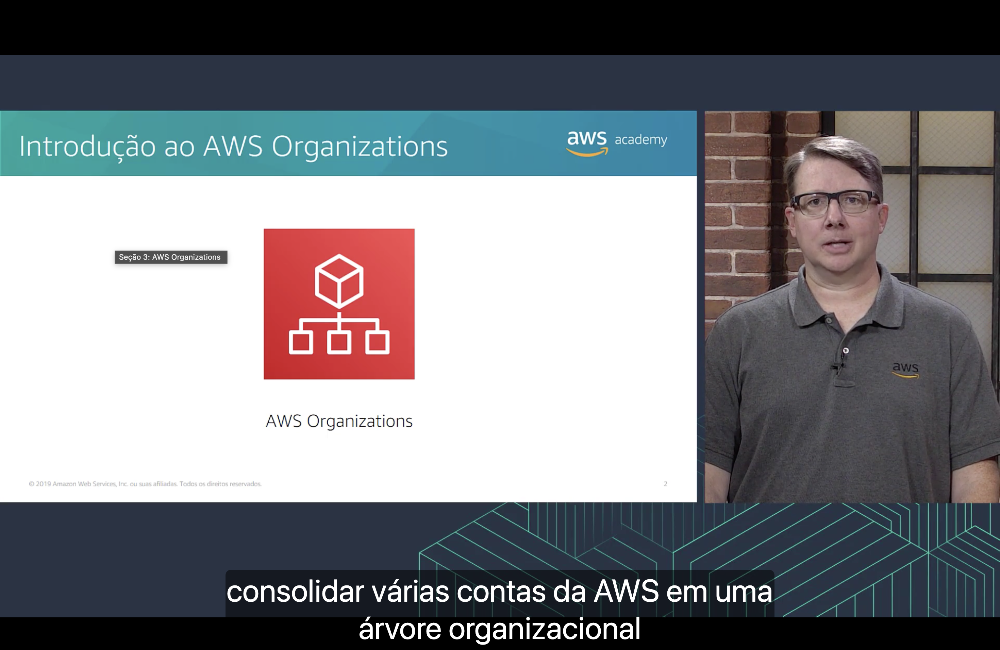
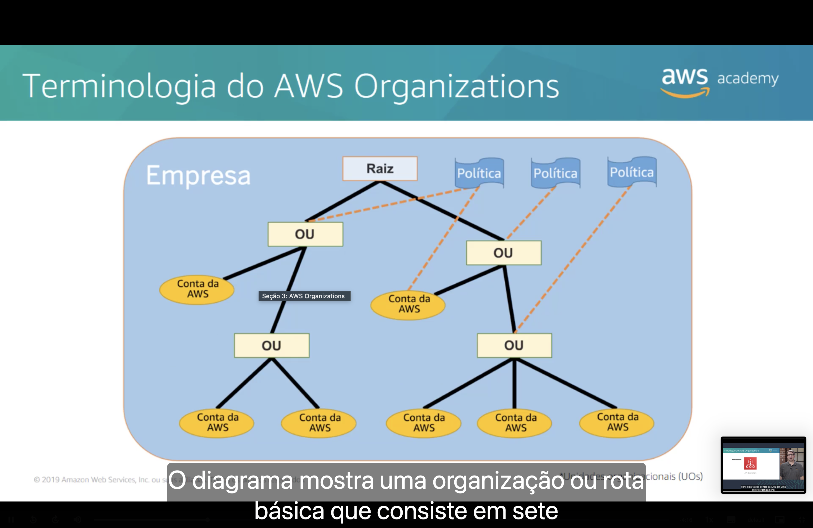
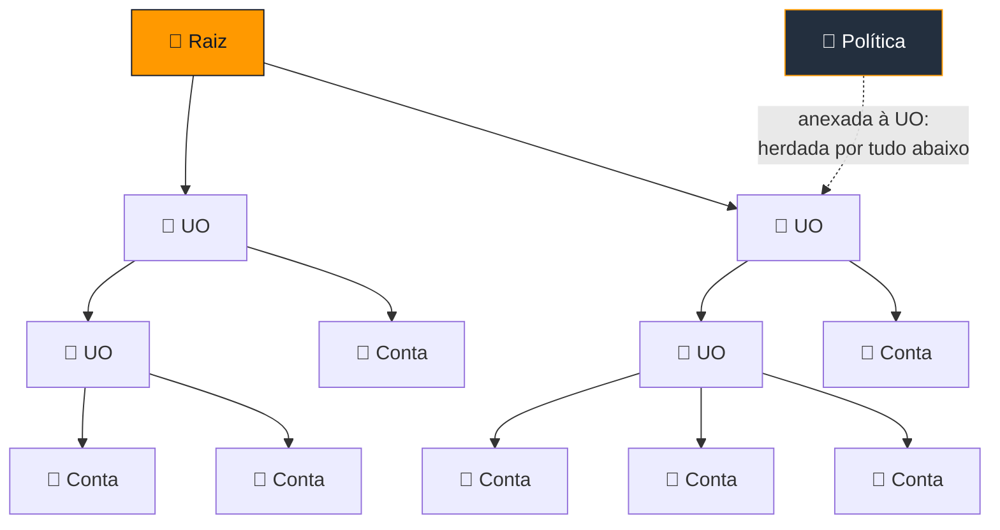
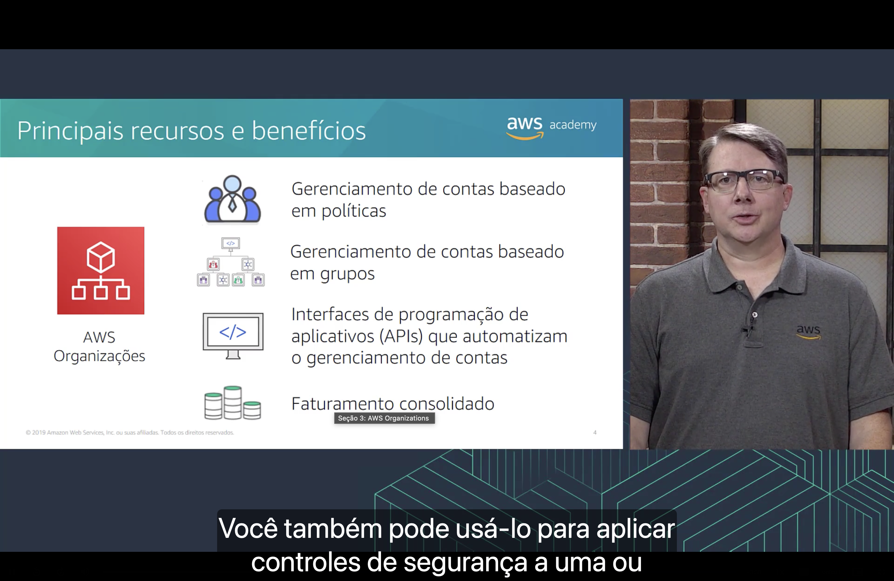
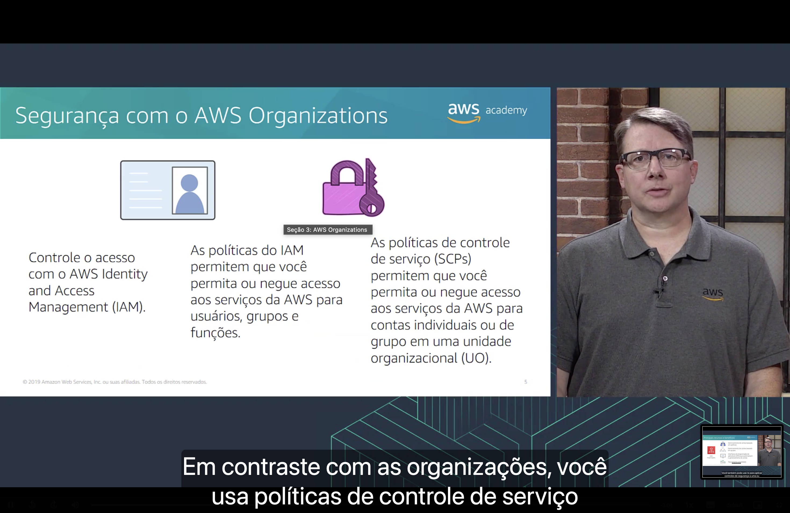
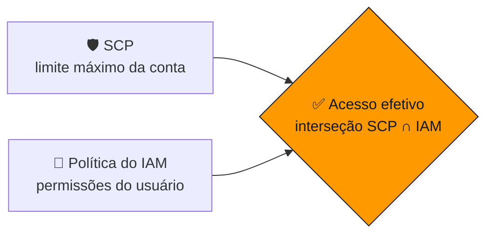
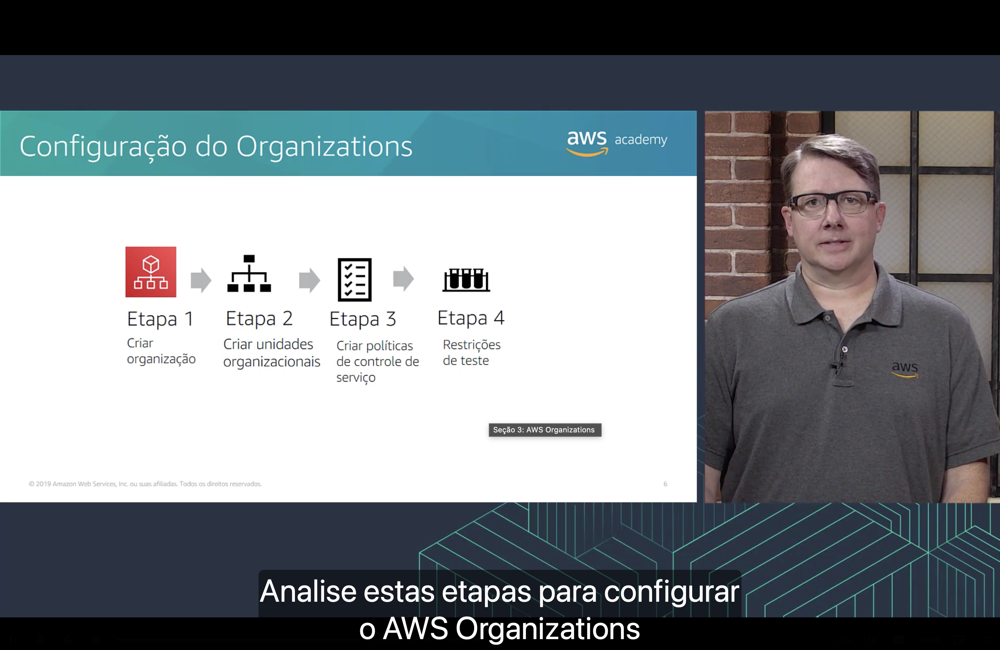
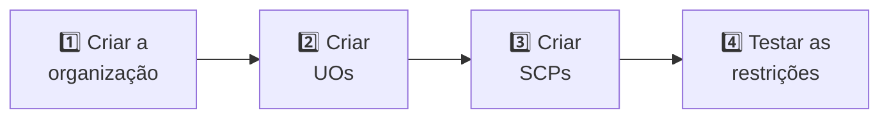
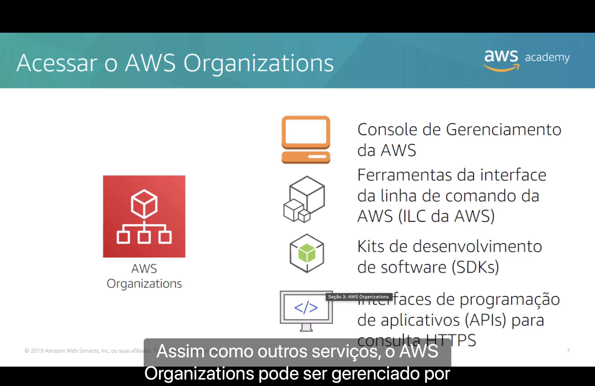

<h1 align="center">🏛️ Seção 3 – AWS Organizations</h1>

  
  
   
  
  
  

  <a href="../README.md">🏠 Início</a> &nbsp;•&nbsp;
  <a href="./Seção%202%20-%20Custo%20total%20de%20propriedade.md">⬅️ Anterior: Custo total de propriedade</a> &nbsp;•&nbsp;
  <a href="./Seção%204%20-%20AWS%20Billing%20and%20Cost%20Management.md">Próxima: Billing and Cost Management ➡️</a>

## 📑 Sumário

| # | Tópico |
|:---:|---|
| 1 | [🏛️ Introdução ao AWS Organizations](#introducao) |
| 2 | [🌳 Terminologia do AWS Organizations](#terminologia) |
| 3 | [⭐ Principais recursos e benefícios](#recursos) |
| 4 | [🔒 Segurança com o AWS Organizations](#seguranca) |
| 5 | [🛠️ Configuração do Organizations](#configuracao) |
| 6 | [🖱️ Acessar o AWS Organizations](#acessar) |
| 🎯 | [Principais conclusões](#conclusoes) |

---

## 1. 🏛️ Introdução ao AWS Organizations

> [!NOTE]
> O **AWS Organizations** é um serviço de **gerenciamento de contas** que permite **consolidar várias contas da AWS em uma organização** que você cria e gerencia de forma centralizada.

- 🌳 As contas ficam agrupadas em uma **árvore organizacional** (hierarquia).
- 📜 Com ele é possível aplicar **políticas** a grupos de contas e centralizar o **faturamento**.
- 🏢 É útil quando a empresa tem **várias contas** (por exemplo, uma por time, projeto ou ambiente) e precisa de **governança** sobre todas elas.

## 2. 🌳 Terminologia do AWS Organizations

O diagrama mostra uma organização básica, formada por **sete contas** distribuídas em **quatro unidades organizacionais (UOs)** abaixo da **raiz**. Uma estrutura desse tipo pode ser representada assim:

| Termo | O que é |
|---|---|
| 🏢 **Organização (Empresa)** | Conjunto de contas da AWS gerenciadas de forma centralizada. |
| 🌳 **Raiz** | Contêiner do topo da hierarquia; todas as contas e UOs ficam abaixo dela. |
| 📁 **Unidade organizacional (UO / OU)** | Grupo de contas dentro da raiz. Uma UO pode conter **contas** e **outras UOs**, formando uma estrutura de árvore. |
| 👤 **Conta da AWS** | Contêiner dos recursos da AWS. Cada conta pertence a **uma única UO** (ou diretamente à raiz). |
| 📜 **Política** | Regra anexada à **raiz**, a uma **UO** ou a uma **conta individual**. |

> [!IMPORTANT]
> - Uma política anexada a uma **UO** se aplica a **todas as contas e UOs abaixo dela** (herança).
> - Uma política anexada à **raiz** afeta **a organização inteira**.

## 3. ⭐ Principais recursos e benefícios

| Recurso | O que oferece |
|---|---|
| 📜 **Gerenciamento de contas baseado em políticas** | Criar políticas de controle de serviço (SCPs) que definem o que as contas podem ou não fazer. |
| 📁 **Gerenciamento de contas baseado em grupos** | Agrupar contas em UOs e aplicar políticas ao grupo inteiro, em vez de conta por conta. |
| 🤖 **APIs que automatizam o gerenciamento de contas** | Criar e gerenciar contas novas de forma programática, adicionando-as aos grupos certos. |
| 💳 **Faturamento consolidado** | Uma **única forma de pagamento** para todas as contas, com visão combinada dos custos e acesso a **descontos por volume** somando o uso de todas elas. |

O Organizations também permite aplicar **controles de segurança** a uma ou mais contas ao mesmo tempo.

## 4. 🔒 Segurança com o AWS Organizations

O controle de acesso combina dois tipos de política:

| | 🔑 Políticas do IAM | 🛡️ Políticas de controle de serviço (SCPs) |
|---|---|---|
| **Serviço** | AWS Identity and Access Management (IAM) | AWS Organizations |
| **Aplicadas a** | **Usuários, grupos e funções** (roles) | **Contas individuais** ou **grupos de contas em uma UO** |
| **Função** | Permitir ou negar acesso aos serviços da AWS | Permitir ou negar acesso aos serviços da AWS |

> [!WARNING]
> A SCP define o **limite máximo** do que uma conta pode fazer. Se um serviço for bloqueado por uma SCP, **nenhum usuário daquela conta consegue usá-lo**, nem o usuário raiz da conta, mesmo que uma política do IAM permita.

Na prática, o acesso efetivo é a **interseção** entre o que a SCP permite e o que a política do IAM concede.

## 5. 🛠️ Configuração do Organizations

A configuração segue **quatro etapas**:

| Etapa | O que fazer |
|:---:|---|
| 1️⃣ **Criar a organização** | A partir da conta que será a **conta de gerenciamento** (antes chamada de conta mestre), convidando ou criando as demais contas. |
| 2️⃣ **Criar unidades organizacionais** | Montar a hierarquia de UOs e mover as contas para dentro delas. |
| 3️⃣ **Criar políticas de controle de serviço** | Definir as SCPs e anexá-las à raiz, às UOs ou às contas. |
| 4️⃣ **Testar as restrições** | Entrar nas contas afetadas e verificar se as permissões e bloqueios funcionam como esperado. |

## 6. 🖱️ Acessar o AWS Organizations

Como os outros serviços da AWS (vistos na [Seção 3 do Módulo 1](../MÓDULO%201/Seção%203%20-%20Introdução%20à%20Amazon%20Web%20Services%20(AWS).md)), o AWS Organizations pode ser gerenciado por:

| 🖱️ Console | ⌨️ AWS CLI | 🧑‍💻 SDKs | 🔗 APIs de consulta HTTPS |
|---|---|---|---|
| Interface gráfica no navegador. | Comandos no terminal (ILC da AWS). | Bibliotecas para usar o serviço dentro do código de aplicações. | Chamadas diretas à API do serviço. |

---

## 🎯 Principais conclusões

- ✅ O **AWS Organizations** consolida **várias contas da AWS** em uma **organização** com gerenciamento centralizado.
- ✅ A hierarquia é formada por **raiz**, **unidades organizacionais (UOs)** e **contas**; políticas aplicadas a uma UO são **herdadas** por tudo abaixo dela.
- ✅ Os principais benefícios são o gerenciamento **baseado em políticas** e **em grupos**, a **automação via APIs** e o **faturamento consolidado**.
- ✅ **Políticas do IAM** controlam o acesso de **usuários, grupos e funções**; **SCPs** controlam o que **contas e UOs inteiras** podem fazer.
- ✅ A configuração segue quatro etapas: **criar a organização**, **criar UOs**, **criar SCPs** e **testar as restrições**.
- ✅ O serviço pode ser acessado pelo **console**, pela **CLI**, pelos **SDKs** e pelas **APIs HTTPS**.

---

  <a href="../README.md">🏠 Início</a> &nbsp;•&nbsp;
  <a href="./Seção%202%20-%20Custo%20total%20de%20propriedade.md">⬅️ Anterior: Custo total de propriedade</a> &nbsp;•&nbsp;
  <a href="./Seção%204%20-%20AWS%20Billing%20and%20Cost%20Management.md">Próxima: Billing and Cost Management ➡️</a>

