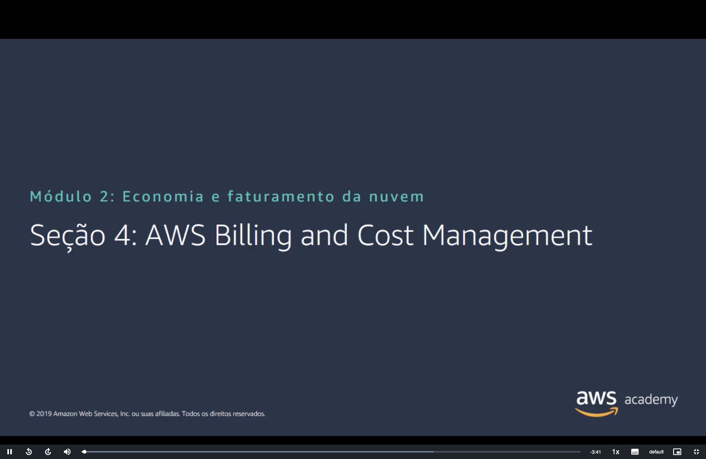
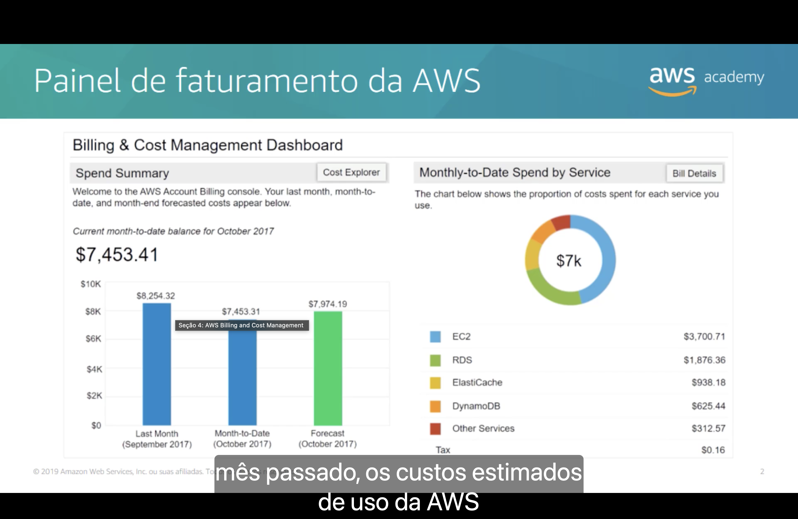
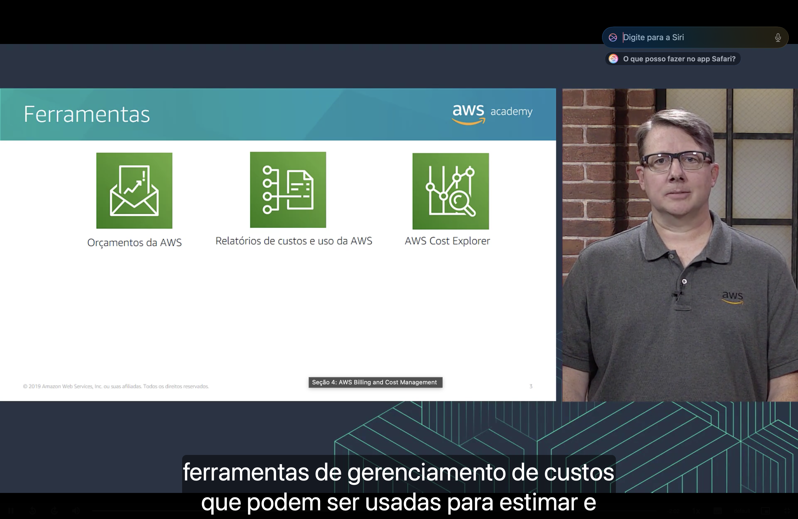
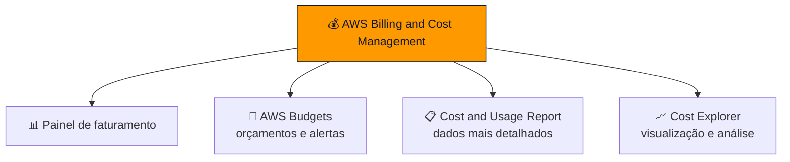
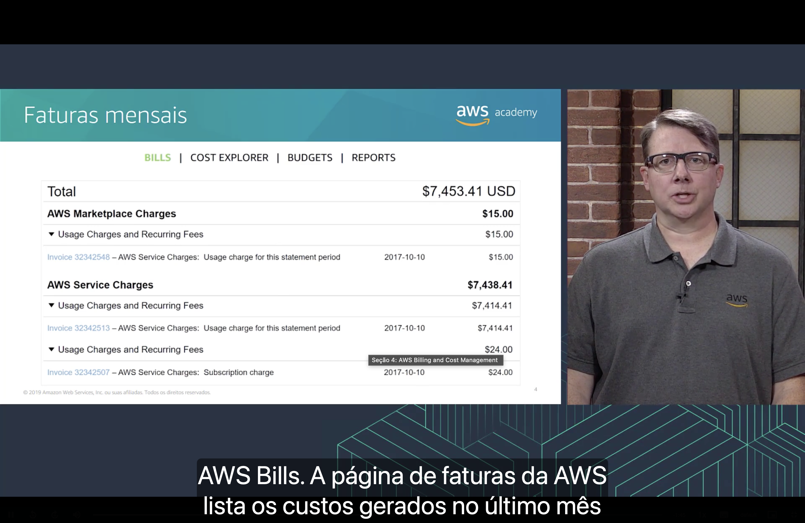
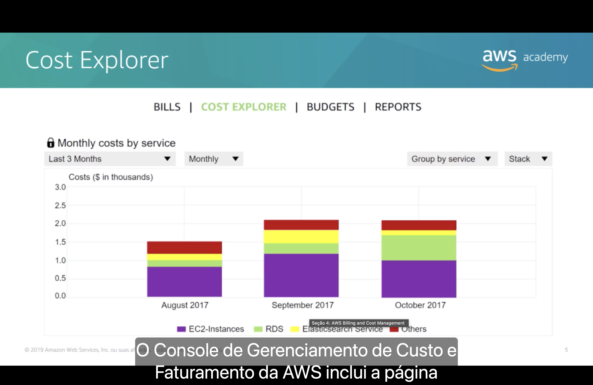
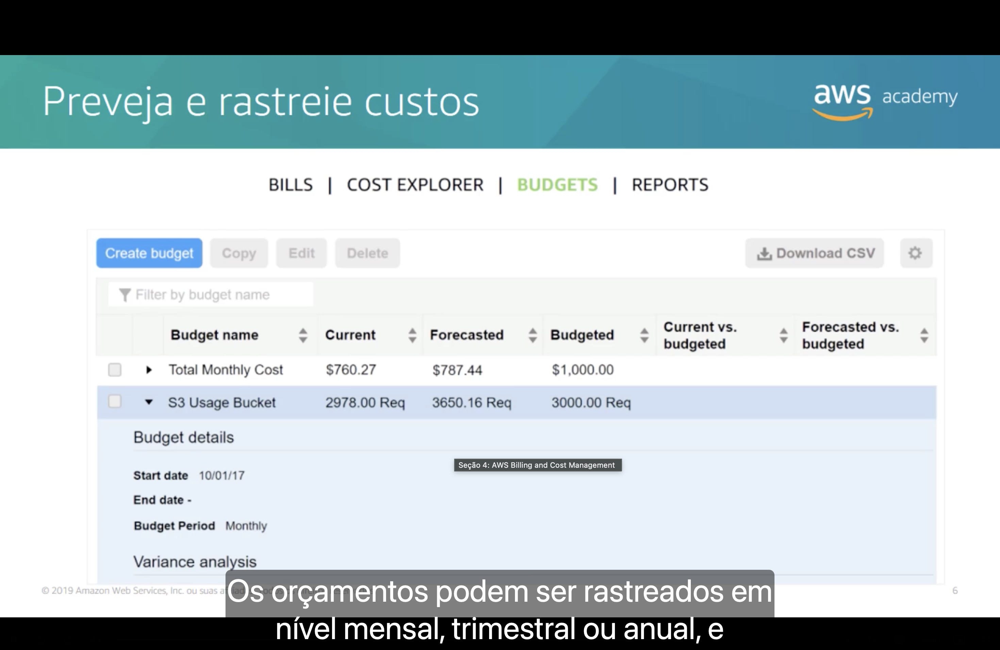
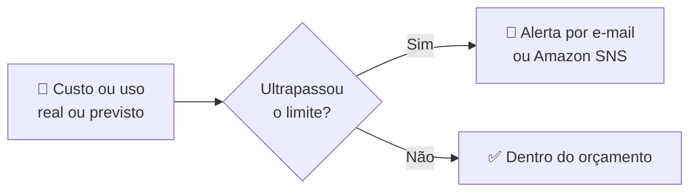
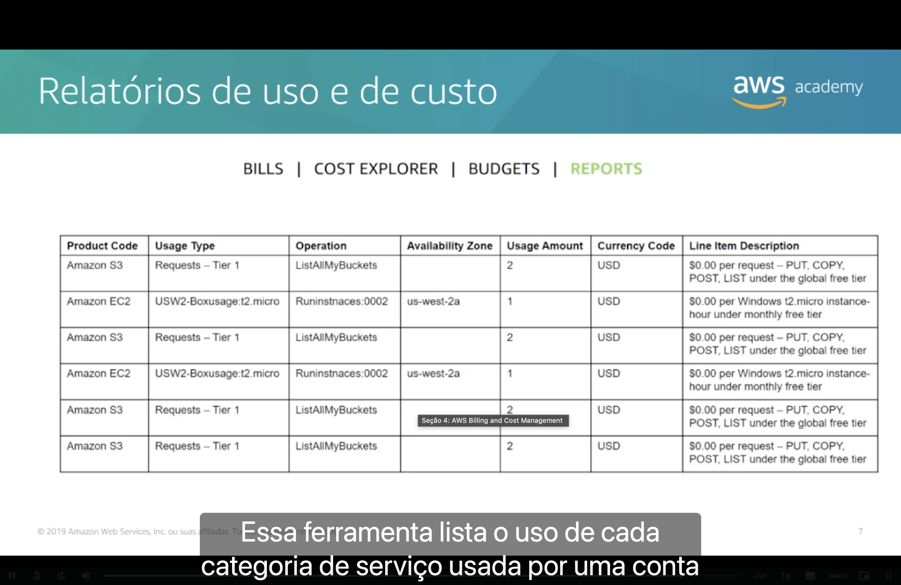

<h1 align="center">💰 Seção 4 – AWS Billing and Cost Management</h1>

  
  
   
  
  

  <a href="../README.md">🏠 Início</a> &nbsp;•&nbsp;
  <a href="./Seção%203%20-%20AWS%20Organizations.md">⬅️ Anterior: AWS Organizations</a> &nbsp;•&nbsp;
  <a href="./Seção%205%20-%20Suporte%20Técnico.md">Próxima: Suporte técnico ➡️</a>

## 📑 Sumário

| # | Tópico |
|:---:|---|
| 1 | [📊 Painel de faturamento da AWS](#painel) |
| 2 | [🧰 Ferramentas](#ferramentas) |
| 3 | [🧾 Faturas mensais](#faturas) |
| 4 | [📈 Cost Explorer](#cost-explorer) |
| 5 | [🎯 Preveja e rastreie custos](#budgets) |
| 6 | [📋 Relatórios de uso e de custo](#relatorios) |
| 🎯 | [Principais conclusões](#conclusoes) |

> [!TIP]
> Quer ver tudo isso no console? Confira a [🎬 Demonstração: Painel de cobrança](./Seção%20Bônus2%20-%20Demonstração%20-%20Painel%20de%20cobrança.md).

---

## 1. 📊 Painel de faturamento da AWS

O **AWS Billing and Cost Management** é o serviço usado para **pagar a fatura da AWS**, **monitorar o uso** e **analisar e controlar os custos**. Sua página inicial é o **painel de faturamento** (*Billing & Cost Management Dashboard*), que reúne:

| Elemento | O que mostra |
|---|---|
| 💵 **Resumo de gastos** (*Spend Summary*) | Compara o custo do **mês passado**, o custo **acumulado no mês atual** (*month-to-date*) e a **previsão** de gasto até o fim do mês (*forecast*). |
| 🥧 **Gastos do mês por serviço** (*Month-to-Date Spend by Service*) | Gráfico com a proporção do custo de cada serviço usado (no exemplo, **EC2**, **RDS**, **ElastiCache**, **DynamoDB** e outros). |
| 🔗 **Atalhos** | Para o **Cost Explorer** e para os **detalhes da fatura** (*Bill Details*). |

## 2. 🧰 Ferramentas

Além do painel, o serviço oferece ferramentas para **estimar, planejar e acompanhar** os custos da AWS:

| Ferramenta | Para que serve |
|---|---|
| 🎯 **Orçamentos da AWS (AWS Budgets)** | Definir orçamentos personalizados e receber **alertas** quando os custos ou o uso ultrapassarem (ou houver previsão de ultrapassar) o valor definido. |
| 📋 **Relatórios de custos e uso da AWS (AWS Cost and Usage Report)** | Gerar o conjunto **mais detalhado** de dados de custo e uso disponível. |
| 📈 **AWS Cost Explorer** | **Visualizar e analisar** custos e uso ao longo do tempo, com gráficos e filtros. |

O console é organizado nas abas **Bills**, **Cost Explorer**, **Budgets** e **Reports**, detalhadas a seguir.

## 3. 🧾 Faturas mensais

A página **AWS Bills** lista os custos gerados no **último mês** e no mês atual, detalhados por **serviço** e por **região**.

- 🗂️ Os valores aparecem agrupados por tipo de cobrança, por exemplo **AWS Marketplace Charges** e **AWS Service Charges**.
- 🧾 Cada grupo mostra as **cobranças de uso e taxas recorrentes** (*Usage Charges and Recurring Fees*), com o número da **fatura** (*invoice*), a data e o valor.
- 🔍 É o lugar para conferir **quanto foi cobrado** e **de onde veio** cada cobrança.

## 4. 📈 Cost Explorer

O **AWS Cost Explorer** mostra os custos em **gráficos**, permitindo visualizar, entender e gerenciar os gastos ao longo do tempo.

| | Recurso |
|:---:|---|
| 📅 | Relatório padrão de **custos mensais por serviço** (*Monthly costs by service*) dos **últimos meses**. |
| 🔎 | Dados **filtrados e agrupados** (por serviço, por período, mensal ou diário, etc.). |
| 📊 | Identifica **tendências** e **quais serviços mais pesam** na conta (no exemplo, **instâncias EC2** são a maior parte do custo). |
| 🔮 | Faz **previsões** do gasto futuro com base no histórico. |

## 5. 🎯 Preveja e rastreie custos

O **AWS Budgets** permite criar **orçamentos personalizados** e acompanhar o gasto real em relação a eles.

- 💵 O orçamento pode ser de **custo** (em dólares) ou de **uso** (por exemplo, número de **requisições** a um bucket do **S3**).
- ⚖️ Para cada orçamento, a tabela compara o valor **atual** (*Current*), o **previsto** (*Forecasted*) e o **orçado** (*Budgeted*).
- 📆 Os orçamentos podem ser acompanhados em nível **mensal**, **trimestral** ou **anual**, com datas de início e fim personalizáveis.

## 6. 📋 Relatórios de uso e de custo

O **AWS Cost and Usage Report** é a fonte de dados de faturamento **mais completa** da AWS.

- 🧩 Lista o uso de **cada categoria de serviço** usada pela conta (e pelos usuários do IAM), em itens de linha **por hora ou por dia**.
- 🏷️ Cada linha traz informações como **código do produto**, **tipo de uso**, **operação**, **zona de disponibilidade**, **quantidade usada**, **moeda** e **descrição** do item.
- 🪣 Os relatórios podem ser entregues em um **bucket do Amazon S3** e analisados em ferramentas externas ou em planilhas.

---

## 🎯 Principais conclusões

- ✅ O **AWS Billing and Cost Management** serve para **pagar a fatura**, **monitorar o uso** e **controlar os custos** da AWS.
- ✅ O **painel de faturamento** resume o gasto do mês passado, do mês atual e a previsão, além do custo por serviço.
- ✅ As principais ferramentas são **AWS Budgets** (orçamentos e alertas), **AWS Cost and Usage Report** (dados detalhados) e **AWS Cost Explorer** (visualização e análise).
- ✅ A página **Bills** detalha as **faturas mensais** por serviço e região.
- ✅ O **Budgets** compara gasto **atual**, **previsto** e **orçado** e envia **alertas** quando o limite é ultrapassado.
- ✅ O **Cost and Usage Report** lista o uso item a item, sendo o relatório **mais granular** disponível.

---

  <a href="../README.md">🏠 Início</a> &nbsp;•&nbsp;
  <a href="./Seção%203%20-%20AWS%20Organizations.md">⬅️ Anterior: AWS Organizations</a> &nbsp;•&nbsp;
  <a href="./Seção%205%20-%20Suporte%20Técnico.md">Próxima: Suporte técnico ➡️</a>

