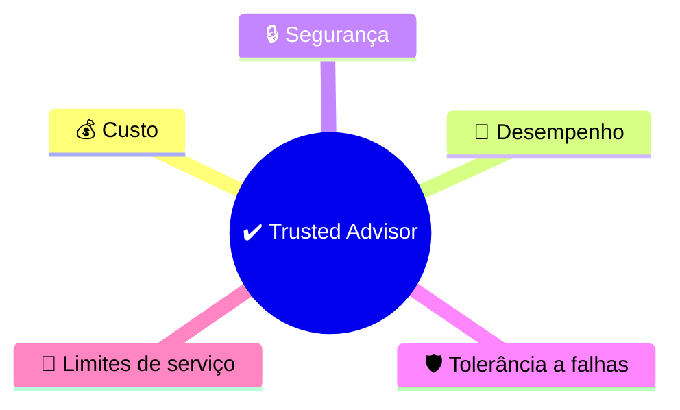

<h1 align="center">🛟 Seção 5 – Suporte Técnico</h1>

  
  
   
  
  

  <a href="../README.md">🏠 Início</a> &nbsp;•&nbsp;
  <a href="./Seção%204%20-%20AWS%20Billing%20and%20Cost%20Management.md">⬅️ Anterior: Billing and Cost Management</a> &nbsp;•&nbsp;
  <a href="./Seção%206%20-%20Conclusão%20do%20Módulo%202.md">Próxima: Conclusão do Módulo 2 ➡️</a>

## 📑 Sumário

| # | Tópico |
|:---:|---|
| 1 | [🛟 AWS Support](#aws-support) |
| 2 | [🧑‍🏫 Orientações, melhores práticas e assistência](#orientacoes) |
| 3 | [📦 Planos de suporte](#planos) |
| 4 | [⏱️ Gravidade do caso e tempos de resposta](#gravidade) |
| 🎯 | [Principais conclusões](#conclusoes) |

---

## 1. 🛟 AWS Support

O **AWS Support** oferece uma combinação de **ferramentas** e **especialização** para ajudar clientes de qualquer nível, seja quem está começando ou quem já usa a AWS há tempo. Essa ajuda é organizada em:

- 🛟 **AWS Support**: o serviço de suporte em si (equipe, ferramentas e canais de atendimento).
- 📦 **Planos do AWS Support**: níveis de suporte com recursos e preços diferentes, escolhidos conforme a necessidade.

O suporte é fornecido para três cenários:

| 🧪 Experimentação | 🏭 Produção | 🚨 Negócios críticos |
|---|---|---|
| **Experimentação** com a AWS. | Uso da AWS em **produção**. | **Processos de negócios críticos** que dependem da AWS. |

## 2. 🧑‍🏫 Orientações, melhores práticas e assistência

Além do atendimento a casos, o AWS Support oferece recursos específicos:

| Recurso | Categoria | Para que serve |
|---|---|---|
| 🧑‍💼 **Gerente técnico de conta (TAM – *Technical Account Manager*)** | 🧭 Orientações proativas | Ponto de contato principal que oferece **orientação**, **revisão de arquitetura** e comunicação contínua para planejar, implantar e otimizar soluções. |
| ✔️ **AWS Trusted Advisor** | ⭐ Melhores práticas | Ferramenta *online* que funciona como um **especialista personalizado**: verifica o ambiente e recomenda melhorias de **custo**, **desempenho**, **segurança**, **tolerância a falhas** e **limites de serviço**. |
| 🛎️ **AWS Support Concierge** | 💳 Assistência à conta | Equipe especializada em **faturamento e contas**: trata dúvidas **não técnicas** sobre cobrança e gerenciamento da conta. |

## 3. 📦 Planos de suporte

O AWS Support oferece **quatro planos**, em ordem crescente de recursos:

| Plano | Indicado para | O que inclui |
|---|---|---|
| 🟢 **Básico (*Basic*)** | Todos os clientes (incluído sem custo) | Central de recursos, **painel de status do serviço** (*Service Health Dashboard*), perguntas frequentes sobre produtos, **fóruns de discussão** e suporte a **verificações de integridade**. |
| 🔵 **Desenvolvedor (*Developer*)** | Desenvolvimento **inicial** e testes na AWS | Suporte técnico em **horário comercial** para casos de menor gravidade. |
| 🟠 **Comercial (*Business*)** | Clientes com cargas de trabalho em **produção** | Suporte técnico **24/7** e respostas mais rápidas. |
| 🔴 **Empresarial (*Enterprise*)** | Cargas de trabalho **comerciais e essenciais à missão** | Suporte **24/7**, resposta mais rápida para casos críticos e acesso a um **TAM**. |

### 🔎 Comparativo rápido

| Recurso | 🟢 Básico | 🔵 Desenvolvedor | 🟠 Business | 🔴 Enterprise |
|---|:---:|:---:|:---:|:---:|
| Abre casos técnicos | ❌ | ✅ | ✅ | ✅ |
| Atendimento 24/7 | ❌ | ❌ | ✅ | ✅ |
| Casos críticos (até 15 min) | ❌ | ❌ | ❌ | ✅ |
| Gerente técnico de conta (TAM) | ❌ | ❌ | ❌ | ✅ |

## 4. ⏱️ Gravidade do caso e tempos de resposta

Ao abrir um caso, o cliente indica a **gravidade** (severidade) do problema, e é ela que define o **tempo de resposta** esperado em cada plano:

| Plano | 🚨 Crítico | 🔥 Urgente | ⚠️ Alto | 📌 Normal | 💤 Baixo |
|---|:---:|:---:|:---:|:---:|:---:|
| 🟢 **Básico** | — | — | — | — | — |
| 🔵 **Desenvolvedor** (horário comercial) | — | — | — | Até 12 horas | Até 24 horas |
| 🟠 **Business** (24/7) | — | Até 1 hora | Até 4 horas | Até 12 horas | Até 24 horas |
| 🔴 **Enterprise** (24/7) | **Até 15 minutos** | Até 1 hora | Até 4 horas | Até 12 horas | Até 24 horas |

> [!IMPORTANT]
> - O plano **Básico** **não oferece suporte a casos** técnicos.
> - O plano **Desenvolvedor** atende apenas casos de gravidade **normal** e **baixa**, em horário comercial.
> - Somente o plano **Enterprise** atende casos **críticos**, com resposta em até **15 minutos**.

---

## 🎯 Principais conclusões

- ✅ O **AWS Support** combina ferramentas e especialistas para apoiar desde a **experimentação** até **processos críticos** em produção.
- ✅ O **TAM** dá **orientação proativa**, o **Trusted Advisor** recomenda **melhores práticas** e o **Support Concierge** cuida de **faturamento e contas**.
- ✅ Existem **quatro planos**: **Básico**, **Desenvolvedor**, **Business** e **Enterprise**.
- ✅ A **gravidade do caso** determina o **tempo de resposta**; quanto mais alto o plano, mais rápido o atendimento.
- ✅ Apenas o **Enterprise** cobre casos **críticos** (até **15 minutos**) e inclui um **TAM**.

---

  <a href="../README.md">🏠 Início</a> &nbsp;•&nbsp;
  <a href="./Seção%204%20-%20AWS%20Billing%20and%20Cost%20Management.md">⬅️ Anterior: Billing and Cost Management</a> &nbsp;•&nbsp;
  <a href="./Seção%206%20-%20Conclusão%20do%20Módulo%202.md">Próxima: Conclusão do Módulo 2 ➡️</a>

