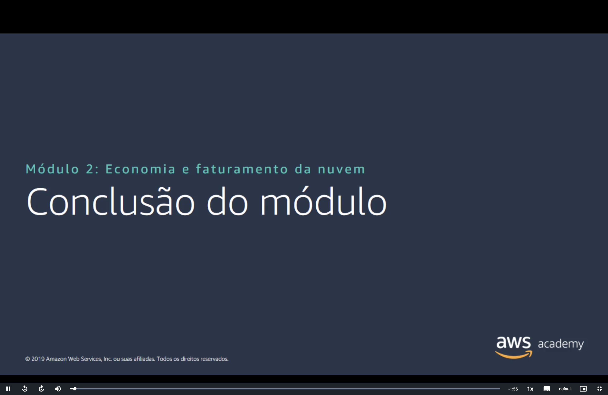
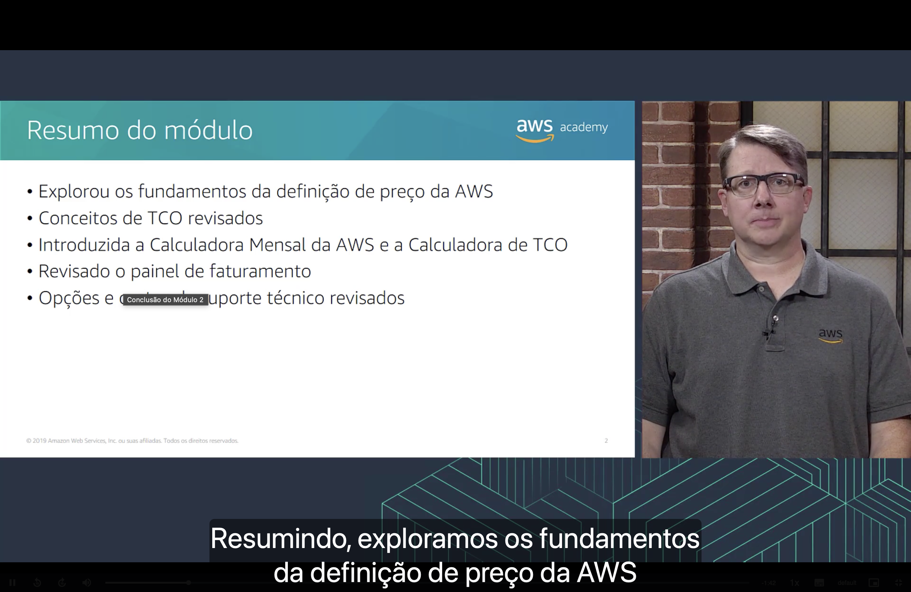
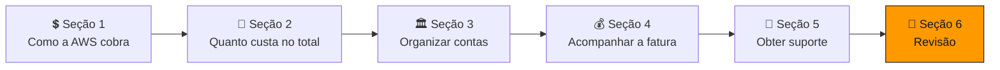
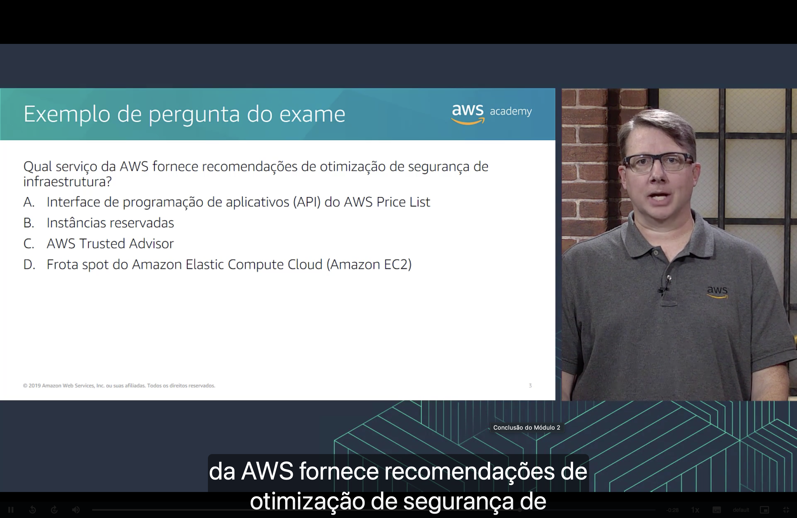
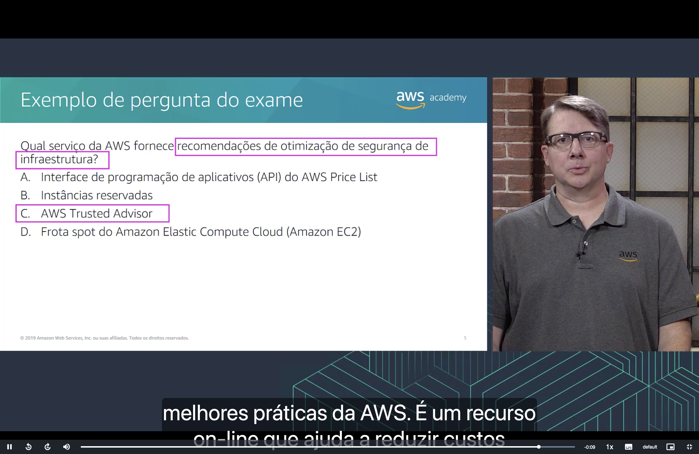

<h1 align="center">🏁 Seção 6 – Conclusão do Módulo 2</h1>

  
  
   
  
  
  

  <a href="../README.md">🏠 Início</a> &nbsp;•&nbsp;
  <a href="./Seção%205%20-%20Suporte%20Técnico.md">⬅️ Anterior: Suporte técnico</a> &nbsp;•&nbsp;
  <a href="./Seção%20Bônus%20-%20Atividade:%20Calculadora%20Mensal.md">Bônus: Calculadora Mensal ➡️</a>

## 📑 Sumário

| # | Tópico |
|:---:|---|
| 1 | [🗂️ Resumo do módulo](#resumo) |
| 2 | [📝 Exemplo de pergunta do exame](#pergunta) |
| 🎯 | [Principais conclusões](#conclusoes) |

---

## 1. 🗂️ Resumo do módulo

Neste módulo, aprendemos a:

| Verbo | Objetivo | Onde estudar |
|---|---|---|
| 🧭 **Explorar** | Os **fundamentos da definição de preço** da AWS (computação, armazenamento e transferência de dados) | [💲 Seção 1](./Seção%201%20-%20Fundamentos%20da%20definição%20de%20preço.md) |
| 🔁 **Revisar** | Os conceitos de **custo total de propriedade (TCO)** | [🧾 Seção 2](./Seção%202%20-%20Custo%20total%20de%20propriedade.md) |
| 🧮 **Conhecer** | A **Calculadora Mensal da AWS** e a **Calculadora de TCO** | [🧾 Seção 2](./Seção%202%20-%20Custo%20total%20de%20propriedade.md) e [🧪 Atividade: Calculadora Mensal](./Seção%20Bônus%20-%20Atividade:%20Calculadora%20Mensal.md) |
| 📊 **Revisar** | O **painel de faturamento** e as ferramentas do AWS Billing and Cost Management | [💰 Seção 4](./Seção%204%20-%20AWS%20Billing%20and%20Cost%20Management.md) e [🎬 Demonstração: Painel de cobrança](./Seção%20Bônus2%20-%20Demonstração%20-%20Painel%20de%20cobrança.md) |
| 🛟 **Revisar** | As **opções e os custos do suporte técnico** | [🛟 Seção 5](./Seção%205%20-%20Suporte%20Técnico.md) |

## 2. 📝 Exemplo de pergunta do exame

> [!NOTE]
> **Qual serviço da AWS fornece recomendações de otimização de segurança de infraestrutura?**

| | Alternativa |
|:---:|---|
| **A** | Interface de programação de aplicativos (API) do AWS Price List |
| **B** | Instâncias reservadas |
| **C** | AWS Trusted Advisor |
| **D** | Frota spot do Amazon Elastic Compute Cloud (Amazon EC2) |

💡 <strong>Clique para ver a resposta</strong>

 

🔑 As palavras-chave da pergunta são **"recomendações de otimização de segurança de infraestrutura"**.

> [!TIP]
> ✅ **Resposta correta: C.** O **AWS Trusted Advisor** é um recurso *online* que verifica o ambiente e recomenda melhorias com base nas **melhores práticas da AWS**, ajudando a reduzir custos, aumentar o desempenho e **melhorar a segurança**.

Por que as outras estão erradas:

| Alternativa | Por que não é a resposta |
|:---:|---|
| ❌ **A** | A **API do AWS Price List** serve para **consultar preços** dos serviços, não para recomendar melhorias de segurança. |
| ❌ **B** | **Instâncias reservadas** são um **modelo de compra** com desconto em troca de compromisso de uso; tratam de custo, não de segurança. |
| ❌ **D** | A **frota spot do EC2** é uma forma de executar instâncias usando **capacidade ociosa** a preço reduzido; também é uma questão de custo. |

Isso retoma a [Seção 5](./Seção%205%20-%20Suporte%20Técnico.md), em que o **Trusted Advisor** aparece como o recurso de **melhores práticas** do AWS Support, cobrindo **custo**, **desempenho**, **segurança**, **tolerância a falhas** e **limites de serviço**.

---

## 🎯 Principais conclusões

- ✅ O preço da AWS se baseia em três fatores: **computação**, **armazenamento** e **transferência de dados** (saída), com **pagamento conforme o uso**.
- ✅ O **TCO** compara o custo total de manter a infraestrutura **local** versus **na nuvem**, considerando também custos indiretos.
- ✅ A **Calculadora Mensal da AWS** estima o custo dos serviços; a **Calculadora de TCO** compara o ambiente local com a AWS.
- ✅ O **painel de faturamento**, o **Cost Explorer**, o **AWS Budgets** e os **relatórios de uso e custo** ajudam a acompanhar e controlar os gastos.
- ✅ O **AWS Support** oferece quatro planos (**Básico**, **Desenvolvedor**, **Business** e **Enterprise**), e o **Trusted Advisor** recomenda melhorias, inclusive de **segurança**.

---

  <a href="../README.md">🏠 Início</a> &nbsp;•&nbsp;
  <a href="./Seção%205%20-%20Suporte%20Técnico.md">⬅️ Anterior: Suporte técnico</a> &nbsp;•&nbsp;
  <a href="./Seção%20Bônus%20-%20Atividade:%20Calculadora%20Mensal.md">Bônus: Calculadora Mensal ➡️</a>

