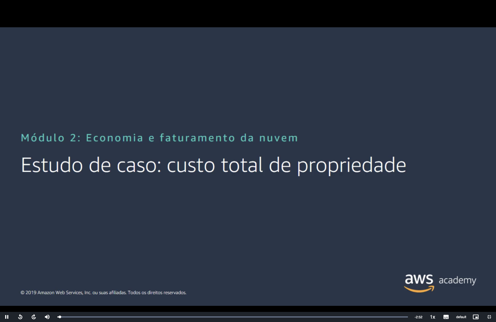
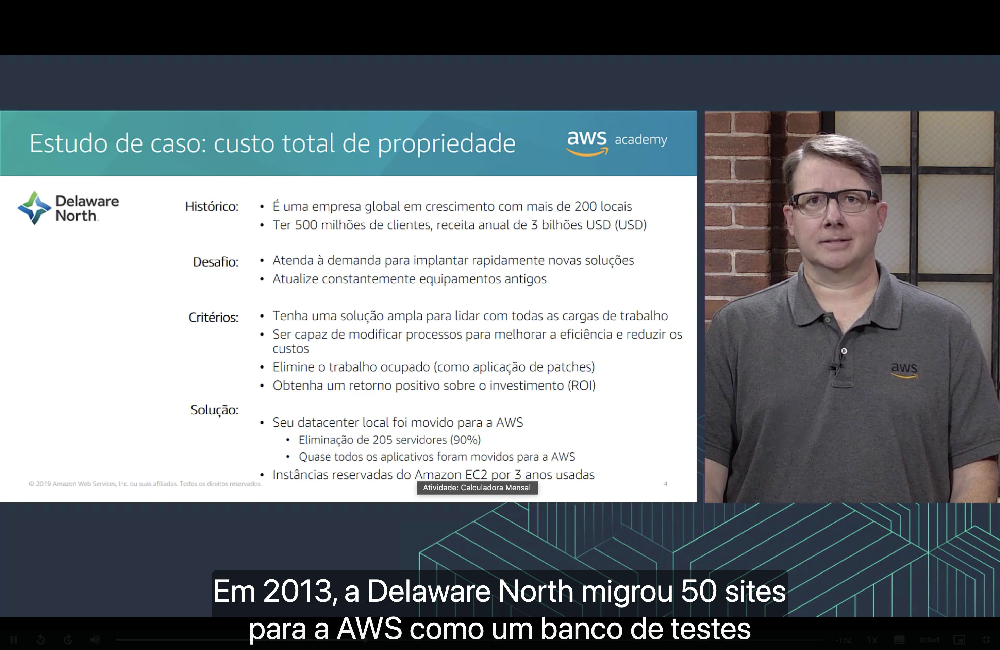
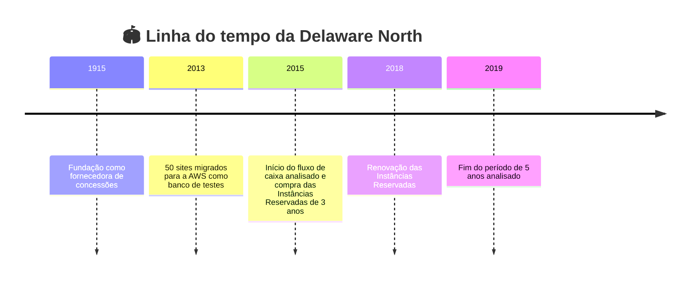
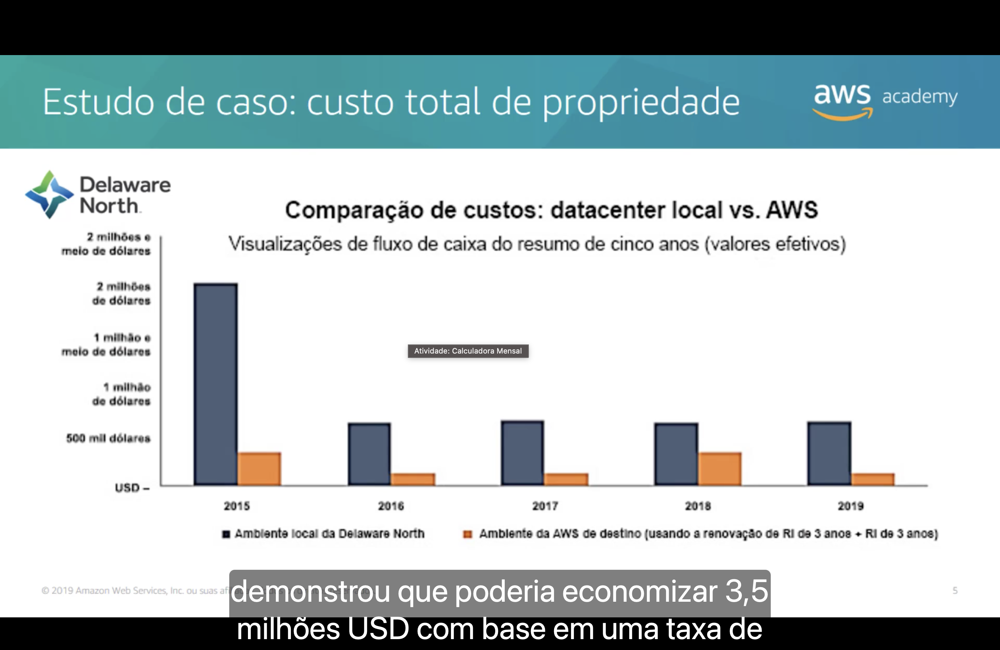
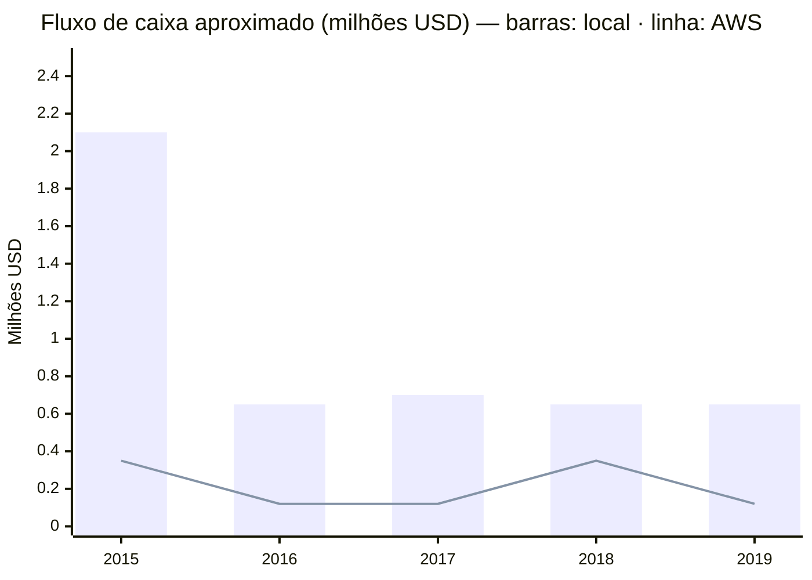
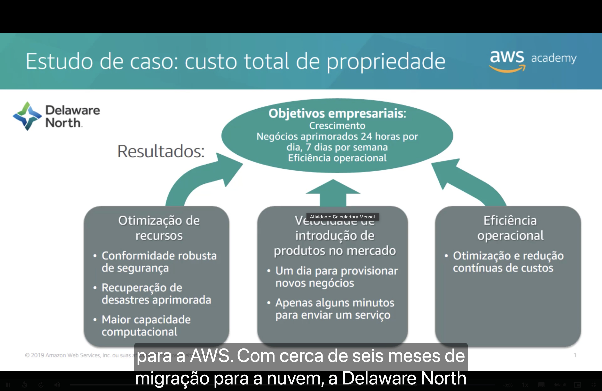

<h1 align="center">🧪 Seção Bônus – Atividade: Calculadora Mensal</h1>

  
  
   
  
  
  

  <a href="../README.md">🏠 Início</a> &nbsp;•&nbsp;
  <a href="./Seção%206%20-%20Conclusão%20do%20Módulo%202.md">⬅️ Anterior: Conclusão do Módulo 2</a> &nbsp;•&nbsp;
  <a href="./Seção%20Bônus2%20-%20Demonstração%20-%20Painel%20de%20cobrança.md">Bônus 2: Painel de cobrança ➡️</a>

> [!NOTE]
> Esta atividade aplica na prática o conceito de **custo total de propriedade (TCO)** visto na [Seção 2](./Seção%202%20-%20Custo%20total%20de%20propriedade.md), usando o caso real da **Delaware North**.

## 📑 Sumário

| # | Tópico |
|:---:|---|
| 1 | [🏟️ Estudo de caso: Delaware North](#estudo-de-caso) |
| 2 | [📊 Comparação de custos: datacenter local vs. AWS](#comparacao) |
| 3 | [🏆 Resultados](#resultados) |
| 🎯 | [Principais conclusões](#conclusoes) |

---

## 1. 🏟️ Estudo de caso: Delaware North

A Delaware North surgiu em **1915** como fornecedora de concessões e hoje atua no mundo todo.

| 📍 +200 locais | 👥 500 milhões de clientes | 💵 3 bilhões USD de receita anual |
|:---:|:---:|:---:|

| Tópico | Detalhes |
|---|---|
| 📜 **Histórico** | Empresa global em crescimento, com **mais de 200 locais**, **500 milhões de clientes** e **receita anual de 3 bilhões USD** |
| 🧗 **Desafio** | Atender à demanda por **implantar novas soluções rapidamente** e **atualizar constantemente equipamentos antigos** |
| 📋 **Critérios** | Ter uma **solução ampla** para todas as cargas de trabalho; **modificar processos** para ganhar eficiência e reduzir custos; **eliminar trabalho operacional repetitivo** (como aplicação de patches); obter **retorno positivo sobre o investimento (ROI)** |
| ✅ **Solução** | O **datacenter local foi movido para a AWS**: **205 servidores eliminados (90%)**, quase todos os aplicativos migrados e uso de **Instâncias Reservadas do Amazon EC2 de 3 anos** |

## 2. 📊 Comparação de custos: datacenter local vs. AWS

O gráfico mostra o **fluxo de caixa de cinco anos (2015–2019)** comparando o ambiente local da Delaware North com o ambiente de destino na AWS (usando **Instâncias Reservadas de 3 anos** e a renovação delas).

| Ano | 🏢 Ambiente local (aprox.) | ☁️ AWS (aprox.) |
|:---:|---:|---:|
| 2015 | ~2,1 milhões USD | ~0,35 milhão USD |
| 2016 | ~0,65 milhão USD | ~0,12 milhão USD |
| 2017 | ~0,7 milhão USD | ~0,12 milhão USD |
| 2018 | ~0,65 milhão USD | ~0,35 milhão USD |
| 2019 | ~0,65 milhão USD | ~0,12 milhão USD |

> [!NOTE]
> Os valores da tabela são leituras aproximadas do gráfico. Os picos da AWS em **2015** e **2018** batem com o pagamento das **Instâncias Reservadas de 3 anos** (a compra inicial e a renovação três anos depois).

- 📉 O custo da AWS fica **abaixo do custo local em todos os anos** do período.
- 💰 Segundo a análise de TCO apresentada no vídeo, a empresa poderia **economizar cerca de 3,5 milhões USD** ao migrar para a AWS.

## 3. 🏆 Resultados

Após cerca de **seis meses de migração** para a nuvem, os resultados sustentaram três **objetivos empresariais**:

| 📈 Crescimento | 🕐 Negócios 24/7 | ⚙️ Eficiência operacional |
|:---:|:---:|:---:|

| Resultado | O que mudou |
|---|---|
| 🛠️ **Otimização de recursos** | Conformidade de segurança robusta, recuperação de desastres aprimorada e maior capacidade computacional |
| 🚀 **Velocidade de introdução de produtos no mercado** | **Um dia** para provisionar novos negócios e **apenas alguns minutos** para colocar um serviço no ar |
| ⚙️ **Eficiência operacional** | Otimização e redução contínuas de custos |

---

## 🎯 Principais conclusões

- ✅ A Delaware North usou uma **análise de TCO** para justificar a migração do datacenter local para a AWS.
- ✅ A migração começou pequena (**50 sites em 2013**, como teste) e depois eliminou **205 servidores (90%)**.
- ✅ **Instâncias Reservadas de 3 anos** do EC2 reduziram o custo de computação, com pagamentos concentrados na compra e na renovação.
- ✅ Em cinco anos, o custo na AWS ficou **bem abaixo** do custo local, com economia estimada de **cerca de 3,5 milhões USD**.
- ✅ Os ganhos foram além do custo: **segurança**, **recuperação de desastres**, **agilidade** para lançar serviços e **eficiência operacional**.

---

  <a href="../README.md">🏠 Início</a> &nbsp;•&nbsp;
  <a href="./Seção%206%20-%20Conclusão%20do%20Módulo%202.md">⬅️ Anterior: Conclusão do Módulo 2</a> &nbsp;•&nbsp;
  <a href="./Seção%20Bônus2%20-%20Demonstração%20-%20Painel%20de%20cobrança.md">Bônus 2: Painel de cobrança ➡️</a>

