<h1 align="center">🎬 Seção Bônus 2 – Demonstração: Painel de cobrança</h1>

  
  
   
  
  

  <a href="../README.md">🏠 Início</a> &nbsp;•&nbsp;
  <a href="./Seção%20Bônus%20-%20Atividade:%20Calculadora%20Mensal.md">⬅️ Anterior: Calculadora Mensal</a> &nbsp;•&nbsp;
  <a href="./Seção%204%20-%20AWS%20Billing%20and%20Cost%20Management.md">📚 Teoria: Billing and Cost Management</a>

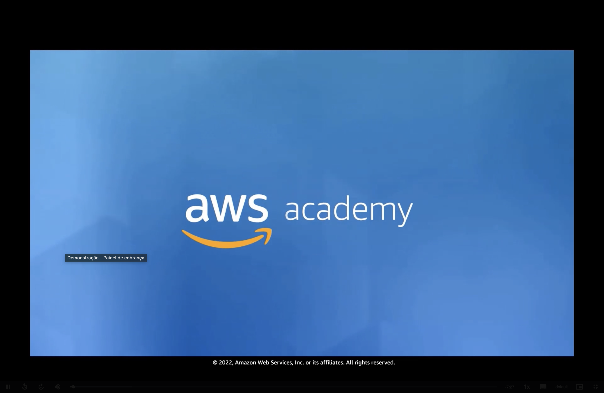

> [!NOTE]
> Esta demonstração mostra na prática, dentro do console, as ferramentas do **AWS Billing and Cost Management** vistas na [Seção 4](./Seção%204%20-%20AWS%20Billing%20and%20Cost%20Management.md): o **painel de faturamento**, o **AWS Cost Explorer** e o **AWS Budgets**.

## 📑 Sumário

| # | Tópico |
|:---:|---|
| 1 | [🚪 Acessando o painel de faturamento](#acessando) |
| 2 | [📊 Painel de faturamento](#painel) |
| 3 | [📈 Cost Explorer](#cost-explorer) |
| 4 | [💾 Salvando um relatório](#salvando) |
| 5 | [🎯 AWS Budgets](#budgets) |
| 🎯 | [Principais conclusões](#conclusoes) |

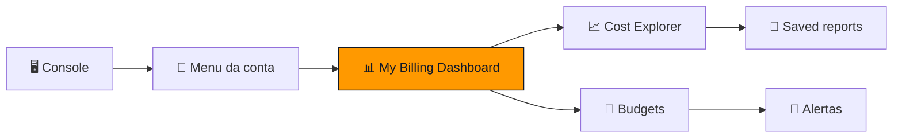

---

## 1. 🚪 Acessando o painel de faturamento

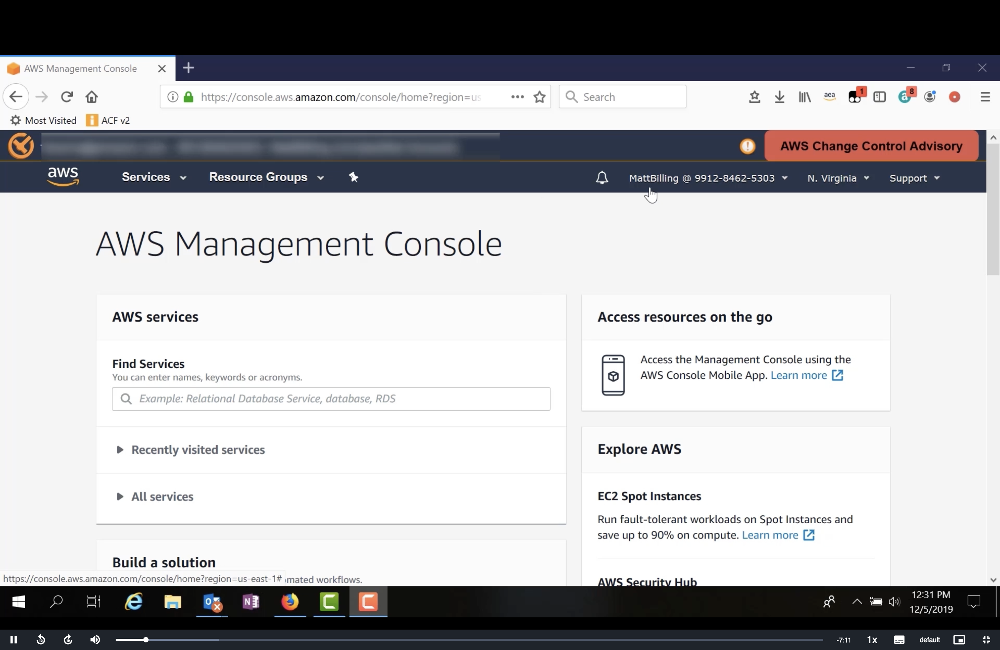

A demonstração começa no **AWS Management Console**, já conectado com um **usuário do IAM** (no exemplo, `MattBilling`).

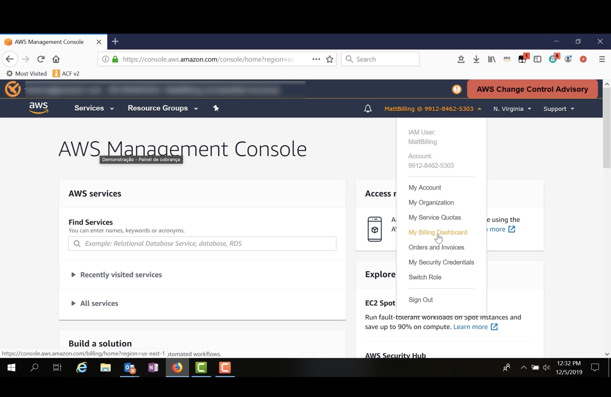

Para chegar ao painel de faturamento:

| Passo | Ação |
|:---:|---|
| 1️⃣ | Clique no **nome da conta** no canto superior direito da barra de navegação. |
| 2️⃣ | O menu mostra o **usuário do IAM** e o **número da conta**, além de atalhos como **My Account**, **My Organization**, **My Service Quotas** e **Orders and Invoices**. |
| 3️⃣ | Selecione **My Billing Dashboard**. |

> [!WARNING]
> Para que um usuário do IAM veja as informações de faturamento, o acesso precisa ser **liberado pelo usuário raiz** e o usuário precisa ter **permissões do IAM** para isso.

## 2. 📊 Painel de faturamento

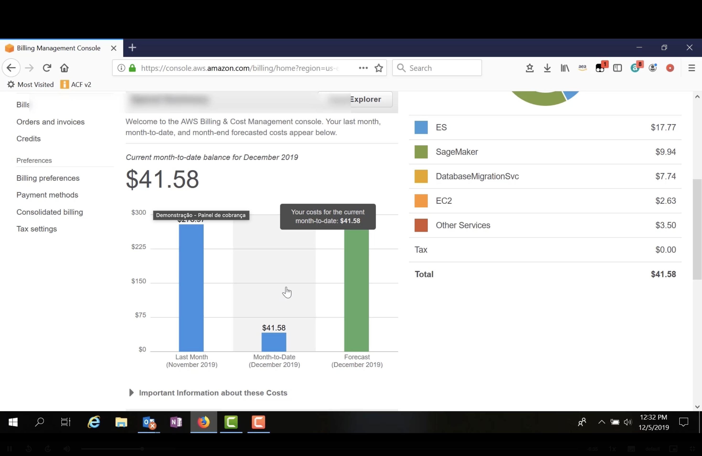

O **AWS Billing & Cost Management Dashboard** apresenta os custos do **mês passado**, o **acumulado do mês atual** e a **previsão** para o fim do mês.

| Elemento | No exemplo |
|---|---|
| 💵 **Saldo acumulado do mês** (*Current month-to-date balance*) | **41,58 USD** em dezembro de 2019 |
| 📊 **Gráfico de barras** | Compara **mês passado** (novembro, ~280 USD), **mês até a data** (41,58 USD) e **previsão** (dezembro) |
| 🥧 **Gastos por serviço** | **ES** (17,77 USD), **SageMaker** (9,94 USD), **DatabaseMigrationSvc** (7,74 USD), **EC2** (2,63 USD) e **outros serviços** (3,50 USD) |
| 🧾 **Imposto e total** | Imposto de 0,00 USD e **total de 41,58 USD** |

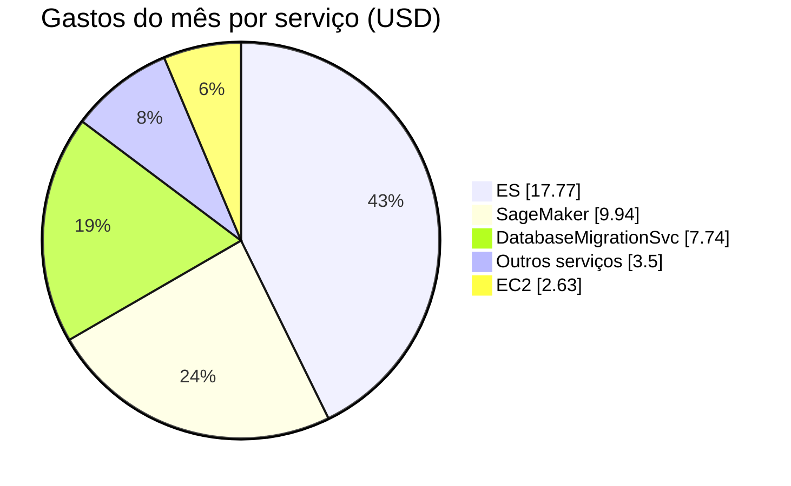

O menu lateral dá acesso a outras páginas do serviço, como **Bills**, **Orders and invoices**, **Credits**, **Billing preferences**, **Payment methods**, **Consolidated billing** e **Tax settings**.

## 3. 📈 Cost Explorer

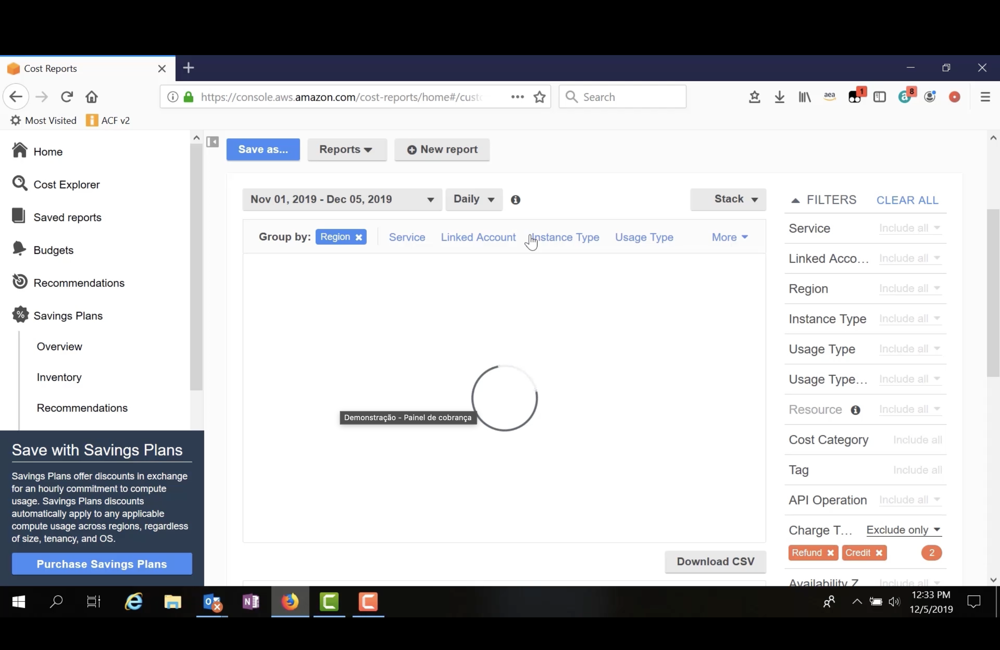

A partir do painel, o botão **Cost Explorer** abre a ferramenta de **relatórios de custo**. A tela é dividida em:

| Área | O que oferece |
|---|---|
| 📂 **Menu lateral** | **Home**, **Cost Explorer**, **Saved reports**, **Budgets**, **Recommendations** e **Savings Plans** (com *Overview*, *Inventory* e *Recommendations*). |
| 📅 **Período e granularidade** | Intervalo de datas (no exemplo, **1º de novembro a 5 de dezembro de 2019**) e visualização **diária** (*Daily*) ou **mensal**. |
| 🗂️ **Agrupar por** (*Group by*) | **Region**, **Service**, **Linked Account**, **Instance Type**, **Usage Type** e outros. |
| 🔎 **Filtros** (*Filters*) | Incluir ou excluir dados por serviço, conta vinculada, região, tipo de instância, tipo de uso, tag, operação de API, tipo de cobrança etc. No exemplo, **reembolsos** (*Refund*) e **créditos** (*Credit*) foram **excluídos**. |
| ⬇️ **Download CSV** | Exporta os dados do relatório. |

### 🌎 Custos diários agrupados por região

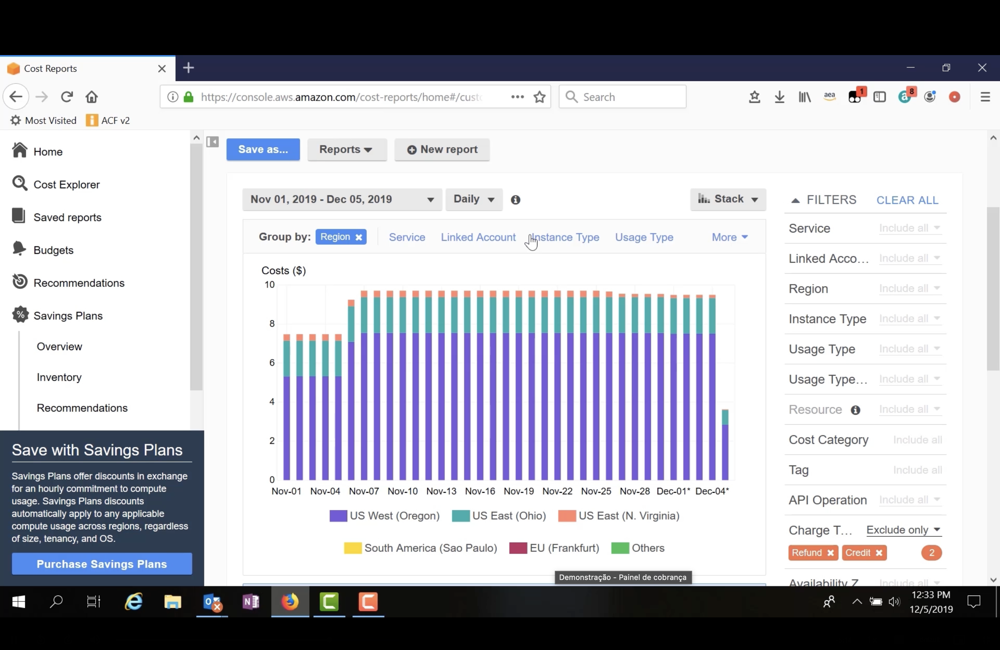

Agrupando por **região**, o gráfico de **barras empilhadas** (*Stack*) mostra quanto cada região custou **por dia**:

- 🥇 A maior parte do custo vem de **US West (Oregon)**, seguida de **US East (Ohio)** e **US East (N. Virginia)**.
- 📈 O custo diário fica em torno de **7,5 USD** no início de novembro e sobe para cerca de **9,5 USD** a partir de **7 de novembro**.
- ⏳ O último dia aparece menor porque ainda está **em andamento** (datas marcadas com `*` são parciais).

## 4. 💾 Salvando um relatório

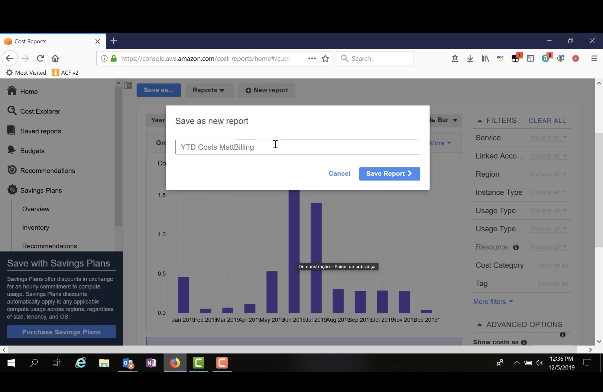

Depois de ajustar período, agrupamento e filtros, o relatório pode ser **salvo** para ser consultado de novo:

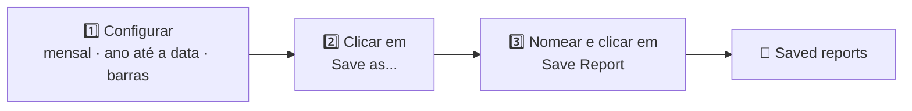

No exemplo, o relatório foi salvo como `YTD Costs MattBilling` e fica disponível em **Saved reports**. No gráfico, os maiores gastos do ano aparecem em **junho** e **julho de 2019**.

## 5. 🎯 AWS Budgets

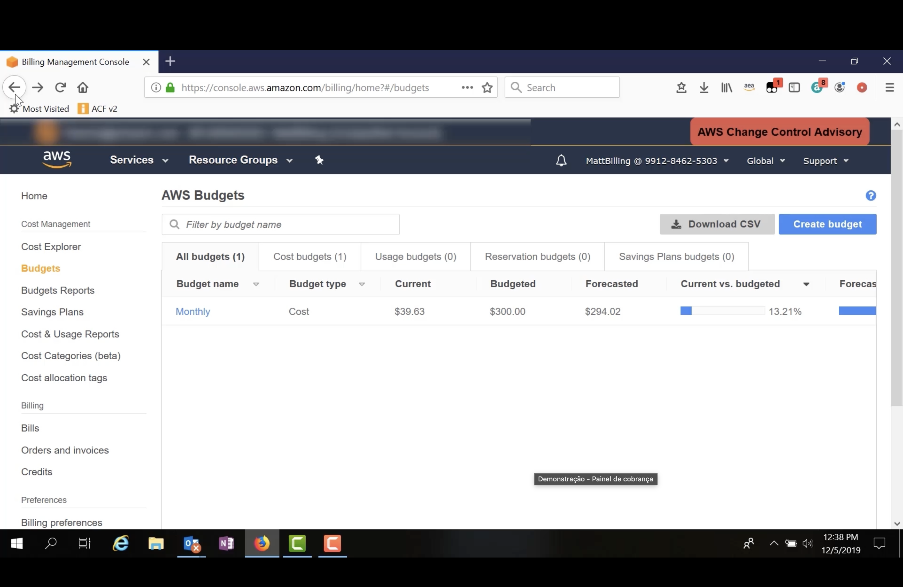

Pelo menu **Budgets**, a página **AWS Budgets** lista os orçamentos criados, separados em abas: **All budgets**, **Cost budgets**, **Usage budgets**, **Reservation budgets** e **Savings Plans budgets**. O botão **Create budget** cria um novo orçamento.

| Orçamento | Tipo | Atual | Orçado | Previsto | Atual vs. orçado |
|---|---|---:|---:|---:|---:|
| 📅 **Monthly** | Custo | 39,63 USD | 300,00 USD | 294,02 USD | 13,21% |

### 🔍 Detalhes do orçamento

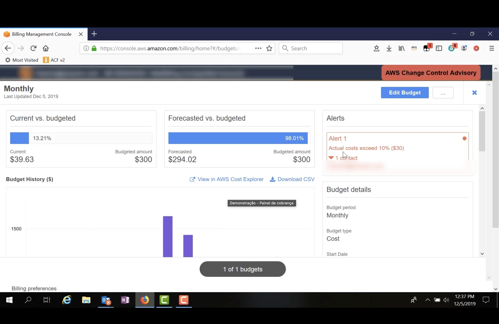

Ao abrir o orçamento **Monthly**, o console mostra:

| Indicador | Progresso em relação aos 300 USD | Valor |
|---|---|---:|
| 💵 **Atual vs. orçado** | 🟧⬜⬜⬜⬜⬜⬜⬜⬜⬜ | **13,21%** (39,63 USD) |
| 🔮 **Previsto vs. orçado** | 🟧🟧🟧🟧🟧🟧🟧🟧🟧🟧 | **98,01%** (294,02 USD) |
| 🔔 **Limite do Alert 1** | 🟥⬜⬜⬜⬜⬜⬜⬜⬜⬜ | **10%** (30 USD) |

- 🔮 A previsão indica que o mês deve fechar **perto do limite**.
- 🔔 **Alerts**: o **Alert 1** dispara quando os **custos reais ultrapassam 10% (30 USD)** do orçamento e notifica **1 contato**. Como o gasto atual já passou de 30 USD, o alerta está **ativo**.
- 📈 **Budget History**: gráfico com o histórico do orçamento, com atalhos para **View in AWS Cost Explorer** e **Download CSV**.
- 📋 **Budget details**: período (**mensal**), tipo (**custo**) e data de início.
- ✏️ **Edit Budget**: permite ajustar valores, período e alertas.

---

## 🎯 Principais conclusões

- ✅ O painel de faturamento é acessado pelo **menu da conta** → **My Billing Dashboard**; usuários do IAM precisam de **permissão** para isso.
- ✅ O **painel** resume o gasto do **mês passado**, do **mês atual** e a **previsão**, além do custo **por serviço**.
- ✅ O **Cost Explorer** permite escolher **período**, **granularidade** (diária ou mensal), **agrupamento** (região, serviço, conta etc.) e **filtros**, e exportar os dados em **CSV**.
- ✅ Relatórios configurados no Cost Explorer podem ser **salvos** e reabertos em **Saved reports**.
- ✅ O **AWS Budgets** compara gasto **atual**, **previsto** e **orçado**, e envia **alertas** quando um limite definido é ultrapassado.

---

  <a href="../README.md">🏠 Início</a> &nbsp;•&nbsp;
  <a href="./Seção%20Bônus%20-%20Atividade:%20Calculadora%20Mensal.md">⬅️ Anterior: Calculadora Mensal</a> &nbsp;•&nbsp;
  <a href="./Seção%204%20-%20AWS%20Billing%20and%20Cost%20Management.md">📚 Teoria: Billing and Cost Management</a>

