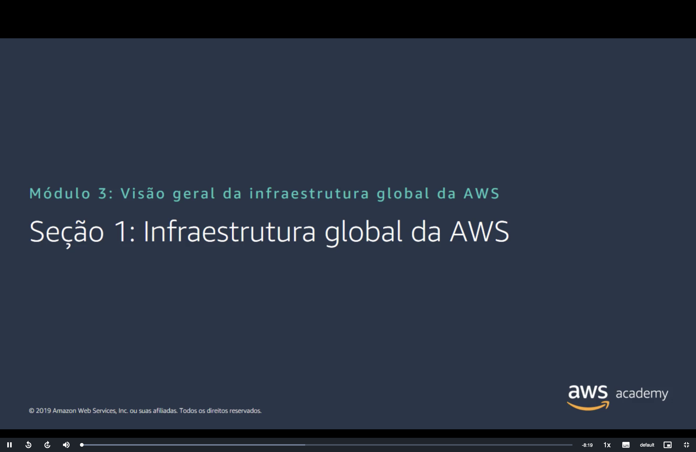
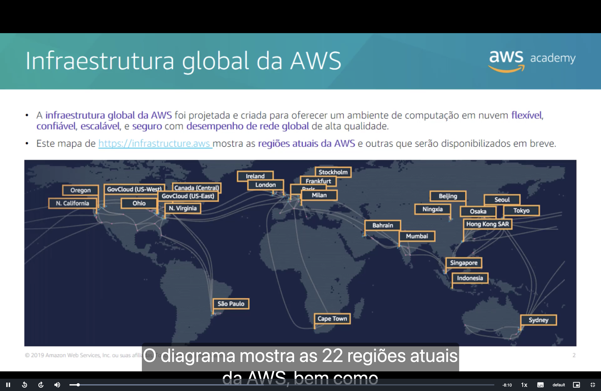
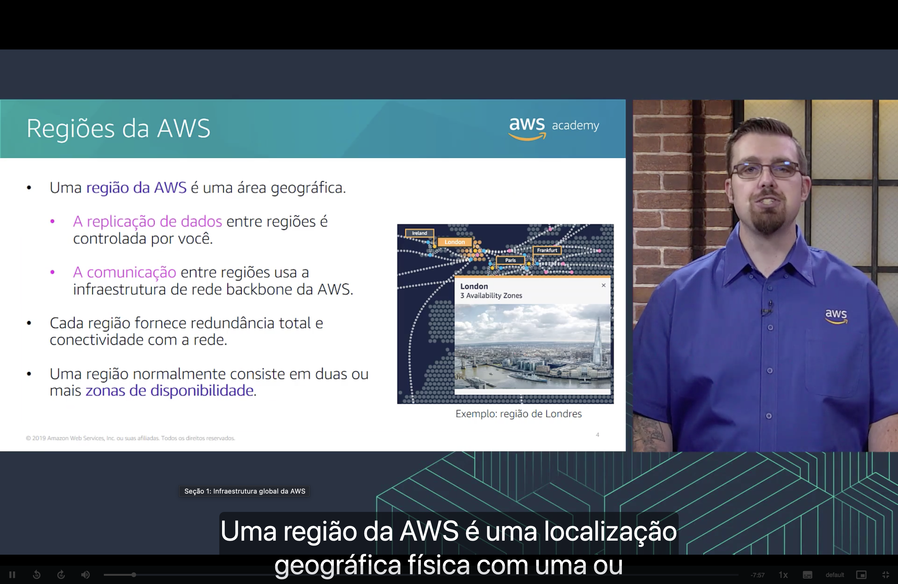
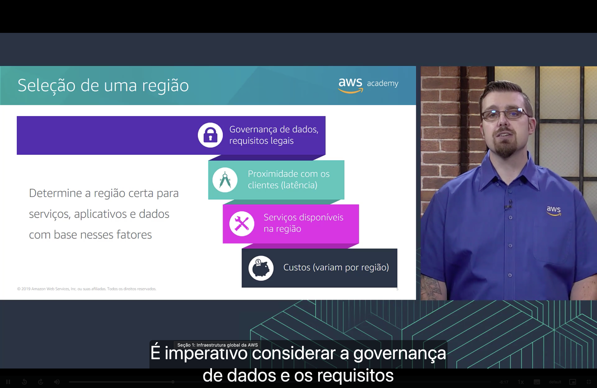
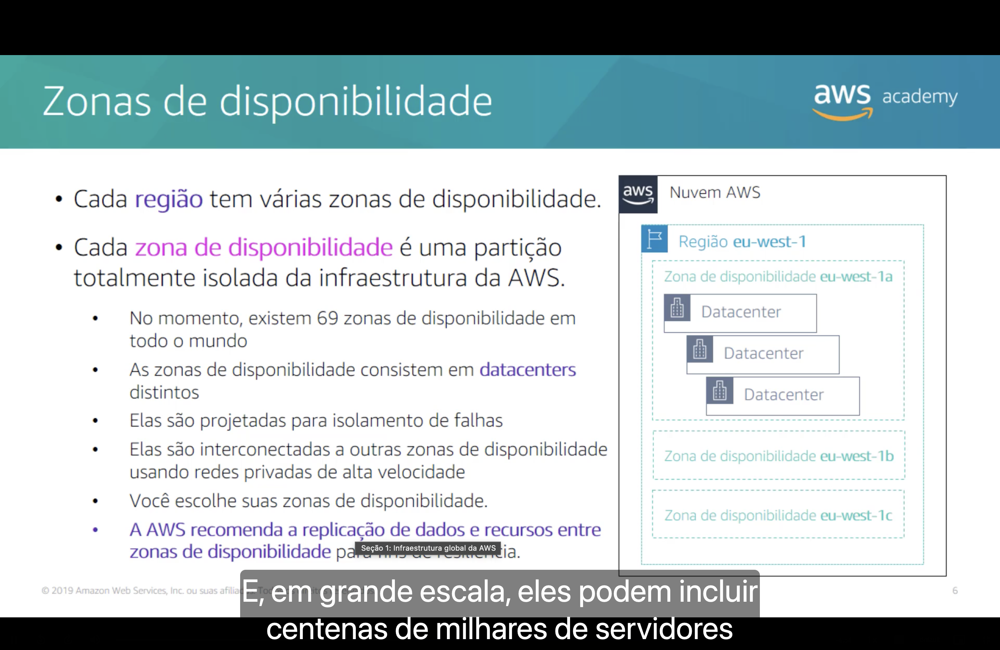
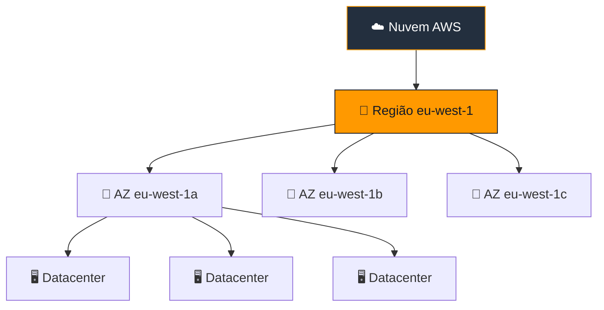
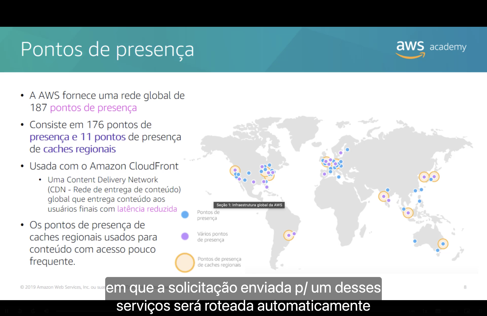
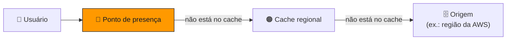
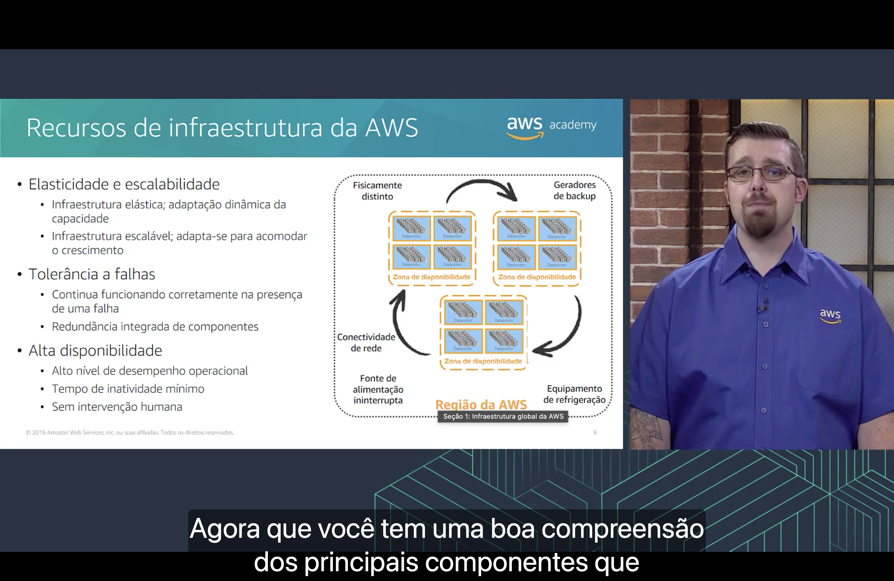

<h1 align="center">🌍 Seção 1 – Infraestrutura global da AWS</h1>

  
  
   
  
  
  

  <a href="../README.md">🏠 Início</a> &nbsp;•&nbsp;
  <a href="../MÓDULO%202/Seção%206%20-%20Conclusão%20do%20Módulo%202.md">⬅️ Módulo anterior: Conclusão do Módulo 2</a> &nbsp;•&nbsp;
  <a href="./Seção%202%20-%20Visão%20geral%20dos%20serviços%20e%20das%20categorias%20de%20serviços%20da%20AWS.md">Próxima: Serviços e categorias da AWS ➡️</a>

## 📑 Sumário

| # | Tópico |
|:---:|---|
| 1 | [🌍 Infraestrutura global da AWS](#infraestrutura-global) |
| 2 | [🗺️ Regiões da AWS](#regioes) |
| 3 | [🧭 Seleção de uma região](#selecao-regiao) |
| 4 | [🏢 Zonas de disponibilidade](#zonas) |
| 5 | [🖥️ Datacenters da AWS](#datacenters) |
| 6 | [📡 Pontos de presença](#pontos-presenca) |
| 7 | [⭐ Recursos de infraestrutura da AWS](#recursos) |
| 🎯 | [Principais conclusões](#conclusoes) |

---

## 1. 🌍 Infraestrutura global da AWS

> [!NOTE]
> A **infraestrutura global da AWS** foi projetada e criada para oferecer um ambiente de computação em nuvem **flexível**, **confiável**, **escalável** e **seguro**, com **desempenho de rede global** de alta qualidade.

- 🗺️ O mapa em [infrastructure.aws](https://infrastructure.aws) mostra as **regiões atuais** da AWS e as que serão disponibilizadas em breve.
- 📊 Na época do slide, eram **22 regiões** ativas, entre elas **São Paulo**, a região da AWS na América do Sul.
- 🏛️ Aparecem também regiões especiais, como a **GovCloud (US-East / US-West)**, voltada a cargas de trabalho do governo dos EUA.

> [!TIP]
> Os números de regiões, zonas e pontos de presença mudam com frequência. Para a prova, o que importa é entender **como os componentes se relacionam**, não decorar as quantidades.

## 2. 🗺️ Regiões da AWS

Uma **região da AWS** é uma **área geográfica** física que contém uma ou mais zonas de disponibilidade.

| Característica | O que significa |
|---|---|
| 🔁 **Replicação de dados controlada por você** | A AWS não copia dados entre regiões por conta própria; é o cliente quem decide se e para onde replicar. |
| 🔗 **Comunicação pela rede backbone da AWS** | O tráfego entre regiões passa pela infraestrutura de rede privada da AWS. |
| 🛡️ **Redundância total e conectividade** | Cada região é independente e totalmente redundante. |
| 🏢 **Duas ou mais zonas de disponibilidade** | Normalmente, uma região é formada por **duas ou mais AZs**. |

> 💡 **Exemplo:** a região de **Londres** possui **3 zonas de disponibilidade**.

## 3. 🧭 Seleção de uma região

A região certa para serviços, aplicativos e dados é escolhida com base em **quatro fatores**:

| Fator | Por que importa |
|---|---|
| 🔒 **Governança de dados e requisitos legais** | Leis locais podem exigir que os dados fiquem em um país ou região específica (ex.: LGPD, GDPR). |
| 📍 **Proximidade com os clientes (latência)** | Quanto mais perto dos usuários, menor o tempo de resposta. |
| 🛠️ **Serviços disponíveis na região** | Nem todo serviço da AWS existe em todas as regiões; serviços novos costumam chegar primeiro a algumas delas. |
| 💰 **Custos (variam por região)** | O mesmo serviço pode ter preço diferente dependendo da região. |

> [!IMPORTANT]
> A **governança de dados e os requisitos legais** vêm primeiro: se a lei exige que os dados fiquem em determinado local, os outros fatores ficam em segundo plano.

## 4. 🏢 Zonas de disponibilidade

Cada **região** tem várias **zonas de disponibilidade (AZs)**, e cada AZ é uma **partição totalmente isolada** da infraestrutura da AWS.

- 🌐 Na época do slide, existiam **69 zonas de disponibilidade** no mundo.
- 🖥️ As AZs são formadas por **datacenters distintos**.
- 🧱 São projetadas para **isolamento de falhas**: um problema em uma AZ não deve afetar as outras.
- ⚡ São interconectadas por **redes privadas de alta velocidade** e baixa latência.
- 👆 **Você escolhe** em quais AZs os seus recursos serão executados.

> [!TIP]
> O nome da AZ é o código da região mais uma letra: `eu-west-1` + `a` = **`eu-west-1a`**.

> [!WARNING]
> A AWS **recomenda replicar dados e recursos entre zonas de disponibilidade** para garantir resiliência. Manter tudo em uma única AZ significa que uma falha nela derruba a aplicação inteira.

## 5. 🖥️ Datacenters da AWS

- 🔐 Os datacenters da AWS são **projetados para segurança**.
- 💾 É nos datacenters que os **dados residem** e onde o **processamento** acontece.
- 🔌 Cada datacenter tem **energia, rede e conectividade redundantes** e fica em uma **instalação separada**.
- 🗄️ Normalmente, um datacenter tem de **50.000 a 80.000 servidores físicos**.

> [!NOTE]
> Os clientes **não escolhem um datacenter específico** ao implantar um recurso; a menor unidade que o cliente escolhe é a **zona de disponibilidade**.

## 6. 📡 Pontos de presença

Além das regiões, a AWS mantém uma rede global de **pontos de presença** (*edge locations*) espalhados pelo mundo, mais próximos dos usuários finais.

| Tipo | Quantidade (na época do slide) | Função |
|---|:---:|---|
| 🔵 **Pontos de presença** | 176 | Entregam conteúdo a partir de um local próximo ao usuário. |
| 🟠 **Pontos de presença de caches regionais** | 11 | Guardam conteúdo **acessado com pouca frequência**, que já saiu do cache dos pontos de presença comuns. |
| **Total** | **187** | |

- 🚀 São usados pelo **Amazon CloudFront**, a **CDN (Content Delivery Network, rede de entrega de conteúdo)** global da AWS, que entrega conteúdo aos usuários finais com **latência reduzida**.
- 🔀 A solicitação do usuário é **roteada automaticamente** para o ponto de presença mais próximo.

## 7. ⭐ Recursos de infraestrutura da AWS

| Recurso | O que oferece |
|---|---|
| 📈 **Elasticidade e escalabilidade** | Infraestrutura **elástica** (adapta a capacidade dinamicamente) e **escalável** (se adapta para acomodar o crescimento). |
| 🛡️ **Tolerância a falhas** | Continua funcionando corretamente **mesmo quando há uma falha**, graças à **redundância integrada** de componentes. |
| ✅ **Alta disponibilidade** | Alto nível de **desempenho operacional**, **tempo de inatividade mínimo** e **sem intervenção humana**. |

O diagrama mostra **três zonas de disponibilidade** dentro de uma **região**, cada uma com vários datacenters. Elas são **fisicamente distintas** e cada uma conta com:

- 🔋 **Fonte de alimentação ininterrupta** (UPS)
- ⚙️ **Geradores de backup**
- ❄️ **Equipamento de refrigeração**
- 🔗 **Conectividade de rede** com as demais AZs

---

## 🎯 Principais conclusões

- ✅ A **infraestrutura global da AWS** é formada por **regiões** e **zonas de disponibilidade**, complementadas pelos **pontos de presença**.
- ✅ Uma **região** é uma área geográfica com **duas ou mais AZs**; a **replicação entre regiões** é controlada pelo cliente.
- ✅ A escolha da região considera **governança de dados/requisitos legais**, **latência**, **serviços disponíveis** e **custos**.
- ✅ Cada **AZ** é uma partição **isolada** formada por **um ou mais datacenters**; a AWS recomenda distribuir recursos **entre várias AZs**.
- ✅ Os **datacenters** têm energia, rede e conectividade redundantes, mas o cliente **não escolhe o datacenter**, apenas a AZ.
- ✅ Os **pontos de presença** e **caches regionais** são usados pelo **Amazon CloudFront** para entregar conteúdo com **baixa latência**.
- ✅ A infraestrutura oferece **elasticidade e escalabilidade**, **tolerância a falhas** e **alta disponibilidade**.

---

  <a href="../README.md">🏠 Início</a> &nbsp;•&nbsp;
  <a href="../MÓDULO%202/Seção%206%20-%20Conclusão%20do%20Módulo%202.md">⬅️ Módulo anterior: Conclusão do Módulo 2</a> &nbsp;•&nbsp;
  <a href="./Seção%202%20-%20Visão%20geral%20dos%20serviços%20e%20das%20categorias%20de%20serviços%20da%20AWS.md">Próxima: Serviços e categorias da AWS ➡️</a>

