<h1 align="center">🧩 Seção 2 – Visão geral dos serviços e das categorias de serviços da AWS</h1>

  
  
   
  
  
  

  <a href="../README.md">🏠 Início</a> &nbsp;•&nbsp;
  <a href="./Seção%201%20-%20Infraestrutura%20global%20da%20AWS.md">⬅️ Anterior: Infraestrutura global da AWS</a> &nbsp;•&nbsp;
  <a href="./Seção%203%20-%20Conclusão%20do%20Módulo%203.md">Próxima: Conclusão do Módulo 3 ➡️</a>

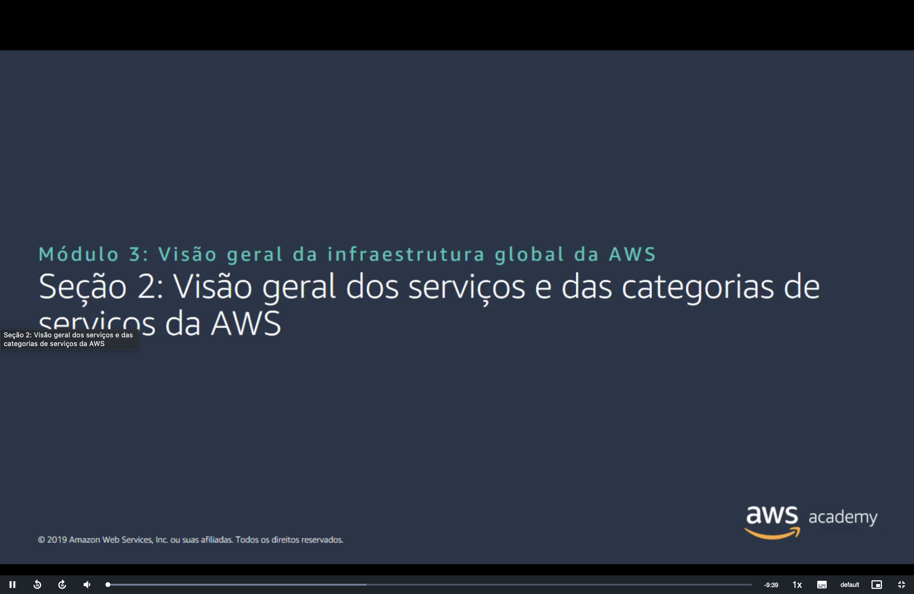

## 📑 Sumário

| # | Tópico |
|:---:|---|
| 1 | [🏗️ Serviços fundamentais da AWS](#servicos-fundamentais) |
| 2 | [🗂️ Categorias de serviços da AWS](#categorias) |
| 3 | [🗄️ Armazenamento](#armazenamento) |
| 4 | [🖥️ Computação](#computacao) |
| 5 | [🛢️ Banco de dados](#banco-de-dados) |
| 6 | [🌐 Redes e entrega de conteúdo](#redes) |
| 7 | [🔐 Segurança, identidade e conformidade](#seguranca) |
| 8 | [💰 Gerenciamento de custos](#custos) |
| 9 | [⚙️ Gerenciamento e governança](#gerenciamento) |
| 🎯 | [Principais conclusões](#conclusoes) |

---

## 1. 🏗️ Serviços fundamentais da AWS

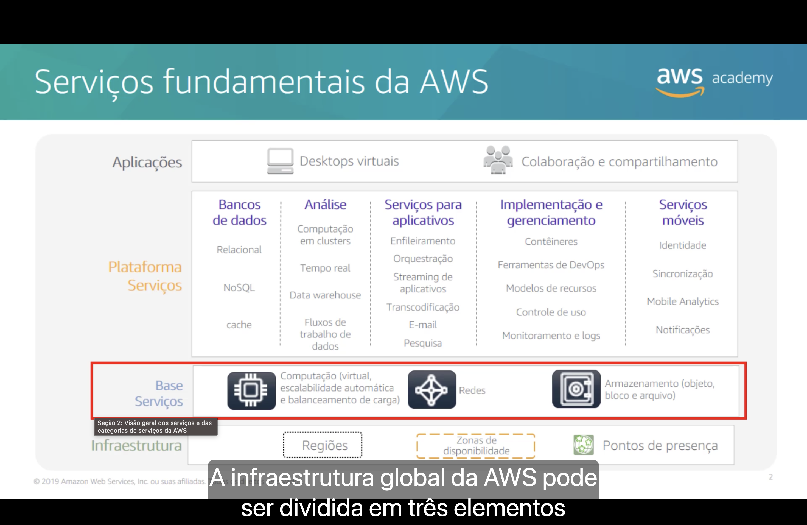

A AWS organiza seus serviços em **camadas**. Cada camada se apoia na de baixo, começando pela **infraestrutura global** vista na Seção 1.

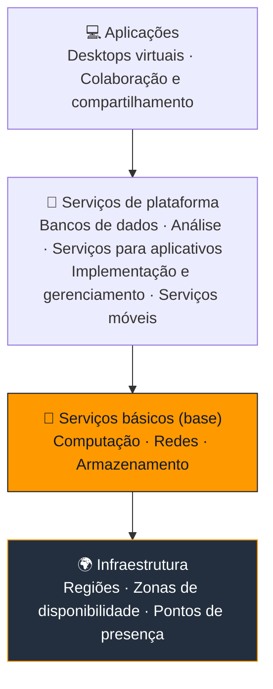

| Camada | O que contém |
|---|---|
| 💻 **Aplicações** | Desktops virtuais, colaboração e compartilhamento. |
| 🧰 **Serviços de plataforma** | **Bancos de dados** (relacional, NoSQL, cache) · **Análise** (computação em clusters, tempo real, *data warehouse*, fluxos de trabalho de dados) · **Serviços para aplicativos** (enfileiramento, orquestração, *streaming*, transcodificação, e-mail, pesquisa) · **Implementação e gerenciamento** (contêineres, DevOps, modelos de recursos, controle de uso, monitoramento e logs) · **Serviços móveis** (identidade, sincronização, *Mobile Analytics*, notificações). |
| 🧱 **Serviços básicos** | **Computação** (virtual, escalabilidade automática e balanceamento de carga), **Redes** e **Armazenamento** (objeto, bloco e arquivo). |
| 🌍 **Infraestrutura** | Regiões, zonas de disponibilidade e pontos de presença. |

> [!NOTE]
> Os **serviços básicos** (computação, redes e armazenamento) são a fundação sobre a qual quase todas as outras soluções da AWS são construídas.

## 2. 🗂️ Categorias de serviços da AWS

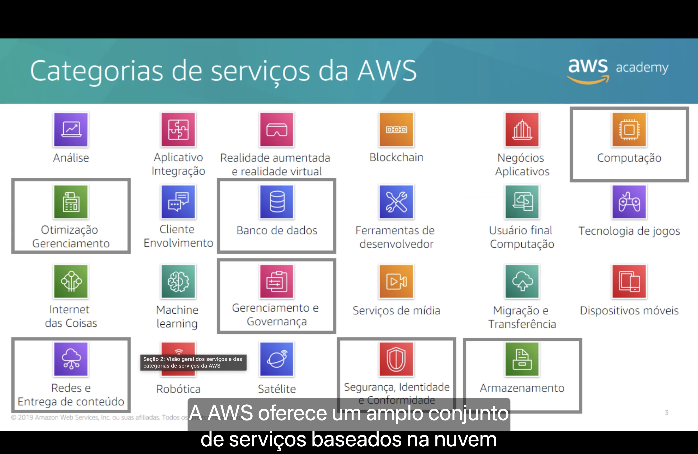

A AWS oferece um **amplo conjunto de serviços em nuvem**, agrupados em **categorias**. Cada categoria reúne serviços com um propósito em comum.

| | | | |
|---|---|---|---|
| Análise | Integração de aplicativos | Realidade aumentada e virtual | Blockchain |
| Aplicativos de negócios | **⭐ Computação** | **⭐ Gerenciamento de custos** | Envolvimento do cliente |
| **⭐ Banco de dados** | Ferramentas do desenvolvedor | Computação do usuário final | Tecnologia de jogos |
| Internet das Coisas | Machine learning | **⭐ Gerenciamento e governança** | Serviços de mídia |
| Migração e transferência | Dispositivos móveis | **⭐ Redes e entrega de conteúdo** | Robótica |
| Satélite | **⭐ Segurança, identidade e conformidade** | **⭐ Armazenamento** | |

> [!TIP]
> As **7 categorias destacadas (⭐)** são o foco do curso e aparecem com frequência na prova. As seções a seguir mostram os principais serviços de cada uma.

## 3. 🗄️ Categoria de serviço de armazenamento

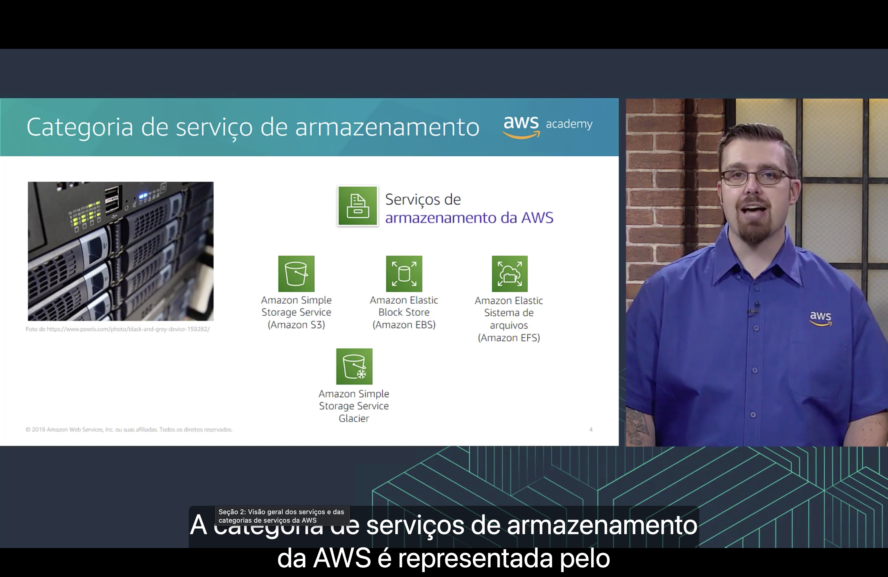

| Serviço | Tipo | Para que serve |
|---|:---:|---|
| 🪣 **Amazon S3** (*Simple Storage Service*) | Objeto | Armazenamento de objetos com **escalabilidade**, **disponibilidade**, **segurança** e **desempenho** altos. Usado para sites, apps móveis, backup e restauração, arquivamento, *data lakes* e análise de *big data*. |
| 💽 **Amazon EBS** (*Elastic Block Store*) | Bloco | Armazenamento em bloco de **alto desempenho**, projetado para uso com instâncias **EC2**. Indicado para bancos de dados, aplicações corporativas e cargas com alta taxa de transferência. |
| 📁 **Amazon EFS** (*Elastic File System*) | Arquivo | Sistema de arquivos **NFS** totalmente gerenciado e **elástico**, que cresce e encolhe automaticamente conforme arquivos são adicionados ou removidos. Funciona com serviços AWS e recursos *on-premises*. |
| 🧊 **Amazon S3 Glacier** | Objeto (arquivamento) | Armazenamento **seguro, durável e de custo extremamente baixo** para **arquivamento de dados** e **backup de longo prazo**. |

> [!IMPORTANT]
> Memorize a associação **tipo → serviço**: **objeto = S3**, **bloco = EBS**, **arquivo = EFS**, **arquivamento = S3 Glacier**.

## 4. 🖥️ Categoria de serviço de computação

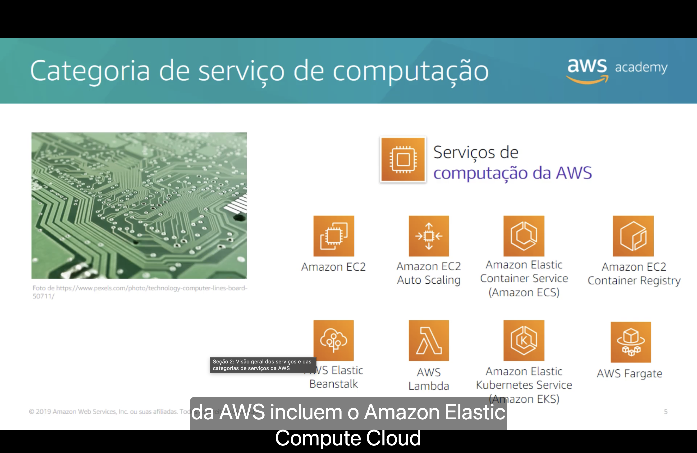

| Serviço | Para que serve |
|---|---|
| 🖥️ **Amazon EC2** (*Elastic Compute Cloud*) | Capacidade de computação **redimensionável** na forma de **máquinas virtuais** na nuvem. |
| 📈 **Amazon EC2 Auto Scaling** | **Adiciona ou remove instâncias EC2 automaticamente** de acordo com condições definidas por você. |
| 📦 **Amazon ECS** (*Elastic Container Service*) | Orquestração de **contêineres Docker** altamente escalável e de alto desempenho. |
| 🗃️ **Amazon ECR** (*EC2 Container Registry*) | Registro Docker totalmente gerenciado para **armazenar, gerenciar e implantar imagens de contêiner**. |
| 🌱 **AWS Elastic Beanstalk** | Implanta e escala **aplicações e serviços web** em servidores conhecidos (Apache, IIS etc.): você envia o código e a AWS cuida do resto. |
| λ **AWS Lambda** | Executa código **sem provisionar ou gerenciar servidores** (*serverless*); você paga **apenas pelo tempo de computação** usado. |
| ☸️ **Amazon EKS** (*Elastic Kubernetes Service*) | Facilita implantar, gerenciar e escalar aplicações em contêineres usando **Kubernetes** na AWS. |
| 🚀 **AWS Fargate** | Mecanismo de computação para o **ECS** que executa contêineres **sem gerenciar servidores ou clusters**. |

> [!TIP]
> "Sem servidor", "*serverless*" ou "pagar só pelo tempo de execução do código" na prova costuma apontar para o **AWS Lambda**.

## 5. 🛢️ Categoria de serviço de banco de dados

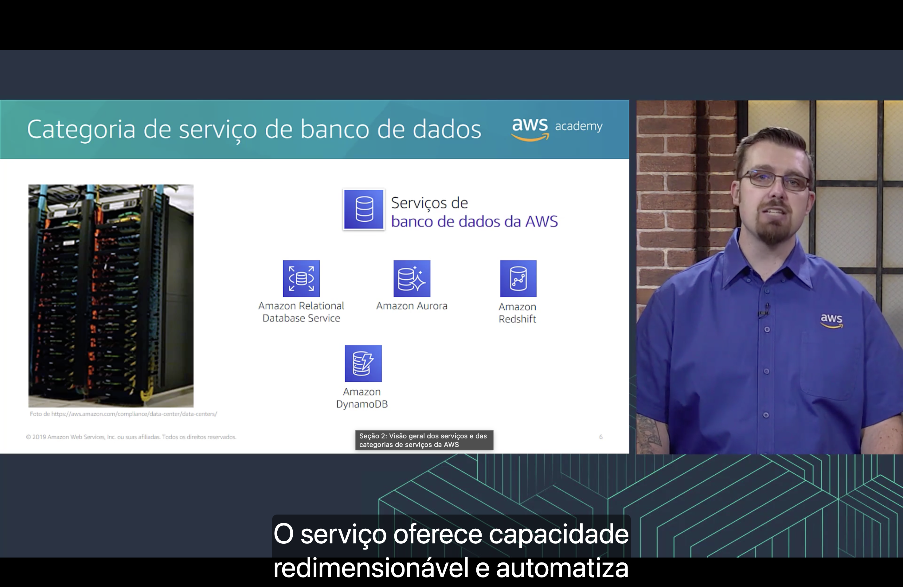

| Serviço | Tipo | Para que serve |
|---|:---:|---|
| 🗄️ **Amazon RDS** (*Relational Database Service*) | Relacional | Facilita configurar, operar e escalar bancos relacionais na nuvem. Oferece capacidade redimensionável e **automatiza tarefas administrativas** demoradas (provisionamento de hardware, configuração, *patches*, backups). |
| ✨ **Amazon Aurora** | Relacional | Banco relacional compatível com **MySQL** e **PostgreSQL**, até **5x mais rápido que o MySQL padrão** e **3x mais rápido que o PostgreSQL padrão**. |
| 📊 **Amazon Redshift** | *Data warehouse* | Executa **consultas analíticas** sobre **petabytes** de dados armazenados localmente, além de consultar dados diretamente no S3. |
| ⚡ **Amazon DynamoDB** | NoSQL | Banco de dados **chave-valor e de documentos** com desempenho de **milissegundos de um dígito** em qualquer escala, com segurança, backup e cache em memória integrados. |

## 6. 🌐 Categoria de serviço de redes e entrega de conteúdo

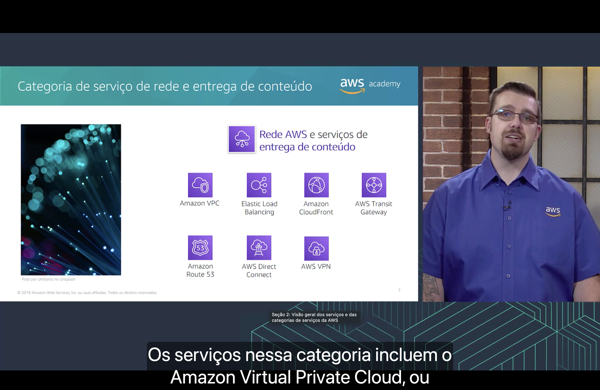

| Serviço | Para que serve |
|---|---|
| 🔒 **Amazon VPC** (*Virtual Private Cloud*) | Provisiona **seções logicamente isoladas** da nuvem AWS, onde você lança recursos em uma rede virtual definida por você. |
| ⚖️ **Elastic Load Balancing** | **Distribui automaticamente o tráfego de entrada** entre vários destinos (instâncias EC2, contêineres, endereços IP, funções Lambda). |
| 📡 **Amazon CloudFront** | **CDN** rápida que entrega dados, vídeos, aplicações e APIs aos clientes no mundo todo com **baixa latência** e **alta velocidade** (usa os pontos de presença da Seção 1). |
| 🔀 **AWS Transit Gateway** | Conecta **VPCs e redes *on-premises*** a um **único *gateway*** central, como um *hub*. |
| 🧭 **Amazon Route 53** | Serviço de **DNS** na nuvem escalável, que direciona os usuários finais para aplicações na internet traduzindo nomes (ex.: `www.exemplo.com`) em endereços IP. |
| 🔌 **AWS Direct Connect** | Estabelece uma **conexão de rede dedicada e privada** entre o seu datacenter/escritório e a AWS, podendo **reduzir custos de rede** e **aumentar a largura de banda**. |
| 🛡️ **AWS VPN** | Cria um **túnel privado e seguro** da sua rede ou dispositivo para a rede global da AWS. |

> [!TIP]
> **Direct Connect** = conexão **física dedicada** (não passa pela internet). **VPN** = túnel **criptografado pela internet pública**.

## 7. 🔐 Categoria de serviços de segurança, identidade e conformidade

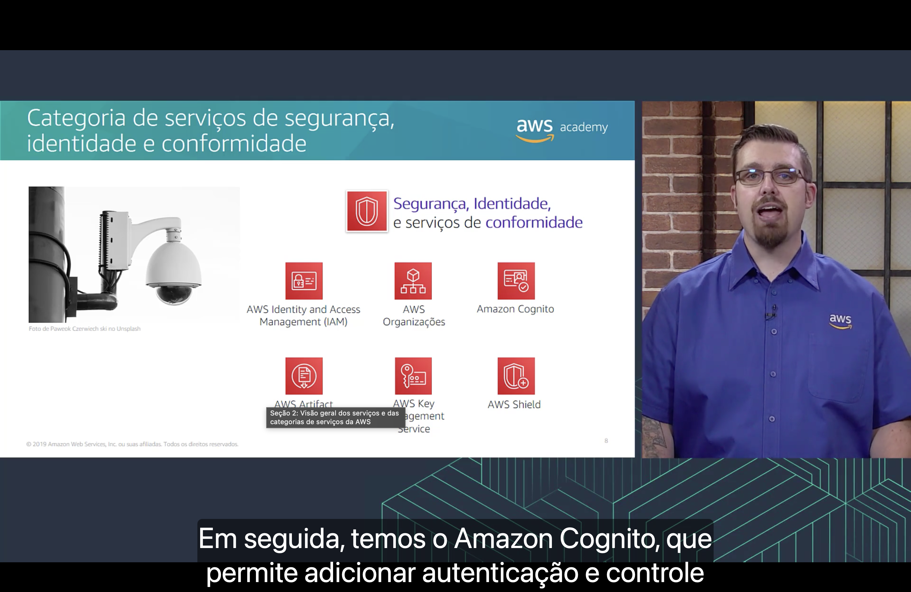

| Serviço | Para que serve |
|---|---|
| 👤 **AWS IAM** (*Identity and Access Management*) | Gerencia **com segurança o acesso** a serviços e recursos da AWS: usuários, grupos e permissões. |
| 🏢 **AWS Organizations** | Restringe quais serviços e ações são permitidos nas contas e **gerencia várias contas de forma centralizada** (visto no Módulo 2). |
| 🪪 **Amazon Cognito** | Adiciona **cadastro, login e controle de acesso** de usuários a aplicativos web e móveis. |
| 📄 **AWS Artifact** | Acesso **sob demanda** a **relatórios de segurança e conformidade** da AWS e a contratos *online* selecionados. |
| 🔑 **AWS KMS** (*Key Management Service*) | Cria e gerencia **chaves de criptografia** e controla seu uso em uma ampla variedade de serviços AWS. |
| 🛡️ **AWS Shield** | Serviço gerenciado de **proteção contra ataques DDoS** (negação de serviço distribuída) para aplicações executadas na AWS. |

> [!NOTE]
> **IAM** controla o acesso de quem **administra** a conta AWS; **Cognito** controla o acesso dos **usuários finais** de um aplicativo.

## 8. 💰 Categoria de serviço de gerenciamento de custos da AWS

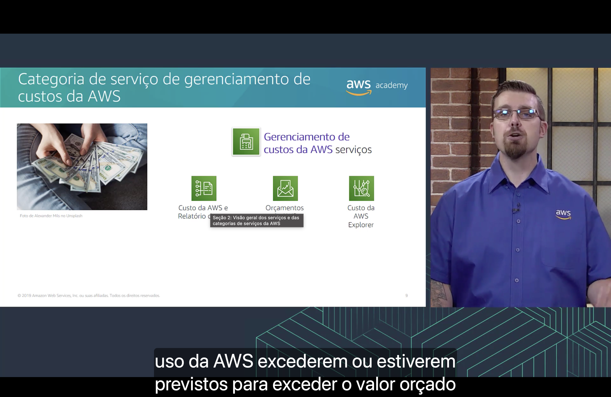

| Serviço | Para que serve |
|---|---|
| 📑 **Relatório de custo e uso da AWS** (*Cost and Usage Report*) | Contém o **conjunto mais abrangente** de dados de custo e uso disponíveis, incluindo metadados sobre serviços, preços e reservas. |
| 🔔 **AWS Budgets** (Orçamentos) | Define **orçamentos personalizados** e envia **alertas** quando os custos ou o uso **excedem (ou estão previstos para exceder)** o valor orçado. |
| 🔍 **AWS Cost Explorer** | Interface fácil para **visualizar, entender e gerenciar** custos e uso da AWS ao longo do tempo. |

> [!TIP]
> Esses três serviços foram vistos em detalhe na [Seção 4 do Módulo 2 (Billing and Cost Management)](../MÓDULO%202/Seção%204%20-%20AWS%20Billing%20and%20Cost%20Management.md).

## 9. ⚙️ Categoria de serviço de gerenciamento e governança

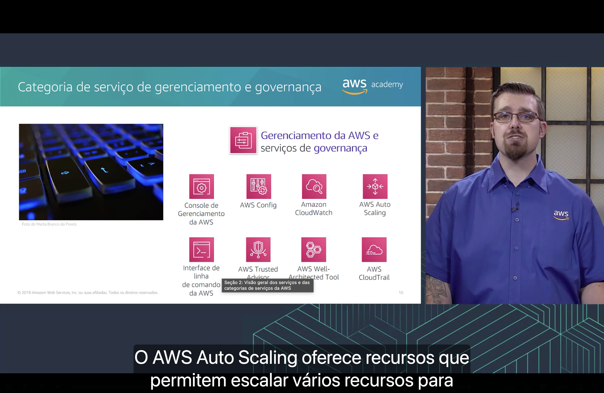

| Serviço | Para que serve |
|---|---|
| 🖱️ **Console de Gerenciamento da AWS** | **Interface web** para acessar a conta AWS e gerenciar os serviços. |
| 🧾 **AWS Config** | **Rastreia o inventário** de recursos e as **alterações de configuração** ao longo do tempo. |
| 📊 **Amazon CloudWatch** | **Monitora recursos e aplicações**: coleta métricas, logs e eventos e permite criar alarmes. |
| 📈 **AWS Auto Scaling** | Escala **vários recursos** automaticamente para atender à demanda. |
| ⌨️ **AWS CLI** (*Command Line Interface*) | **Interface unificada de linha de comando** para gerenciar os serviços AWS e automatizar tarefas com scripts. |
| ✔️ **AWS Trusted Advisor** | Ajuda a **otimizar desempenho e segurança** com recomendações de melhores práticas (visto no Módulo 2). |
| 🏛️ **AWS Well-Architected Tool** | Ajuda a **revisar e melhorar cargas de trabalho** com base nas melhores práticas do *AWS Well-Architected Framework*. |
| 🕵️ **AWS CloudTrail** | **Rastreia a atividade dos usuários e o uso de APIs**: registra quem fez o quê, quando e de onde. |

> [!IMPORTANT]
> Diferença clássica de prova:
> - **CloudWatch** → *desempenho* (métricas, logs, alarmes).
> - **CloudTrail** → *auditoria* (quem chamou qual API).
> - **Config** → *configuração* (como os recursos estavam configurados e o que mudou).

---

## 🎯 Principais conclusões

- ✅ Os serviços da AWS se organizam em camadas: **infraestrutura → serviços básicos → serviços de plataforma → aplicações**.
- ✅ Os **serviços básicos** são **computação**, **redes** e **armazenamento**.
- ✅ A AWS agrupa seus serviços em **categorias**; o curso foca em armazenamento, computação, banco de dados, redes e entrega de conteúdo, segurança/identidade/conformidade, gerenciamento de custos e gerenciamento e governança.
- ✅ **Armazenamento:** S3 (objeto), EBS (bloco), EFS (arquivo) e S3 Glacier (arquivamento).
- ✅ **Computação:** EC2, EC2 Auto Scaling, ECS, ECR, Elastic Beanstalk, Lambda, EKS e Fargate.
- ✅ **Banco de dados:** RDS, Aurora (relacionais), Redshift (*data warehouse*) e DynamoDB (NoSQL).
- ✅ **Redes:** VPC, Elastic Load Balancing, CloudFront, Transit Gateway, Route 53, Direct Connect e VPN.
- ✅ **Segurança:** IAM, Organizations, Cognito, Artifact, KMS e Shield.
- ✅ **Custos:** Relatório de custo e uso, Budgets e Cost Explorer.
- ✅ **Gerenciamento e governança:** Console, Config, CloudWatch, Auto Scaling, CLI, Trusted Advisor, Well-Architected Tool e CloudTrail.

---

  <a href="../README.md">🏠 Início</a> &nbsp;•&nbsp;
  <a href="./Seção%201%20-%20Infraestrutura%20global%20da%20AWS.md">⬅️ Anterior: Infraestrutura global da AWS</a> &nbsp;•&nbsp;
  <a href="./Seção%203%20-%20Conclusão%20do%20Módulo%203.md">Próxima: Conclusão do Módulo 3 ➡️</a>

