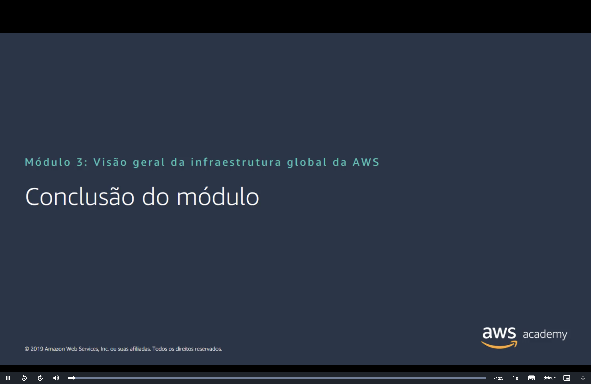
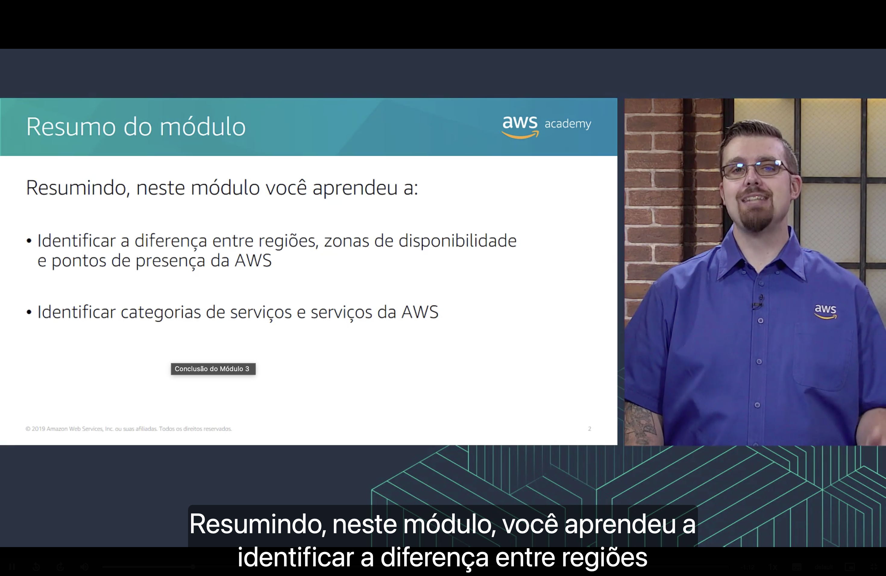
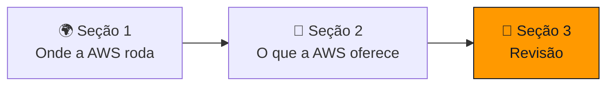
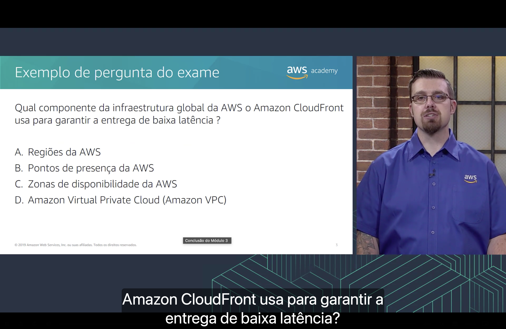
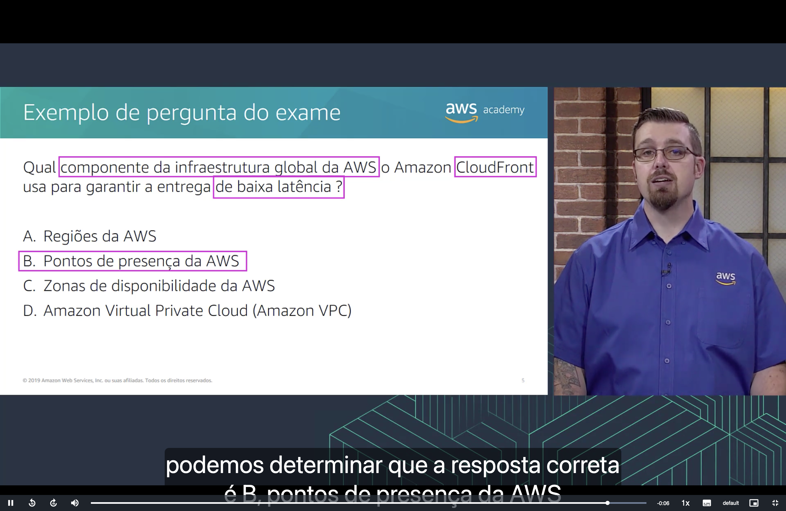

<h1 align="center">🏁 Seção 3 – Conclusão do Módulo 3</h1>

  
  
   
  
  
  

  <a href="../README.md">🏠 Início</a> &nbsp;•&nbsp;
  <a href="./Seção%202%20-%20Visão%20geral%20dos%20serviços%20e%20das%20categorias%20de%20serviços%20da%20AWS.md">⬅️ Anterior: Serviços e categorias da AWS</a>

## 📑 Sumário

| # | Tópico |
|:---:|---|
| 1 | [🗂️ Resumo do módulo](#resumo) |
| 2 | [📝 Exemplo de pergunta do exame](#pergunta) |
| 🎯 | [Principais conclusões](#conclusoes) |

---

## 1. 🗂️ Resumo do módulo

Neste módulo, aprendemos a:

| Verbo | Objetivo | Onde estudar |
|---|---|---|
| 🌍 **Identificar** | A diferença entre **regiões**, **zonas de disponibilidade** e **pontos de presença** da AWS | [🌍 Seção 1](./Seção%201%20-%20Infraestrutura%20global%20da%20AWS.md) |
| 🧩 **Identificar** | As **categorias de serviços** e os **serviços** da AWS | [🧩 Seção 2](./Seção%202%20-%20Visão%20geral%20dos%20serviços%20e%20das%20categorias%20de%20serviços%20da%20AWS.md) |

## 2. 📝 Exemplo de pergunta do exame

> [!NOTE]
> **Qual componente da infraestrutura global da AWS o Amazon CloudFront usa para garantir a entrega de baixa latência?**

| | Alternativa |
|:---:|---|
| **A** | Regiões da AWS |
| **B** | Pontos de presença da AWS |
| **C** | Zonas de disponibilidade da AWS |
| **D** | Amazon Virtual Private Cloud (Amazon VPC) |

💡 <strong>Clique para ver a resposta</strong>

 

🔑 As palavras-chave da pergunta são **"componente da infraestrutura global da AWS"**, **"CloudFront"** e **"baixa latência"**.

> [!TIP]
> ✅ **Resposta correta: B.** O **Amazon CloudFront** é a **CDN** da AWS e entrega conteúdo a partir dos **pontos de presença** (*edge locations*), que ficam espalhados pelo mundo e mais próximos dos usuários finais, reduzindo a latência.

Por que as outras estão erradas:

| Alternativa | Por que não é a resposta |
|:---:|---|
| ❌ **A** | As **regiões** são áreas geográficas onde ficam os recursos principais (a **origem** do conteúdo), mas são poucas e distantes de boa parte dos usuários; não são elas que o CloudFront usa para a entrega de baixa latência. |
| ❌ **C** | As **zonas de disponibilidade** existem **dentro de uma região** e servem para **alta disponibilidade e tolerância a falhas**, não para aproximar o conteúdo do usuário. |
| ❌ **D** | A **Amazon VPC** é um serviço de **rede privada isolada** na nuvem, não um componente da infraestrutura global. |

Isso retoma a [Seção 1](./Seção%201%20-%20Infraestrutura%20global%20da%20AWS.md#pontos-presenca), em que os **pontos de presença** e os **caches regionais** aparecem como a base do **CloudFront**: a solicitação do usuário é roteada automaticamente para o ponto de presença mais próximo.

---

## 🎯 Principais conclusões

- ✅ A **infraestrutura global da AWS** é formada por **regiões**, **zonas de disponibilidade** e **pontos de presença**.
- ✅ Uma **região** é uma área geográfica com **duas ou mais zonas de disponibilidade**; a escolha da região considera **governança de dados**, **proximidade dos clientes**, **serviços disponíveis** e **custo**.
- ✅ As **zonas de disponibilidade** são grupos de datacenters isolados entre si, usados para obter **alta disponibilidade** e **tolerância a falhas**.
- ✅ Os **pontos de presença** ficam próximos dos usuários e são usados pelo **Amazon CloudFront** para entregar conteúdo com **baixa latência**.
- ✅ Os serviços da AWS se agrupam em **categorias** (armazenamento, computação, banco de dados, redes, segurança, custos, gerenciamento e governança, entre outras).

---

  <a href="../README.md">🏠 Início</a> &nbsp;•&nbsp;
  <a href="./Seção%202%20-%20Visão%20geral%20dos%20serviços%20e%20das%20categorias%20de%20serviços%20da%20AWS.md">⬅️ Anterior: Serviços e categorias da AWS</a>

