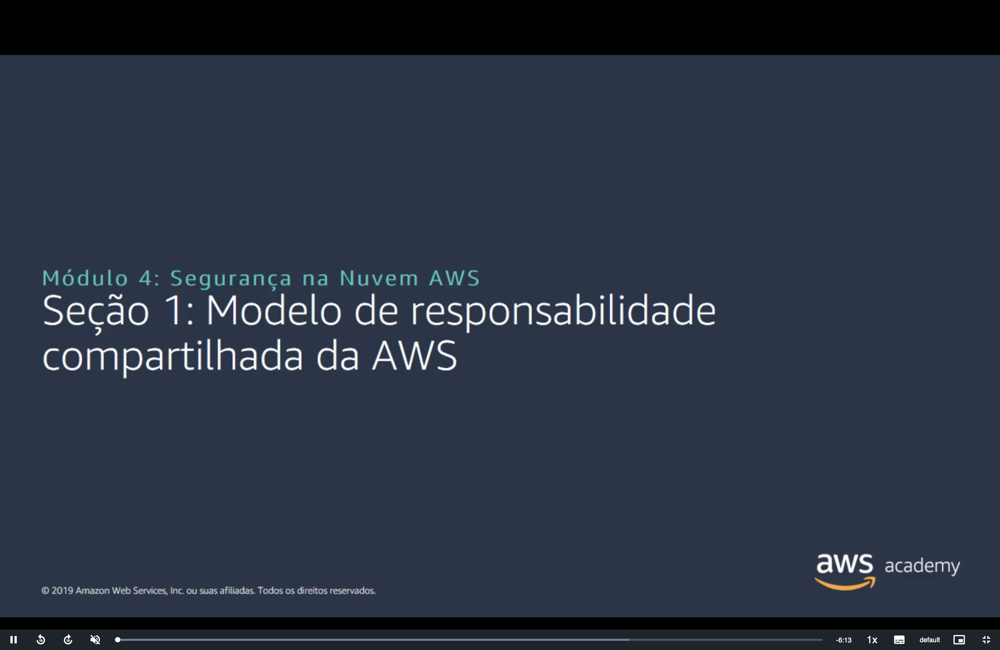
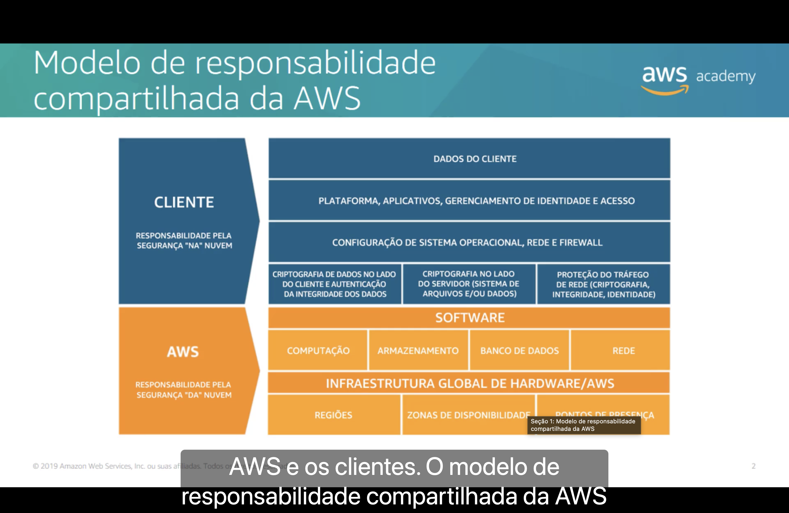
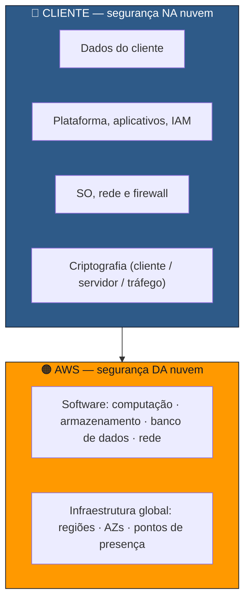
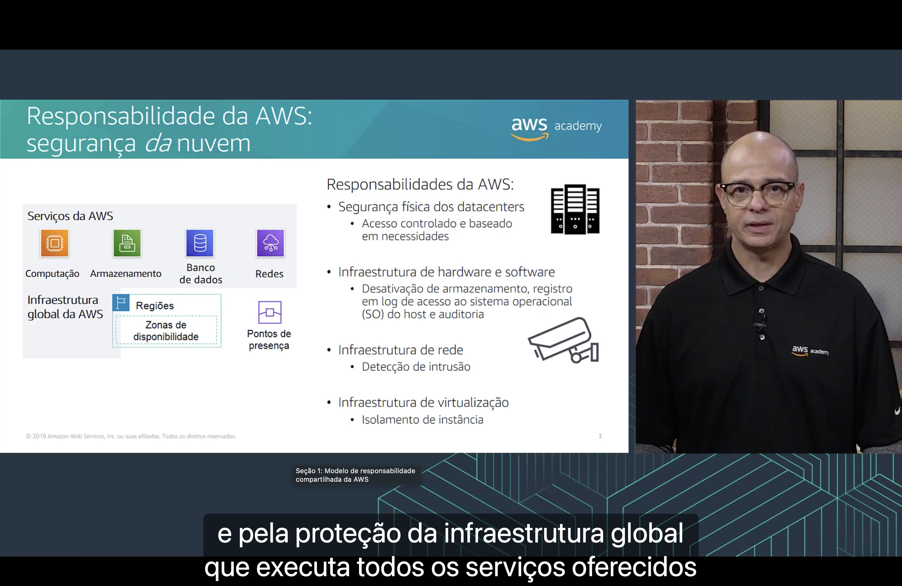
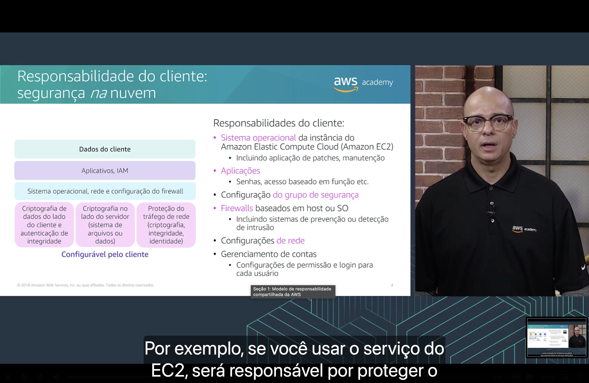
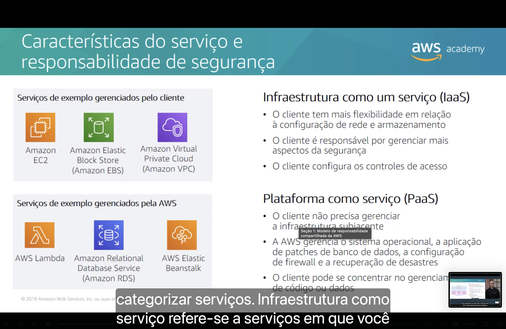
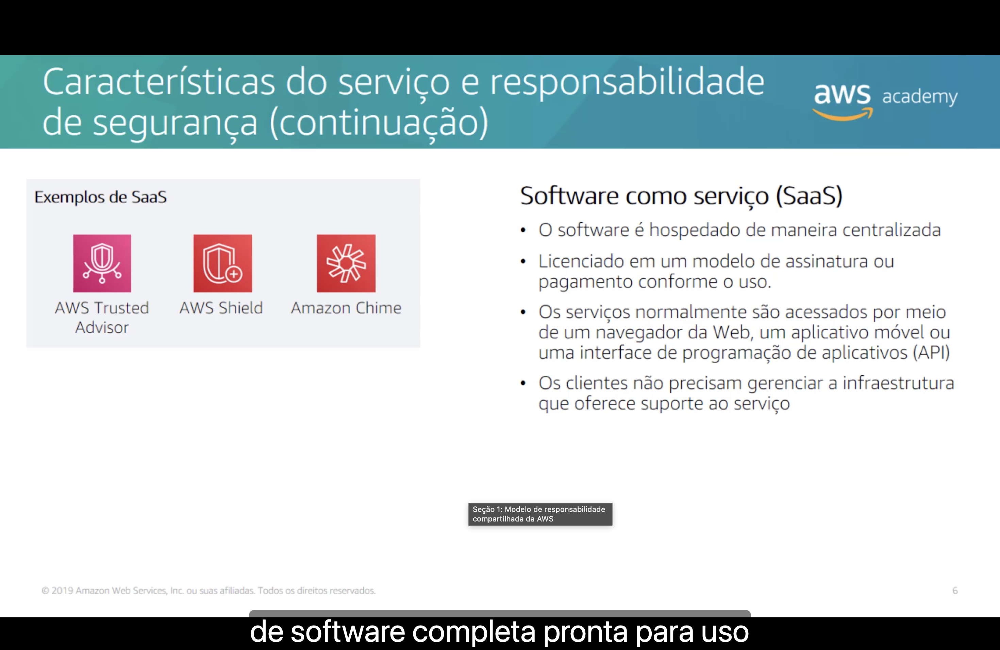
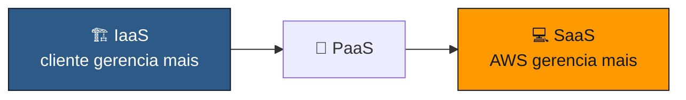

<h1 align="center">🤝 Seção 1 – Modelo de responsabilidade compartilhada da AWS</h1>

  
  
   
  
  
  

  <a href="../README.md">🏠 Início</a> &nbsp;•&nbsp;
  <a href="../MÓDULO%203/Seção%203%20-%20Conclusão%20do%20Módulo%203.md">⬅️ Módulo anterior: Conclusão do Módulo 3</a> &nbsp;•&nbsp;
  <a href="./Seção%202%20-%20AWS%20Identity%20and%20Access%20Management%20(IAM).md">Próxima: AWS IAM ➡️</a>

## 📑 Sumário

| # | Tópico |
|:---:|---|
| 1 | [🤝 Modelo de responsabilidade compartilhada](#modelo) |
| 2 | [🟠 Responsabilidade da AWS: segurança *da* nuvem](#aws) |
| 3 | [🔵 Responsabilidade do cliente: segurança *na* nuvem](#cliente) |
| 4 | [🧩 Características do serviço: IaaS e PaaS](#iaas-paas) |
| 5 | [💻 Características do serviço: SaaS](#saas) |
| 🎯 | [Principais conclusões](#conclusoes) |

---

## 1. 🤝 Modelo de responsabilidade compartilhada

> [!NOTE]
> A segurança na nuvem é uma **responsabilidade compartilhada entre a AWS e o cliente**. O **modelo de responsabilidade compartilhada** define exatamente onde termina a parte de cada um.

| Quem | Responsabilidade | Camadas |
|---|---|---|
| 🔵 **Cliente** | Segurança **"NA"** nuvem | Dados do cliente · Plataforma, aplicativos, gerenciamento de identidade e acesso · Configuração de SO, rede e firewall · Criptografia no lado do cliente e integridade dos dados · Criptografia no lado do servidor (sistema de arquivos e/ou dados) · Proteção do tráfego de rede (criptografia, integridade, identidade) |
| 🟠 **AWS** | Segurança **"DA"** nuvem | Software (computação, armazenamento, banco de dados, rede) · Infraestrutura global de hardware (regiões, zonas de disponibilidade, pontos de presença) |

> [!TIP]
> Um jeito fácil de lembrar: a AWS cuida de tudo **que você não consegue tocar** (prédio, hardware, rede física, virtualização); você cuida de tudo **que você coloca e configura** na nuvem.

## 2. 🟠 Responsabilidade da AWS: segurança *da* nuvem

A AWS é responsável por **proteger a infraestrutura global** que executa todos os serviços oferecidos na nuvem: **computação, armazenamento, banco de dados e redes**, além das **regiões, zonas de disponibilidade e pontos de presença**.

| Responsabilidade da AWS | Exemplo |
|---|---|
| 🏢 **Segurança física dos datacenters** | Acesso **controlado** e **baseado em necessidades**. |
| 🖥️ **Infraestrutura de hardware e software** | Desativação de armazenamento, registro em log de acesso ao **SO do host** e auditoria. |
| 🌐 **Infraestrutura de rede** | **Detecção de intrusão**. |
| 🧱 **Infraestrutura de virtualização** | **Isolamento de instância**. |

> [!NOTE]
> O cliente **não tem acesso** aos datacenters nem ao hardware físico; por isso, proteger essa camada é inteiramente papel da AWS.

## 3. 🔵 Responsabilidade do cliente: segurança *na* nuvem

O cliente é responsável pelo que **coloca na nuvem** e por **como configura** os serviços. As camadas abaixo são **configuráveis pelo cliente**:

- 💾 Dados do cliente
- 🔑 Aplicativos e **IAM**
- ⚙️ Sistema operacional, rede e configuração do firewall
- 🔐 Criptografia de dados no lado do cliente e autenticação de integridade
- 🗄️ Criptografia no lado do servidor (sistema de arquivos ou dados)
- 🚦 Proteção do tráfego de rede (criptografia, integridade, identidade)

| Responsabilidade do cliente | Detalhe |
|---|---|
| 🖥️ **Sistema operacional** da instância Amazon EC2 | Inclui **aplicação de patches** e **manutenção**. |
| 📱 **Aplicações** | Senhas, acesso baseado em função etc. |
| 🛡️ **Configuração do grupo de segurança** | Regras de entrada e saída das instâncias. |
| 🔥 **Firewalls baseados em host ou SO** | Inclui sistemas de **prevenção ou detecção de intrusão**. |
| 🌐 **Configurações de rede** | Sub-redes, rotas, acesso público/privado. |
| 👤 **Gerenciamento de contas** | Configurações de **permissão e login** para cada usuário. |

> 💡 **Exemplo:** ao usar o **Amazon EC2**, você é responsável por proteger o **sistema operacional convidado** (patches e atualizações), os aplicativos instalados e o **grupo de segurança** da instância. A AWS protege apenas o host físico e a camada de virtualização abaixo dele.

> [!WARNING]
> Se uma instância EC2 for invadida por falta de **patch no SO** ou por um **grupo de segurança aberto demais**, a falha é **do cliente**, não da AWS.

## 4. 🧩 Características do serviço: IaaS e PaaS

O **tipo de serviço** determina quanto da segurança fica com o cliente. Quanto **mais gerenciado** o serviço, **menos** o cliente precisa fazer.

| | 🏗️ **IaaS** (Infraestrutura como serviço) | 🧰 **PaaS** (Plataforma como serviço) |
|---|---|---|
| **Quem gerencia** | O **cliente** gerencia mais aspectos | A **AWS** gerencia a infraestrutura subjacente |
| **Características** | Mais **flexibilidade** em rede e armazenamento · O cliente é responsável por **mais aspectos da segurança** · O cliente **configura os controles de acesso** | O cliente **não gerencia a infraestrutura** · A AWS cuida do **SO**, **patches do banco de dados**, **configuração de firewall** e **recuperação de desastres** · O cliente foca no **código ou nos dados** |
| **Exemplos** | **Amazon EC2** · **Amazon EBS** · **Amazon VPC** | **AWS Lambda** · **Amazon RDS** · **AWS Elastic Beanstalk** |

> [!IMPORTANT]
> No **Amazon RDS**, a AWS aplica os patches do mecanismo do banco de dados e do SO; no **EC2** com um banco instalado manualmente, essa tarefa é **do cliente**. Esse tipo de comparação aparece com frequência na prova.

## 5. 💻 Características do serviço: SaaS

No **SaaS (Software como serviço)**, o cliente recebe uma **aplicação de software completa, pronta para uso**.

- 🏛️ O software é **hospedado de maneira centralizada**.
- 💳 É licenciado em um modelo de **assinatura** ou **pagamento conforme o uso**.
- 🌐 Normalmente é acessado por **navegador da Web**, **aplicativo móvel** ou **API**.
- 🙌 O cliente **não precisa gerenciar a infraestrutura** que dá suporte ao serviço.

| Exemplos de SaaS na AWS | |
|---|---|
| 🛡️ **AWS Trusted Advisor** | Recomendações de boas práticas (custo, segurança, desempenho etc.). |
| 🛡️ **AWS Shield** | Proteção gerenciada contra ataques **DDoS**. |
| 💬 **Amazon Chime** | Comunicação: reuniões, chat e chamadas. |

---

## 🎯 Principais conclusões

- ✅ A segurança na AWS segue o **modelo de responsabilidade compartilhada** entre a AWS e o cliente.
- ✅ A **AWS** é responsável pela segurança **DA nuvem**: datacenters, hardware, software dos serviços, rede e virtualização da infraestrutura global.
- ✅ O **cliente** é responsável pela segurança **NA nuvem**: dados, aplicações, IAM, SO convidado, grupos de segurança, firewalls, configuração de rede e criptografia.
- ✅ Em **IaaS** (EC2, EBS, VPC), o cliente tem mais flexibilidade e **mais responsabilidade**.
- ✅ Em **PaaS** (Lambda, RDS, Elastic Beanstalk), a AWS cuida do SO, patches e infraestrutura; o cliente foca no **código e nos dados**.
- ✅ Em **SaaS** (Trusted Advisor, Shield, Chime), o cliente apenas **usa o software**, sem gerenciar a infraestrutura.

---

  <a href="../README.md">🏠 Início</a> &nbsp;•&nbsp;
  <a href="../MÓDULO%203/Seção%203%20-%20Conclusão%20do%20Módulo%203.md">⬅️ Módulo anterior: Conclusão do Módulo 3</a> &nbsp;•&nbsp;
  <a href="./Seção%202%20-%20AWS%20Identity%20and%20Access%20Management%20(IAM).md">Próxima: AWS IAM ➡️</a>

