<h1 align="center">🔐 Seção 2 – AWS Identity and Access Management (IAM)</h1>

<p align="center">
  
  
  <br>
  
  
  
</p>

<p align="center">
  <a href="../README.md">🏠 Início</a> &nbsp;•&nbsp;
  <a href="./Seção%201%20-%20Modelo%20de%20responsabilidade%20compartilhada%20da%20AWS.md">⬅️ Anterior: Modelo de responsabilidade compartilhada</a> &nbsp;•&nbsp;
  <a href="./Seção%20Bônus%20-%20Demonstração%20-%20IAM.md">Próxima: Demonstração IAM ➡️</a>
</p>

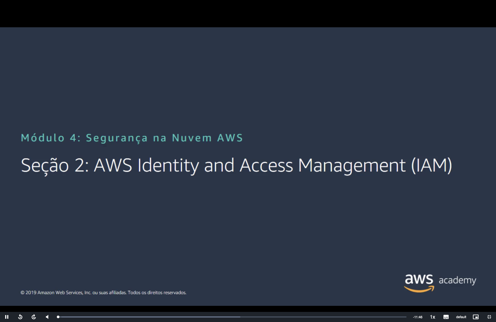

## 📑 Sumário

| # | Tópico |
|:---:|---|
| 1 | [🔐 O que é o IAM](#iam) |
| 2 | [🧩 Componentes essenciais](#componentes) |
| 3 | [🔑 Autenticação: tipos de acesso](#autenticacao) |
| 4 | [📱 MFA do IAM](#mfa) |
| 5 | [✅ Autorização](#autorizacao) |
| 6 | [📄 Exemplo de política do IAM](#exemplo-politica) |
| 7 | [⚖️ Como o IAM determina permissões](#permissoes) |
| 8 | [👥 Grupos do IAM](#grupos) |
| 9 | [🎭 Funções do IAM](#funcoes) |
| 10 | [🖥️ Exemplo de uso de uma função do IAM](#exemplo-funcao) |
| 🎯 | [Principais conclusões](#conclusoes) |

---

<a id="iam"></a>
## 1. 🔐 O que é o IAM

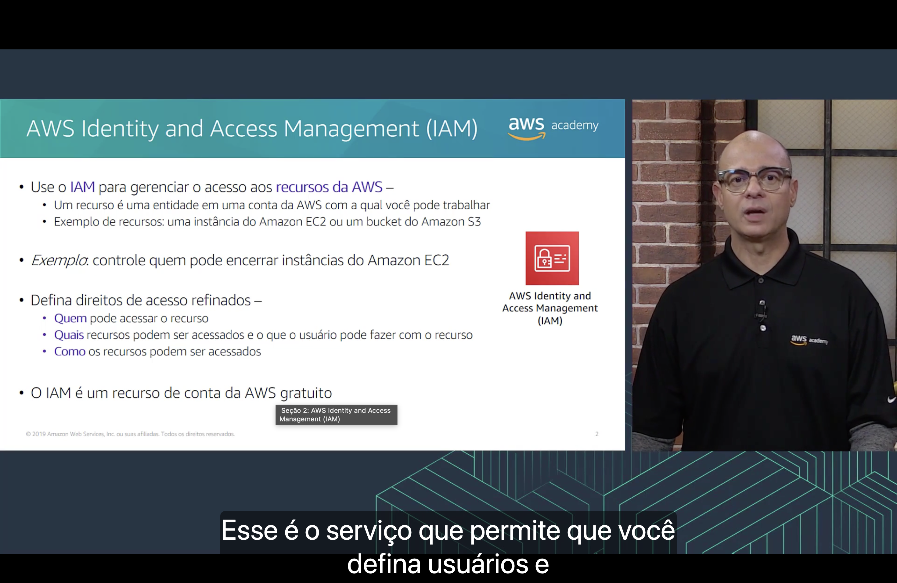

O **AWS Identity and Access Management (IAM)** é o serviço usado para **gerenciar o acesso aos recursos da AWS**.

- 📦 Um **recurso** é uma entidade em uma conta da AWS com a qual você pode trabalhar. Exemplos: uma **instância do Amazon EC2** ou um **bucket do Amazon S3**.
- 💡 **Exemplo:** controlar **quem pode encerrar** instâncias do Amazon EC2.

Com o IAM, você define **direitos de acesso refinados**:

| Pergunta | O que define |
|---|---|
| 👤 **Quem** | Quem pode acessar o recurso. |
| 📦 **Quais** | Quais recursos podem ser acessados e **o que** o usuário pode fazer com eles. |
| 🛣️ **Como** | Como os recursos podem ser acessados. |

> [!NOTE]
> O IAM é um recurso **gratuito** da conta da AWS. Você paga apenas pelos recursos que os usuários utilizam, nunca pelo IAM em si.

<a id="componentes"></a>
## 2. 🧩 Componentes essenciais

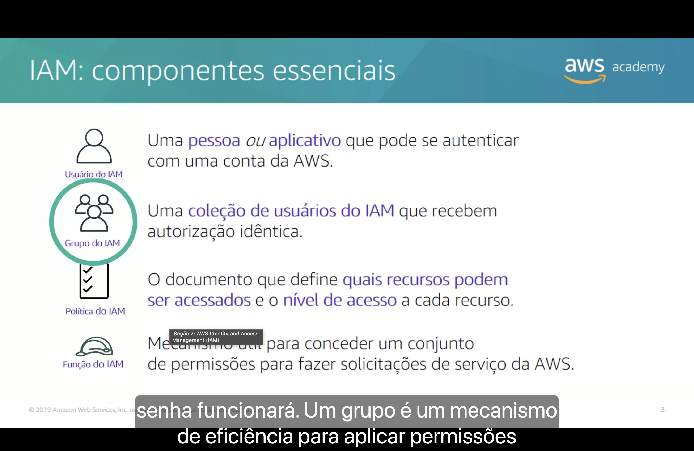

| Componente | Definição |
|---|---|
| 👤 **Usuário do IAM** | Uma **pessoa ou aplicativo** que pode se autenticar com uma conta da AWS. |
| 👥 **Grupo do IAM** | Uma **coleção de usuários do IAM** que recebem **autorização idêntica**. |
| 📄 **Política do IAM** | O documento que define **quais recursos podem ser acessados** e o **nível de acesso** a cada recurso. |
| 🎭 **Função do IAM** | Mecanismo útil para conceder um **conjunto de permissões** para fazer solicitações de serviço da AWS. |

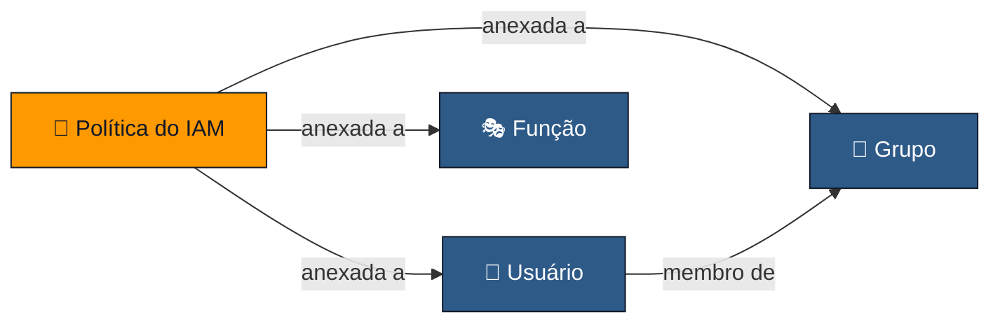

> [!TIP]
> Usuários, grupos e funções são **identidades** ("quem"). A política é o que diz **o que** cada identidade pode fazer. Sem política anexada, uma identidade não pode fazer nada.

<a id="autenticacao"></a>
## 3. 🔑 Autenticação: tipos de acesso

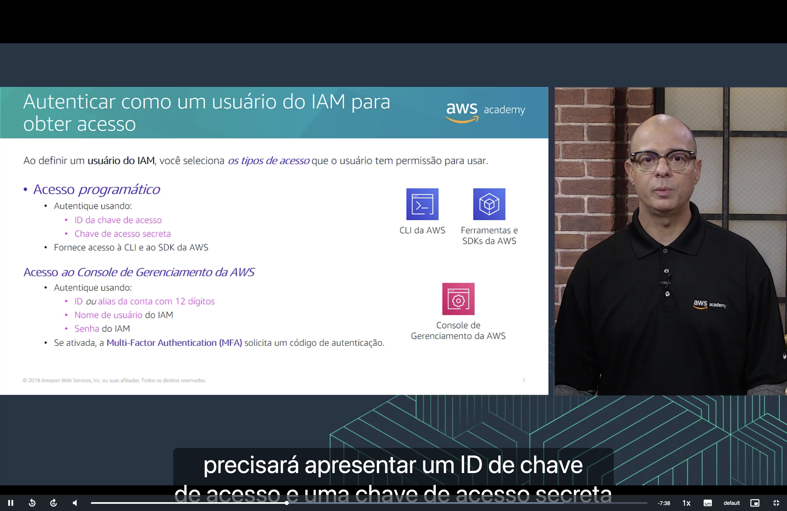

Ao definir um **usuário do IAM**, você seleciona **os tipos de acesso** que ele tem permissão para usar.

| | 💻 **Acesso programático** | 🖱️ **Acesso ao Console de Gerenciamento da AWS** |
|---|---|---|
| **Autentica com** | **ID da chave de acesso** + **chave de acesso secreta** | **ID ou alias da conta (12 dígitos)** + **nome de usuário** do IAM + **senha** do IAM |
| **Dá acesso a** | **CLI da AWS** e **SDKs/ferramentas** da AWS | Interface web do **Console** |
| **Camada extra** | — | Se ativada, a **MFA** solicita um código de autenticação |

> [!WARNING]
> A **chave de acesso secreta** funciona como uma senha. Nunca a coloque em código-fonte, repositórios públicos ou mensagens.

<a id="mfa"></a>
## 4. 📱 MFA do IAM

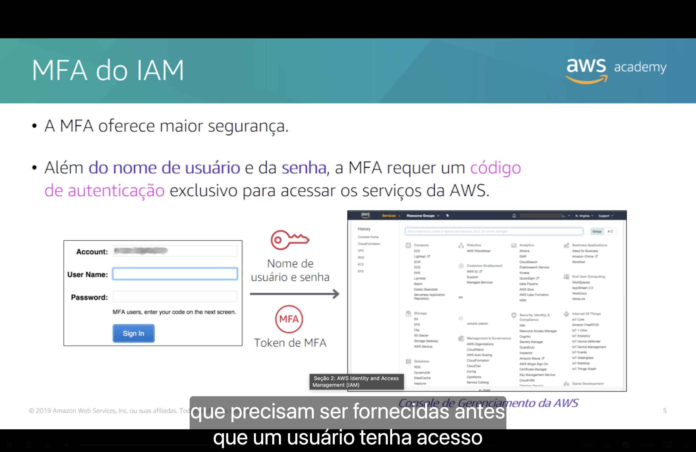

A **Multi-Factor Authentication (MFA)** oferece **maior segurança**: além do **nome de usuário** e da **senha**, ela exige um **código de autenticação exclusivo** para acessar os serviços da AWS.

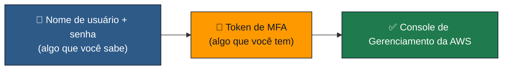

> [!TIP]
> Mesmo que a senha vaze, o atacante não entra sem o dispositivo de MFA. Ative a MFA principalmente no **usuário raiz** e em usuários com privilégios administrativos.

<a id="autorizacao"></a>
## 5. ✅ Autorização

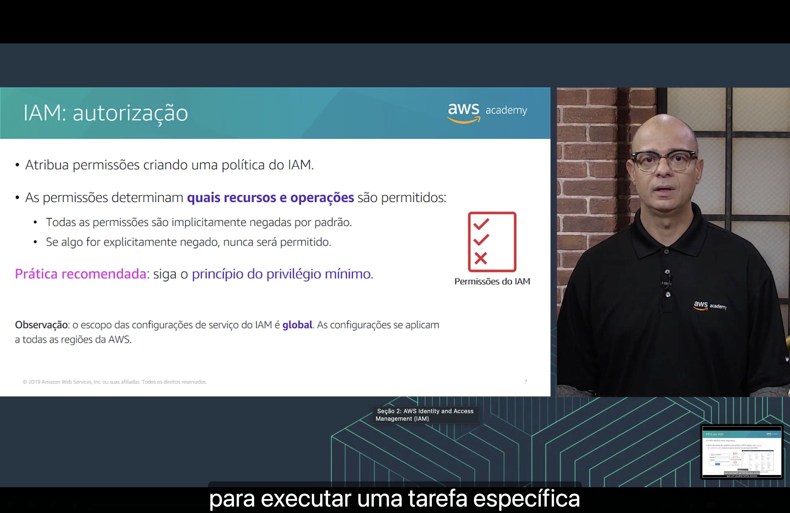

Depois de **autenticado** (provar quem é), o usuário precisa ser **autorizado** (ter permissão para fazer algo).

- 📄 As permissões são atribuídas **criando uma política do IAM**.
- 🎯 As permissões determinam **quais recursos e operações** são permitidos:
  - 🚫 Todas as permissões são **implicitamente negadas por padrão**.
  - ⛔ Se algo for **explicitamente negado**, **nunca** será permitido.

> [!IMPORTANT]
> **Prática recomendada:** siga o **princípio do privilégio mínimo**: conceda apenas as permissões estritamente necessárias para executar uma tarefa específica.

> [!NOTE]
> O escopo das configurações do IAM é **global**: elas se aplicam a **todas as regiões da AWS**. Você não cria um usuário "na região de São Paulo".

<a id="exemplo-politica"></a>
## 6. 📄 Exemplo de política do IAM

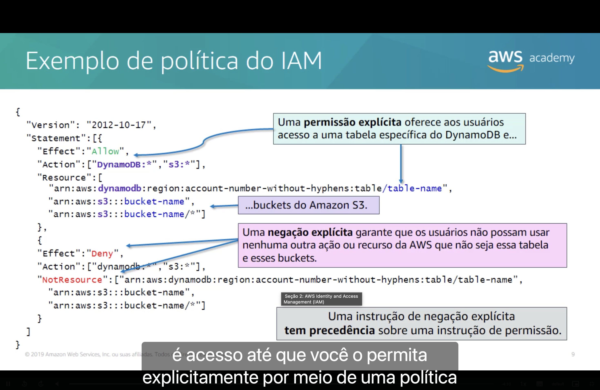

As políticas do IAM são documentos **JSON**. No exemplo abaixo:

```json
{
  "Version": "2012-10-17",
  "Statement": [{
    "Effect": "Allow",
    "Action": ["DynamoDB:*", "s3:*"],
    "Resource": [
      "arn:aws:dynamodb:region:account-number-without-hyphens:table/table-name",
      "arn:aws:s3:::bucket-name",
      "arn:aws:s3:::bucket-name/*"]
  },
  {
    "Effect": "Deny",
    "Action": ["dynamodb:*", "s3:*"],
    "NotResource": ["arn:aws:dynamodb:region:account-number-without-hyphens:table/table-name",
      "arn:aws:s3:::bucket-name",
      "arn:aws:s3:::bucket-name/*"]
  }]
}
```

| Instrução | Efeito |
|---|---|
| ✅ **`Allow`** (permissão explícita) | Dá acesso a uma **tabela específica do DynamoDB** e aos **buckets do Amazon S3** indicados. |
| ⛔ **`Deny`** + **`NotResource`** (negação explícita) | Garante que os usuários **não possam usar nenhuma outra** ação ou recurso do DynamoDB/S3 além dessa tabela e desses buckets. |

| Elemento | Significado |
|---|---|
| `Version` | Versão da linguagem de política (`2012-10-17`). |
| `Effect` | `Allow` ou `Deny`. |
| `Action` | Operações da API (`s3:*` = todas as ações do S3). |
| `Resource` / `NotResource` | Recursos (ARNs) aos quais a instrução se aplica / **não** se aplica. |

> [!IMPORTANT]
> Uma instrução de **negação explícita tem precedência** sobre uma instrução de permissão.

<a id="permissoes"></a>
## 7. ⚖️ Como o IAM determina permissões

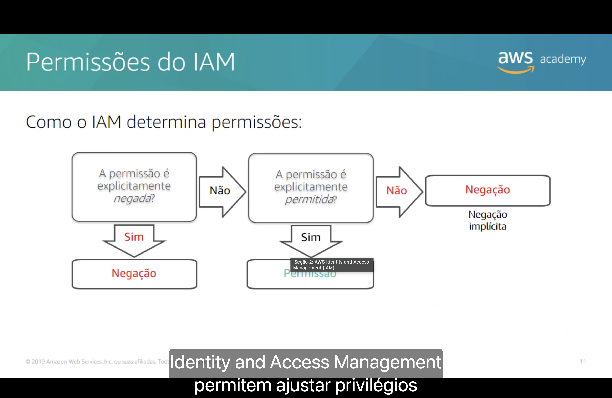

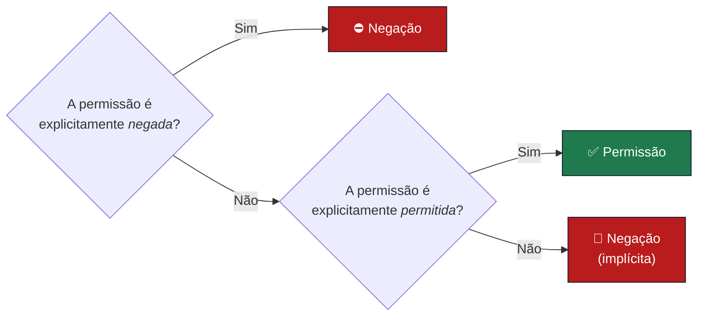

| Ordem | Regra |
|:---:|---|
| 1️⃣ | **Negação explícita** → sempre vence. |
| 2️⃣ | **Permissão explícita** → acesso concedido. |
| 3️⃣ | Nenhuma das duas → **negação implícita** (padrão). |

<a id="grupos"></a>
## 8. 👥 Grupos do IAM

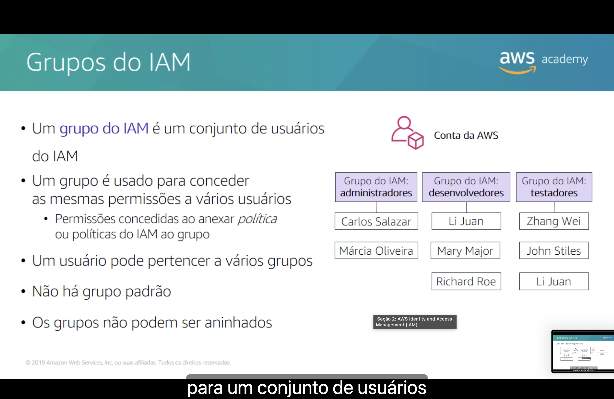

- 👥 Um **grupo do IAM** é um **conjunto de usuários do IAM**.
- 📄 É usado para conceder as **mesmas permissões a vários usuários**, anexando **uma ou mais políticas** ao grupo.
- 🔀 Um usuário **pode pertencer a vários grupos**.
- ❌ **Não há grupo padrão**.
- ❌ Os grupos **não podem ser aninhados** (grupo dentro de grupo).

| Grupo do IAM | Membros |
|---|---|
| 🛠️ **Administradores** | Carlos Salazar · Márcia Oliveira |
| 💻 **Desenvolvedores** | Li Juan · Mary Major · Richard Roe |
| 🧪 **Testadores** | Zhang Wei · John Stiles · **Li Juan** |

> 💡 Note que **Li Juan** está em **dois grupos** (desenvolvedores e testadores) e recebe as permissões de ambos.

<a id="funcoes"></a>
## 9. 🎭 Funções do IAM

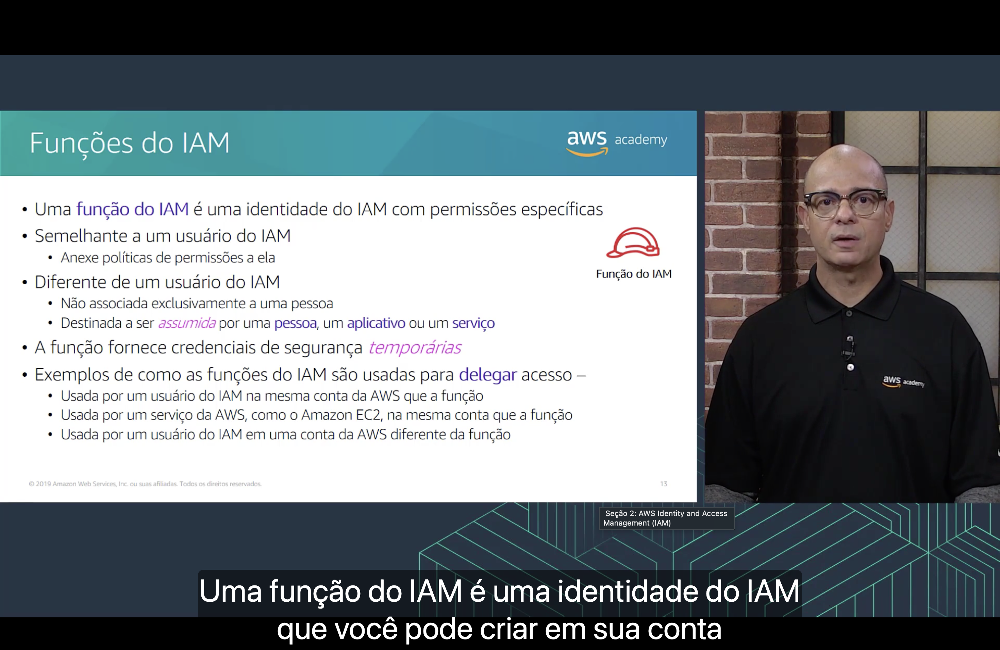

Uma **função do IAM** (*IAM role*) é uma **identidade do IAM com permissões específicas**.

| | 👤 Usuário do IAM | 🎭 Função do IAM |
|---|---|---|
| **Recebe políticas de permissão** | ✅ Sim | ✅ Sim |
| **Associada a uma pessoa** | ✅ Exclusivamente | ❌ Não |
| **Quem usa** | A própria pessoa/aplicativo | É **assumida** por uma **pessoa**, um **aplicativo** ou um **serviço** |
| **Credenciais** | Permanentes (senha, chaves de acesso) | **Temporárias** |

Exemplos de como as funções são usadas para **delegar acesso**:

- 👤 Por um **usuário do IAM na mesma conta** da AWS que a função.
- 🖥️ Por um **serviço da AWS**, como o **Amazon EC2**, na mesma conta que a função.
- 🌐 Por um **usuário do IAM em outra conta** da AWS.

<a id="exemplo-funcao"></a>
## 10. 🖥️ Exemplo de uso de uma função do IAM

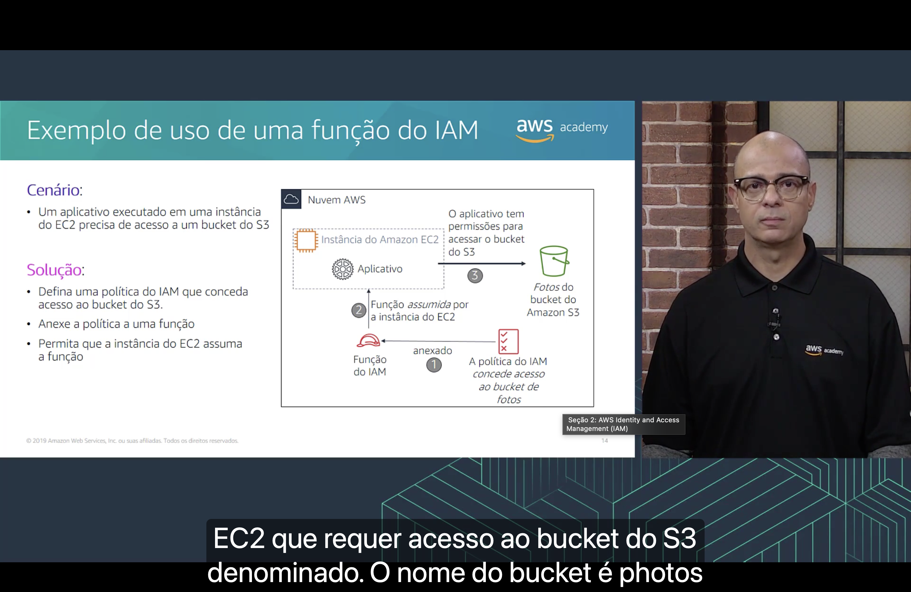

**Cenário:** um aplicativo executado em uma **instância do EC2** precisa de acesso a um **bucket do S3** (fotos).

**Solução:**

1. 📄 Defina uma **política do IAM** que conceda acesso ao bucket do S3 e **anexe-a a uma função**.
2. 🎭 Permita que a **instância do EC2 assuma a função**.
3. ✅ O **aplicativo** passa a ter permissões para acessar o bucket do S3.

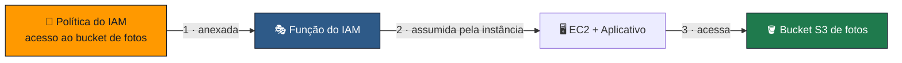

> [!TIP]
> Usar uma função evita **gravar chaves de acesso dentro da instância ou do código**. As credenciais temporárias são fornecidas e renovadas automaticamente.

---

<a id="conclusoes"></a>
## 🎯 Principais conclusões

- ✅ O **IAM** gerencia **quem** pode acessar **quais** recursos da AWS e **como**, e é **gratuito**.
- ✅ Componentes essenciais: **usuário**, **grupo**, **política** e **função**.
- ✅ Usuários podem ter **acesso programático** (chaves de acesso → CLI/SDK) e/ou **acesso ao Console** (ID da conta + usuário + senha).
- ✅ A **MFA** adiciona um código exclusivo além de usuário e senha.
- ✅ Tudo é **negado implicitamente** por padrão; uma **negação explícita sempre vence** uma permissão.
- ✅ Siga o **princípio do privilégio mínimo**.
- ✅ As configurações do IAM têm escopo **global** (todas as regiões).
- ✅ **Grupos** concedem as mesmas permissões a vários usuários; um usuário pode estar em vários grupos, mas grupos **não podem ser aninhados**.
- ✅ **Funções** fornecem **credenciais temporárias** e são **assumidas** por pessoas, aplicativos ou serviços (ex.: EC2 acessando S3).

---

<p align="center">
  <a href="../README.md">🏠 Início</a> &nbsp;•&nbsp;
  <a href="./Seção%201%20-%20Modelo%20de%20responsabilidade%20compartilhada%20da%20AWS.md">⬅️ Anterior: Modelo de responsabilidade compartilhada</a> &nbsp;•&nbsp;
  <a href="./Seção%20Bônus%20-%20Demonstração%20-%20IAM.md">Próxima: Demonstração IAM ➡️</a>
</p>
