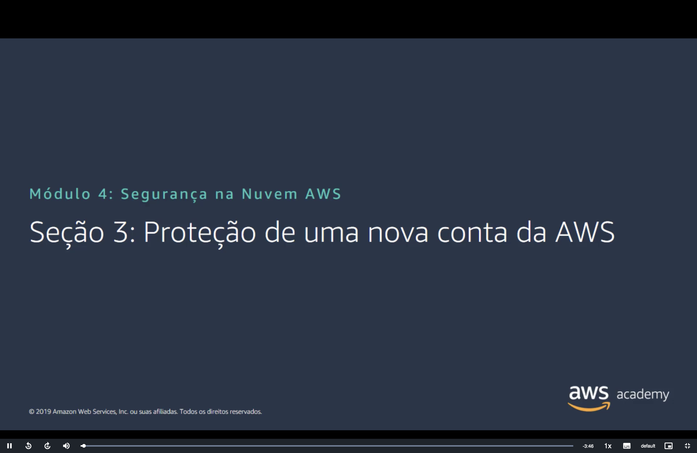
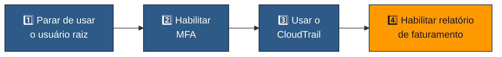
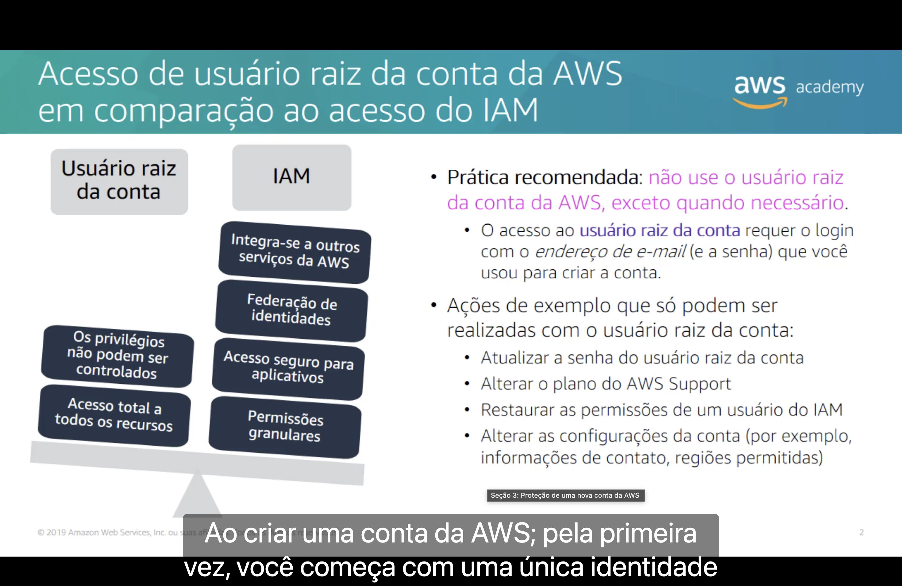
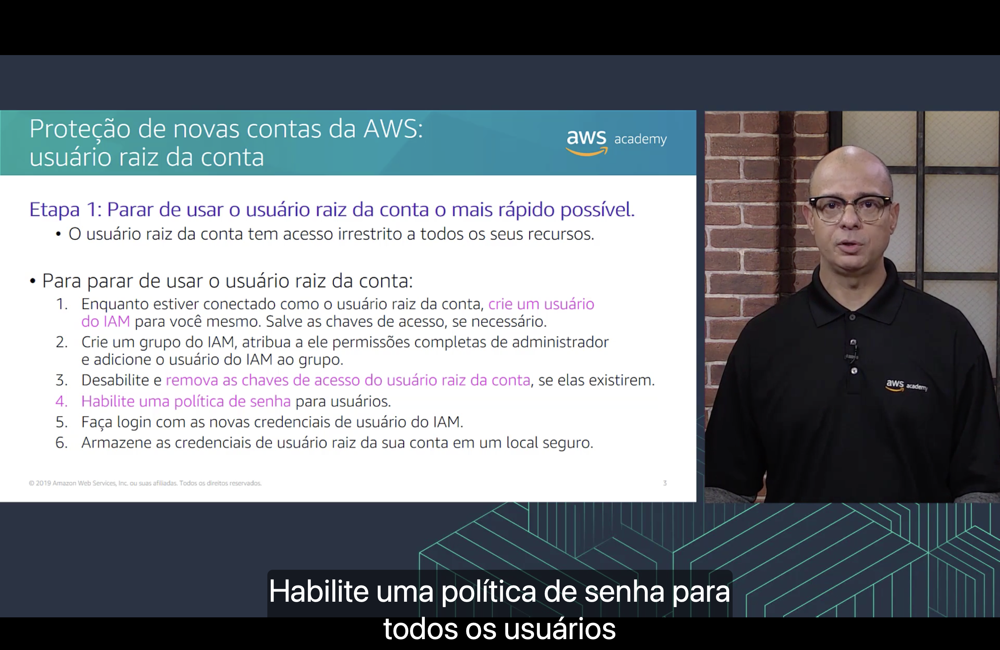
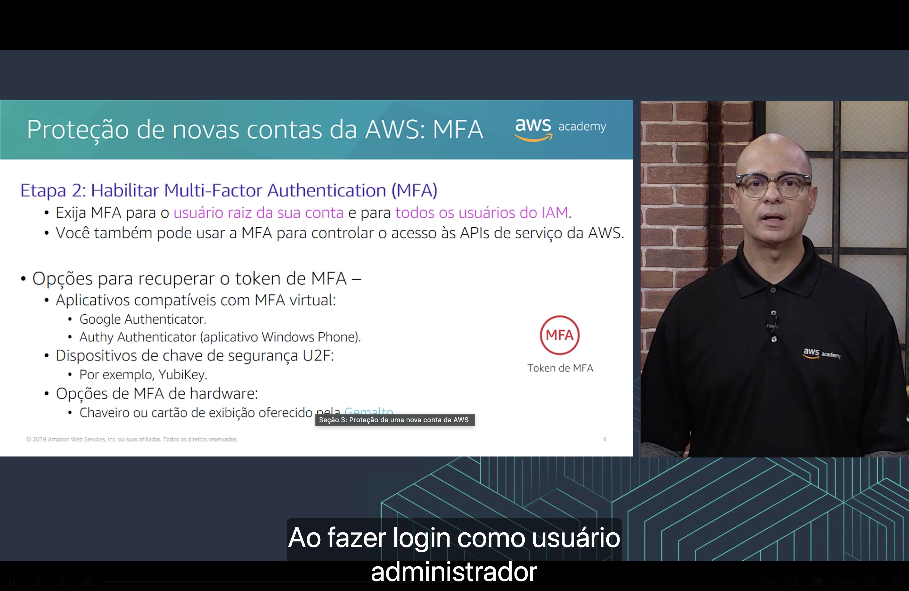
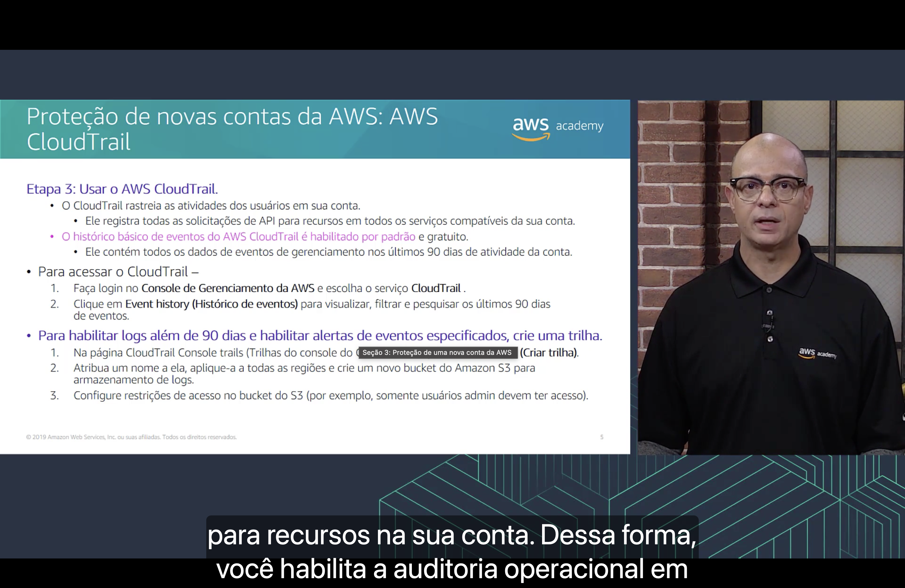
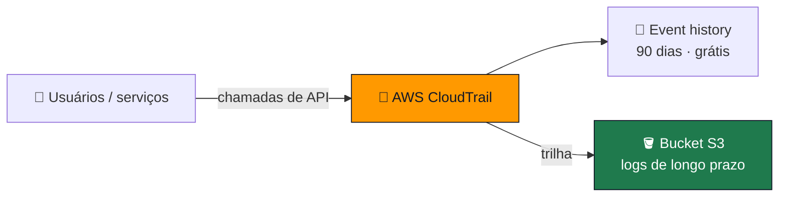
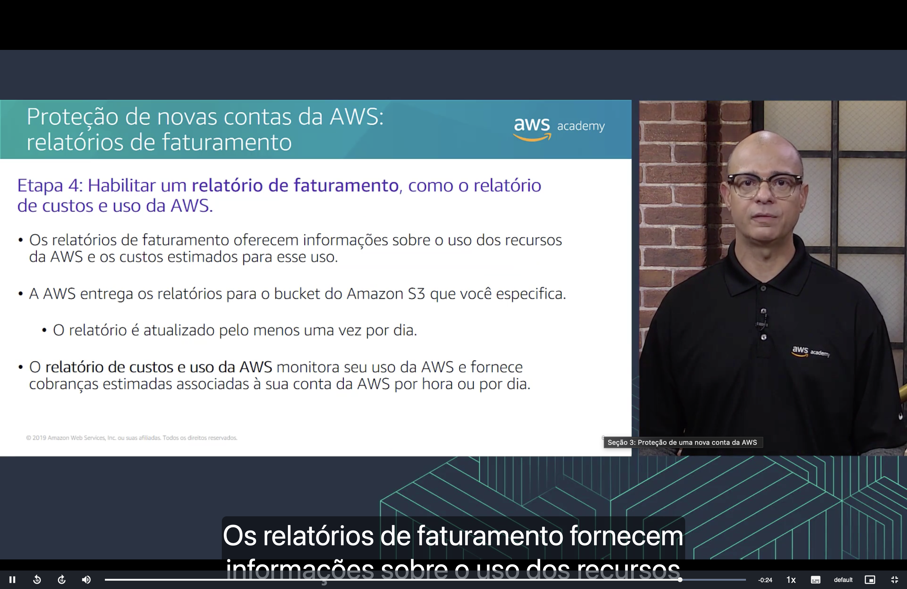

<h1 align="center">🛡️ Seção 3 – Proteção de uma nova conta da AWS</h1>

  
  
   
  
  
  

  <a href="../README.md">🏠 Início</a> &nbsp;•&nbsp;
  <a href="./Seção%20Bônus%20-%20Demonstração%20-%20IAM.md">⬅️ Anterior: Demonstração IAM</a> &nbsp;•&nbsp;
  <a href="./Seção%204%20-%20Proteção%20de%20contas.md">Próxima: Proteção de contas ➡️</a>

## 📑 Sumário

| # | Tópico |
|:---:|---|
| 1 | [⚖️ Usuário raiz da conta vs. IAM](#raiz-vs-iam) |
| 2 | [1️⃣ Etapa 1: parar de usar o usuário raiz](#etapa1) |
| 3 | [2️⃣ Etapa 2: habilitar a MFA](#etapa2) |
| 4 | [3️⃣ Etapa 3: usar o AWS CloudTrail](#etapa3) |
| 5 | [4️⃣ Etapa 4: habilitar um relatório de faturamento](#etapa4) |
| 🎯 | [Principais conclusões](#conclusoes) |

---

## 1. ⚖️ Usuário raiz da conta vs. IAM

Ao criar uma conta da AWS, você começa com uma **única identidade**: o **usuário raiz da conta**. O acesso a ele exige o login com o **endereço de e-mail** (e a senha) usado para criar a conta.

| | 👑 **Usuário raiz da conta** | 🔐 **IAM** |
|---|---|---|
| **Acesso** | **Total** a todos os recursos | **Permissões granulares** |
| **Controle** | Os privilégios **não podem ser controlados** | **Acesso seguro** para aplicativos |
| **Recursos extras** | — | **Federação de identidades** · **integra-se** a outros serviços da AWS |

> [!IMPORTANT]
> **Prática recomendada:** **não use o usuário raiz** da conta da AWS, **exceto quando necessário**.

Ações de exemplo que **só podem ser realizadas com o usuário raiz**:

- 🔑 Atualizar a **senha do usuário raiz** da conta.
- 🛟 Alterar o **plano do AWS Support**.
- ♻️ **Restaurar as permissões** de um usuário do IAM.
- ⚙️ Alterar as **configurações da conta** (por exemplo, informações de contato, regiões permitidas).

## 2. 1️⃣ Etapa 1: parar de usar o usuário raiz o mais rápido possível

O usuário raiz tem **acesso irrestrito** a todos os seus recursos. Para parar de usá-lo:

| Passo | Ação |
|:---:|---|
| 1️⃣ | Enquanto estiver conectado como usuário raiz, **crie um usuário do IAM** para você mesmo. Salve as chaves de acesso, se necessário. |
| 2️⃣ | **Crie um grupo do IAM**, atribua a ele **permissões completas de administrador** e **adicione o usuário** do IAM ao grupo. |
| 3️⃣ | **Desabilite e remova as chaves de acesso do usuário raiz**, se elas existirem. |
| 4️⃣ | **Habilite uma política de senha** para os usuários. |
| 5️⃣ | **Faça login com as novas credenciais** de usuário do IAM. |
| 6️⃣ | **Armazene as credenciais do usuário raiz** em um local seguro. |

> [!TIP]
> Repare que as permissões de administrador vão para o **grupo**, e não diretamente para o usuário, aplicando a boa prática de **usar grupos para atribuir permissões** vista na [Seção 2](./Seção%202%20-%20AWS%20Identity%20and%20Access%20Management%20(IAM).md#grupos).

## 3. 2️⃣ Etapa 2: habilitar a Multi-Factor Authentication (MFA)

- 📱 Exija MFA para o **usuário raiz da sua conta** e para **todos os usuários do IAM**.
- 🔌 Você também pode usar a MFA para **controlar o acesso às APIs** de serviço da AWS.

Opções para obter o **token de MFA**:

| Tipo | Exemplos |
|---|---|
| 📲 **Aplicativos compatíveis com MFA virtual** | **Google Authenticator** · **Authy Authenticator** (aplicativo Windows Phone) |
| 🔑 **Dispositivos de chave de segurança U2F** | **YubiKey** |
| 🪪 **Opções de MFA de hardware** | **Chaveiro ou cartão de exibição** oferecido pela **Gemalto** |

## 4. 3️⃣ Etapa 3: usar o AWS CloudTrail

O **AWS CloudTrail** **rastreia as atividades dos usuários** na sua conta: ele **registra todas as solicitações de API** para recursos em todos os serviços compatíveis. Dessa forma, você habilita a **auditoria operacional** da conta.

> [!NOTE]
> O **histórico básico de eventos** do CloudTrail é **habilitado por padrão** e **gratuito**. Ele contém todos os dados de eventos de gerenciamento dos **últimos 90 dias** de atividade da conta.

**Para acessar o CloudTrail:**

1. Faça login no **Console de Gerenciamento da AWS** e escolha o serviço **CloudTrail**.
2. Clique em **Event history** (*Histórico de eventos*) para visualizar, filtrar e pesquisar os últimos 90 dias de eventos.

**Para guardar logs por mais de 90 dias e habilitar alertas de eventos específicos, crie uma trilha (*trail*):**

1. Na página **CloudTrail Console trails** (*Trilhas do console do CloudTrail*), clique em **Create trail** (*Criar trilha*).
2. Atribua um **nome** a ela, **aplique-a a todas as regiões** e crie um **novo bucket do Amazon S3** para armazenar os logs.
3. Configure **restrições de acesso no bucket do S3** (por exemplo, somente usuários admin devem ter acesso).

## 5. 4️⃣ Etapa 4: habilitar um relatório de faturamento

Habilite um **relatório de faturamento**, como o **relatório de custos e uso da AWS** (*AWS Cost and Usage Report*).

- 📊 Os relatórios de faturamento oferecem informações sobre o **uso dos recursos** da AWS e os **custos estimados** desse uso.
- 🪣 A AWS entrega os relatórios para o **bucket do Amazon S3** que você especificar.
- 🔄 O relatório é atualizado **pelo menos uma vez por dia**.
- ⏱️ O **relatório de custos e uso da AWS** monitora seu uso e fornece cobranças estimadas associadas à conta **por hora ou por dia**.

> [!TIP]
> Do ponto de vista de segurança, um **gasto inesperado** costuma ser o primeiro sinal de uma conta comprometida (por exemplo, instâncias criadas por um invasor). Ver as ferramentas de custo em [Módulo 2 – Billing and Cost Management](../MÓDULO%202/Seção%204%20-%20AWS%20Billing%20and%20Cost%20Management.md).

---

## 🎯 Principais conclusões

- ✅ Toda conta nova começa com o **usuário raiz**, que tem **acesso total** e privilégios que **não podem ser controlados**.
- ✅ **Não use o usuário raiz** no dia a dia; reserve-o para tarefas que **só ele** pode fazer (senha do raiz, plano de suporte, configurações da conta etc.).
- ✅ **Etapa 1:** crie um **usuário do IAM** em um **grupo de administradores**, remova as **chaves de acesso do raiz**, habilite uma **política de senha** e guarde as credenciais do raiz em local seguro.
- ✅ **Etapa 2:** exija **MFA** para o raiz e para todos os usuários do IAM (app virtual, chave U2F ou hardware).
- ✅ **Etapa 3:** use o **AWS CloudTrail** para auditar chamadas de API; o histórico de **90 dias é grátis** e uma **trilha** guarda logs por mais tempo em um bucket do S3.
- ✅ **Etapa 4:** habilite o **relatório de custos e uso da AWS**, entregue em um bucket do S3 e atualizado ao menos **uma vez por dia**.

---

  <a href="../README.md">🏠 Início</a> &nbsp;•&nbsp;
  <a href="./Seção%20Bônus%20-%20Demonstração%20-%20IAM.md">⬅️ Anterior: Demonstração IAM</a> &nbsp;•&nbsp;
  <a href="./Seção%204%20-%20Proteção%20de%20contas.md">Próxima: Proteção de contas ➡️</a>

