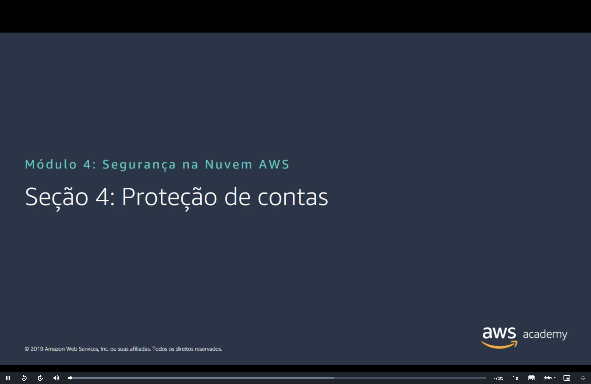
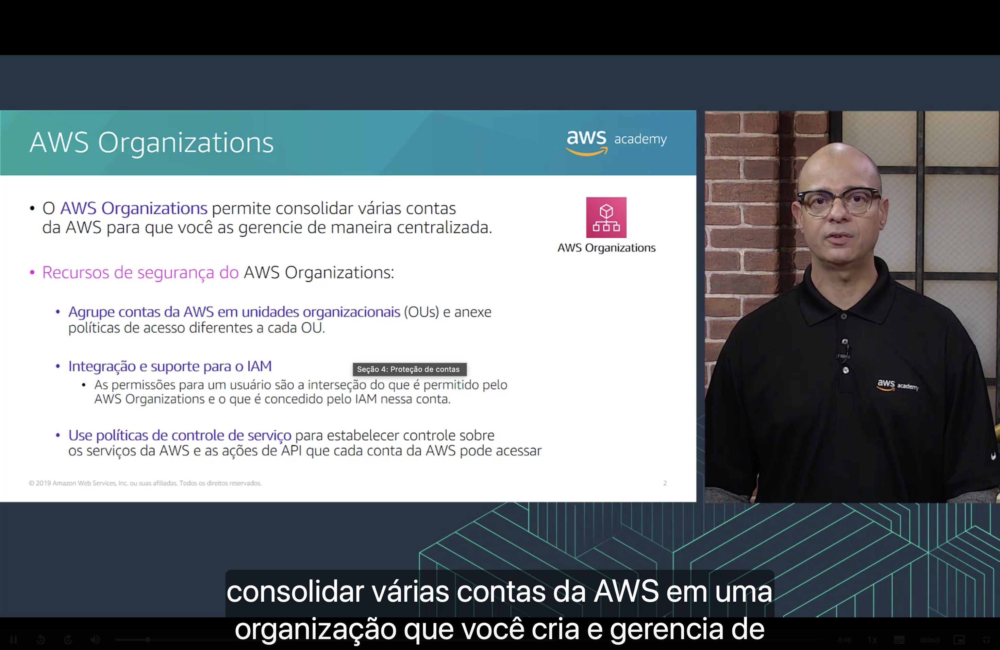
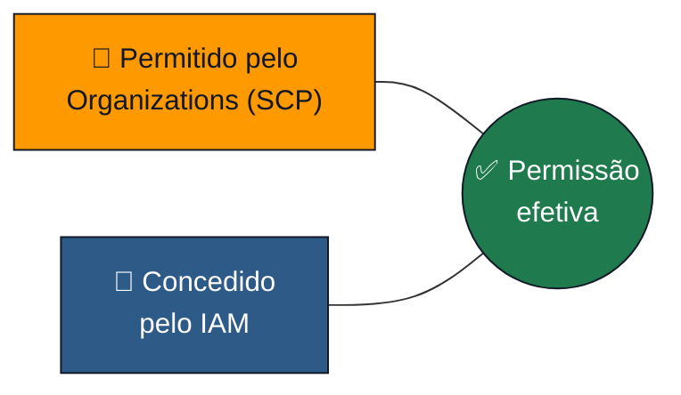
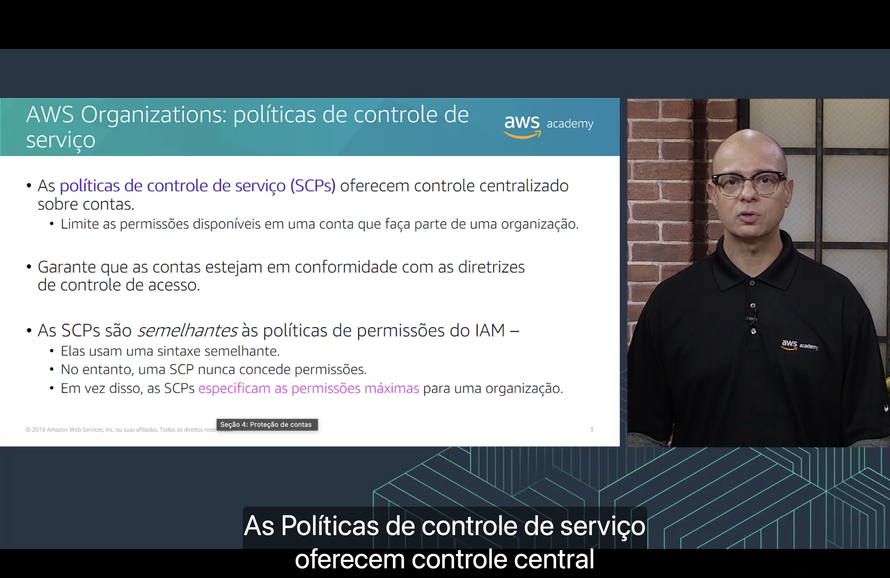
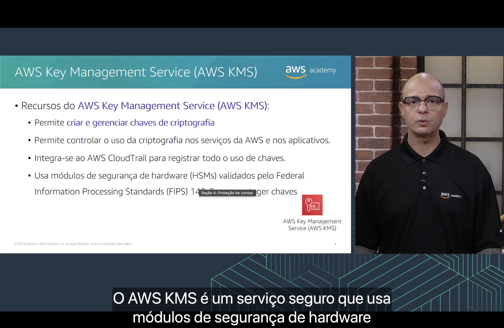
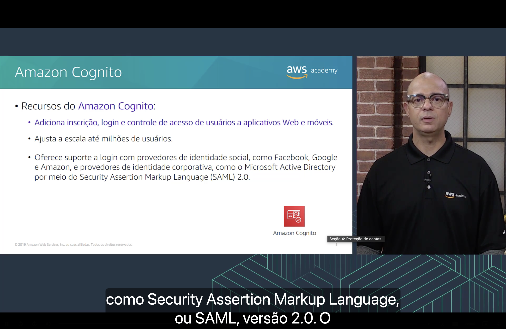
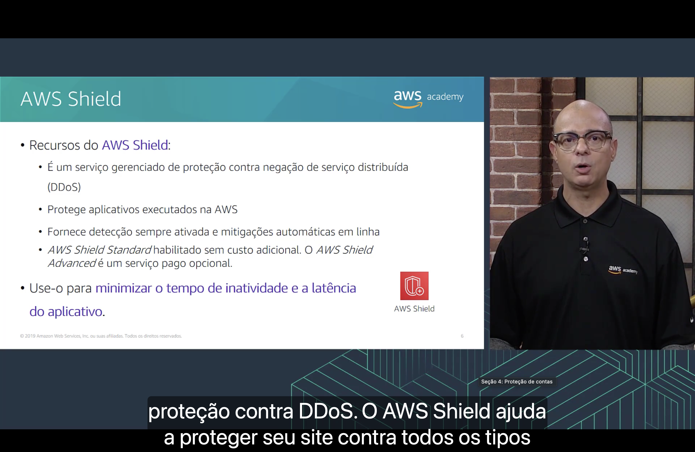

<h1 align="center">🏢 Seção 4 – Proteção de contas</h1>

  
  
   
  
  
  

  <a href="../README.md">🏠 Início</a> &nbsp;•&nbsp;
  <a href="./Seção%203%20-%20Proteção%20de%20uma%20nova%20conta%20da%20AWS.md">⬅️ Anterior: Proteção de uma nova conta</a> &nbsp;•&nbsp;
  <a href="./Seção%205%20-%20Proteção%20de%20dados%20na%20AWS.md">Próxima: Proteção de dados ➡️</a>

## 📑 Sumário

| # | Tópico |
|:---:|---|
| 1 | [🏢 AWS Organizations](#organizations) |
| 2 | [🚧 Políticas de controle de serviço (SCPs)](#scps) |
| 3 | [🔑 AWS Key Management Service (AWS KMS)](#kms) |
| 4 | [👤 Amazon Cognito](#cognito) |
| 5 | [🛡️ AWS Shield](#shield) |
| 🎯 | [Principais conclusões](#conclusoes) |

| Serviço | Em uma frase |
|---|---|
| 🏢 **AWS Organizations** | Gerencia **várias contas** de forma centralizada. |
| 🚧 **SCPs** | Definem as **permissões máximas** das contas de uma organização. |
| 🔑 **AWS KMS** | Cria e gerencia **chaves de criptografia**. |
| 👤 **Amazon Cognito** | **Login e controle de acesso** para aplicativos Web e móveis. |
| 🛡️ **AWS Shield** | Proteção gerenciada contra ataques **DDoS**. |

---

## 1. 🏢 AWS Organizations

O **AWS Organizations** permite **consolidar várias contas** da AWS para que você as **gerencie de maneira centralizada**. (O lado de faturamento consolidado foi visto no [Módulo 2 – AWS Organizations](../MÓDULO%202/Seção%203%20-%20AWS%20Organizations.md).)

**Recursos de segurança do AWS Organizations:**

| Recurso | Detalhe |
|---|---|
| 🗂️ **Unidades organizacionais (OUs)** | Agrupe contas da AWS em **OUs** e anexe **políticas de acesso diferentes** a cada OU. |
| 🔐 **Integração e suporte para o IAM** | As permissões de um usuário são a **interseção** do que é permitido pelo **AWS Organizations** e do que é concedido pelo **IAM** naquela conta. |
| 🚧 **Políticas de controle de serviço (SCPs)** | Estabelecem controle sobre os **serviços** da AWS e as **ações de API** que cada conta pode acessar. |

> [!TIP]
> Pense em **interseção**: o usuário só consegue fazer algo se **as duas** camadas permitirem. Se o IAM concede `s3:*` mas a SCP da conta bloqueia o S3, o acesso é **negado**.

## 2. 🚧 Políticas de controle de serviço (SCPs)

- 🎛️ As **políticas de controle de serviço (SCPs)** oferecem **controle centralizado sobre contas**: limitam as permissões disponíveis em uma conta que faça parte de uma organização.
- ✅ Garantem que as contas estejam em **conformidade** com as diretrizes de controle de acesso.

| | 🚧 SCP | 📄 Política do IAM |
|---|---|---|
| **Sintaxe** | JSON, **semelhante** | JSON |
| **Concede permissões?** | ❌ **Nunca** | ✅ Sim |
| **Papel** | Especifica as **permissões máximas** para uma organização (um "teto") | Concede permissões a usuários, grupos e funções |

> [!IMPORTANT]
> Uma SCP **nunca concede** permissões. Ela só define o **limite máximo**; quem concede de fato é o **IAM**.

## 3. 🔑 AWS Key Management Service (AWS KMS)

Recursos do **AWS KMS**:

- 🗝️ Permite **criar e gerenciar chaves de criptografia**.
- 🎛️ Permite **controlar o uso da criptografia** nos serviços da AWS e nos aplicativos.
- 📜 Integra-se ao **AWS CloudTrail** para **registrar todo o uso de chaves** (ver [Seção 3](./Seção%203%20-%20Proteção%20de%20uma%20nova%20conta%20da%20AWS.md#etapa3)).
- 🔒 Usa **módulos de segurança de hardware (HSMs)** validados pelo **Federal Information Processing Standards (FIPS) 140-2** para proteger as chaves.

## 4. 👤 Amazon Cognito

Recursos do **Amazon Cognito**:

- 📝 Adiciona **inscrição, login e controle de acesso** de usuários a **aplicativos Web e móveis**.
- 📈 **Ajusta a escala** até **milhões de usuários**.
- 🌐 Oferece suporte a login com:

| Tipo de provedor | Exemplos |
|---|---|
| 👥 **Identidade social** | **Facebook**, **Google** e **Amazon** |
| 🏢 **Identidade corporativa** | **Microsoft Active Directory**, por meio do **SAML 2.0** (*Security Assertion Markup Language*) |

> [!NOTE]
> **IAM vs. Cognito:** o IAM controla quem acessa **a sua conta da AWS** (funcionários, aplicativos, serviços); o Cognito controla os **usuários finais do seu aplicativo** (clientes que se cadastram no seu site ou app).

## 5. 🛡️ AWS Shield

Recursos do **AWS Shield**:

- 🛡️ É um **serviço gerenciado de proteção contra negação de serviço distribuída (DDoS)**.
- ☁️ **Protege aplicativos** executados na AWS.
- ⚡ Fornece **detecção sempre ativada** e **mitigações automáticas em linha**.
- 🎯 Use-o para **minimizar o tempo de inatividade e a latência** do aplicativo.

| Plano | Custo |
|---|---|
| 🟢 **AWS Shield Standard** | Habilitado **sem custo adicional** |
| 🟠 **AWS Shield Advanced** | Serviço **pago opcional** |

---

## 🎯 Principais conclusões

- ✅ O **AWS Organizations** gerencia várias contas de forma centralizada, agrupando-as em **OUs** com políticas diferentes.
- ✅ A permissão efetiva de um usuário é a **interseção** do que o **Organizations** permite com o que o **IAM** concede.
- ✅ As **SCPs** definem as **permissões máximas** de uma conta, mas **nunca concedem** permissões.
- ✅ O **AWS KMS** cria e gerencia **chaves de criptografia**, usa **HSMs FIPS 140-2** e registra o uso das chaves no **CloudTrail**.
- ✅ O **Amazon Cognito** adiciona **cadastro e login** a aplicativos Web e móveis, com provedores sociais e corporativos (**SAML 2.0**).
- ✅ O **AWS Shield** protege contra **DDoS**: o **Standard** é gratuito e o **Advanced** é pago.

---

  <a href="../README.md">🏠 Início</a> &nbsp;•&nbsp;
  <a href="./Seção%203%20-%20Proteção%20de%20uma%20nova%20conta%20da%20AWS.md">⬅️ Anterior: Proteção de uma nova conta</a> &nbsp;•&nbsp;
  <a href="./Seção%205%20-%20Proteção%20de%20dados%20na%20AWS.md">Próxima: Proteção de dados ➡️</a>

