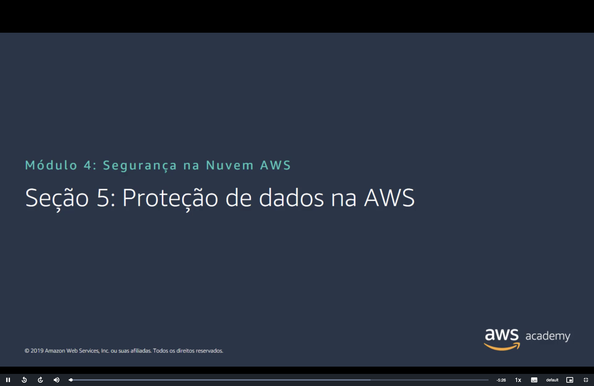
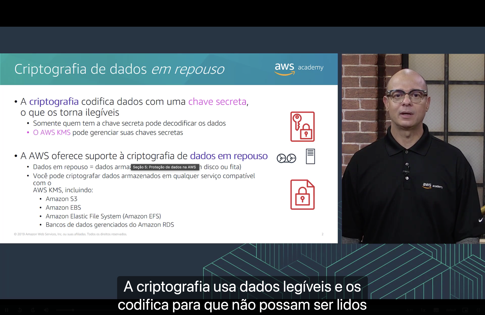
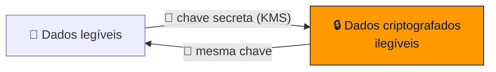
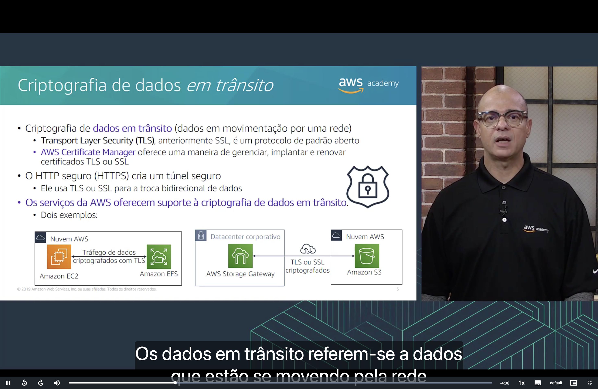
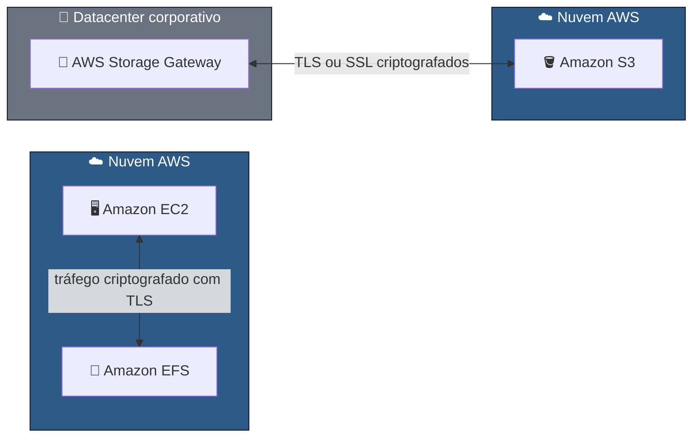
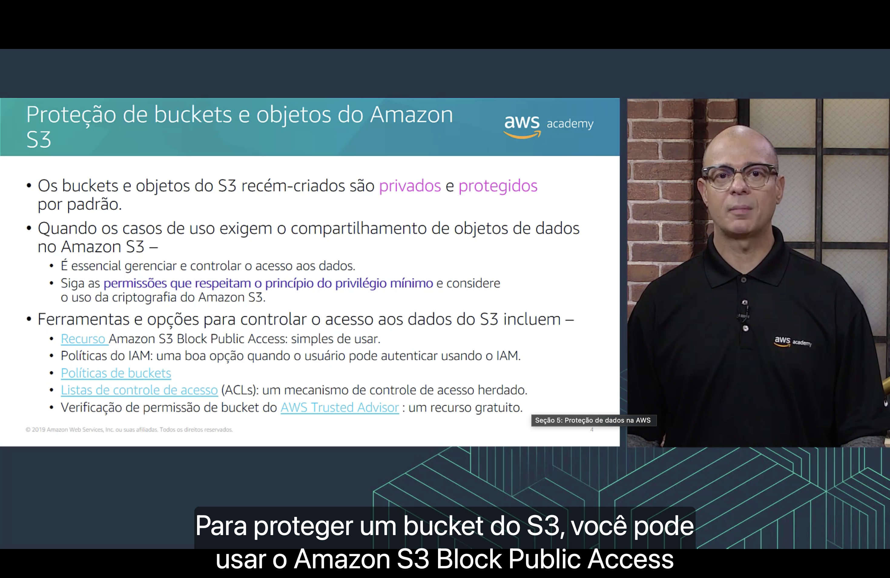

<h1 align="center">🔒 Seção 5 – Proteção de dados na AWS</h1>

  
  
   
  
  
  

  <a href="../README.md">🏠 Início</a> &nbsp;•&nbsp;
  <a href="./Seção%204%20-%20Proteção%20de%20contas.md">⬅️ Anterior: Proteção de contas</a> &nbsp;•&nbsp;
  <a href="./Seção%206%20-%20Trabalhar%20para%20garantir%20a%20conformidade.md">Próxima: Conformidade ➡️</a>

## 📑 Sumário

| # | Tópico |
|:---:|---|
| 1 | [💾 Criptografia de dados em repouso](#repouso) |
| 2 | [🚚 Criptografia de dados em trânsito](#transito) |
| 3 | [🪣 Proteção de buckets e objetos do Amazon S3](#s3) |
| 🎯 | [Principais conclusões](#conclusoes) |

| | 💾 **Dados em repouso** | 🚚 **Dados em trânsito** |
|---|---|---|
| **O que são** | Dados **armazenados fisicamente** (disco ou fita) | Dados **em movimentação** por uma rede |
| **Como proteger** | Criptografia com chaves gerenciadas pelo **AWS KMS** | **TLS/SSL** e **HTTPS**, com certificados do **AWS Certificate Manager** |

---

## 1. 💾 Criptografia de dados *em repouso*

A **criptografia** codifica dados com uma **chave secreta**, o que os torna **ilegíveis**.

- 🔑 Somente **quem tem a chave secreta** pode decodificar os dados.
- 🗝️ O **AWS KMS** pode gerenciar suas chaves secretas (ver [Seção 4](./Seção%204%20-%20Proteção%20de%20contas.md#kms)).

A AWS oferece suporte à criptografia de **dados em repouso**, ou seja, dados **armazenados fisicamente** (em disco ou fita). Você pode criptografar dados armazenados em **qualquer serviço compatível com o AWS KMS**, incluindo:

| Serviço | Tipo de armazenamento |
|---|---|
| 🪣 **Amazon S3** | Objetos |
| 💽 **Amazon EBS** | Volumes de blocos (discos das instâncias EC2) |
| 📁 **Amazon Elastic File System (Amazon EFS)** | Sistema de arquivos |
| 🗄️ **Amazon RDS** | Bancos de dados gerenciados |

## 2. 🚚 Criptografia de dados *em trânsito*

Os **dados em trânsito** são os dados **em movimentação por uma rede**.

| Tecnologia | O que faz |
|---|---|
| 🔐 **Transport Layer Security (TLS)** | Antes chamado de **SSL**, é um **protocolo de padrão aberto** para criptografar a comunicação. |
| 📜 **AWS Certificate Manager** | Oferece uma maneira de **gerenciar, implantar e renovar** certificados **TLS ou SSL**. |
| 🌐 **HTTP seguro (HTTPS)** | Cria um **túnel seguro**, usando **TLS ou SSL** para a troca **bidirecional** de dados. |

Os **serviços da AWS oferecem suporte** à criptografia de dados em trânsito. Dois exemplos:

1. ☁️ Uma instância **Amazon EC2** e o **Amazon EFS** trocam dados criptografados com **TLS**.
2. 🏢 O **AWS Storage Gateway**, no datacenter corporativo, envia dados ao **Amazon S3** usando **TLS ou SSL**.

## 3. 🪣 Proteção de buckets e objetos do Amazon S3

> [!NOTE]
> Os buckets e objetos do S3 **recém-criados** são **privados e protegidos por padrão**.

Quando os casos de uso exigem **compartilhar** objetos no Amazon S3:

- 🎛️ É essencial **gerenciar e controlar o acesso** aos dados.
- 🎯 Siga permissões que respeitem o **princípio do privilégio mínimo** e considere usar a **criptografia do Amazon S3**.

**Ferramentas e opções para controlar o acesso aos dados do S3:**

| Ferramenta | Observação |
|---|---|
| 🚫 **Amazon S3 Block Public Access** | **Simples de usar**; bloqueia o acesso público aos buckets. |
| 🔐 **Políticas do IAM** | Boa opção quando o usuário **pode se autenticar usando o IAM**. |
| 📄 **Políticas de buckets** | Definem o acesso **no próprio bucket**. |
| 📋 **Listas de controle de acesso (ACLs)** | Mecanismo de controle de acesso **herdado** (*legacy*). |
| ✅ **Verificação de permissão de bucket do AWS Trusted Advisor** | Recurso **gratuito**. |

> [!WARNING]
> A maior parte dos vazamentos de dados no S3 acontece por **buckets configurados como públicos por engano**, e não por falha da AWS. Pelo [modelo de responsabilidade compartilhada](./Seção%201%20-%20Modelo%20de%20responsabilidade%20compartilhada%20da%20AWS.md), essa configuração é **do cliente**.

---

## 🎯 Principais conclusões

- ✅ A **criptografia** torna os dados ilegíveis para quem não tem a **chave secreta**; o **AWS KMS** gerencia essas chaves.
- ✅ **Dados em repouso** (disco ou fita) podem ser criptografados em serviços compatíveis com o KMS: **S3**, **EBS**, **EFS** e **RDS**.
- ✅ **Dados em trânsito** são protegidos com **TLS** (antigo SSL) e **HTTPS**; o **AWS Certificate Manager** gerencia os certificados.
- ✅ Buckets e objetos do **S3** são **privados por padrão**.
- ✅ Para controlar o acesso ao S3, use **Block Public Access**, **políticas do IAM**, **políticas de bucket**, **ACLs** e a verificação gratuita do **Trusted Advisor**, sempre com **privilégio mínimo**.

---

  <a href="../README.md">🏠 Início</a> &nbsp;•&nbsp;
  <a href="./Seção%204%20-%20Proteção%20de%20contas.md">⬅️ Anterior: Proteção de contas</a> &nbsp;•&nbsp;
  <a href="./Seção%206%20-%20Trabalhar%20para%20garantir%20a%20conformidade.md">Próxima: Conformidade ➡️</a>

