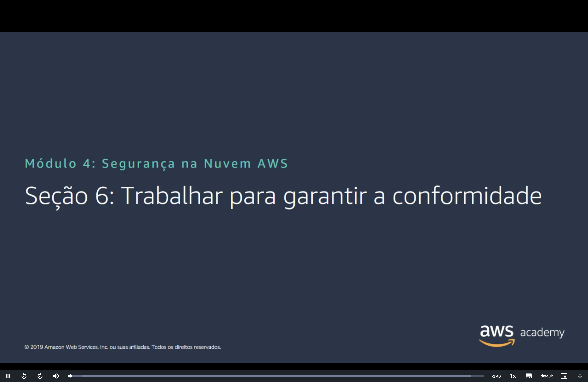
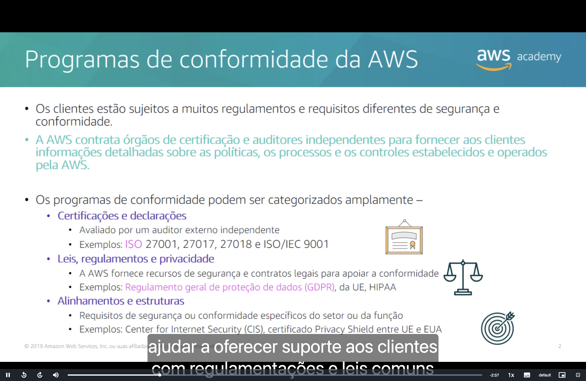
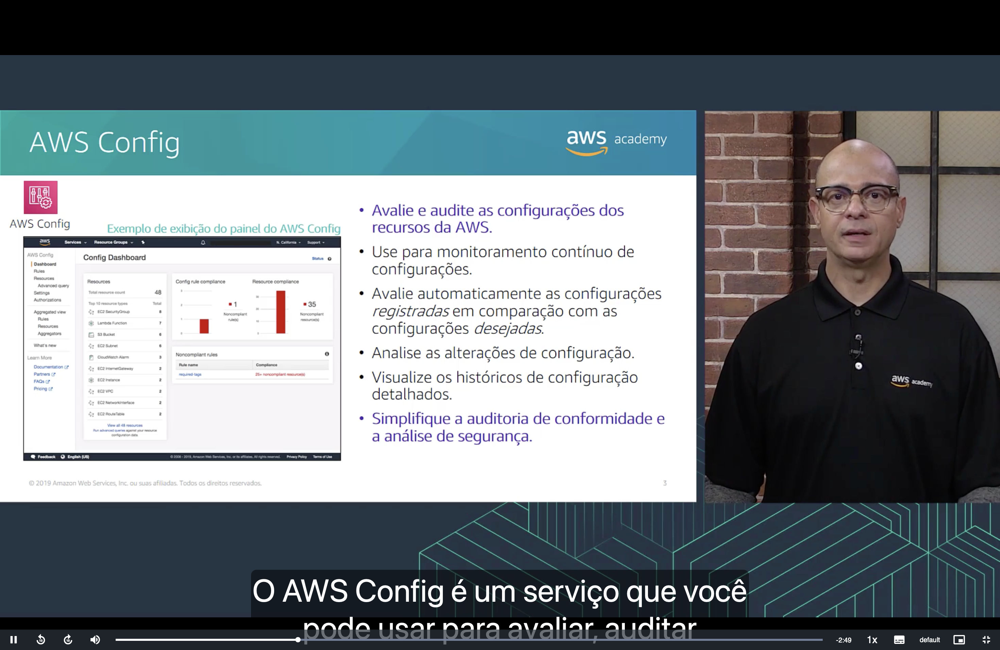
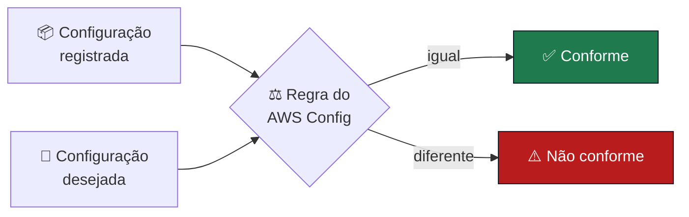
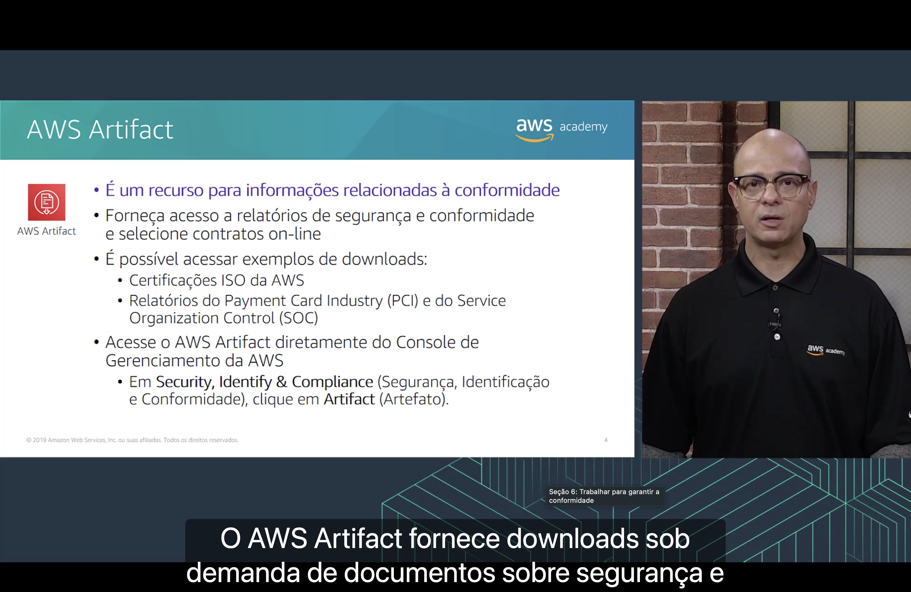

<h1 align="center">📋 Seção 6 – Trabalhar para garantir a conformidade</h1>

  
  
   
  
  

  <a href="../README.md">🏠 Início</a> &nbsp;•&nbsp;
  <a href="./Seção%205%20-%20Proteção%20de%20dados%20na%20AWS.md">⬅️ Anterior: Proteção de dados na AWS</a> &nbsp;•&nbsp;
  <a href="./Seção%207%20-%20Conclusão%20do%20Módulo%204.md">Próxima: Conclusão do Módulo 4 ➡️</a>

## 📑 Sumário

| # | Tópico |
|:---:|---|
| 1 | [📜 Programas de conformidade da AWS](#programas) |
| 2 | [⚙️ AWS Config](#config) |
| 3 | [📁 AWS Artifact](#artifact) |
| 🎯 | [Principais conclusões](#conclusoes) |

| Serviço | Pergunta que responde |
|---|---|
| ⚙️ **AWS Config** | "Os **meus recursos** estão configurados como deveriam?" |
| 📁 **AWS Artifact** | "Onde estão os **relatórios de conformidade da AWS** para mostrar ao auditor?" |

---

## 1. 📜 Programas de conformidade da AWS

- ⚖️ Os clientes estão sujeitos a **muitos regulamentos e requisitos** diferentes de segurança e conformidade.
- 🔎 A AWS **contrata órgãos de certificação e auditores independentes** para fornecer aos clientes informações detalhadas sobre as **políticas, os processos e os controles** estabelecidos e operados pela AWS.

Os programas de conformidade podem ser **categorizados amplamente** em:

| Categoria | Descrição | Exemplos |
|---|---|---|
| 🏅 **Certificações e declarações** | Avaliadas por um **auditor externo independente** | **ISO 27001**, **27017**, **27018** e **ISO/IEC 9001** |
| ⚖️ **Leis, regulamentos e privacidade** | A AWS fornece **recursos de segurança e contratos legais** para apoiar a conformidade | **GDPR** (Regulamento Geral de Proteção de Dados) da UE, **HIPAA** |
| 🎯 **Alinhamentos e estruturas** | Requisitos de segurança ou conformidade **específicos do setor ou da função** | **Center for Internet Security (CIS)**, certificado **Privacy Shield entre UE e EUA** |

> [!NOTE]
> As certificações da AWS cobrem a **infraestrutura** (segurança **DA** nuvem). Elas não tornam automaticamente a **sua aplicação** conforme: isso continua sendo responsabilidade do cliente, como no [modelo de responsabilidade compartilhada](./Seção%201%20-%20Modelo%20de%20responsabilidade%20compartilhada%20da%20AWS.md).

## 2. ⚙️ AWS Config

O **AWS Config** é usado para **avaliar, auditar e analisar** as configurações dos recursos da AWS.

- 🔍 **Avalie e audite** as configurações dos recursos da AWS.
- 🔄 Use para **monitoramento contínuo** de configurações.
- ⚖️ **Avalie automaticamente** as configurações **registradas** em comparação com as configurações **desejadas**.
- 📝 **Analise as alterações** de configuração.
- 🕓 Visualize **históricos de configuração** detalhados.
- ✅ **Simplifique a auditoria de conformidade** e a análise de segurança.

**No exemplo do painel do AWS Config** (*Config Dashboard*):

| Indicador | Valor |
|---|---:|
| 📦 **Recursos** registrados (*Total resource count*) | 48 |
| 📏 **Regras não conformes** (*Noncompliant rules*) | 1 (`required-tags`) |
| ⚠️ **Recursos não conformes** (*Noncompliant resources*) | 35 |

## 3. 📁 AWS Artifact

O **AWS Artifact** é um **recurso para informações relacionadas à conformidade**: fornece **downloads sob demanda** de documentos de segurança e conformidade.

- 📄 Forneça acesso a **relatórios de segurança e conformidade** e selecione **contratos on-line**.
- ⬇️ Exemplos de downloads:
  - 🏅 **Certificações ISO** da AWS.
  - 💳 Relatórios do **Payment Card Industry (PCI)** e do **Service Organization Control (SOC)**.

**Como acessar:** no **Console de Gerenciamento da AWS**, em **Security, Identity & Compliance** (*Segurança, Identificação e Conformidade*), clique em **Artifact** (*Artefato*).

> [!TIP]
> **Config vs. Artifact:** o **Config** verifica a conformidade dos **seus** recursos; o **Artifact** entrega os relatórios que comprovam a conformidade **da própria AWS**.

---

## 🎯 Principais conclusões

- ✅ A AWS contrata **auditores independentes** e mantém **programas de conformidade** para ajudar os clientes a atender regulamentos.
- ✅ Os programas se dividem em **certificações e declarações** (ISO), **leis, regulamentos e privacidade** (GDPR, HIPAA) e **alinhamentos e estruturas** (CIS).
- ✅ O **AWS Config** monitora continuamente as configurações dos recursos, compara o **registrado** com o **desejado** e mantém o **histórico** de alterações.
- ✅ O **AWS Artifact** oferece **download sob demanda** de relatórios de conformidade da AWS (ISO, PCI, SOC) e contratos on-line.

---

  <a href="../README.md">🏠 Início</a> &nbsp;•&nbsp;
  <a href="./Seção%205%20-%20Proteção%20de%20dados%20na%20AWS.md">⬅️ Anterior: Proteção de dados na AWS</a> &nbsp;•&nbsp;
  <a href="./Seção%207%20-%20Conclusão%20do%20Módulo%204.md">Próxima: Conclusão do Módulo 4 ➡️</a>

