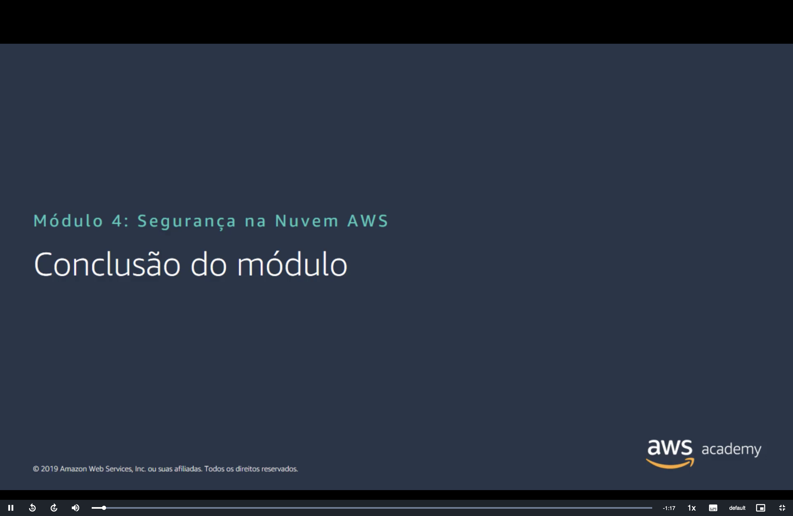
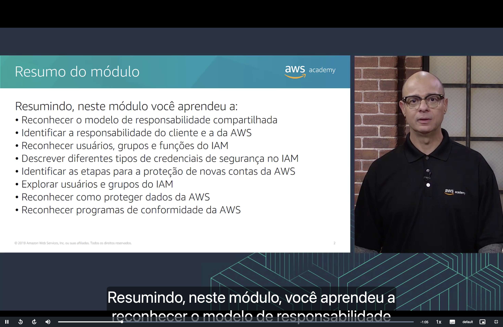
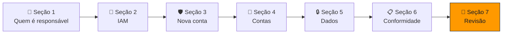
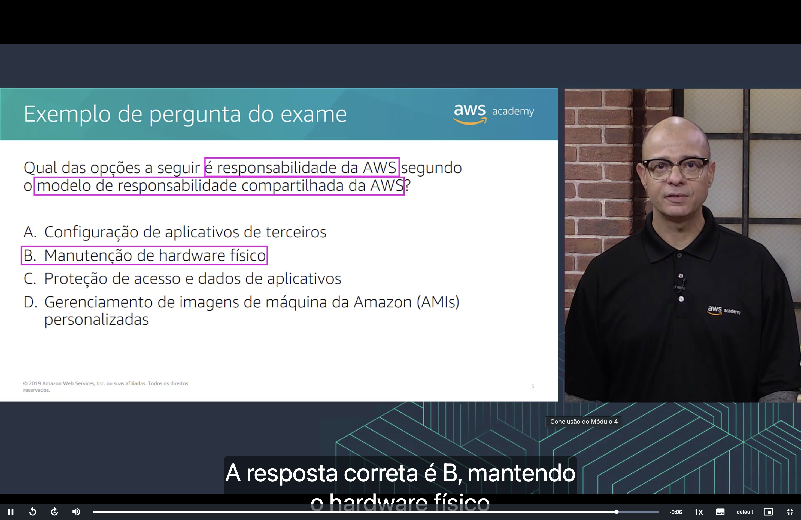

<h1 align="center">🏁 Seção 7 – Conclusão do Módulo 4</h1>

  
  
   
  
  
  

  <a href="../README.md">🏠 Início</a> &nbsp;•&nbsp;
  <a href="./Seção%206%20-%20Trabalhar%20para%20garantir%20a%20conformidade.md">⬅️ Anterior: Conformidade</a>

## 📑 Sumário

| # | Tópico |
|:---:|---|
| 1 | [🗂️ Resumo do módulo](#resumo) |
| 2 | [📝 Exemplo de pergunta do exame](#pergunta) |
| 🎯 | [Principais conclusões](#conclusoes) |

---

## 1. 🗂️ Resumo do módulo

Neste módulo, aprendemos a:

| Verbo | Objetivo | Onde estudar |
|---|---|---|
| 🤝 **Reconhecer** | O **modelo de responsabilidade compartilhada** | [🤝 Seção 1](./Seção%201%20-%20Modelo%20de%20responsabilidade%20compartilhada%20da%20AWS.md) |
| 🔍 **Identificar** | A responsabilidade **do cliente** e a **da AWS** | [🤝 Seção 1](./Seção%201%20-%20Modelo%20de%20responsabilidade%20compartilhada%20da%20AWS.md#aws) |
| 👥 **Reconhecer** | **Usuários**, **grupos** e **funções** do IAM | [🔐 Seção 2](./Seção%202%20-%20AWS%20Identity%20and%20Access%20Management%20(IAM).md#componentes) |
| 🔑 **Descrever** | Diferentes tipos de **credenciais de segurança** no IAM | [🔐 Seção 2](./Seção%202%20-%20AWS%20Identity%20and%20Access%20Management%20(IAM).md#autenticacao) |
| 🛡️ **Identificar** | As etapas para a **proteção de novas contas** da AWS | [🛡️ Seção 3](./Seção%203%20-%20Proteção%20de%20uma%20nova%20conta%20da%20AWS.md) |
| 🧭 **Explorar** | Usuários e grupos do IAM | [🎬 Demonstração IAM](./Seção%20Bônus%20-%20Demonstração%20-%20IAM.md) |
| 🔒 **Reconhecer** | Como **proteger dados** na AWS | [🔒 Seção 5](./Seção%205%20-%20Proteção%20de%20dados%20na%20AWS.md) |
| 📋 **Reconhecer** | Os **programas de conformidade** da AWS | [📋 Seção 6](./Seção%206%20-%20Trabalhar%20para%20garantir%20a%20conformidade.md) |

> [!NOTE]
> O slide de resumo não cita a [Seção 4 – Proteção de contas](./Seção%204%20-%20Proteção%20de%20contas.md) (Organizations, SCPs, KMS, Cognito e Shield), mas ela faz parte do módulo e vale revisar.

## 2. 📝 Exemplo de pergunta do exame

> [!NOTE]
> **Qual das opções a seguir é responsabilidade da AWS segundo o modelo de responsabilidade compartilhada da AWS?**

| | Alternativa |
|:---:|---|
| **A** | Configuração de aplicativos de terceiros |
| **B** | Manutenção de hardware físico |
| **C** | Proteção de acesso e dados de aplicativos |
| **D** | Gerenciamento de imagens de máquina da Amazon (AMIs) personalizadas |

💡 <strong>Clique para ver a resposta</strong>

 

🔑 As palavras-chave da pergunta são **"é responsabilidade da AWS"** e **"modelo de responsabilidade compartilhada da AWS"**.

> [!TIP]
> ✅ **Resposta correta: B.** A **manutenção do hardware físico** faz parte da segurança **DA nuvem**: a AWS cuida dos datacenters, do hardware e da infraestrutura global. O cliente não tem nem acesso físico a esses equipamentos.

Por que as outras estão erradas:

| Alternativa | Por que não é a resposta |
|:---:|---|
| ❌ **A** | A **configuração de aplicativos** (inclusive de terceiros) que o cliente instala é segurança **NA nuvem**, portanto do **cliente**. |
| ❌ **C** | **Dados do cliente** e **controle de acesso** a aplicativos (IAM, senhas, permissões) são responsabilidade do **cliente**. |
| ❌ **D** | As **AMIs personalizadas** são criadas e mantidas pelo **cliente**, incluindo o **sistema operacional** e os patches que elas contêm. |

Isso retoma a [Seção 1](./Seção%201%20-%20Modelo%20de%20responsabilidade%20compartilhada%20da%20AWS.md#aws): tudo o que o cliente **não consegue tocar** (prédio, hardware, rede física, virtualização) é da AWS; tudo o que ele **coloca e configura** na nuvem é dele.

---

## 🎯 Principais conclusões

- ✅ No **modelo de responsabilidade compartilhada**, a AWS cuida da segurança **DA nuvem** e o cliente, da segurança **NA nuvem**; quanto mais gerenciado o serviço (IaaS → PaaS → SaaS), menos o cliente gerencia.
- ✅ O **IAM** controla **quem** acessa **o quê** com **usuários**, **grupos**, **funções** e **políticas**; tudo é negado por padrão e uma **negação explícita** sempre vence.
- ✅ Para proteger uma **nova conta**: pare de usar o **usuário raiz**, habilite a **MFA**, use o **CloudTrail** e habilite um **relatório de faturamento**.
- ✅ **Organizations** e **SCPs** controlam várias contas; **KMS** gerencia chaves; **Cognito** cuida do login em apps; **Shield** protege contra **DDoS**.
- ✅ Os dados devem ser criptografados **em repouso** (KMS) e **em trânsito** (TLS/HTTPS); buckets do S3 são **privados por padrão**.
- ✅ A AWS mantém **programas de conformidade**; o **AWS Config** audita seus recursos e o **AWS Artifact** fornece os relatórios de conformidade da AWS.

---

  <a href="../README.md">🏠 Início</a> &nbsp;•&nbsp;
  <a href="./Seção%206%20-%20Trabalhar%20para%20garantir%20a%20conformidade.md">⬅️ Anterior: Conformidade</a>

