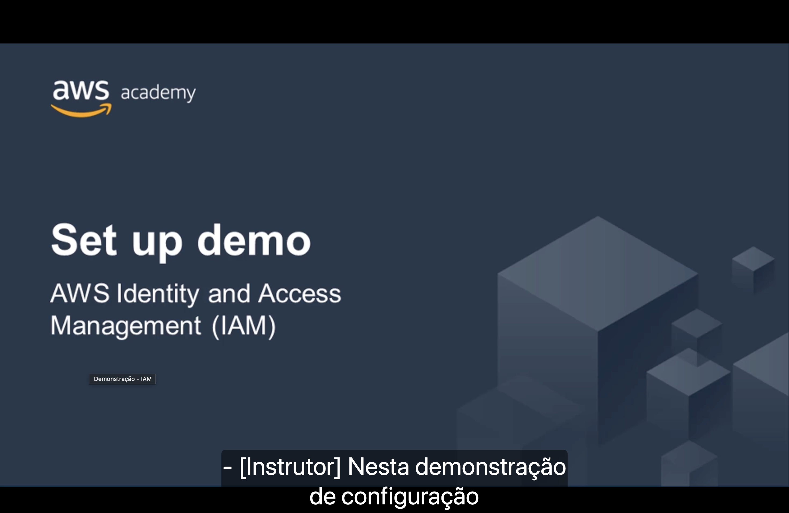
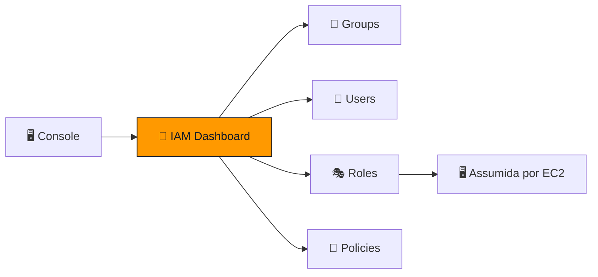
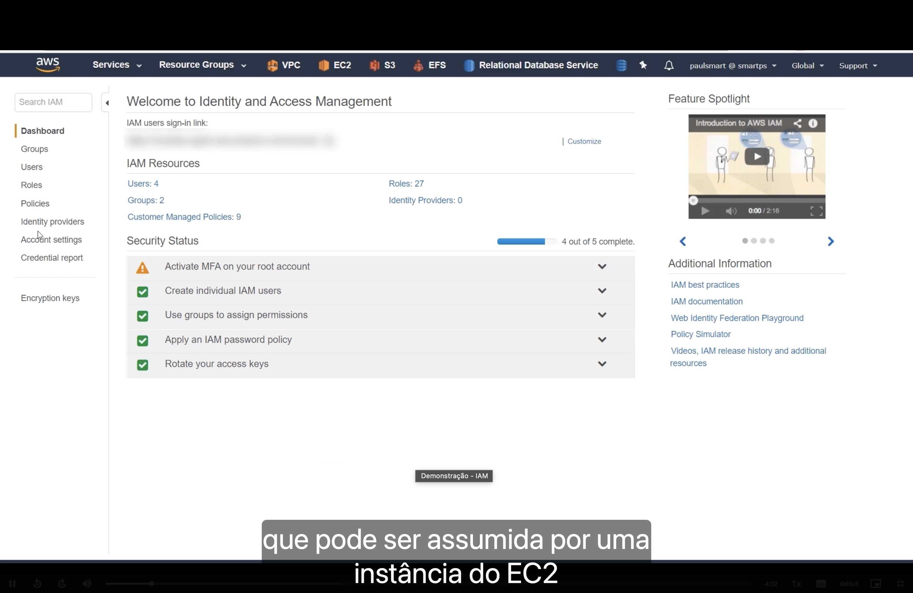

<h1 align="center">🎬 Seção Bônus – Demonstração: IAM</h1>

  
  
   
  
  

  <a href="../README.md">🏠 Início</a> &nbsp;•&nbsp;
  <a href="./Seção%202%20-%20AWS%20Identity%20and%20Access%20Management%20(IAM).md">⬅️ Anterior: AWS IAM</a> &nbsp;•&nbsp;
  <a href="./Seção%203%20-%20Proteção%20de%20uma%20nova%20conta%20da%20AWS.md">Próxima: Proteção de uma nova conta ➡️</a>

> [!NOTE]
> Esta demonstração mostra na prática, dentro do console, os conceitos de **usuários, grupos, políticas e funções** vistos na [Seção 2](./Seção%202%20-%20AWS%20Identity%20and%20Access%20Management%20(IAM).md), incluindo uma **função que pode ser assumida por uma instância do EC2**.

## 📑 Sumário

| # | Tópico |
|:---:|---|
| 1 | [🧭 Navegação do console do IAM](#navegacao) |
| 2 | [📦 Recursos do IAM na conta](#recursos) |
| 3 | [🛡️ Status de segurança](#security-status) |
| 4 | [📚 Informações adicionais](#info) |
| 🎯 | [Principais conclusões](#conclusoes) |

---

## 1. 🧭 Navegação do console do IAM

A demonstração acontece no **painel do IAM** (*Welcome to Identity and Access Management*). Repare que, na barra superior, a região aparece como **Global**: como visto na teoria, o IAM **não pertence a uma região**.

| Menu lateral | Para que serve |
|---|---|
| 📊 **Dashboard** | Visão geral da conta e do status de segurança. |
| 👥 **Groups** | Criar grupos e anexar políticas a eles. |
| 👤 **Users** | Criar usuários e definir o tipo de acesso (programático e/ou console). |
| 🎭 **Roles** | Criar funções que podem ser **assumidas** por usuários, aplicativos ou serviços (ex.: **EC2**). |
| 📄 **Policies** | Ver políticas gerenciadas pela AWS e criar políticas próprias (JSON). |
| 🌐 **Identity providers** | Integrar provedores externos de identidade (federação). |
| ⚙️ **Account settings** | Configurações da conta, como a **política de senha**. |
| 📋 **Credential report** | Relatório com o estado das credenciais de todos os usuários. |
| 🔑 **Encryption keys** | Atalho para as chaves de criptografia. |

No topo do painel também fica o **IAM users sign-in link**: a URL que os usuários do IAM usam para entrar no console. Ela pode ser personalizada em **Customize** (trocando o ID da conta por um alias).

## 2. 📦 Recursos do IAM na conta

A seção **IAM Resources** resume o que já existe na conta da demonstração:

| Recurso | Quantidade |
|---|---:|
| 👤 **Users** | 4 |
| 👥 **Groups** | 2 |
| 📄 **Customer Managed Policies** | 9 |
| 🎭 **Roles** | 27 |
| 🌐 **Identity Providers** | 0 |

> [!TIP]
> **Customer Managed Policies** são políticas criadas **pelo cliente**. Elas se diferenciam das **AWS managed policies**, que já vêm prontas e são mantidas pela AWS.

## 3. 🛡️ Status de segurança

O painel mostra uma checklist de **boas práticas** (*Security Status*). Na demonstração, **4 de 5** estão concluídas:

| Status | Item | Relação com a teoria |
|:---:|---|---|
| ⚠️ | **Activate MFA on your root account** | Ativar a **MFA** no usuário raiz. |
| ✅ | **Create individual IAM users** | Cada pessoa usa o **próprio usuário**, nunca o raiz. |
| ✅ | **Use groups to assign permissions** | Conceder permissões por **grupos**, não usuário a usuário. |
| ✅ | **Apply an IAM password policy** | Exigir senhas fortes (tamanho, complexidade, expiração). |
| ✅ | **Rotate your access keys** | Trocar periodicamente as **chaves de acesso** programático. |

> [!WARNING]
> O único item pendente é justamente a **MFA no usuário raiz**, a conta com acesso total. Esse costuma ser o primeiro item a resolver em uma conta nova.

## 4. 📚 Informações adicionais

À direita do painel há o **Feature Spotlight** (vídeo *Introduction to AWS IAM*) e links úteis:

- 📘 **IAM best practices**
- 📗 **IAM documentation**
- 🧪 **Web Identity Federation Playground**
- 🔍 **Policy Simulator**: testa se uma política permite ou nega uma ação **antes** de aplicá-la.
- 🎞️ **Videos, IAM release history and additional resources**

---

## 🎯 Principais conclusões

- ✅ O console do IAM é **global** (sem região) e organiza tudo em **Groups**, **Users**, **Roles** e **Policies**.
- ✅ O **IAM users sign-in link** é o endereço de login dos usuários do IAM e pode receber um **alias**.
- ✅ **IAM Resources** mostra quantos usuários, grupos, funções e políticas existem na conta.
- ✅ O **Security Status** é uma checklist de boas práticas: **MFA no raiz**, **usuários individuais**, **grupos**, **política de senha** e **rotação de chaves**.
- ✅ Funções (**Roles**) permitem que serviços como o **EC2** recebam permissões sem guardar credenciais.

---

  <a href="../README.md">🏠 Início</a> &nbsp;•&nbsp;
  <a href="./Seção%202%20-%20AWS%20Identity%20and%20Access%20Management%20(IAM).md">⬅️ Anterior: AWS IAM</a> &nbsp;•&nbsp;
  <a href="./Seção%203%20-%20Proteção%20de%20uma%20nova%20conta%20da%20AWS.md">Próxima: Proteção de uma nova conta ➡️</a>

