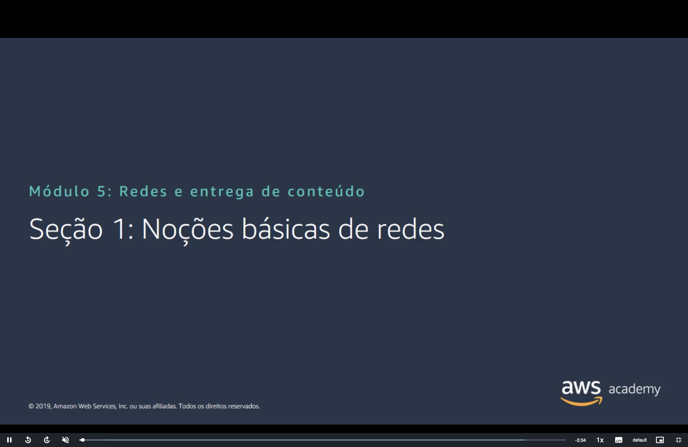
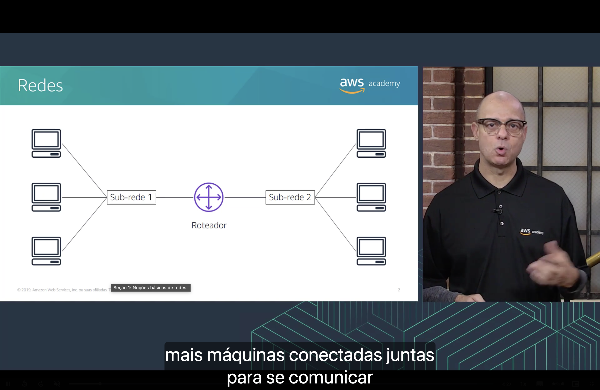
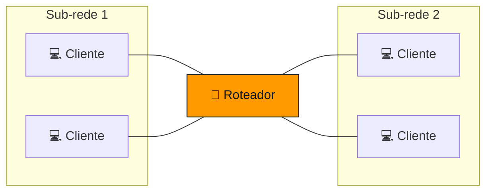
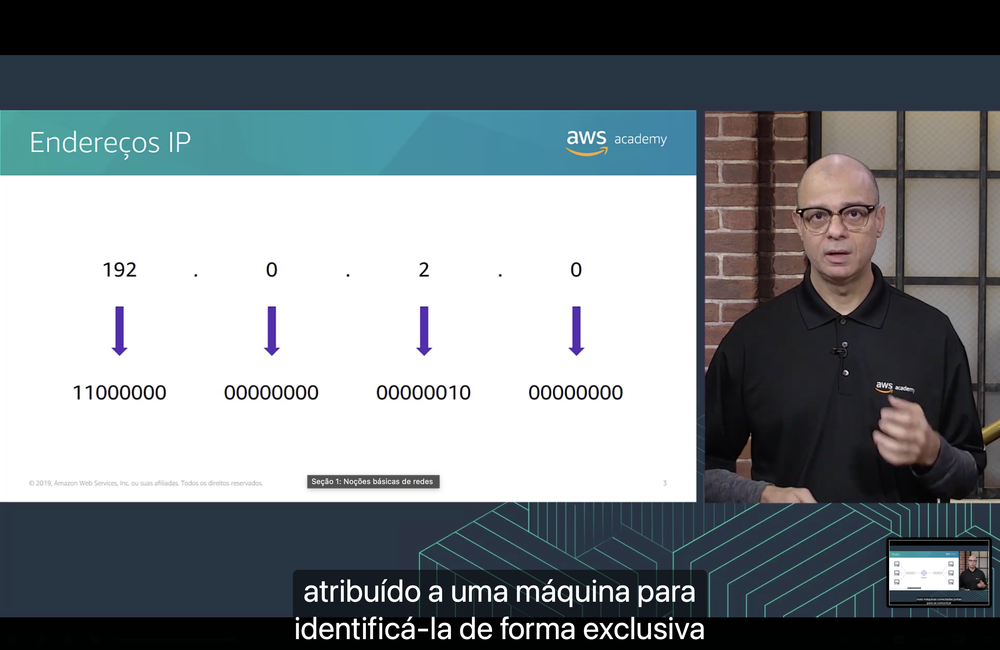
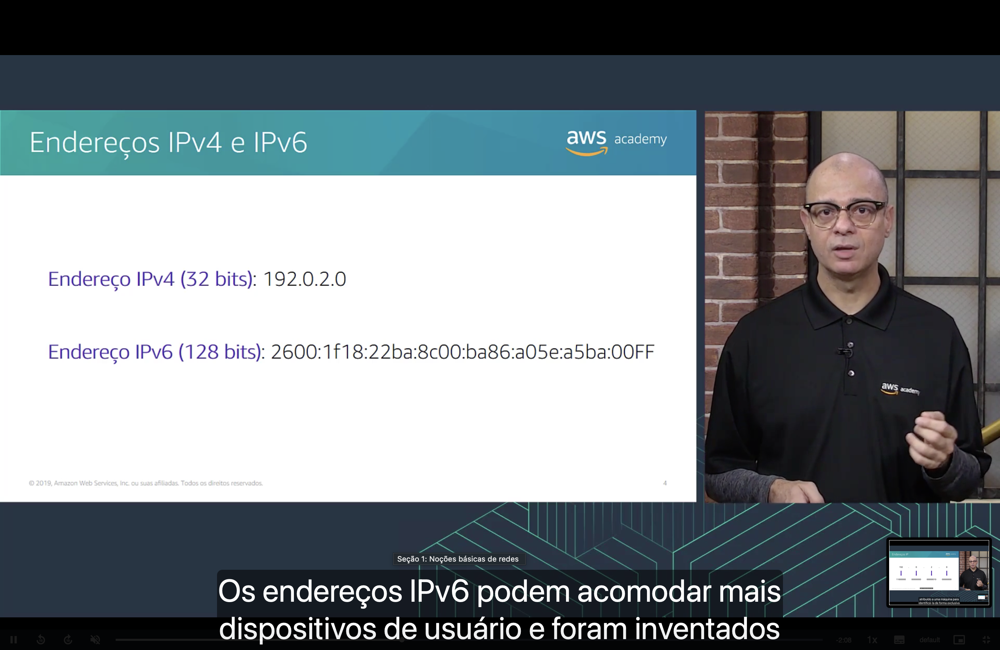
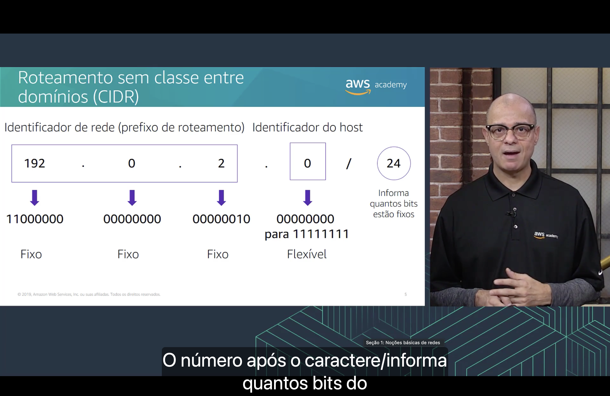
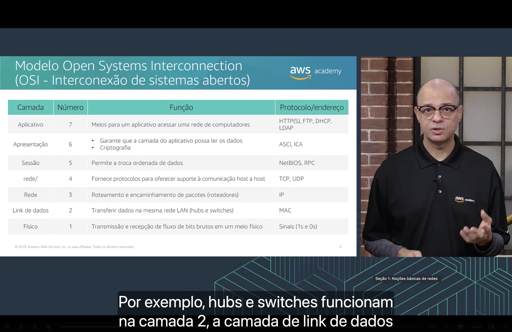

<h1 align="center">🌐 Seção 1 – Noções básicas de redes</h1>

<p align="center">
  
  
  <br>
  
  
  
</p>

<p align="center">
  <a href="../README.md">🏠 Início</a> &nbsp;•&nbsp;
  <a href="./Seção%202%20-%20Amazon%20VPC.md">Próxima: Amazon VPC ➡️</a>
</p>



> [!NOTE]
> Antes de falar de redes **na nuvem**, esta seção revisa os conceitos de redes **tradicionais** que a Amazon VPC reaproveita: sub-redes, endereços IP, notação CIDR e o modelo OSI.

## 📑 Sumário

| # | Tópico |
|:---:|---|
| 1 | [🖧 Redes](#redes) |
| 2 | [🔢 Endereços IP](#ip) |
| 3 | [🆚 Endereços IPv4 e IPv6](#ipv4-ipv6) |
| 4 | [✂️ Roteamento sem classe entre domínios (CIDR)](#cidr) |
| 5 | [🧱 Modelo OSI](#osi) |
| 🎯 | [Principais conclusões](#conclusoes) |

---

<a id="redes"></a>
## 1. 🖧 Redes



Uma **rede de computadores** é formada por **duas ou mais máquinas cliente conectadas** para **compartilhar recursos**.

- ✂️ Uma rede pode ser **particionada logicamente** em **sub-redes** (*subnets*).
- 🔀 Toda rede precisa de um **dispositivo de rede**, como um **roteador** ou um **switch**, para conectar os clientes e permitir a comunicação entre eles.



> [!TIP]
> Na AWS, essa mesma ideia reaparece na **Amazon VPC**: a VPC é a rede, as **sub-redes** a dividem e um **roteador virtual** (configurado pelas **tabelas de rotas**) conecta tudo. Ver [Seção 2](./Seção%202%20-%20Amazon%20VPC.md).

<a id="ip"></a>
## 2. 🔢 Endereços IP



Cada máquina cliente de uma rede tem um **endereço IP exclusivo** que a identifica.

- 👀 Para pessoas, o endereço IP é um **rótulo numérico em formato decimal** (ex.: `192.0.2.0`).
- 🤖 As máquinas **convertem** esse número para o formato **binário**.

| | 1º octeto | 2º octeto | 3º octeto | 4º octeto |
|---|:---:|:---:|:---:|:---:|
| **Decimal** | `192` | `0` | `2` | `0` |
| **Binário** | `11000000` | `00000000` | `00000010` | `00000000` |

Cada um dos 4 números é um **octeto** (8 bits), o que dá **32 bits** no total. Por isso cada octeto vai de `0` a `255`.

> [!NOTE]
> A faixa `192.0.2.0/24` é reservada para **documentação e exemplos** (RFC 5737). É por isso que ela aparece tanto nos slides: nunca é roteada na internet real.

<a id="ipv4-ipv6"></a>
## 3. 🆚 Endereços IPv4 e IPv6



| | **IPv4** | **IPv6** |
|---|---|---|
| **Tamanho** | **32 bits** | **128 bits** |
| **Exemplo** | `192.0.2.0` | `2600:1f18:22ba:8c00:ba86:a05e:a5ba:00ff` |
| **Formato** | 4 números **decimais** (octetos) separados por **pontos** | 8 grupos de 4 dígitos **hexadecimais** (16 bits cada) separados por **dois-pontos** |
| **Total de endereços** | ~4,3 bilhões (2³²) | ~3,4 × 10³⁸ (2¹²⁸) |

> [!TIP]
> O IPv6 existe porque os ~4,3 bilhões de endereços IPv4 **não bastam** para todos os dispositivos conectados. A Amazon VPC suporta **os dois**.

<a id="cidr"></a>
## 4. ✂️ Roteamento sem classe entre domínios (CIDR)



O **CIDR** (*Classless Inter-Domain Routing*) é a notação usada para **expressar um intervalo de endereços IP**. Exemplo: `192.0.2.0/24`.

```text
  192    .    0     .    2     .    0
11000000 . 00000000 . 00000010 . 00000000
└────── 24 bits fixos ───────┘   └8 bits┘
    identificador de rede          host
   (prefixo de roteamento)       (livres)
```

| Parte | Significado |
|---|---|
| `192.0.2.0` | **Identificador de rede**: o endereço de início do intervalo. |
| `/24` | **Informa quantos bits estão fixos**, da esquerda para a direita. |
| Bits restantes | **Identificador do host**: bits **flexíveis**, que vão de `00000000` para `11111111`. |

Com `/24`, os 3 primeiros octetos são **fixos** e sobram **8 bits flexíveis**: 2⁸ = **256 endereços**, de `192.0.2.0` a `192.0.2.255`.

> 🧮 **Fórmula:** quantidade de endereços = **2^(32 − prefixo)**.

| CIDR | Bits livres | Total de endereços | Observação |
|---|:---:|---:|---|
| `192.0.2.0/32` | 0 | 1 | **Caso especial "fixo"**: um **único** endereço IP. |
| `10.0.0.0/28` | 4 | 16 | Menor bloco permitido em uma VPC. |
| `192.0.2.0/24` | 8 | 256 | Tamanho comum de sub-rede. |
| `10.0.0.0/16` | 16 | 65.536 | Maior bloco permitido em uma VPC. |
| `0.0.0.0/0` | 32 | ~4,3 bilhões | **Caso especial "flexível"**: **todos** os endereços IP. |

> [!IMPORTANT]
> Memorize o `0.0.0.0/0`: nas tabelas de rotas e nas regras de firewall da AWS ele significa **"qualquer endereço"**, ou seja, **a internet**.

<a id="osi"></a>
## 5. 🧱 Modelo OSI



O modelo **OSI** (*Open Systems Interconnection*, ou Interconexão de sistemas abertos) é um modelo conceitual que explica **como os dados trafegam** em uma rede, dividido em **7 camadas**.

| Número | Camada | Função | Protocolo / endereço |
|:---:|---|---|---|
| 7 | 📱 **Aplicativo** | Meios para um aplicativo acessar uma rede de computadores. | HTTP(S), FTP, DHCP, LDAP |
| 6 | 🎨 **Apresentação** | Garante que a camada do aplicativo possa ler os dados; **criptografia**. | ASCII, ICA |
| 5 | 🗣️ **Sessão** | Permite a troca **ordenada** de dados. | NetBIOS, RPC |
| 4 | 🚚 **Transporte** | Fornece protocolos para oferecer suporte à comunicação **host a host**. | TCP, UDP |
| 3 | 🧭 **Rede** | **Roteamento** e encaminhamento de pacotes (**roteadores**). | IP |
| 2 | 🔗 **Link de dados** | Transferir dados na **mesma rede LAN** (**hubs e switches**). | MAC |
| 1 | ⚡ **Físico** | Transmissão e recepção de **fluxo de bits brutos** em um meio físico. | Sinais (1s e 0s) |

> [!NOTE]
> No slide, a camada 4 aparece como "rede/", um erro de tradução: o nome correto é **Transporte** (*Transport*). A camada 2 também é chamada de **enlace de dados**.

> [!TIP]
> Por que isso importa na AWS? Vários serviços trabalham em camadas específicas: **grupos de segurança** e **ACLs de rede** filtram por **IP (camada 3)** e por **porta TCP/UDP (camada 4)**; um **Network Load Balancer** atua na **camada 4** e um **Application Load Balancer**, na **camada 7** (HTTP/HTTPS).

---

<a id="conclusoes"></a>
## 🎯 Principais conclusões

- ✅ Uma **rede** conecta duas ou mais máquinas para compartilhar recursos e pode ser dividida em **sub-redes**; roteadores e switches fazem a conexão.
- ✅ Todo cliente tem um **endereço IP exclusivo**, escrito em decimal para pessoas e tratado em binário pelas máquinas.
- ✅ **IPv4** tem **32 bits** (4 octetos decimais); **IPv6** tem **128 bits** (8 grupos hexadecimais).
- ✅ Na notação **CIDR**, o número após a barra indica quantos bits são **fixos**; o total de endereços é **2^(32 − prefixo)**.
- ✅ `/32` = **um único IP**; `0.0.0.0/0` = **todos os IPs** (a internet).
- ✅ O **modelo OSI** tem **7 camadas**: Aplicativo, Apresentação, Sessão, Transporte, Rede, Link de dados e Físico.

---

<p align="center">
  <a href="../README.md">🏠 Início</a> &nbsp;•&nbsp;
  <a href="./Seção%202%20-%20Amazon%20VPC.md">Próxima: Amazon VPC ➡️</a>
</p>
