<h1 align="center">☁️ Seção 2 – Amazon VPC</h1>

  
  
   
  
  
  

  <a href="../README.md">🏠 Início</a> &nbsp;•&nbsp;
  <a href="./Seção%201%20-%20Noções%20básicas%20de%20redes.md">⬅️ Anterior: Noções básicas de redes</a> &nbsp;•&nbsp;
  <a href="./Seção%203%20-%20Redes%20VPC.md">Próxima: Redes VPC ➡️</a>

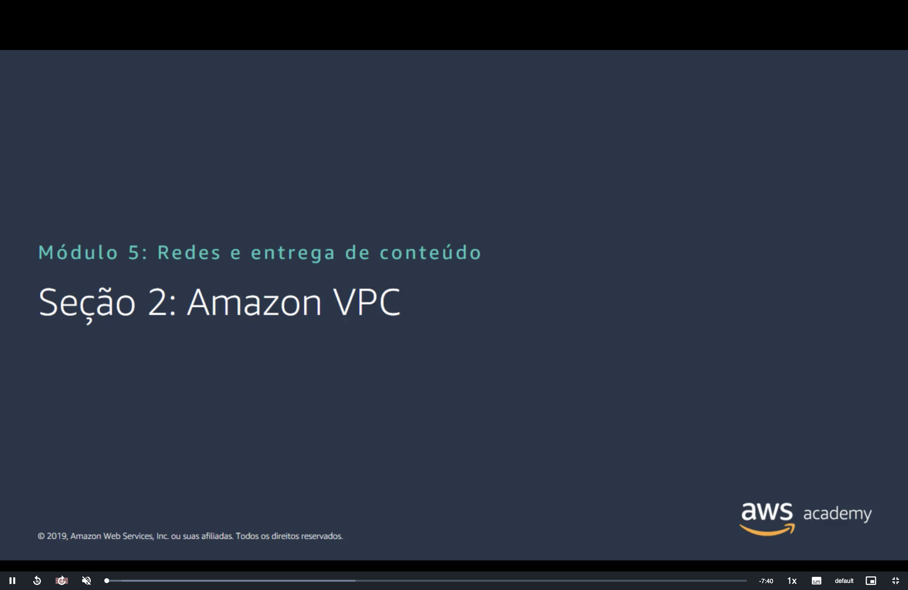

## 📑 Sumário

| # | Tópico |
|:---:|---|
| 1 | [☁️ O que é a Amazon VPC](#vpc) |
| 2 | [🧩 VPCs e sub-redes](#vpc-subredes) |
| 3 | [🔢 Endereçamento IP](#enderecamento) |
| 4 | [🚫 Endereços IP reservados](#reservados) |
| 5 | [🌍 Tipos de endereço IP público](#ip-publico) |
| 6 | [🔌 Interface de rede elástica (ENI)](#eni) |
| 7 | [🗺️ Tabelas de rotas e rotas](#tabelas-rotas) |
| 🎯 | [Principais conclusões](#conclusoes) |

---

## 1. ☁️ O que é a Amazon VPC

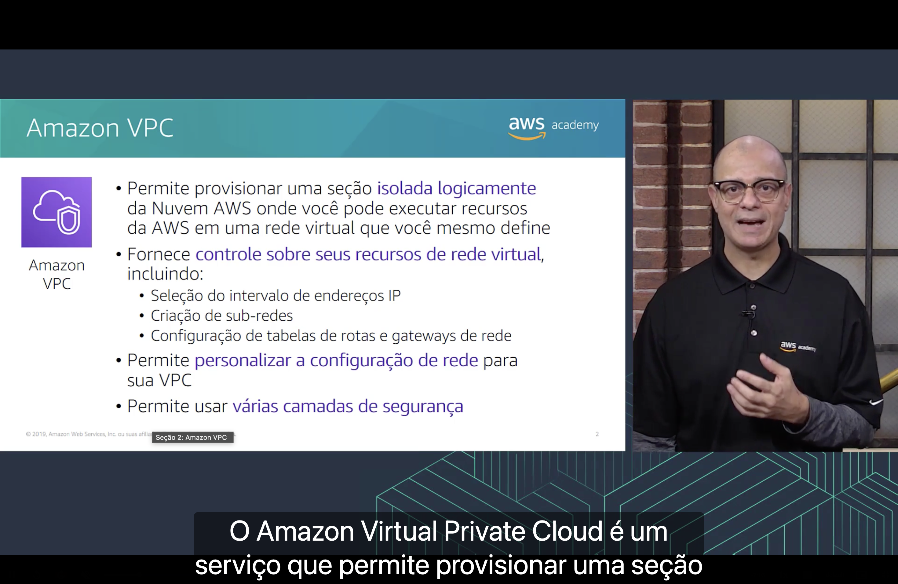

A **Amazon Virtual Private Cloud (Amazon VPC)** permite **provisionar uma seção logicamente isolada da Nuvem AWS**, onde você executa recursos da AWS em uma **rede virtual que você mesmo define**.

Ela dá **controle sobre os recursos de rede virtual**, incluindo:

- 🔢 a seleção do **intervalo de endereços IP**;
- ✂️ a criação de **sub-redes**;
- 🗺️ a configuração de **tabelas de rotas** e **gateways de rede**.

Ela também permite:

- ⚙️ **personalizar** a configuração de rede da VPC;
- 🛡️ usar **várias camadas de segurança** (grupos de segurança e ACLs de rede, vistos na [Seção 4](./Seção%204%20-%20Segurança%20da%20VPC.md)).

> [!TIP]
> Pense na VPC como o seu **datacenter particular dentro da AWS**: a AWS cuida do hardware e da infraestrutura física, e **você desenha a rede**.

## 2. 🧩 VPCs e sub-redes

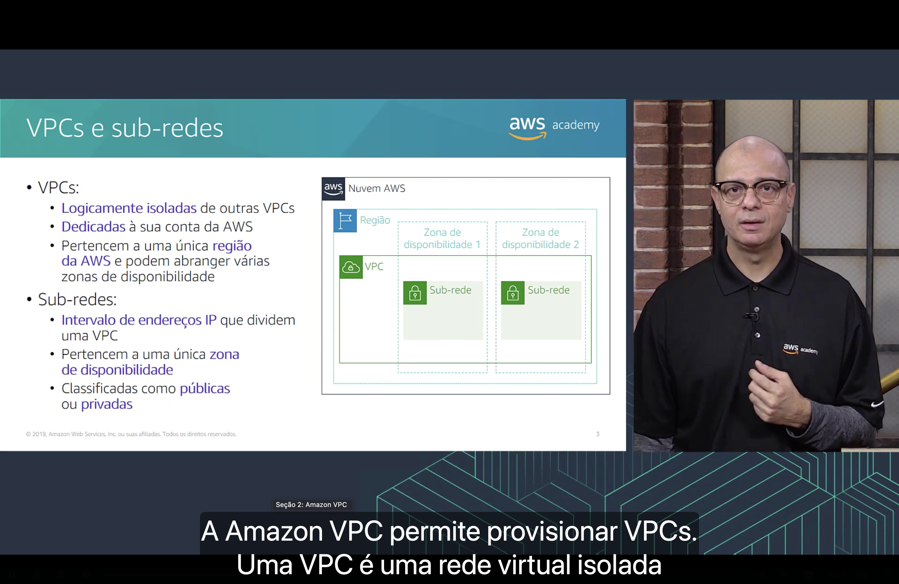

| | ☁️ **VPC** | ✂️ **Sub-rede** |
|---|---|---|
| **O que é** | Rede **logicamente isolada** de outras VPCs. | Um **intervalo de endereços IP** que **divide** uma VPC. |
| **Escopo** | Pertence a **uma única Região** e pode abranger **várias Zonas de Disponibilidade**. | Pertence a **uma única Zona de Disponibilidade**. |
| **Dono** | **Dedicada** à sua conta da AWS. | Faz parte da VPC. |
| **Classificação** | — | **Pública** ou **privada**. |

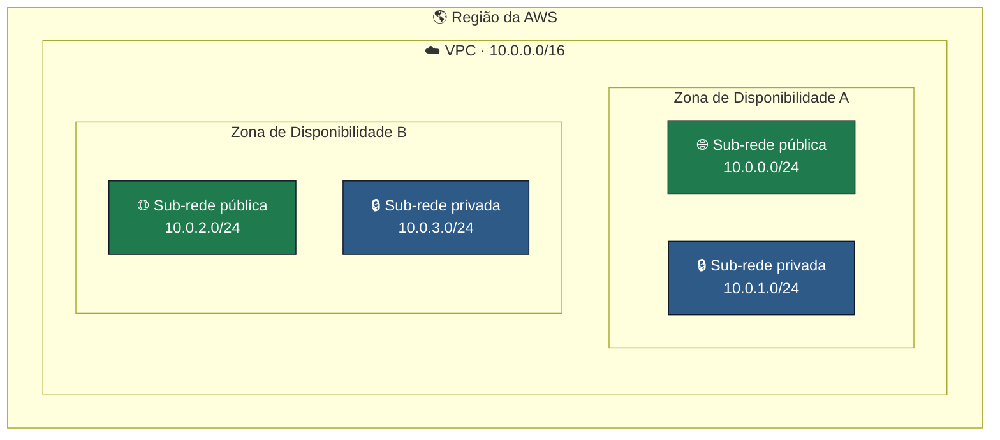

> [!NOTE]
> O que torna uma sub-rede **pública** ou **privada** não é um "tipo" escolhido na criação, e sim a **tabela de rotas**: a sub-rede é pública quando tem uma rota para um **gateway da internet**. Ver [Seção 3](./Seção%203%20-%20Redes%20VPC.md#igw).

## 3. 🔢 Endereçamento IP

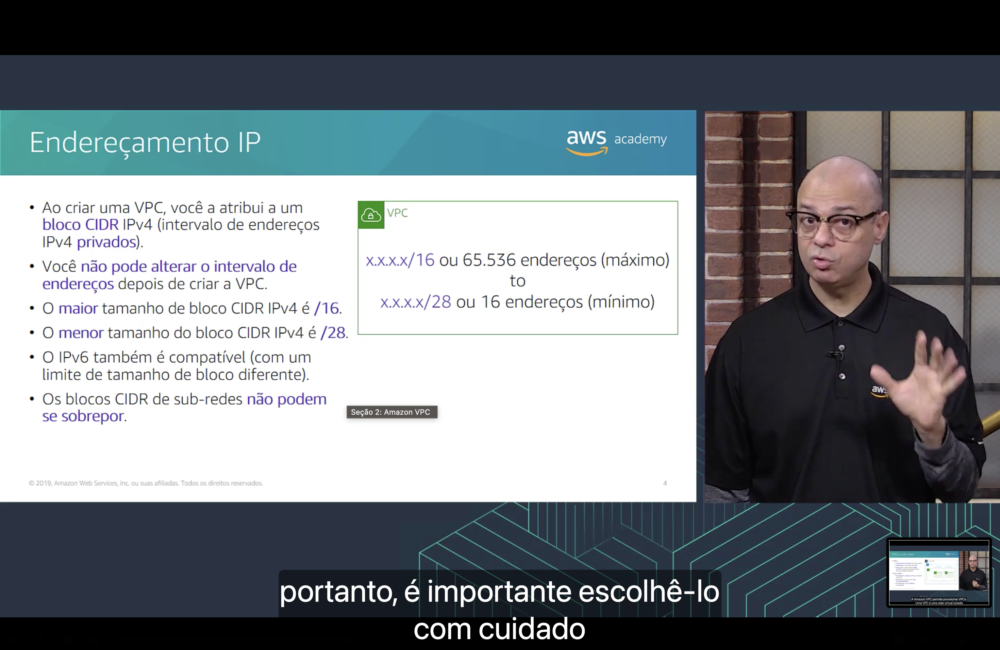

- 🏷️ Ao criar uma VPC, você atribui a ela um **bloco CIDR IPv4** (um intervalo de endereços IPv4 **privados**).
- 🔒 **Não é possível alterar** o intervalo de endereços depois que a VPC é criada, por isso é importante escolhê-lo com cuidado.
- 📏 O **maior** bloco CIDR IPv4 é **/16** (65.536 endereços) e o **menor** é **/28** (16 endereços).
- 🆕 O **IPv6** também é suportado, com limites de tamanho de bloco diferentes.
- ⚠️ Os blocos CIDR das **sub-redes não podem se sobrepor**.

| Tamanho do bloco da VPC | Endereços | |
|---|---:|---|
| `x.x.x.x/16` | 65.536 | ⬆️ **Máximo** |
| `x.x.x.x/28` | 16 | ⬇️ **Mínimo** |

> [!TIP]
> Use as faixas **privadas** da RFC 1918 para a VPC: `10.0.0.0/8`, `172.16.0.0/12` ou `192.168.0.0/16`. Evite blocos que **coincidam** com a rede do seu escritório ou de outras VPCs: isso impede, mais tarde, VPN e emparelhamento de VPC.

> [!NOTE]
> Hoje a AWS permite **adicionar blocos CIDR secundários** a uma VPC, mas o bloco **principal** continua sem poder ser alterado. Por isso vale planejar o tamanho da rede desde o início.

## 4. 🚫 Endereços IP reservados

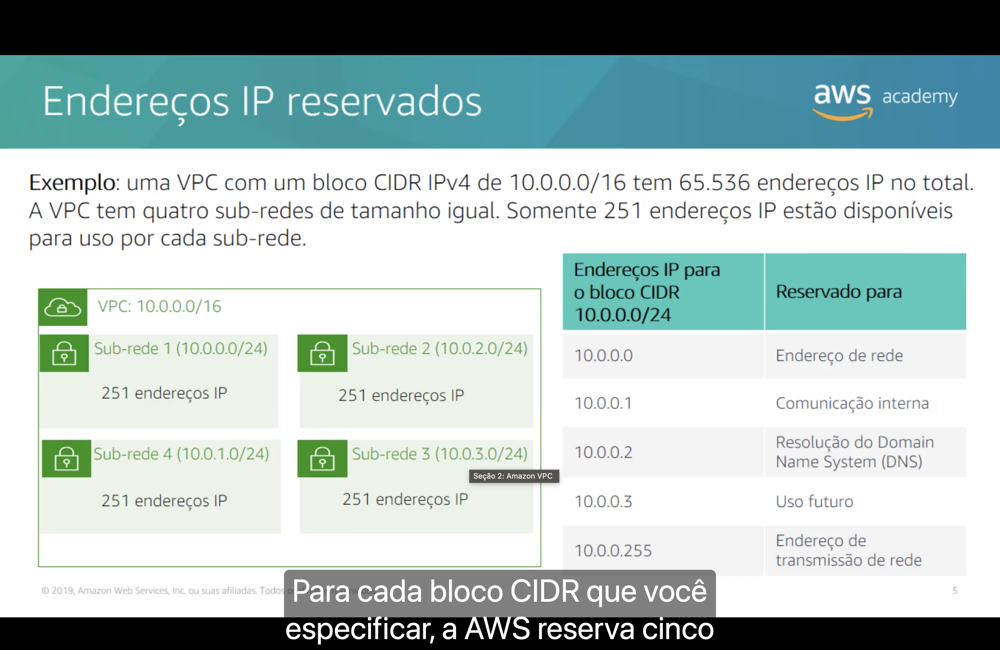

**Exemplo:** uma VPC com o bloco IPv4 `10.0.0.0/16` tem **65.536** endereços IP no total. Ela tem **quatro sub-redes de tamanho igual** (`/24`, 256 endereços cada), e **somente 251 endereços IP** estão disponíveis para uso em cada uma.

| Sub-rede | Bloco CIDR | IPs disponíveis |
|---|---|---:|
| ✂️ Sub-rede 1 | `10.0.0.0/24` | 251 |
| ✂️ Sub-rede 2 | `10.0.2.0/24` | 251 |
| ✂️ Sub-rede 3 | `10.0.3.0/24` | 251 |
| ✂️ Sub-rede 4 | `10.0.1.0/24` | 251 |

Em **cada sub-rede**, a AWS **reserva 5 endereços**. Para a sub-rede `10.0.0.0/24`:

| Endereço | Reservado para |
|---|---|
| `10.0.0.0` | 🏷️ **Endereço de rede** |
| `10.0.0.1` | 🔀 **Comunicação interna** (roteador da VPC) |
| `10.0.0.2` | 🔎 **Resolução do Domain Name System (DNS)** |
| `10.0.0.3` | 🔮 **Uso futuro** |
| `10.0.0.255` | 📢 **Endereço de transmissão de rede** (broadcast) |

Sobram **256 − 5 = 251 endereços utilizáveis** em cada sub-rede `/24`.

> [!IMPORTANT]
> Essa conta cai em prova: uma sub-rede **/28** tem 16 endereços, mas só **11 utilizáveis** (16 − 5).

## 5. 🌍 Tipos de endereço IP público

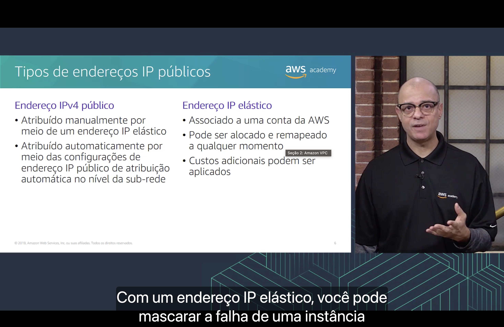

| Tipo | Como funciona |
|---|---|
| 🌐 **Endereço IPv4 público** | Atribuído **manualmente** por meio de um **IP elástico**, ou **automaticamente** pela configuração de **atribuição automática de IP público no nível da sub-rede**. |
| 📌 **Endereço IP elástico** | **Associado à conta** da AWS (e não à instância); pode ser **alocado e remapeado a qualquer momento**; **custos adicionais** podem ser aplicados. |

> [!NOTE]
> O IP público atribuído **automaticamente** muda quando a instância é **interrompida e iniciada**. O **IP elástico** é **estático**: com ele você pode **mascarar a falha de uma instância**, remapeando rapidamente o endereço para outra instância da conta.

> [!WARNING]
> Desde fevereiro de 2024, a AWS cobra por hora por **todo endereço IPv4 público**, inclusive IPs elásticos **alocados e não usados**. Libere os IPs elásticos que não estiver utilizando.

## 6. 🔌 Interface de rede elástica (ENI)

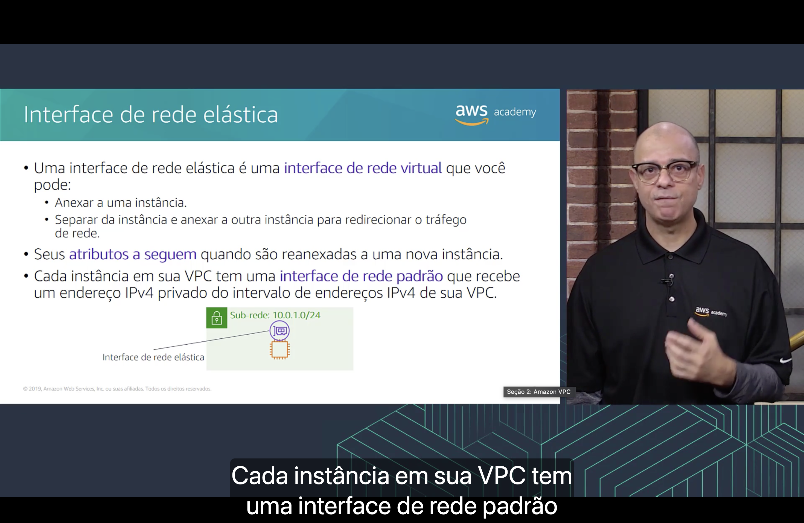

- 🔌 Uma **interface de rede elástica** é uma **interface de rede virtual** que você pode:
  - **anexar** a uma instância;
  - **separar** da instância e **anexar a outra** instância para **redirecionar o tráfego** de rede.
- 🧳 Os **atributos** da interface **a seguem** quando ela é reanexada a uma nova instância (IP privado, IP elástico, endereço MAC, grupos de segurança).
- 🖥️ Toda instância da VPC tem uma **interface de rede padrão** (a **interface de rede primária**), que recebe um **IPv4 privado** do intervalo da VPC.

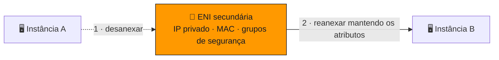

> [!TIP]
> Mover uma ENI de uma instância com problema para uma instância saudável é uma forma simples de **failover**: o tráfego continua chegando no **mesmo IP**.

## 7. 🗺️ Tabelas de rotas e rotas

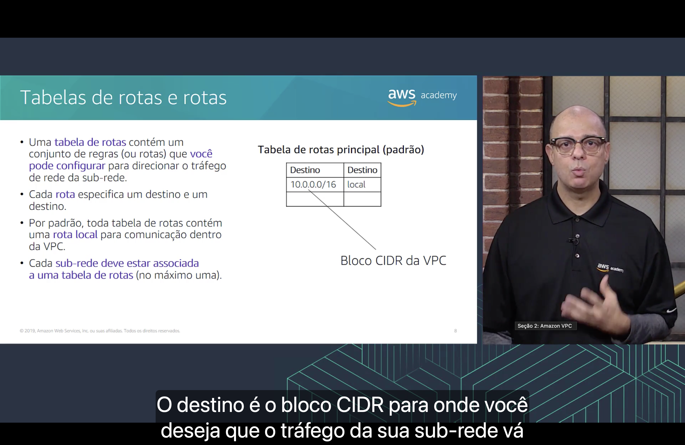

- 🗺️ Uma **tabela de rotas** contém um conjunto de **regras (rotas)** que **você pode configurar** para direcionar o tráfego de rede da sub-rede.
- 🎯 Cada rota especifica um **destino** (o bloco CIDR para onde o tráfego vai) e um **alvo** (por onde ele sai).
- 🏠 Por padrão, toda tabela de rotas contém uma **rota local** para a comunicação **dentro da VPC**.
- 🔗 Cada sub-rede deve estar associada a **uma tabela de rotas** (no máximo uma). Uma mesma tabela pode atender **várias sub-redes**.

**Tabela de rotas principal (padrão):**

| Destino | Alvo |
|---|---|
| `10.0.0.0/16` (bloco CIDR da VPC) | `local` |

> [!NOTE]
> No slide, as duas colunas aparecem como "Destino" por causa da tradução. A segunda é o **alvo** (*target*), nome usado no console da AWS em português.

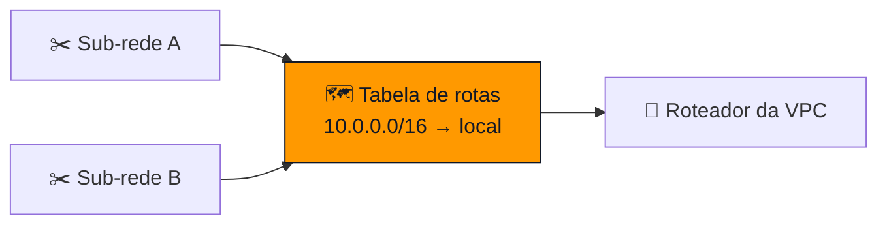

> [!IMPORTANT]
> A **rota local não pode ser excluída**. É ela que garante que todas as sub-redes da mesma VPC conversem entre si. Para falar com qualquer coisa **fora** da VPC, você **adiciona rotas** (gateway da internet, gateway NAT, emparelhamento etc.).

> [!NOTE]
> Sub-redes sem associação explícita usam a **tabela de rotas principal** da VPC.

---

## 🎯 Principais conclusões

- ✅ Uma **VPC** é uma seção **logicamente isolada** da Nuvem AWS.
- ✅ Uma VPC pertence a **uma Região** e exige um **bloco CIDR** (de **/16** a **/28**), que não pode ser alterado depois.
- ✅ Uma VPC é dividida em **sub-redes**; cada sub-rede pertence a **uma Zona de Disponibilidade** e também exige um bloco CIDR, sem sobreposição.
- ✅ A AWS **reserva 5 IPs** em cada sub-rede (um /24 tem **251** utilizáveis).
- ✅ IPs públicos podem ser **automáticos** (mudam ao parar/iniciar) ou **elásticos** (estáticos, ligados à conta).
- ✅ Uma **ENI** pode ser movida entre instâncias e leva junto seus atributos.
- ✅ **Tabelas de rotas** controlam o tráfego de uma sub-rede; elas têm uma **rota local embutida**, que **não pode ser excluída**, e você adiciona as demais rotas.

---

  <a href="../README.md">🏠 Início</a> &nbsp;•&nbsp;
  <a href="./Seção%201%20-%20Noções%20básicas%20de%20redes.md">⬅️ Anterior: Noções básicas de redes</a> &nbsp;•&nbsp;
  <a href="./Seção%203%20-%20Redes%20VPC.md">Próxima: Redes VPC ➡️</a>

