<h1 align="center">🔀 Seção 3 – Redes VPC</h1>

  
  
   
  
  
  

  <a href="../README.md">🏠 Início</a> &nbsp;•&nbsp;
  <a href="./Seção%202%20-%20Amazon%20VPC.md">⬅️ Anterior: Amazon VPC</a> &nbsp;•&nbsp;
  <a href="./Seção%20Bônus%20-%20Demonstração%20-%20Amazon%20VPC.md">Próxima: Demonstração Amazon VPC ➡️</a>

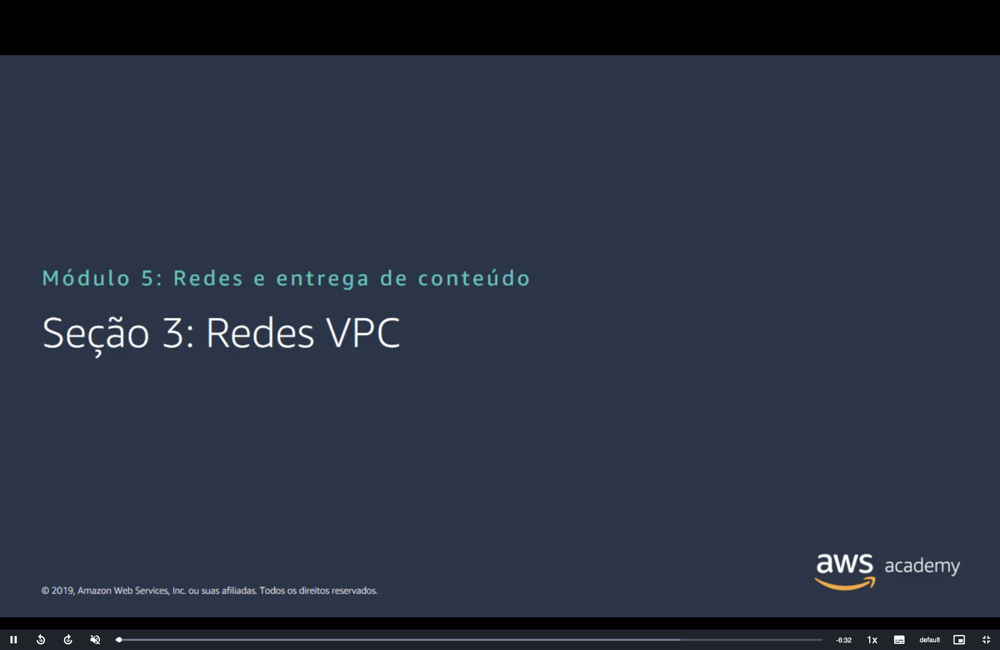

> [!NOTE]
> A [Seção 2](./Seção%202%20-%20Amazon%20VPC.md) mostrou a VPC **isolada**, só com a rota `local`. Esta seção mostra as opções para **conectar** a VPC à internet, a outras VPCs, ao datacenter local e aos serviços da AWS.

## 📑 Sumário

| # | Tópico |
|:---:|---|
| 1 | [🚪 Gateway da internet](#igw) |
| 2 | [🔁 Gateway NAT](#nat) |
| 3 | [🤝 Compartilhamento de VPC](#compartilhamento) |
| 4 | [🔗 Emparelhamento de VPC (VPC peering)](#peering) |
| 5 | [🔐 AWS Site-to-Site VPN](#vpn) |
| 6 | [🛤️ AWS Direct Connect](#direct-connect) |
| 7 | [🎯 Endpoints da VPC](#endpoints) |
| 8 | [🕸️ AWS Transit Gateway](#transit-gateway) |
| 9 | [🏷️ Atividade: rotule o diagrama de rede](#atividade) |
| 🎯 | [Principais conclusões](#conclusoes) |

---

## 1. 🚪 Gateway da internet

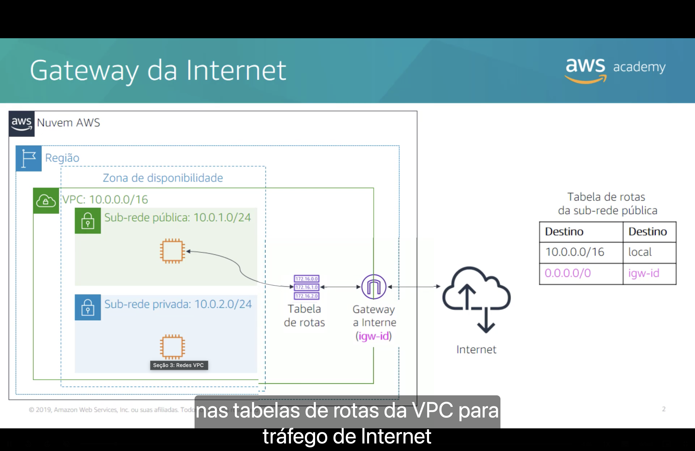

Um **gateway da internet** (*internet gateway*) é um componente da VPC **escalável, redundante e altamente disponível** que permite a comunicação entre as instâncias da VPC e a **internet**.

Ele tem **duas finalidades**:

1. 🎯 Fornecer um **alvo** nas tabelas de rotas para o tráfego roteável pela internet.
2. 🔄 Executar a **conversão de endereços de rede (NAT)** para as instâncias que receberam **IPv4 público**.

**Tabela de rotas da sub-rede pública:**

| Destino | Alvo |
|---|---|
| `10.0.0.0/16` | `local` |
| `0.0.0.0/0` | `igw-id` |

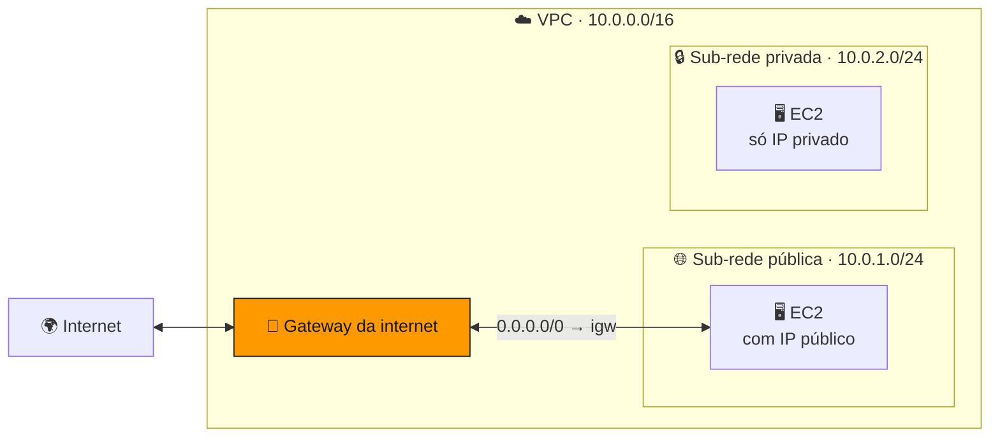

> [!IMPORTANT]
> Para uma instância ser acessível pela internet, **quatro coisas** precisam estar certas:
> 1. um **gateway da internet anexado** à VPC;
> 2. uma rota **`0.0.0.0/0 → igw`** na tabela de rotas da sub-rede (é isso que a torna **pública**);
> 3. um **IP público** ou **IP elástico** na instância;
> 4. **grupo de segurança** e **ACL de rede** permitindo o tráfego (ver [Seção 4](./Seção%204%20-%20Segurança%20da%20VPC.md)).

## 2. 🔁 Gateway NAT

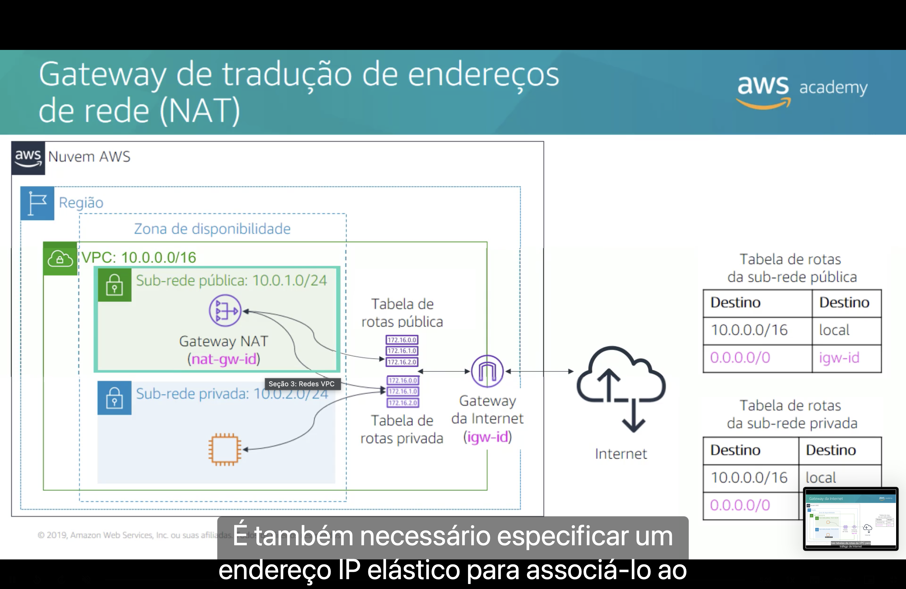

Um **gateway de tradução de endereços de rede (NAT)** (*network address translation gateway*) permite que instâncias de uma **sub-rede privada** se conectem à **internet** ou a outros serviços da AWS, mas **impede que a internet inicie uma conexão** com essas instâncias.

- 📍 O gateway NAT é criado em uma **sub-rede pública**, e é necessário especificar um **IP elástico** para associá-lo a ele.
- 🗺️ A tabela de rotas da **sub-rede privada** aponta o tráfego de internet para o gateway NAT.

| Tabela de rotas da sub-rede **pública** | | Tabela de rotas da sub-rede **privada** | |
|---|---|---|---|
| **Destino** | **Alvo** | **Destino** | **Alvo** |
| `10.0.0.0/16` | `local` | `10.0.0.0/16` | `local` |
| `0.0.0.0/0` | `igw-id` | `0.0.0.0/0` | `nat-gw-id` |

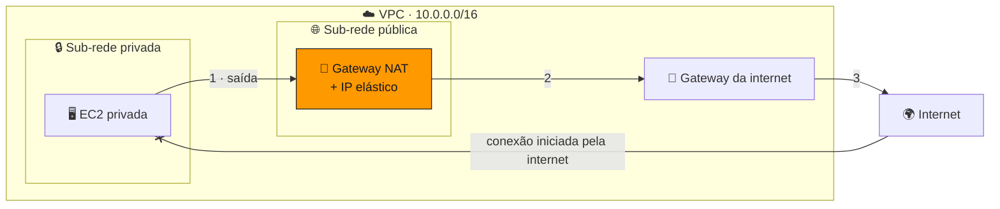

> [!TIP]
> Caso típico: um **servidor de banco de dados** em sub-rede privada que precisa baixar **patches e atualizações**, mas que nunca deve ser acessível diretamente da internet.

> [!NOTE]
> Também existe a **instância NAT** (uma instância EC2 configurada para fazer NAT), mas a AWS recomenda o **gateway NAT**: ele é um **serviço gerenciado**, escala sozinho e é altamente disponível dentro da Zona de Disponibilidade.

## 3. 🤝 Compartilhamento de VPC

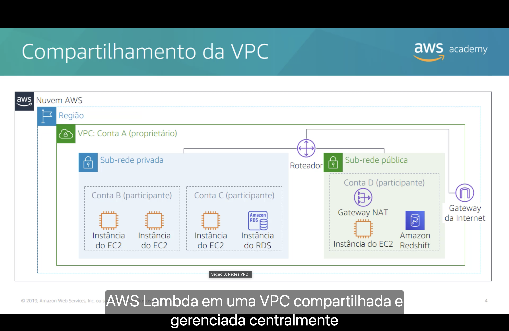

O **compartilhamento de VPC** (*VPC sharing*) permite que você **compartilhe sub-redes** com outras contas da AWS **da mesma organização** no **AWS Organizations**.

- 👑 A conta **proprietária** da VPC compartilha uma ou mais sub-redes.
- 👥 As contas **participantes** podem **criar, gerenciar e excluir os próprios recursos** (instâncias do EC2, bancos do Amazon RDS, clusters do Amazon Redshift, funções do AWS Lambda) nas sub-redes compartilhadas.
- 🚫 Os participantes **não podem ver, modificar ou excluir** recursos que pertencem a outros participantes ou ao proprietário da VPC.

| Benefício | O que significa |
|---|---|
| 🧑‍⚖️ **Separação de funções** | Estrutura da VPC, roteamento e alocação de endereços IP ficam **centralizados**. |
| 👤 **Propriedade** | Os donos dos aplicativos continuam donos dos **seus recursos, contas e grupos de segurança**. |
| 🔗 **Grupos de segurança** | Os participantes podem **referenciar os IDs de grupos de segurança** uns dos outros. |
| ⚡ **Eficiência** | Maior **densidade** nas sub-redes e uso eficiente de **VPNs** e do **AWS Direct Connect**. |
| 🧱 **Limites** | **Limites rígidos** podem ser evitados graças a uma arquitetura de rede simplificada. |
| 💰 **Custos** | Custos otimizados pelo **reuso** de gateways NAT, endpoints de interface da VPC e tráfego dentro da mesma Zona de Disponibilidade. |

No exemplo do slide, a **Conta A** é dona da VPC e as demais contas criam recursos nas sub-redes compartilhadas:

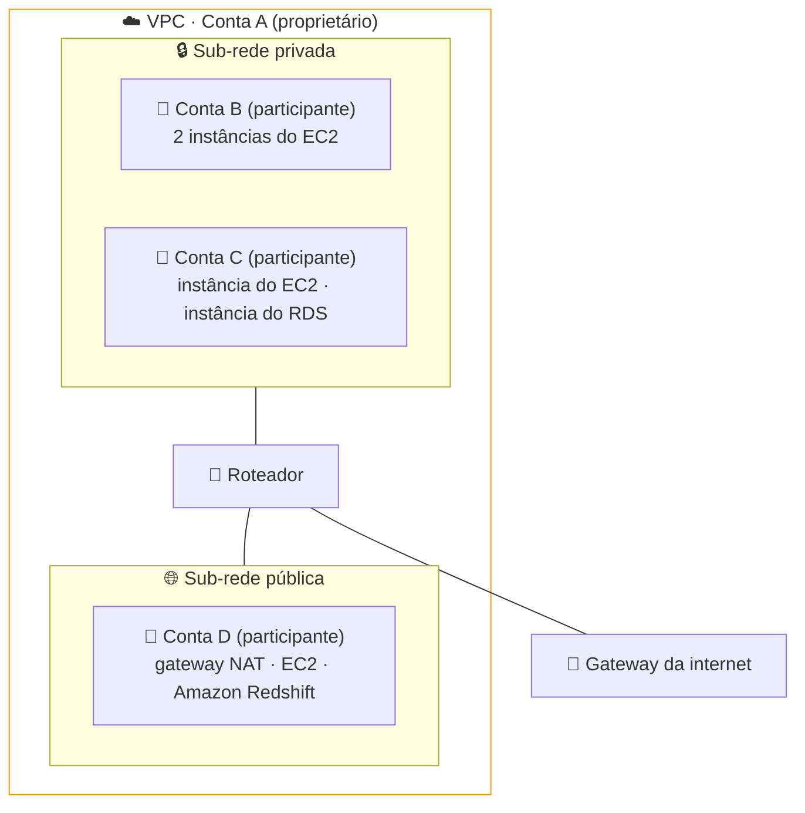

## 4. 🔗 Emparelhamento de VPC (VPC peering)

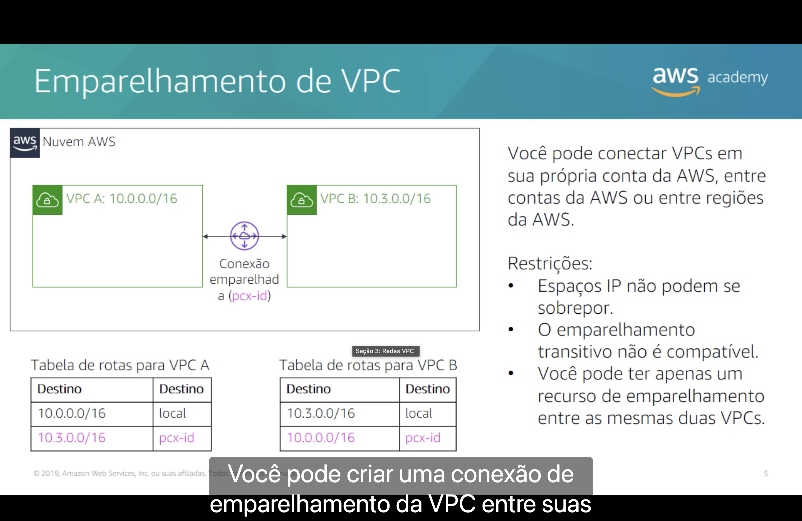

Uma **conexão de emparelhamento de VPC** liga **duas VPCs** e permite rotear o tráfego entre elas usando **endereços IP privados**. Você pode conectar VPCs:

- 🏠 na **sua própria conta** da AWS;
- 🤝 **entre contas** da AWS;
- 🌎 **entre Regiões** da AWS.

**Restrições:**

- ❌ Os espaços de endereços IP **não podem se sobrepor**.
- ❌ **Não há emparelhamento transitivo**.
- ❌ Só pode existir **um** recurso de emparelhamento entre as **mesmas duas VPCs**.

| Tabela de rotas da **VPC A** (`10.0.0.0/16`) | | Tabela de rotas da **VPC B** (`10.3.0.0/16`) | |
|---|---|---|---|
| **Destino** | **Alvo** | **Destino** | **Alvo** |
| `10.0.0.0/16` | `local` | `10.3.0.0/16` | `local` |
| `10.3.0.0/16` | `pcx-id` | `10.0.0.0/16` | `pcx-id` |

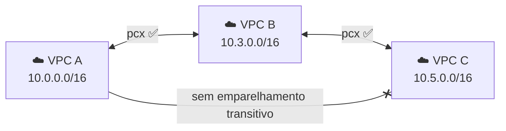

> [!WARNING]
> "Não transitivo" significa que, se **A↔B** e **B↔C** estão emparelhadas, **A não fala com C** passando por B. Para isso é preciso uma conexão **A↔C** própria, ou um [Transit Gateway](#transit-gateway).

## 5. 🔐 AWS Site-to-Site VPN

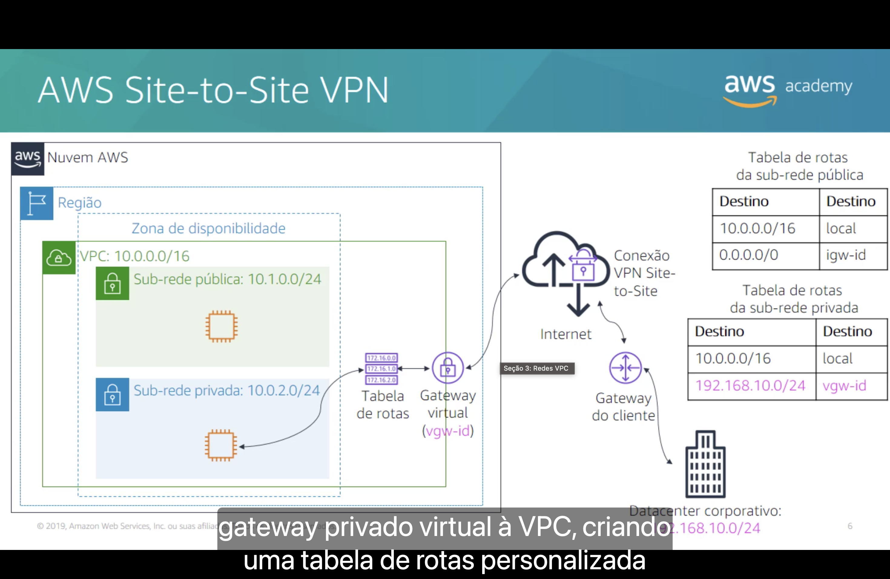

Por padrão, as instâncias executadas em uma VPC **não conseguem se comunicar com uma rede remota** (como o datacenter da empresa). Para conectar a VPC à rede remota, ou seja, **criar uma conexão VPN**:

1. 🔐 Crie um novo **gateway privado virtual** (*virtual private gateway*) e **anexe-o** à VPC.
2. 📟 Defina a configuração do dispositivo VPN, o **gateway do cliente** (*customer gateway*).
3. 🗺️ Crie uma **tabela de rotas personalizada** que direcione o tráfego destinado ao datacenter corporativo para o gateway VPN.
4. 🛡️ **Atualize as regras** dos grupos de segurança.

| Tabela de rotas da sub-rede **pública** | | Tabela de rotas da sub-rede **privada** | |
|---|---|---|---|
| **Destino** | **Alvo** | **Destino** | **Alvo** |
| `10.0.0.0/16` | `local` | `10.0.0.0/16` | `local` |
| `0.0.0.0/0` | `igw-id` | `192.168.10.0/24` (datacenter corporativo) | `vgw-id` |

> [!NOTE]
> No slide, a sub-rede pública aparece como `10.1.0.0/24`, o que não cabe na VPC `10.0.0.0/16`. Nos outros slides da seção ela é `10.0.1.0/24`, então é provável que seja um erro de digitação.

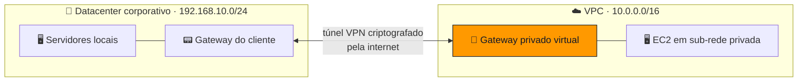

## 6. 🛤️ AWS Direct Connect

O desempenho pode ser **prejudicado** quando o datacenter fica **longe** da Região da AWS. Para esses casos, a AWS oferece o **AWS Direct Connect (DX)**.

- 🛤️ O DX estabelece uma **conexão de rede dedicada e privada** entre a sua rede e um dos **locais do DX**.
- 🏷️ Usa **VLANs 802.1q** de padrão aberto.

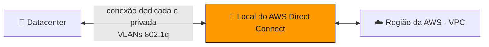

| | 🔐 **Site-to-Site VPN** | 🛤️ **Direct Connect** |
|---|---|---|
| **Meio** | **Internet pública**, com túnel criptografado (IPsec) | **Conexão física dedicada e privada** |
| **Tempo para ativar** | Minutos | Semanas (envolve provedor e cabeamento) |
| **Desempenho** | Varia conforme a internet | **Consistente**, com baixa latência |
| **Criptografia** | Nativa | Não por padrão (pode ser combinado com VPN) |

> [!TIP]
> Na prova: "**conexão privada e dedicada**", "**não passar pela internet**" ou "**desempenho de rede consistente**" apontam para o **Direct Connect**. "**Rápido de configurar**" e "**criptografado pela internet**" apontam para a **Site-to-Site VPN**.

## 7. 🎯 Endpoints da VPC

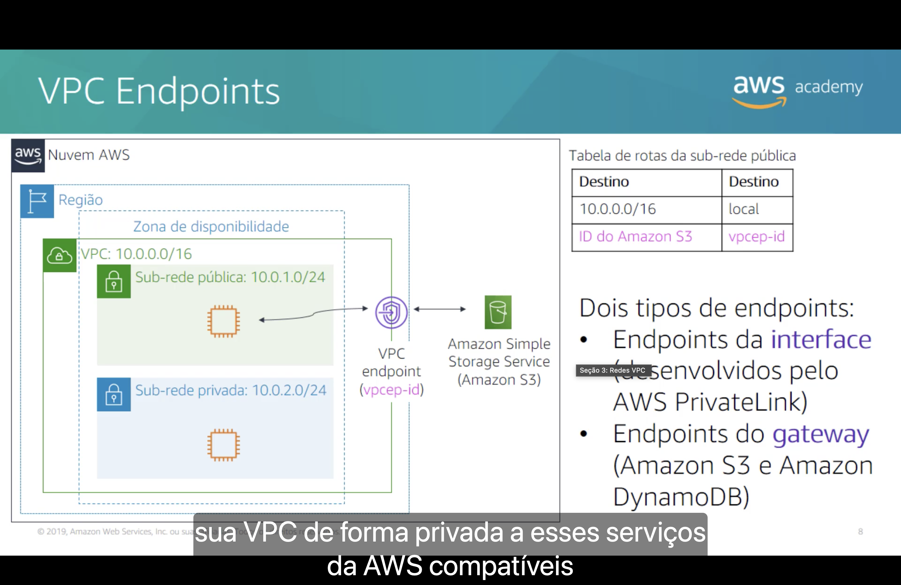

Um **endpoint da VPC** é um dispositivo virtual que permite **conectar de forma privada** a VPC a serviços da AWS compatíveis e a serviços de endpoint da VPC com a tecnologia **AWS PrivateLink**.

- 🚫 A conexão **não exige** gateway da internet, dispositivo NAT, conexão VPN nem AWS Direct Connect.
- 🔒 As instâncias da VPC **não precisam de IP público** para se comunicar com o serviço.

| Tipo | Como funciona | Serviços |
|---|---|---|
| 🔌 **Endpoints da interface** | Desenvolvidos pelo **AWS PrivateLink**: criam uma **ENI com IP privado** na sub-rede. | A maioria dos serviços da AWS |
| 🚪 **Endpoints do gateway** | Viram um **alvo na tabela de rotas**. | **Amazon S3** e **Amazon DynamoDB** |

**Tabela de rotas da sub-rede pública com endpoint de gateway para o S3:**

| Destino | Alvo |
|---|---|
| `10.0.0.0/16` | `local` |
| ID do Amazon S3 | `vpcep-id` |

> [!NOTE]
> O slide usa `vpcep-id` como exemplo. No console, os IDs de endpoint começam com `vpce-`, e o "ID do Amazon S3" aparece como uma **lista de prefixos** (`pl-...`).

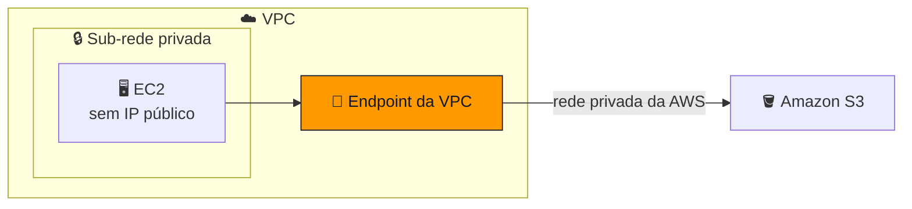

> [!TIP]
> **Endpoints de gateway** (S3 e DynamoDB) **não têm custo adicional**. Além de mais seguros, evitam pagar processamento de dados de um gateway NAT só para acessar o S3.

## 8. 🕸️ AWS Transit Gateway

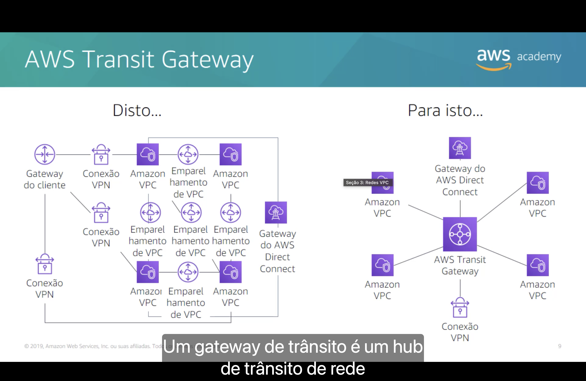

Conectar muitas VPCs com emparelhamento vira uma **malha completa**: cada par precisa da própria conexão, e o número de conexões cresce rápido (4 VPCs = 6 conexões; 10 VPCs = 45). Somando conexões VPN e o Direct Connect de cada VPC, a rede fica difícil de gerenciar.

Um **gateway de trânsito** é um **hub de trânsito de rede**: o **AWS Transit Gateway** substitui a malha por um **hub central** (modelo **hub-and-spoke**) que conecta **VPCs** e **redes locais** (via conexão VPN e gateway do AWS Direct Connect).

**Disto... (malha de emparelhamentos)**

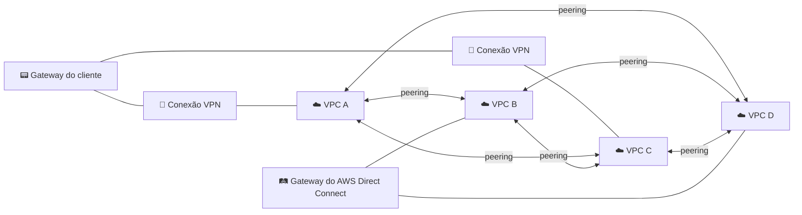

**Para isto... (hub-and-spoke com o Transit Gateway)**

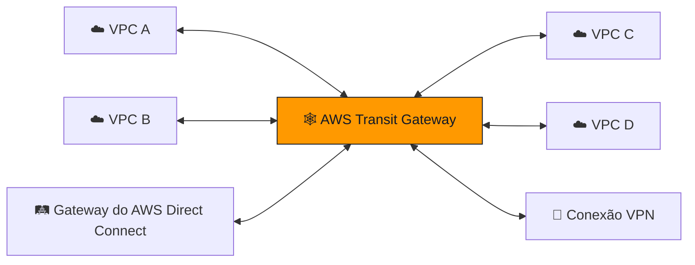

## 9. 🏷️ Atividade: rotule o diagrama de rede

Identifique os componentes numerados no diagrama abaixo e responda: **quais rotas existem nas tabelas de rotas de ⑤ e de ⑦?**

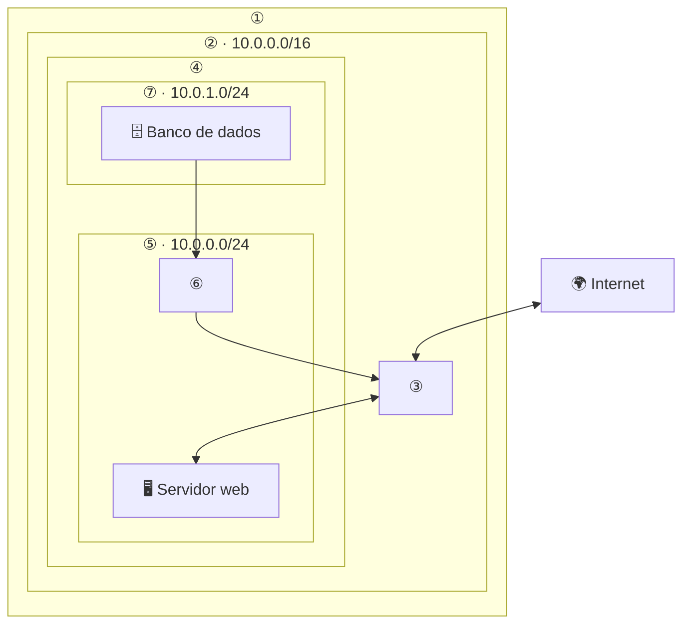

💡 <strong>Clique para ver a resposta</strong>

 

| Nº | Componente |
|:---:|---|
| ① | 🌎 **Região** da AWS |
| ② | ☁️ **VPC** (`10.0.0.0/16`) |
| ③ | 🚪 **Gateway da internet** |
| ④ | 🏢 **Zona de Disponibilidade** |
| ⑤ | 🌐 **Sub-rede pública** (`10.0.0.0/24`) |
| ⑥ | 🔁 **Gateway NAT** |
| ⑦ | 🔒 **Sub-rede privada** (`10.0.1.0/24`) |

**Tabela de rotas de ⑤ (pública):**

| Destino | Alvo |
|---|---|
| `10.0.0.0/16` | `local` |
| `0.0.0.0/0` | `igw-id` |

**Tabela de rotas de ⑦ (privada):**

| Destino | Alvo |
|---|---|
| `10.0.0.0/16` | `local` |
| `0.0.0.0/0` | `nat-gw-id` |

---

## 🎯 Principais conclusões

Existem várias opções de rede para a VPC. Resumo de **quando usar cada uma**:

| Preciso... | Use |
|---|---|
| dar acesso à internet a uma **sub-rede pública** | 🚪 **Gateway da internet** |
| deixar instâncias **privadas** acessarem a internet (só saída) | 🔁 **Gateway NAT** |
| compartilhar **sub-redes** entre contas da mesma organização | 🤝 **Compartilhamento de VPC** |
| conectar **duas VPCs** com IPs privados | 🔗 **Emparelhamento de VPC** |
| ligar o datacenter à VPC **pela internet, com criptografia** | 🔐 **AWS Site-to-Site VPN** |
| ligar o datacenter à AWS por uma **conexão dedicada e privada** | 🛤️ **AWS Direct Connect** |
| acessar S3, DynamoDB e outros serviços **sem sair da rede da AWS** | 🎯 **Endpoint da VPC** |
| conectar **muitas VPCs e redes locais** por um hub central | 🕸️ **AWS Transit Gateway** |

- ✅ Uma sub-rede é **pública** quando sua tabela de rotas tem `0.0.0.0/0 → igw`.
- ✅ O emparelhamento de VPC **não é transitivo** e exige blocos CIDR **sem sobreposição**.
- ✅ Você pode usar o **assistente da VPC** para implementar o seu projeto (ver a [Demonstração](./Seção%20Bônus%20-%20Demonstração%20-%20Amazon%20VPC.md)).

---

  <a href="../README.md">🏠 Início</a> &nbsp;•&nbsp;
  <a href="./Seção%202%20-%20Amazon%20VPC.md">⬅️ Anterior: Amazon VPC</a> &nbsp;•&nbsp;
  <a href="./Seção%20Bônus%20-%20Demonstração%20-%20Amazon%20VPC.md">Próxima: Demonstração Amazon VPC ➡️</a>

