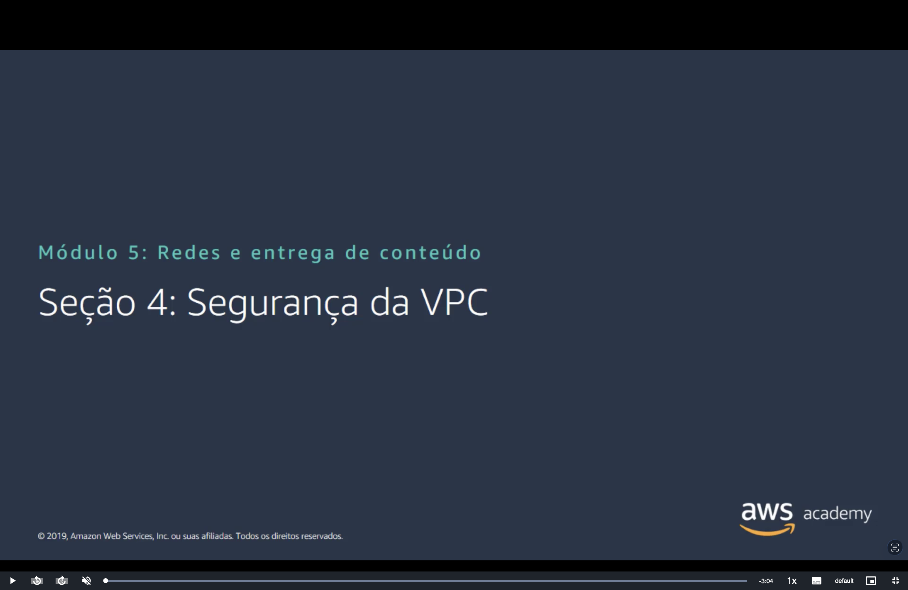
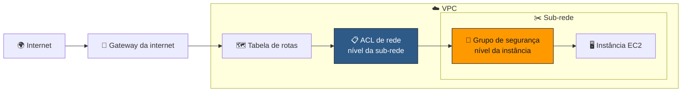
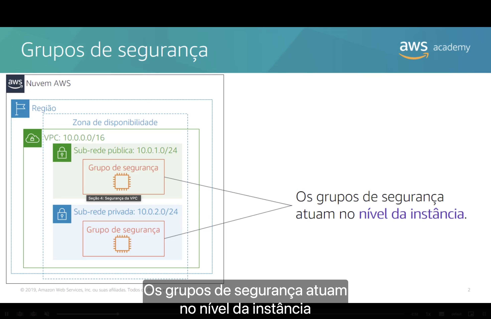
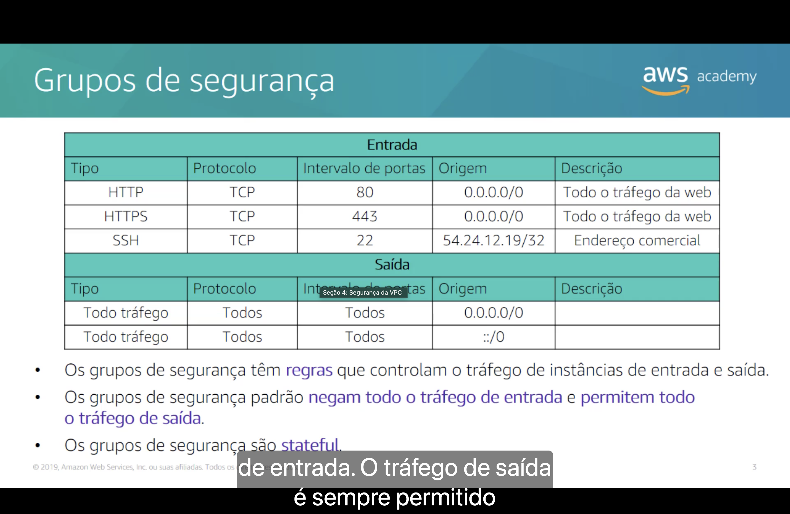
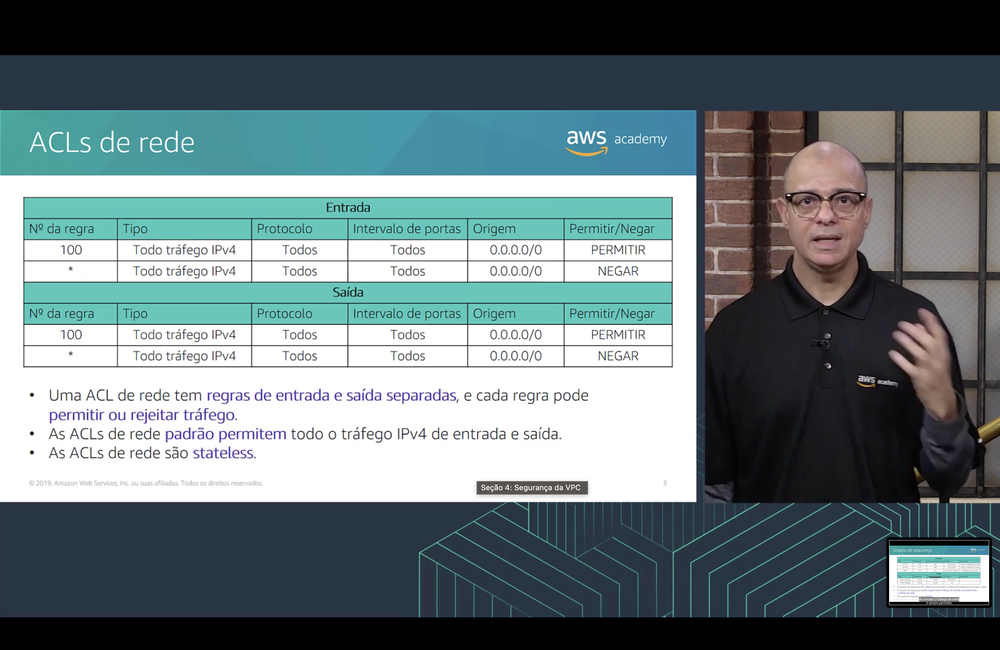
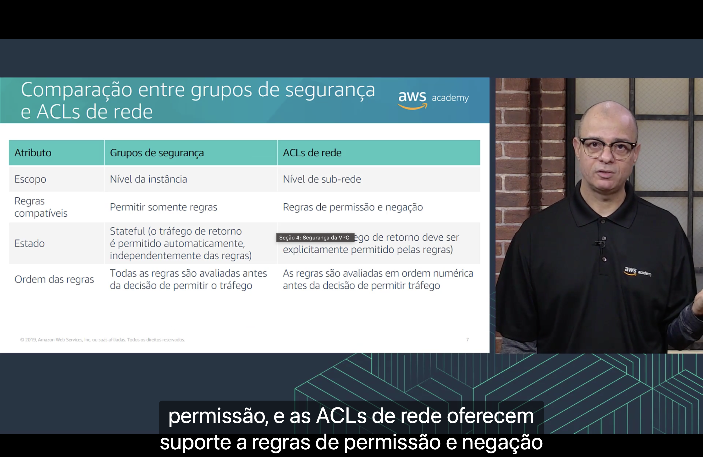
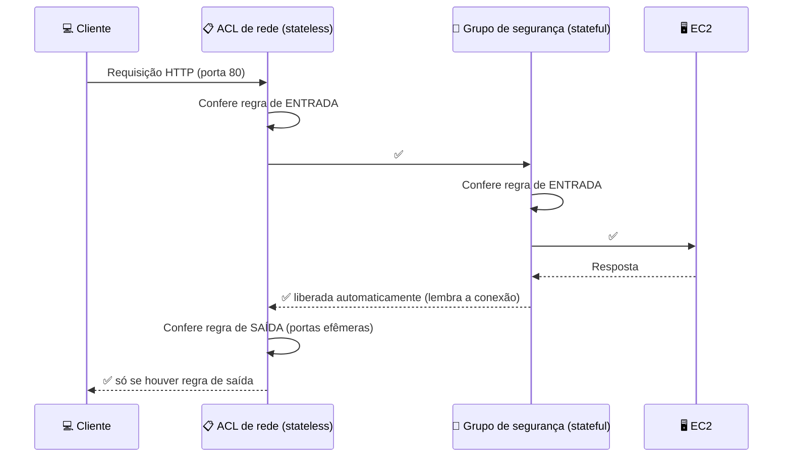
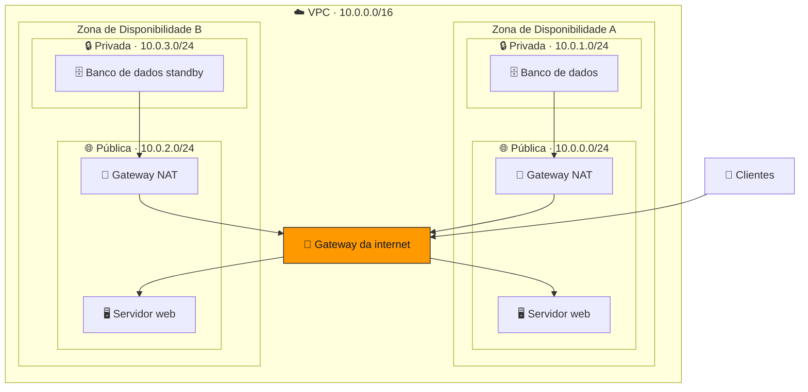

<h1 align="center">🛡️ Seção 4 – Segurança da VPC</h1>

  
  
   
  
  
  

  <a href="../README.md">🏠 Início</a> &nbsp;•&nbsp;
  <a href="./Seção%20Bônus2%20-%20Laboratório%202%20-%20Crie%20sua%20VPC%20e%20execute%20um%20servidor%20web.md">⬅️ Anterior: Laboratório 2</a> &nbsp;•&nbsp;
  <a href="./Seção%205%20-%20Amazon%20Route%2053.md">Próxima: Amazon Route 53 ➡️</a>

## 📑 Sumário

| # | Tópico |
|:---:|---|
| 1 | [🧱 Grupos de segurança](#sg) |
| 2 | [🛠️ Grupos de segurança personalizados](#sg-personalizado) |
| 3 | [📋 ACLs de rede](#nacl) |
| 4 | [🛠️ ACLs de rede personalizadas](#nacl-personalizada) |
| 5 | [⚖️ Grupos de segurança vs. ACLs de rede](#comparacao) |
| 6 | [✏️ Atividade: projete uma VPC](#atividade) |
| 🎯 | [Principais conclusões](#conclusoes) |

A VPC tem **duas camadas de firewall**: a **ACL de rede**, na entrada da **sub-rede**, e o **grupo de segurança**, na porta da **instância**.

---

## 1. 🧱 Grupos de segurança

- 🖥️ Os grupos de segurança atuam no **nível da instância**: cada instância, esteja ela na sub-rede pública ou na privada, fica "dentro" do seu grupo de segurança.

- 📜 Os grupos de segurança têm **regras** que controlam o tráfego de **entrada** e de **saída** das instâncias.
- 🚪 Os grupos de segurança padrão **negam todo o tráfego de entrada** e **permitem todo o tráfego de saída**.
- 🧠 Os grupos de segurança são **stateful** (com estado): eles **lembram** das conexões e liberam automaticamente o tráfego de **resposta**.

**Exemplo do slide — entrada:**

| Tipo | Protocolo | Intervalo de portas | Origem | Descrição |
|---|---|:---:|---|---|
| HTTP | TCP | 80 | `0.0.0.0/0` | Todo o tráfego da web |
| HTTPS | TCP | 443 | `0.0.0.0/0` | Todo o tráfego da web |
| SSH | TCP | 22 | `54.24.12.19/32` | Endereço comercial |

**Exemplo do slide — saída:**

| Tipo | Protocolo | Intervalo de portas | Destino | Descrição |
|---|---|:---:|---|---|
| Todo tráfego | Todos | Todos | `0.0.0.0/0` | Todo o IPv4 |
| Todo tráfego | Todos | Todos | `::/0` | Todo o IPv6 |

> [!TIP]
> O `/32` na regra de SSH libera **um único IP** (o do escritório), como visto na [Seção 1](./Seção%201%20-%20Noções%20básicas%20de%20redes.md#cidr). Já HTTP e HTTPS ficam abertos para **qualquer endereço** (`0.0.0.0/0`), porque é um site público.

> [!NOTE]
> No slide, a coluna das regras de saída aparece como "Origem", mas em uma regra de saída o endereço é o **destino** do tráfego.

> [!NOTE]
> O grupo de segurança **default** criado junto com a VPC tem uma regra de entrada extra: ele permite tráfego vindo de **instâncias associadas ao mesmo grupo**. Um grupo **novo**, criado por você, começa **sem nenhuma regra de entrada**.

## 2. 🛠️ Grupos de segurança personalizados

- ✅ Você pode especificar regras de **permissão**, mas **não de negação**.
- 🔎 **Todas as regras são avaliadas** antes de decidir se o tráfego é permitido.

**Exemplo — regras de entrada:**

| Origem | Protocolo | Porta | Descrição |
|---|---|:---:|---|
| `0.0.0.0/0` | TCP | 80 | Permite **HTTP** de entrada a partir de qualquer IPv4. |
| `0.0.0.0/0` | TCP | 443 | Permite **HTTPS** de entrada a partir de qualquer IPv4. |
| Intervalo de IPv4 público da sua rede | TCP | 22 | Permite **SSH** de entrada em instâncias Linux a partir de IPs da sua rede (pelo gateway da internet). |

**Exemplo — regras de saída:**

| Destino | Protocolo | Porta | Descrição |
|---|---|:---:|---|
| ID do grupo de segurança das instâncias com **Microsoft SQL Server** | TCP | 1433 | Permite acesso de saída aos servidores de banco SQL Server. |
| ID do grupo de segurança das instâncias com **MySQL** | TCP | 3306 | Permite acesso de saída aos servidores de banco MySQL. |

> [!TIP]
> Usar o **ID de outro grupo de segurança** como origem/destino (em vez de IPs) é uma prática recomendada: a regra continua valendo mesmo que as instâncias do banco mudem de IP ou sejam substituídas.

## 3. 📋 ACLs de rede

- ✂️ ACLs de rede atuam no **nível da sub-rede**.
- ⚖️ Uma ACL de rede tem **regras de entrada e saída separadas**, e cada regra pode **permitir ou rejeitar** o tráfego.
- 🚪 As ACLs de rede **padrão permitem todo** o tráfego IPv4 de entrada e de saída.
- 🧠 As ACLs de rede são **stateless** (sem estado): o tráfego de **resposta** precisa ser **explicitamente permitido** pelas regras.

**ACL de rede padrão — entrada:**

| Nº da regra | Tipo | Protocolo | Intervalo de portas | Origem | Permitir/Negar |
|:---:|---|---|---|---|:---:|
| 100 | Todo tráfego IPv4 | Todos | Todos | `0.0.0.0/0` | ✅ PERMITIR |
| `*` | Todo tráfego IPv4 | Todos | Todos | `0.0.0.0/0` | ⛔ NEGAR |

**ACL de rede padrão — saída:**

| Nº da regra | Tipo | Protocolo | Intervalo de portas | Destino | Permitir/Negar |
|:---:|---|---|---|---|:---:|
| 100 | Todo tráfego IPv4 | Todos | Todos | `0.0.0.0/0` | ✅ PERMITIR |
| `*` | Todo tráfego IPv4 | Todos | Todos | `0.0.0.0/0` | ⛔ NEGAR |

> [!NOTE]
> A regra `*` é a **regra padrão final**: ela não pode ser removida e só é aplicada se **nenhuma** regra numerada combinar com o tráfego. Na ACL padrão, a regra 100 sempre combina, então tudo passa.

## 4. 🛠️ ACLs de rede personalizadas

- 🚫 ACLs de rede personalizadas **negam todo o tráfego** de entrada e de saída **até que você adicione regras**.
- ⚖️ Você pode especificar regras de **permissão e de negação**.
- 🔢 As regras são avaliadas **em ordem numérica**, começando pelo **menor número**. A **primeira** regra que combina decide.

**Exemplo — entrada:**

| Nº da regra | Tipo | Protocolo | Porta | Origem | Permitir/Negar |
|:---:|---|---|---|---|:---:|
| 100 | HTTP | TCP | 80 | `0.0.0.0/0` | ✅ PERMITIR |
| 120 | HTTPS | TCP | 443 | `0.0.0.0/0` | ✅ PERMITIR |
| 140 | SSH | TCP | 22 | `192.0.2.0/24` | ✅ PERMITIR |
| `*` | Todo tráfego IPv4 | Todos | Todos | `0.0.0.0/0` | ⛔ NEGAR |

**Exemplo — saída:**

| Nº da regra | Tipo | Protocolo | Porta | Destino | Permitir/Negar |
|:---:|---|---|---|---|:---:|
| 100 | HTTP | TCP | 80 | `0.0.0.0/0` | ✅ PERMITIR |
| 120 | HTTPS | TCP | 443 | `0.0.0.0/0` | ✅ PERMITIR |
| 140 | TCP personalizado | TCP | 1024–65535 | `0.0.0.0/0` | ✅ PERMITIR |
| `*` | Todo tráfego IPv4 | Todos | Todos | `0.0.0.0/0` | ⛔ NEGAR |

> [!IMPORTANT]
> A regra de saída **140** libera as **portas efêmeras** (1024–65535). Quando um cliente acessa o servidor na porta 80, a **resposta** volta para uma porta alta e aleatória do cliente. Como a ACL é **stateless**, sem essa regra a resposta seria bloqueada.

## 5. ⚖️ Grupos de segurança vs. ACLs de rede

| Atributo | 🧱 **Grupos de segurança** | 📋 **ACLs de rede** |
|---|---|---|
| **Escopo** | Nível da **instância** | Nível da **sub-rede** |
| **Regras suportadas** | Somente regras de **permissão** | Regras de **permissão e de negação** |
| **Estado** | **Stateful**: o tráfego de retorno é permitido automaticamente, independentemente das regras | **Stateless**: o tráfego de retorno precisa ser permitido explicitamente pelas regras |
| **Ordem das regras** | **Todas** as regras são avaliadas antes de decidir | Regras avaliadas em **ordem numérica** antes de decidir |

> [!TIP]
> Na prova: "**negar** um IP específico" ou "**bloquear** uma faixa de endereços" só é possível com **ACL de rede**, porque grupos de segurança **não têm regra de negação**.

## 6. ✏️ Atividade: projete uma VPC

**Cenário:** você tem uma pequena empresa com um **site hospedado em uma instância do Amazon EC2**. Os **dados dos clientes** ficam em um **banco de dados de back-end** que você quer manter **privado**. Use a Amazon VPC para montar uma VPC que atenda a estes requisitos:

| # | Requisito |
|:---:|---|
| 1 | O servidor web e o servidor de banco de dados devem ficar em **sub-redes separadas**. |
| 2 | O **primeiro endereço** da rede deve ser `10.0.0.0`. |
| 3 | Cada sub-rede deve ter **256 endereços IPv4** no total. |
| 4 | Os clientes devem **sempre conseguir acessar** o servidor web. |
| 5 | O servidor de banco de dados deve conseguir **acessar a internet** para baixar **patches**. |
| 6 | A arquitetura deve ser **altamente disponível** e usar **pelo menos uma camada de firewall personalizada**. |

💡 <strong>Clique para ver uma solução possível</strong>

 

| Requisito | Como a solução atende |
|:---:|---|
| 1 | Servidores web nas sub-redes **públicas**; banco de dados nas sub-redes **privadas**. |
| 2 | VPC com o bloco **`10.0.0.0/16`**. |
| 3 | Todas as sub-redes são **`/24`** (256 endereços). |
| 4 | **Gateway da internet** + rota `0.0.0.0/0 → igw` nas sub-redes públicas. |
| 5 | **Gateway NAT** nas sub-redes públicas + rota `0.0.0.0/0 → nat` nas sub-redes privadas. |
| 6 | Recursos espalhados por **duas AZs** (um gateway NAT por AZ evita ponto único de falha). Como firewall personalizado: um **grupo de segurança web** (80/443 de `0.0.0.0/0`), um **grupo de segurança do banco** (3306 **somente a partir do grupo web**) e, opcionalmente, **ACLs de rede** personalizadas. |

> [!TIP]
> Para distribuir os clientes entre os dois servidores web, a solução pode ser completada com um **Elastic Load Balancing** na frente deles.

---

## 🎯 Principais conclusões

- ✅ Construa a segurança **dentro** da arquitetura da VPC:
  - 🔒 **isole sub-redes** sempre que possível;
  - 🔌 escolha o **gateway** ou a **conexão VPN** adequada às suas necessidades;
  - 🧱 use **firewalls**.
- ✅ **Grupos de segurança** e **ACLs de rede** são as opções de firewall para proteger a VPC.
- ✅ **Grupo de segurança**: nível da **instância**, só **permite**, **stateful**, avalia **todas** as regras.
- ✅ **ACL de rede**: nível da **sub-rede**, **permite e nega**, **stateless**, avalia em **ordem numérica**.
- ✅ Por ser stateless, a ACL de rede precisa liberar as **portas efêmeras** (1024–65535) para as respostas.

---

  <a href="../README.md">🏠 Início</a> &nbsp;•&nbsp;
  <a href="./Seção%20Bônus2%20-%20Laboratório%202%20-%20Crie%20sua%20VPC%20e%20execute%20um%20servidor%20web.md">⬅️ Anterior: Laboratório 2</a> &nbsp;•&nbsp;
  <a href="./Seção%205%20-%20Amazon%20Route%2053.md">Próxima: Amazon Route 53 ➡️</a>

