<h1 align="center">🧭 Seção 5 – Amazon Route 53</h1>

  
  
   
  
  
  

  <a href="../README.md">🏠 Início</a> &nbsp;•&nbsp;
  <a href="./Seção%204%20-%20Segurança%20da%20VPC.md">⬅️ Anterior: Segurança da VPC</a> &nbsp;•&nbsp;
  <a href="./Seção%206%20-%20Amazon%20CloudFront.md">Próxima: Amazon CloudFront ➡️</a>

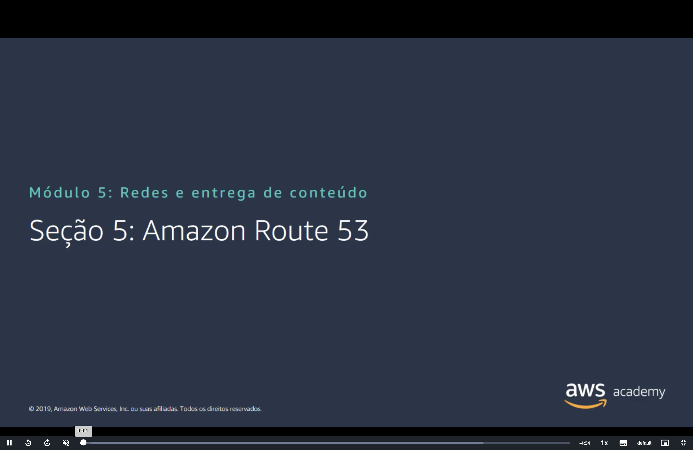

## 📑 Sumário

| # | Tópico |
|:---:|---|
| 1 | [🧭 O que é o Amazon Route 53](#route53) |
| 2 | [🔎 Resolução de DNS do Amazon Route 53](#dns) |
| 3 | [🛣️ Roteamento compatível com o Amazon Route 53](#roteamento) |
| 4 | [🌎 Caso de uso: implantação em várias regiões](#multirregiao) |
| 5 | [🩺 Failover de DNS do Amazon Route 53](#failover) |
| 6 | [🏗️ Failover de DNS para um aplicativo web multicamadas](#multicamadas) |
| 🎯 | [Principais conclusões](#conclusoes) |

---

## 1. 🧭 O que é o Amazon Route 53

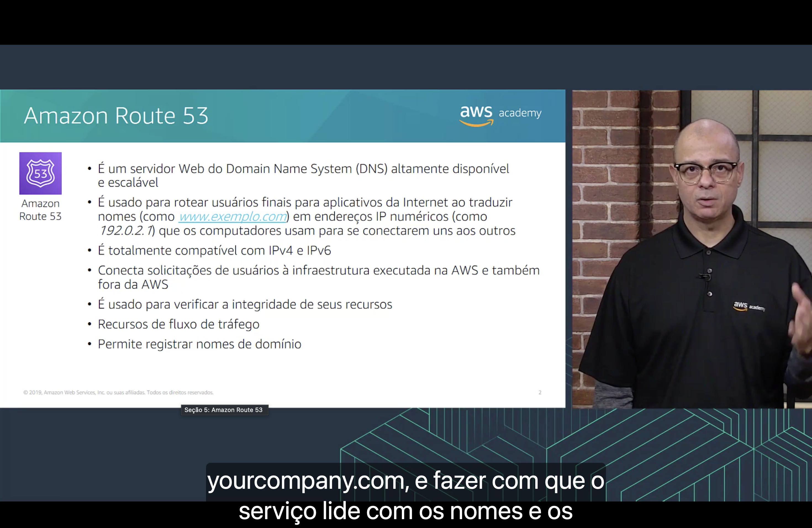

O **Amazon Route 53** é um serviço web de **DNS (Domain Name System)** **altamente disponível e escalável**. Ele:

- 🔤 **Roteia os usuários finais** para aplicações na internet, **traduzindo nomes** (como `www.example.com`) em **endereços IP numéricos** (como `192.0.2.1`), que os computadores usam para se conectar.
- 🆚 É **totalmente compatível** com **IPv4 e IPv6**.
- 🔗 Conecta as solicitações dos usuários à infraestrutura executada **na AWS** e também **fora da AWS**.
- 🩺 É usado para **verificar a integridade** (*health check*) dos seus recursos.
- 🔀 Oferece o recurso de **fluxo de tráfego** (*traffic flow*).
- 📝 Permite **registrar nomes de domínio**.

> [!NOTE]
> O nome vem da **porta 53**, a porta padrão do DNS. O Route 53 também é um dos poucos serviços da AWS com SLA de **100% de disponibilidade**.

## 2. 🔎 Resolução de DNS do Amazon Route 53

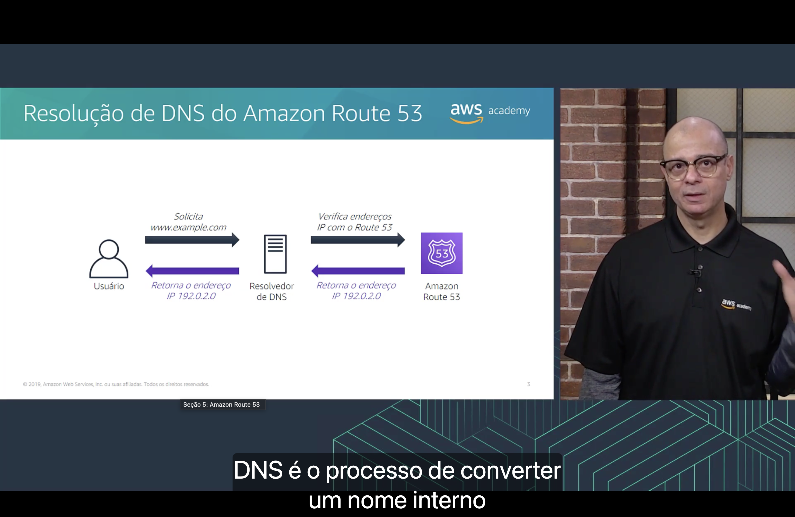

**DNS** é o processo de **converter um nome** (como `www.example.com`) **no endereço IP** do servidor que hospeda o site.

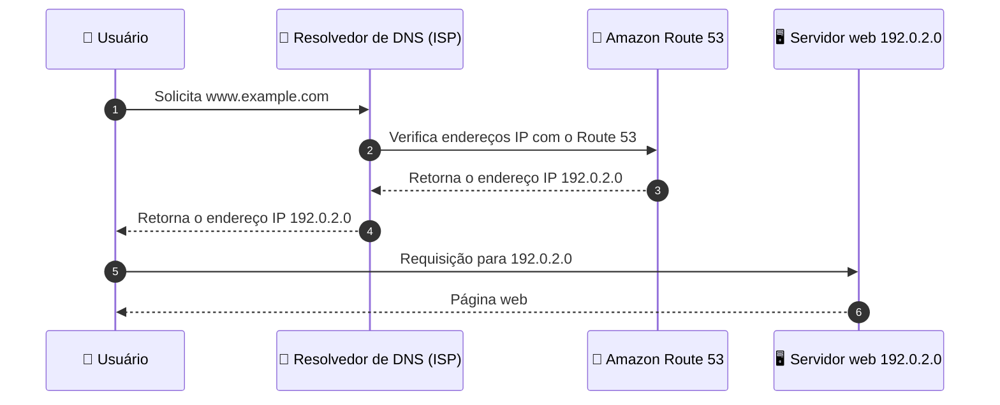

| Passo | O que acontece |
|:---:|---|
| 1 | O usuário digita `www.example.com` e o computador pergunta ao **resolvedor DNS** (geralmente do provedor de internet). |
| 2 | O resolvedor encaminha a pergunta ao **Route 53**, que é o DNS **autoritativo** do domínio. |
| 3–4 | O Route 53 responde com o IP `192.0.2.0`, que chega ao usuário. |
| 5–6 | O navegador se conecta diretamente ao **servidor web** nesse IP. |

> [!TIP]
> O resolvedor guarda a resposta em **cache** pelo tempo definido no **TTL** do registro. Por isso uma mudança de DNS pode levar algum tempo para chegar a todos os usuários.

## 3. 🛣️ Roteamento compatível com o Amazon Route 53

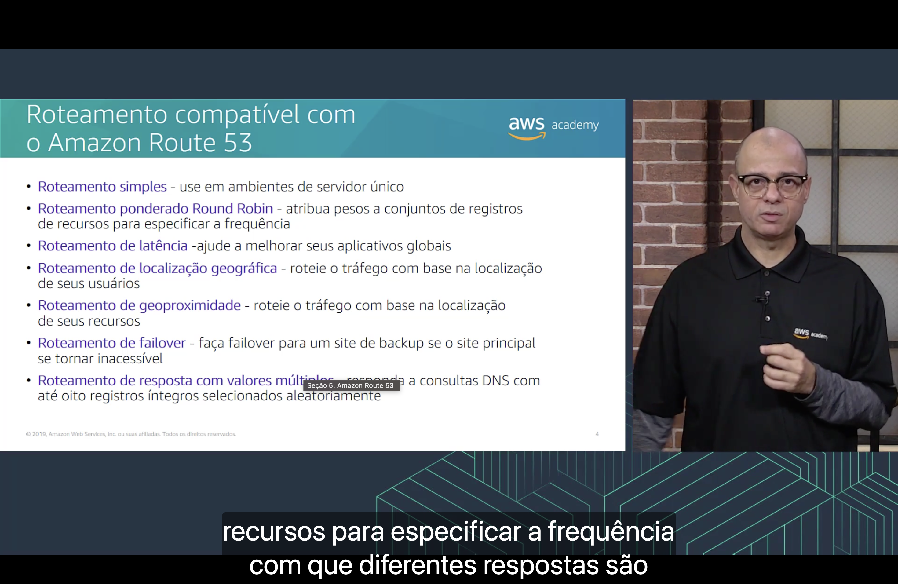

O Route 53 suporta várias **políticas de roteamento**, que definem **como** ele responde às consultas:

| Política | Quando usar |
|---|---|
| 🎯 **Roteamento simples** | Ambientes com **um único servidor**. |
| ⚖️ **Roteamento ponderado Round Robin** | Atribuir **pesos** aos conjuntos de registros de recursos para especificar a **frequência** com que cada resposta é retornada (ex.: 90% na versão atual, 10% na nova). |
| ⏱️ **Roteamento de latência** | Ajudar a melhorar os aplicativos **globais**, enviando o usuário para a Região com **menor latência**. |
| 🗺️ **Roteamento de localização geográfica** | Rotear o tráfego com base na localização dos **usuários** (ex.: usuários do Brasil → site em português). |
| 📍 **Roteamento de geoproximidade** | Rotear o tráfego com base na localização dos **recursos**. |
| 🔁 **Roteamento de failover** | Fazer failover para um **site de backup** se o site principal se tornar inacessível. |
| 🎲 **Roteamento de resposta com valores múltiplos** | Responder às consultas DNS com **até oito registros íntegros** selecionados **aleatoriamente**. |

> [!TIP]
> Não confunda **localização geográfica** (onde está o **usuário**) com **geoproximidade** (onde estão os **recursos**). Já a política de **latência** olha para o **tempo de resposta da rede**, não para a distância.

## 4. 🌎 Caso de uso: implantação em várias regiões

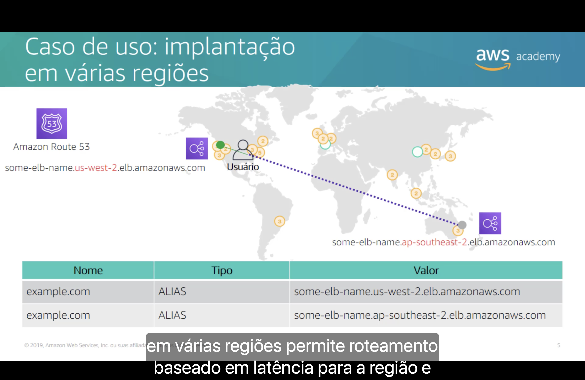

Com a aplicação implantada em **várias Regiões**, o Route 53 permite **roteamento baseado em latência para a Região** e **balanceamento de carga para a Zona de Disponibilidade**: cada usuário vai para a Região que responde **mais rápido** para ele, e lá dentro o **Elastic Load Balancing** distribui o tráfego entre as AZs.

No exemplo do slide, o domínio `example.com` tem **dois registros**, um para o load balancer de cada Região:

| Nome | Tipo | Valor |
|---|---|---|
| `example.com` | ALIAS | `some-elb-name.us-west-2.elb.amazonaws.com` |
| `example.com` | ALIAS | `some-elb-name.ap-southeast-2.elb.amazonaws.com` |

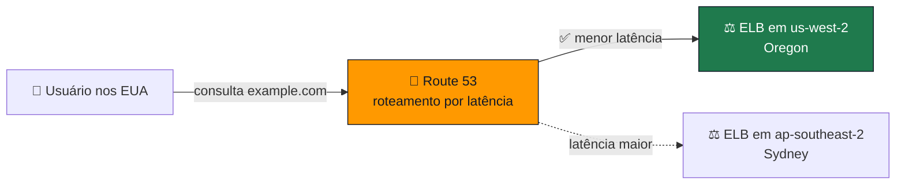

> [!TIP]
> Um registro **ALIAS** é uma extensão do Route 53 que aponta o domínio direto para um recurso da AWS (como um load balancer), sem precisar saber o IP dele.

> [!NOTE]
> A implantação multirregional **melhora o desempenho** da aplicação para um **público global** e, de quebra, aumenta a disponibilidade: se uma Região tiver problemas, as outras continuam atendendo.

## 5. 🩺 Failover de DNS do Amazon Route 53

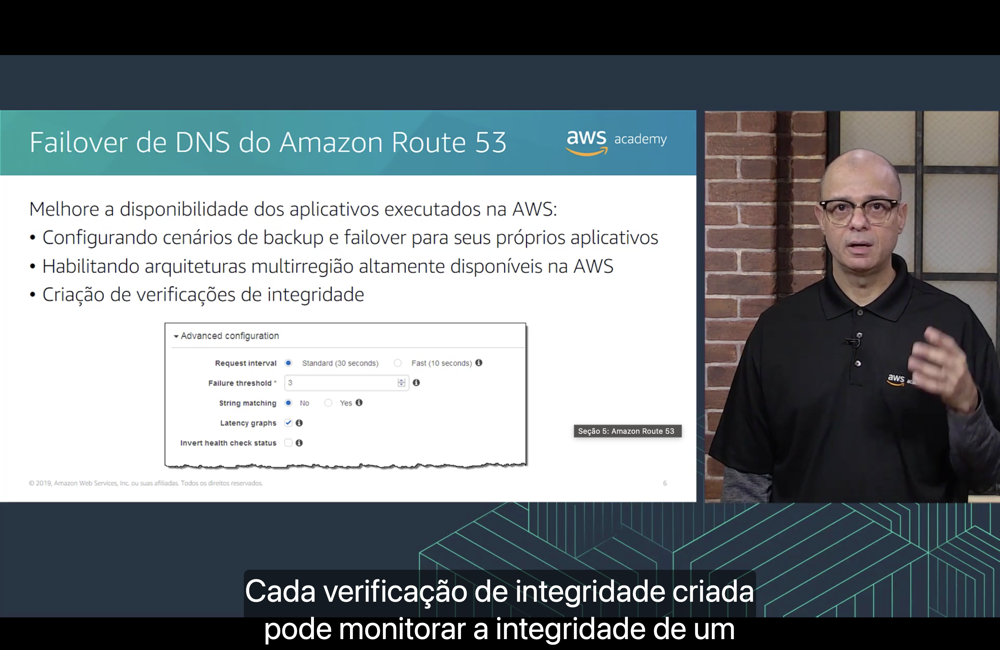

O failover de DNS do Route 53 **melhora a disponibilidade** dos aplicativos executados na AWS:

- 🔁 **configurando** cenários de **backup e failover** para seus próprios aplicativos;
- 🌎 **habilitando** arquiteturas **multirregião altamente disponíveis** na AWS;
- 🩺 **criando verificações de integridade** (*health checks*). Cada verificação pode monitorar a **integridade e o desempenho** de um aplicativo web, servidor web ou outro recurso.

O slide mostra as **configurações avançadas** de uma verificação de integridade no console:

| Configuração | Valor no slide | O que significa |
|---|---|---|
| **Request interval** | *Standard (30 seconds)* | Intervalo entre as verificações (a opção *Fast* faz a cada 10 segundos). |
| **Failure threshold** | `3` | Quantas falhas seguidas até o recurso ser considerado **não íntegro**. |
| **String matching** | *No* | Se a resposta precisa conter um texto específico para ser considerada íntegra. |
| **Latency graphs** | ✅ | Gera gráficos de latência da verificação. |
| **Invert health check status** | ☐ | Inverte o resultado (íntegro ↔ não íntegro). |

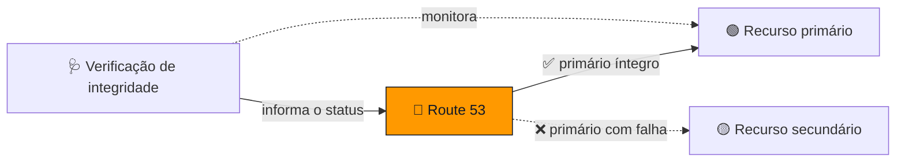

## 6. 🏗️ Failover de DNS para um aplicativo web multicamadas

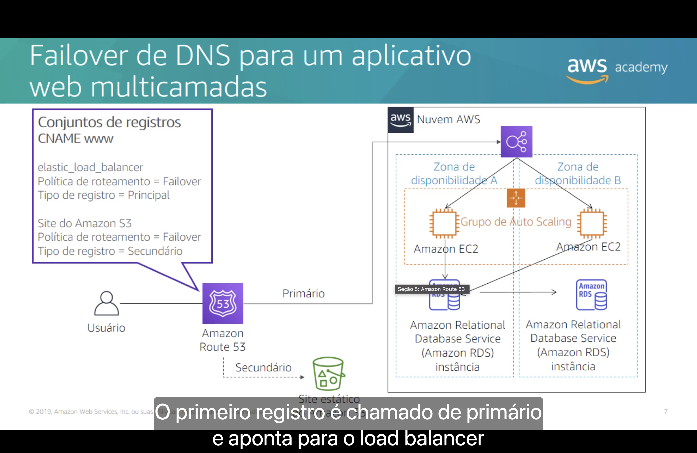

Exemplo: o site principal é um aplicativo em camadas; se ele falhar, o Route 53 passa a responder com um **site estático de backup** hospedado no **Amazon S3**. Isso é configurado com dois **conjuntos de registros CNAME** para `www`:

| Registro | Aponta para | Política de roteamento | Tipo de registro |
|:---:|---|---|---|
| 1º | `elastic_load_balancer` | Failover | **Principal** |
| 2º | Site do Amazon S3 | Failover | **Secundário** |

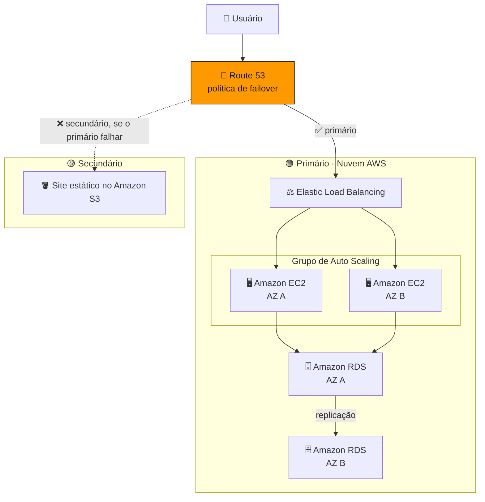

| Situação | Resposta do Route 53 |
|---|---|
| ✅ Verificação de integridade **OK** | Envia os usuários ao **primário** (ELB → EC2 → RDS). |
| ❌ Verificação de integridade **falhou** | Envia os usuários ao **secundário** (página estática no S3, ex.: "Voltamos em breve"). |

---

## 🎯 Principais conclusões

- ✅ O **Amazon Route 53** é um serviço de **DNS na nuvem** altamente disponível e escalável que **traduz nomes de domínio em endereços IP**.
- ✅ Ele também **registra domínios** e faz **verificações de integridade**.
- ✅ Suporta várias **políticas de roteamento**: simples, ponderado Round Robin, latência, localização geográfica, geoproximidade, failover e resposta com valores múltiplos.
- ✅ A **implantação multirregional** com roteamento por latência melhora o desempenho para um **público global**.
- ✅ O **failover do Route 53**, junto com as verificações de integridade, melhora a **disponibilidade** das aplicações.

---

  <a href="../README.md">🏠 Início</a> &nbsp;•&nbsp;
  <a href="./Seção%204%20-%20Segurança%20da%20VPC.md">⬅️ Anterior: Segurança da VPC</a> &nbsp;•&nbsp;
  <a href="./Seção%206%20-%20Amazon%20CloudFront.md">Próxima: Amazon CloudFront ➡️</a>

