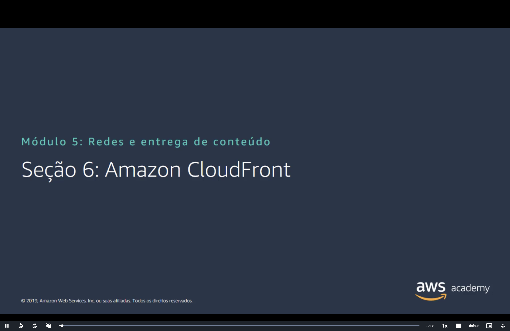
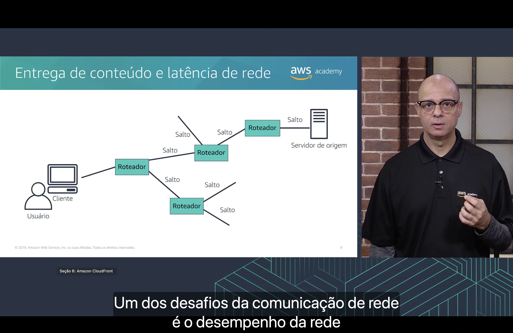
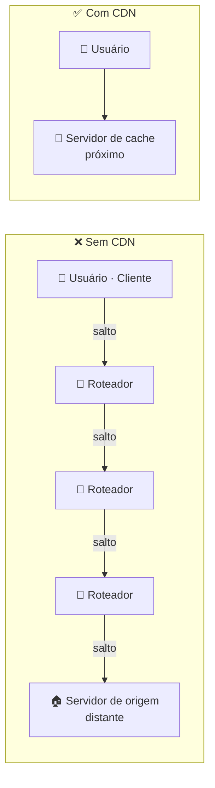
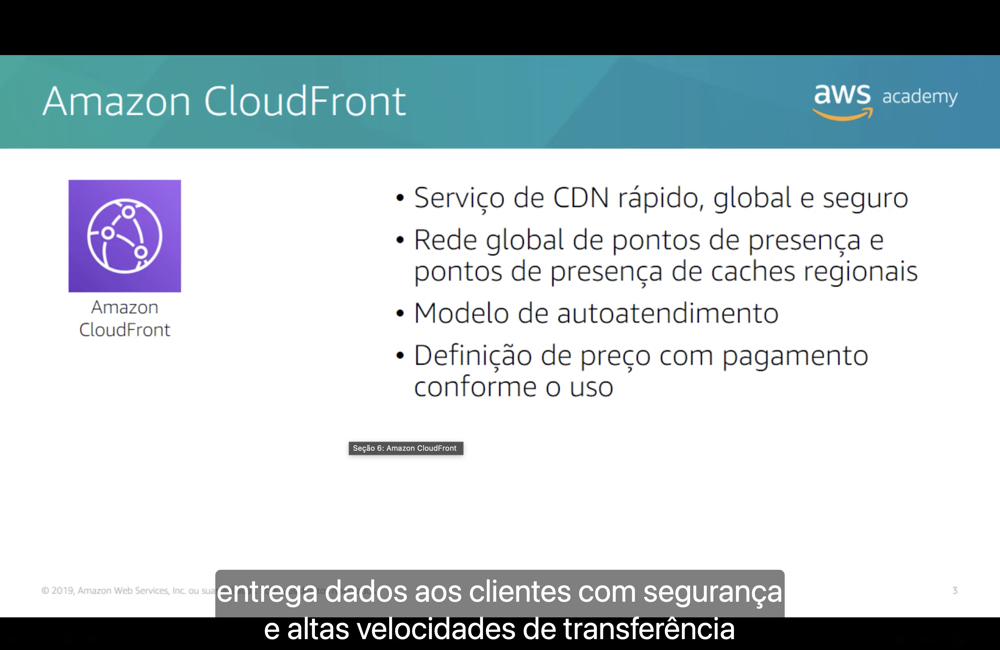
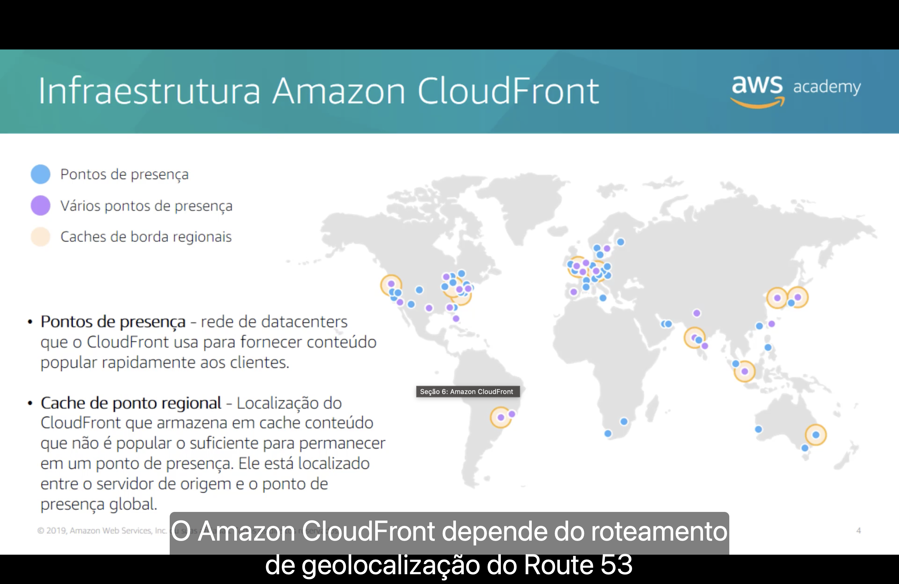
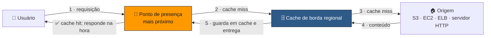

<h1 align="center">🚀 Seção 6 – Amazon CloudFront</h1>

  
  
   
  
  
  

  <a href="../README.md">🏠 Início</a> &nbsp;•&nbsp;
  <a href="./Seção%205%20-%20Amazon%20Route%2053.md">⬅️ Anterior: Amazon Route 53</a> &nbsp;•&nbsp;
  <a href="./Seção%207%20-%20Conclusão%20do%20Módulo%205.md">Próxima: Conclusão do Módulo 5 ➡️</a>

## 📑 Sumário

| # | Tópico |
|:---:|---|
| 1 | [🐢 Entrega de conteúdo e latência de rede](#latencia) |
| 2 | [🌐 Rede de entrega de conteúdo (CDN)](#cdn) |
| 3 | [🚀 O que é o Amazon CloudFront](#cloudfront) |
| 4 | [🗺️ Infraestrutura do Amazon CloudFront](#infraestrutura) |
| 5 | [✨ Benefícios do Amazon CloudFront](#beneficios) |
| 6 | [💲 Definição de preço do Amazon CloudFront](#preco) |
| 🎯 | [Principais conclusões](#conclusoes) |

---

## 1. 🐢 Entrega de conteúdo e latência de rede

Um dos desafios da comunicação de rede é o **desempenho da rede**. Quando o usuário acessa um conteúdo, a requisição passa por **vários roteadores** (cada passagem é um **salto**) até chegar ao **servidor de origem**. Quanto **mais longe** a origem, **mais saltos** e **mais latência**: a página demora mais para carregar.

## 2. 🌐 Rede de entrega de conteúdo (CDN)

Uma **rede de entrega de conteúdo** (*content delivery network*, **CDN**):

- 🌍 É um **sistema globalmente distribuído de servidores de cache**.
- 🗂️ **Armazena em cache cópias** dos arquivos solicitados com frequência (**conteúdo estático**).
- 📍 Entrega uma **cópia local** do conteúdo a partir de um **cache de borda** ou **ponto de presença** próximo.
- ⚡ **Acelera a entrega** de **conteúdo dinâmico**.
- 📈 Melhora o **desempenho** e a **escalabilidade** da aplicação.

## 3. 🚀 O que é o Amazon CloudFront

O **Amazon CloudFront** é o serviço de **CDN** da AWS:

- ⚡ Serviço de CDN **rápido, global e seguro**.
- 🌐 **Rede global de pontos de presença** e **pontos de presença de caches regionais**.
- 🛠️ Modelo de **autoatendimento** (*self-service*).
- 💳 Definição de preço com **pagamento conforme o uso** (*pay-as-you-go*).

Na prática, você cria uma **distribuição** que aponta para uma **origem** (um bucket do **Amazon S3**, uma instância do **EC2**, um **Elastic Load Balancer** ou qualquer servidor HTTP) e recebe um domínio como `d111111abcdef8.cloudfront.net`.

> [!TIP]
> O CloudFront entrega **dados, vídeos, aplicações e APIs** com **baixa latência** e **altas velocidades de transferência**.

## 4. 🗺️ Infraestrutura do Amazon CloudFront

| Componente | O que é |
|---|---|
| 📍 **Ponto de presença** (*edge location*, também chamado de local de borda) | Rede de datacenters que o CloudFront usa para fornecer **conteúdo popular** rapidamente aos clientes. Algumas cidades têm **vários pontos de presença**. |
| 🗄️ **Cache de borda regional** (*regional edge cache*) | Local do CloudFront que armazena em cache o conteúdo que **não é popular o suficiente** para permanecer em um ponto de presença. Fica **entre o servidor de origem e o ponto de presença global**. |

> [!TIP]
> Para mandar cada usuário ao ponto de presença mais próximo, o CloudFront **depende do roteamento de geolocalização do Route 53** (ver [Seção 5](./Seção%205%20-%20Amazon%20Route%2053.md#roteamento)).

> [!NOTE]
> Os pontos de presença fazem parte da **infraestrutura global** vista no [Módulo 3](../MÓDULO%203/Seção%201%20-%20Infraestrutura%20global%20da%20AWS.md) (pontos de presença). O conteúdo fica em cache pelo tempo definido no **TTL**; para removê-lo antes disso, faz-se uma **invalidação**.

## 5. ✨ Benefícios do Amazon CloudFront

| Benefício | O que significa |
|---|---|
| ⚡ **Rápido e global** | Rede de pontos de presença no mundo todo, entregando o conteúdo **perto do usuário**. |
| 🛡️ **Segurança na borda** | Proteção contra **DDoS** (AWS Shield Standard incluído), **HTTPS/TLS** e integração com o **AWS WAF**. |
| 🧩 **Altamente programável** | Comportamento personalizável na borda com **Lambda@Edge** e **CloudFront Functions**. |
| 🔗 **Profundamente integrado à AWS** | Funciona nativamente com S3, EC2, ELB, Route 53, Shield, WAF e AWS Certificate Manager. |
| 💰 **Econômico** | Sem compromisso mínimo, paga-se pelo uso, e a transferência de dados **de origens da AWS para o CloudFront** não é cobrada. |

## 6. 💲 Definição de preço do Amazon CloudFront

| Item cobrado | Como funciona |
|---|---|
| 📤 **Transferência de dados para fora** | Cobrada pelo **volume de dados** (em GB) transferido dos **pontos de presença** do CloudFront para a internet. |
| 📨 **Solicitações HTTP(S)** | Cobradas pelo **número de solicitações** HTTP(S). |
| 🧹 **Solicitações de invalidação** | **Sem custo** para os primeiros **1.000 caminhos** invalidados por mês; depois, **0,005 USD por caminho**. |
| 🔐 **SSL personalizado com IP dedicado** | **600 USD por mês** para cada certificado SSL personalizado associado a uma ou mais distribuições que usam a versão de **IP dedicado**. |

> [!TIP]
> O CloudFront tem um **nível gratuito permanente** que inclui **1 TB** de transferência de dados para fora e **10 milhões** de solicitações HTTP(S) por mês. Para a maioria dos projetos pessoais e de estudo, isso basta.

> [!NOTE]
> O suporte a SSL personalizado via **SNI** (*Server Name Indication*) **não tem a taxa de 600 USD**; ela só se aplica a quem precisa de **IP dedicado**, normalmente para clientes antigos que não suportam SNI.

---

## 🎯 Principais conclusões

- ✅ Uma **CDN** é um sistema **globalmente distribuído de servidores de cache** que **acelera a entrega** de conteúdo.
- ✅ O **Amazon CloudFront** é o serviço de CDN da AWS: entrega dados, vídeos, aplicações e APIs com **baixa latência** e **alta velocidade de transferência** sobre uma infraestrutura global.
- ✅ A infraestrutura combina **pontos de presença** (conteúdo popular) e **caches de borda regionais** (conteúdo menos acessado, entre o ponto de presença e a origem).
- ✅ Benefícios: **rápido e global**, **segurança na borda**, **altamente programável**, **integrado à AWS** e **econômico**.
- ✅ Preço: **transferência de dados para fora**, **solicitações HTTP(S)**, **invalidações** (acima de 1.000 caminhos/mês) e **SSL com IP dedicado**.

---

  <a href="../README.md">🏠 Início</a> &nbsp;•&nbsp;
  <a href="./Seção%205%20-%20Amazon%20Route%2053.md">⬅️ Anterior: Amazon Route 53</a> &nbsp;•&nbsp;
  <a href="./Seção%207%20-%20Conclusão%20do%20Módulo%205.md">Próxima: Conclusão do Módulo 5 ➡️</a>

