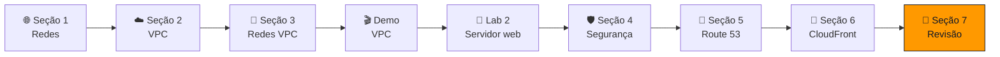

<h1 align="center">🏁 Seção 7 – Conclusão do Módulo 5</h1>

  
  
   
  
  
  

  <a href="../README.md">🏠 Início</a> &nbsp;•&nbsp;
  <a href="./Seção%206%20-%20Amazon%20CloudFront.md">⬅️ Anterior: Amazon CloudFront</a>

## 📑 Sumário

| # | Tópico |
|:---:|---|
| 1 | [🗂️ Resumo do módulo](#resumo) |
| 2 | [📝 Exemplo de pergunta do exame](#pergunta) |
| 🎯 | [Principais conclusões](#conclusoes) |

---

## 1. 🗂️ Resumo do módulo

Neste módulo, aprendemos a:

| Verbo | Objetivo | Onde estudar |
|---|---|---|
| 🌐 **Reconhecer** | Os **fundamentos de redes** | [🌐 Seção 1](./Seção%201%20-%20Noções%20básicas%20de%20redes.md) |
| ☁️ **Descrever** | As **redes virtuais na nuvem** com a **Amazon VPC** | [☁️ Seção 2](./Seção%202%20-%20Amazon%20VPC.md) |
| 🏷️ **Rotular** | Um **diagrama de rede** | [🔀 Seção 3](./Seção%203%20-%20Redes%20VPC.md#atividade) |
| ✏️ **Projetar** | Uma **arquitetura básica de VPC** | [🛡️ Seção 4](./Seção%204%20-%20Segurança%20da%20VPC.md#atividade) |
| 🪜 **Indicar** | As **etapas para criar uma VPC** | [🎬 Demonstração Amazon VPC](./Seção%20Bônus%20-%20Demonstração%20-%20Amazon%20VPC.md) |
| 🧱 **Identificar** | Os **grupos de segurança** | [🛡️ Seção 4](./Seção%204%20-%20Segurança%20da%20VPC.md#sg) |
| 🧪 **Criar** | A **própria VPC** e adicionar componentes para produzir uma **rede personalizada** | [🧪 Laboratório 2](./Seção%20Bônus2%20-%20Laboratório%202%20-%20Crie%20sua%20VPC%20e%20execute%20um%20servidor%20web.md) |
| 🧭 **Identificar** | Os **fundamentos do Amazon Route 53** | [🧭 Seção 5](./Seção%205%20-%20Amazon%20Route%2053.md) |
| 🚀 **Reconhecer** | Os **benefícios do Amazon CloudFront** | [🚀 Seção 6](./Seção%206%20-%20Amazon%20CloudFront.md) |

> [!NOTE]
> Depois de revisar, faça o **Módulo 5 – Teste de conhecimento** no Canvas para consolidar o conteúdo.

## 2. 📝 Exemplo de pergunta do exame

> [!NOTE]
> **Qual serviço de rede da AWS permite que uma empresa crie uma rede virtual dentro da AWS?**

| | Alternativa |
|:---:|---|
| **A** | AWS Config |
| **B** | Amazon Route 53 |
| **C** | AWS Direct Connect |
| **D** | Amazon VPC |

💡 <strong>Clique para ver a resposta</strong>

 

🔑 As palavras-chave da pergunta são **"serviço de rede da AWS"** e **"crie uma rede virtual"**.

> [!TIP]
> ✅ **Resposta correta: D.** A **Amazon VPC** permite provisionar uma **seção logicamente isolada da Nuvem AWS** onde você executa recursos em uma **rede virtual que você define**, escolhendo o intervalo de IPs, as sub-redes, as tabelas de rotas e os gateways.

Por que as outras estão erradas:

| Alternativa | Por que não é a resposta |
|:---:|---|
| ❌ **A** | O **AWS Config** avalia, audita e registra as **configurações** dos recursos (visto no [Módulo 4](../MÓDULO%204/Seção%206%20-%20Trabalhar%20para%20garantir%20a%20conformidade.md)). Não é um serviço de rede. |
| ❌ **B** | O **Amazon Route 53** é um serviço de **DNS**: traduz nomes de domínio em IPs, mas não cria redes. |
| ❌ **C** | O **AWS Direct Connect** cria uma **conexão dedicada** entre o datacenter e a AWS; ele **conecta** a uma rede, mas não **cria** a rede virtual. |

Isso retoma a [Seção 2](./Seção%202%20-%20Amazon%20VPC.md#vpc): a VPC é o "datacenter particular" dentro da AWS, e os demais serviços de rede **se conectam a ela**.

---

## 🎯 Principais conclusões

- ✅ Uma rede é dividida em **sub-redes**, e cada recurso tem um **endereço IP**; a notação **CIDR** define o tamanho dos intervalos (**2^(32 − prefixo)** endereços).
- ✅ A **Amazon VPC** é uma rede **logicamente isolada**, **regional**, dividida em **sub-redes** (uma por AZ), com **tabelas de rotas** que têm uma rota **local** fixa; a AWS reserva **5 IPs** por sub-rede.
- ✅ **Gateway da internet** torna a sub-rede pública; **gateway NAT** dá saída às sub-redes privadas; **peering**, **compartilhamento**, **Site-to-Site VPN**, **Direct Connect**, **endpoints** e **Transit Gateway** conectam a VPC a outras redes e serviços.
- ✅ **Grupos de segurança** (instância, só permitem, **stateful**) e **ACLs de rede** (sub-rede, permitem e negam, **stateless**) são as camadas de firewall da VPC.
- ✅ O **Amazon Route 53** é o **DNS** da AWS, com várias **políticas de roteamento**, **verificações de integridade** e **failover**.
- ✅ O **Amazon CloudFront** é a **CDN** da AWS, que usa **pontos de presença** e **caches regionais** para entregar conteúdo com baixa latência.

---

  <a href="../README.md">🏠 Início</a> &nbsp;•&nbsp;
  <a href="./Seção%206%20-%20Amazon%20CloudFront.md">⬅️ Anterior: Amazon CloudFront</a>

