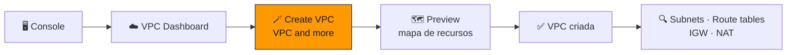
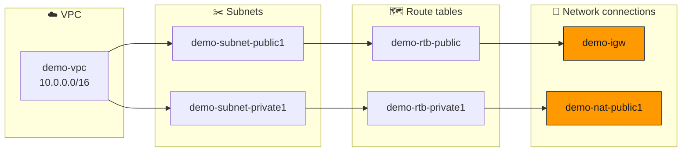

<h1 align="center">🎬 Seção Bônus – Demonstração: Amazon VPC</h1>

  
  
   
  
  

  <a href="../README.md">🏠 Início</a> &nbsp;•&nbsp;
  <a href="./Seção%203%20-%20Redes%20VPC.md">⬅️ Anterior: Redes VPC</a> &nbsp;•&nbsp;
  <a href="./Seção%20Bônus2%20-%20Laboratório%202%20-%20Crie%20sua%20VPC%20e%20execute%20um%20servidor%20web.md">Bônus 2: Laboratório 2 ➡️</a>

> [!NOTE]
> Esta demonstração mostra, no console, como usar o **assistente da VPC** para criar uma VPC com **sub-redes públicas e privadas**, aplicando na prática o que foi visto nas [Seção 2](./Seção%202%20-%20Amazon%20VPC.md) e [Seção 3](./Seção%203%20-%20Redes%20VPC.md). Os nomes de botões e menus estão em inglês, como aparecem no console, e podem variar um pouco entre versões.

## 📑 Sumário

| # | Tópico |
|:---:|---|
| 1 | [🧭 Navegação do console da VPC](#navegacao) |
| 2 | [🪄 Criando a VPC com o assistente](#assistente) |
| 3 | [🗺️ Mapa de recursos](#mapa) |
| 4 | [🔍 Conferindo o que foi criado](#conferindo) |
| 5 | [🧹 Limpeza](#limpeza) |
| 🎯 | [Principais conclusões](#conclusoes) |

---

## 1. 🧭 Navegação do console da VPC

O ponto de partida é **Services → Networking & Content Delivery → VPC**, que abre o **VPC Dashboard**.

> [!IMPORTANT]
> Diferente do IAM (que é **global**), a VPC é um recurso **regional**. Confira a **Região** no canto superior direito antes de criar qualquer coisa.

| Menu lateral | Conceito visto na teoria |
|---|---|
| ☁️ **Your VPCs** | A VPC e seu **bloco CIDR** ([Seção 2](./Seção%202%20-%20Amazon%20VPC.md#enderecamento)) |
| ✂️ **Subnets** | Sub-redes, cada uma em **uma AZ** ([Seção 2](./Seção%202%20-%20Amazon%20VPC.md#vpc-subredes)) |
| 🗺️ **Route tables** | Rotas `local`, `igw`, `nat` ([Seção 2](./Seção%202%20-%20Amazon%20VPC.md#tabelas-rotas)) |
| 🚪 **Internet gateways** | Saída para a internet ([Seção 3](./Seção%203%20-%20Redes%20VPC.md#igw)) |
| 📌 **Elastic IPs** | IPs públicos estáticos ([Seção 2](./Seção%202%20-%20Amazon%20VPC.md#ip-publico)) |
| 🔁 **NAT gateways** | Saída para a internet de sub-redes privadas ([Seção 3](./Seção%203%20-%20Redes%20VPC.md#nat)) |
| 🔗 **Peering connections** | Emparelhamento de VPC ([Seção 3](./Seção%203%20-%20Redes%20VPC.md#peering)) |
| 🎯 **Endpoints** | Endpoints da VPC ([Seção 3](./Seção%203%20-%20Redes%20VPC.md#endpoints)) |
| 🛡️ **Security → Network ACLs / Security groups** | Firewalls da VPC ([Seção 4](./Seção%204%20-%20Segurança%20da%20VPC.md)) |
| 🔐 **Virtual private network (VPN)** | Customer gateways, virtual private gateways e conexões Site-to-Site VPN ([Seção 3](./Seção%203%20-%20Redes%20VPC.md#vpn)) |
| 🕸️ **Transit gateways** | Hub central de conexões ([Seção 3](./Seção%203%20-%20Redes%20VPC.md#transit-gateway)) |

> [!NOTE]
> Toda conta já vem com uma **VPC padrão** (*default VPC*) em cada Região, com sub-redes públicas em todas as AZs. Ela é prática para testes, mas para ambientes reais o recomendado é criar a **própria VPC**.

## 2. 🪄 Criando a VPC com o assistente

Em **Your VPCs → Create VPC**, escolha **VPC and more**. Essa opção é o **assistente da VPC**: em uma única tela, ele cria a VPC **e** os componentes de rede ao redor dela.

| Configuração | Valor de exemplo | Por quê |
|---|---|---|
| **Name tag auto-generation** | `demo` | Prefixo usado no nome de todos os recursos criados. |
| **IPv4 CIDR block** | `10.0.0.0/16` | Maior bloco permitido (65.536 IPs). |
| **IPv6 CIDR block** | *No IPv6 CIDR block* | Apenas IPv4 na demonstração. |
| **Tenancy** | *Default* | Hardware compartilhado (o *Dedicated* custa mais). |
| **Number of Availability Zones** | `1` ou `2` | Duas AZs dão **alta disponibilidade**. |
| **Number of public subnets** | `1` por AZ | Para recursos acessíveis pela internet. |
| **Number of private subnets** | `1` por AZ | Para bancos de dados e servidores internos. |
| **Public subnet CIDR** | `10.0.0.0/24` | 256 IPs (251 utilizáveis). |
| **Private subnet CIDR** | `10.0.1.0/24` | 256 IPs (251 utilizáveis). |
| **NAT gateways** | *In 1 AZ* | Saída para a internet das sub-redes privadas. |
| **VPC endpoints** | *None* ou *S3 Gateway* | O endpoint de gateway do S3 não tem custo. |
| **DNS options** | *Enable DNS hostnames* e *Enable DNS resolution* | Instâncias recebem nomes DNS públicos. |

> [!NOTE]
> Em versões antigas do console, o assistente se chamava **Launch VPC Wizard** e oferecia quatro cenários prontos: *VPC with a Single Public Subnet*, *VPC with Public and Private Subnets*, *VPC with Public and Private Subnets and Hardware VPN Access* e *VPC with a Private Subnet Only and Hardware VPN Access*. A configuração acima equivale ao segundo cenário.

## 3. 🗺️ Mapa de recursos

Enquanto os campos são preenchidos, o painel **Preview** desenha um **mapa de recursos** com tudo o que será criado:

Ao clicar em **Create VPC**, o console mostra o progresso de cada etapa (criar VPC, sub-redes, gateway da internet, alocar IP elástico, criar gateway NAT, criar e associar tabelas de rotas). O **gateway NAT** costuma ser o passo mais demorado.

## 4. 🔍 Conferindo o que foi criado

| Onde olhar | O que conferir |
|---|---|
| ✂️ **Subnets** | Cada sub-rede em **uma AZ**, com seu CIDR e **Available IPv4 addresses = 251** (os 5 reservados já descontados). |
| 🗺️ **Route tables → público** | `10.0.0.0/16 → local` e `0.0.0.0/0 → igw-...`; associada à **sub-rede pública**. |
| 🗺️ **Route tables → privado** | `10.0.0.0/16 → local` e `0.0.0.0/0 → nat-...`; associada à **sub-rede privada**. |
| 🚪 **Internet gateways** | Estado **Attached** à VPC. |
| 🔁 **NAT gateways** | Criado na **sub-rede pública**, com um **IP elástico**. |
| 📌 **Elastic IPs** | O IP alocado automaticamente para o gateway NAT. |
| 🛡️ **Security groups / Network ACLs** | Um **grupo de segurança padrão** e uma **ACL de rede padrão**, criados junto com a VPC. |

> [!TIP]
> Repare que a diferença entre a sub-rede **pública** e a **privada** está **apenas na tabela de rotas**: uma aponta `0.0.0.0/0` para o **gateway da internet**, a outra para o **gateway NAT**.

## 5. 🧹 Limpeza

> [!WARNING]
> O **gateway NAT** e o **IP elástico** são cobrados **por hora**, mesmo sem tráfego. Depois de testar, exclua o gateway NAT, libere o IP elástico e então exclua a VPC (**Actions → Delete VPC** remove sub-redes, tabelas de rotas e gateway da internet junto).

---

## 🎯 Principais conclusões

- ✅ A VPC é **regional**: sempre confira a Região antes de criar recursos.
- ✅ **Create VPC → VPC and more** (o assistente) cria VPC, sub-redes, tabelas de rotas, gateway da internet e gateway NAT de uma vez.
- ✅ O **mapa de recursos** mostra como sub-redes, tabelas de rotas e conexões de rede se ligam.
- ✅ Cada sub-rede `/24` mostra **251 IPs disponíveis** porque a AWS reserva 5.
- ✅ Sub-rede **pública** = rota para o **IGW**; sub-rede **privada** = rota para o **NAT**.
- ✅ Gateway NAT e IP elástico **geram custo por hora**: limpe o ambiente após os testes.

---

  <a href="../README.md">🏠 Início</a> &nbsp;•&nbsp;
  <a href="./Seção%203%20-%20Redes%20VPC.md">⬅️ Anterior: Redes VPC</a> &nbsp;•&nbsp;
  <a href="./Seção%20Bônus2%20-%20Laboratório%202%20-%20Crie%20sua%20VPC%20e%20execute%20um%20servidor%20web.md">Bônus 2: Laboratório 2 ➡️</a>

