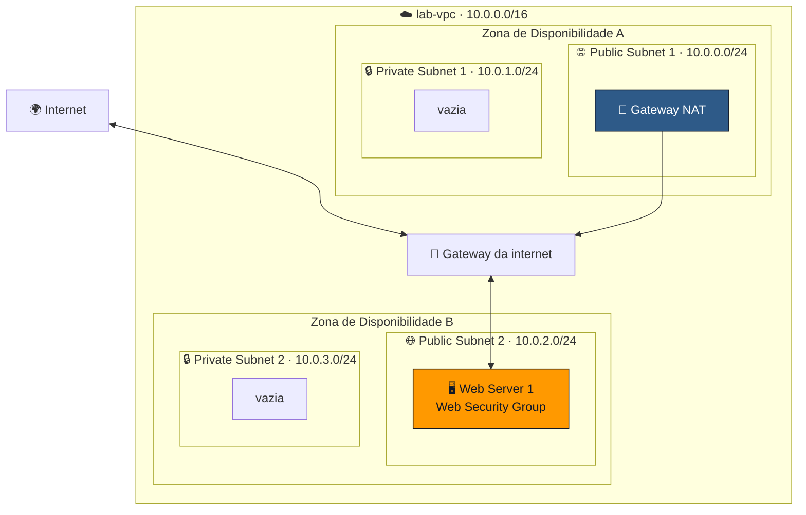
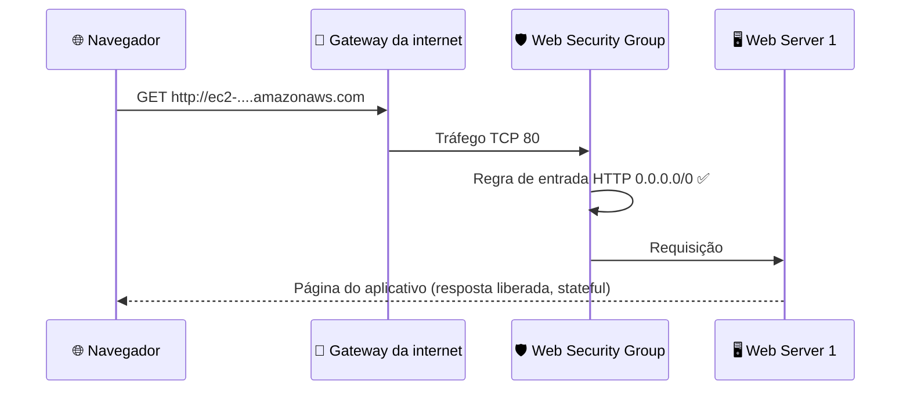

<h1 align="center">🧪 Seção Bônus 2 – Laboratório 2: Crie sua VPC e execute um servidor web</h1>

<p align="center">
  
  
  <br>
  
  
  
</p>

<p align="center">
  <a href="../README.md">🏠 Início</a> &nbsp;•&nbsp;
  <a href="./Seção%20Bônus%20-%20Demonstração%20-%20Amazon%20VPC.md">⬅️ Anterior: Demonstração Amazon VPC</a> &nbsp;•&nbsp;
  <a href="./Seção%204%20-%20Segurança%20da%20VPC.md">Próxima: Segurança da VPC ➡️</a>
</p>

> [!NOTE]
> Este laboratório junta tudo o que foi visto até aqui no módulo: criar uma **VPC** com o assistente, adicionar **sub-redes** em uma segunda AZ, configurar um **grupo de segurança** (adiantando a [Seção 4](./Seção%204%20-%20Segurança%20da%20VPC.md)) e executar um **servidor web** no Amazon EC2. Os nomes e valores abaixo seguem o roteiro do laboratório e podem variar entre versões; siga sempre as instruções do ambiente.

## 📑 Sumário

| # | Tópico |
|:---:|---|
| 1 | [🎯 Objetivos e arquitetura final](#objetivos) |
| 2 | [🪄 Tarefa 1: criar a VPC](#tarefa1) |
| 3 | [✂️ Tarefa 2: criar sub-redes adicionais](#tarefa2) |
| 4 | [🛡️ Tarefa 3: criar um grupo de segurança da VPC](#tarefa3) |
| 5 | [🖥️ Tarefa 4: executar uma instância de servidor web](#tarefa4) |
| 6 | [✅ Testando o servidor web](#teste) |
| 🎯 | [Principais conclusões](#conclusoes) |

---

<a id="objetivos"></a>
## 1. 🎯 Objetivos e arquitetura final

Ao final do laboratório, você será capaz de:

- 🪄 **Criar uma VPC**;
- ✂️ **Criar sub-redes**;
- 🛡️ **Configurar um grupo de segurança**;
- 🖥️ **Executar uma instância do EC2 em uma VPC**.



| Etapa | O que é adicionado |
|:---:|---|
| Tarefa 1 | VPC, 1 sub-rede pública, 1 sub-rede privada, gateway da internet, gateway NAT (AZ A) |
| Tarefa 2 | 1 sub-rede pública e 1 sub-rede privada na **AZ B** |
| Tarefa 3 | Grupo de segurança liberando **HTTP** |
| Tarefa 4 | Instância EC2 com **servidor web** na sub-rede pública da AZ B |

<a id="tarefa1"></a>
## 2. 🪄 Tarefa 1: criar a VPC

No console, abra **VPC → Create VPC → VPC and more** (o assistente visto na [Demonstração](./Seção%20Bônus%20-%20Demonstração%20-%20Amazon%20VPC.md)):

| Configuração | Valor |
|---|---|
| **Name tag auto-generation** | `lab` |
| **IPv4 CIDR block** | `10.0.0.0/16` |
| **Number of Availability Zones** | `1` |
| **Number of public subnets** | `1` |
| **Number of private subnets** | `1` |
| **Public subnet CIDR** | `10.0.0.0/24` |
| **Private subnet CIDR** | `10.0.1.0/24` |
| **NAT gateways** | *In 1 AZ* |
| **VPC endpoints** | *None* |
| **DNS hostnames / DNS resolution** | Ambos **habilitados** |

Resultado: **lab-vpc**, uma sub-rede pública e uma privada na primeira AZ, um **gateway da internet**, um **gateway NAT** (com IP elástico) e as **tabelas de rotas** pública e privada já configuradas.

> [!TIP]
> Confira em **Route tables** que a tabela pública aponta `0.0.0.0/0 → igw` e a privada, `0.0.0.0/0 → nat`. É exatamente o que a [Seção 3](./Seção%203%20-%20Redes%20VPC.md#nat) descreve.

<a id="tarefa2"></a>
## 3. ✂️ Tarefa 2: criar sub-redes adicionais

Para ter **alta disponibilidade**, a rede ganha mais duas sub-redes em uma **segunda Zona de Disponibilidade**. Em **Subnets → Create subnet**, com a VPC **lab-vpc**:

| Sub-rede | Zona de Disponibilidade | CIDR |
|---|---|---|
| 🌐 **Public Subnet 2** (`lab-subnet-public2`) | **Segunda AZ** da Região | `10.0.2.0/24` |
| 🔒 **Private Subnet 2** (`lab-subnet-private2`) | **Segunda AZ** da Região | `10.0.3.0/24` |

Sub-redes novas usam a tabela de rotas **principal** por padrão, então é preciso **associá-las** às tabelas certas em **Route tables → Subnet associations → Edit subnet associations**:

| Tabela de rotas | Adicionar a sub-rede |
|---|---|
| 🗺️ Tabela **privada** (`0.0.0.0/0 → nat`) | `lab-subnet-private2` |
| 🗺️ Tabela **pública** (`0.0.0.0/0 → igw`) | `lab-subnet-public2` |

> [!IMPORTANT]
> Sem essa associação, a "Public Subnet 2" **não seria pública** de verdade: o que define isso é a rota para o gateway da internet, não o nome.

<a id="tarefa3"></a>
## 4. 🛡️ Tarefa 3: criar um grupo de segurança da VPC

Em **Security groups → Create security group**:

| Campo | Valor |
|---|---|
| **Security group name** | `Web Security Group` |
| **Description** | `Enable HTTP access` |
| **VPC** | `lab-vpc` |

**Regra de entrada:**

| Tipo | Protocolo | Porta | Origem | Descrição |
|---|---|:---:|---|---|
| HTTP | TCP | 80 | *Anywhere-IPv4* (`0.0.0.0/0`) | `Permit web requests` |

> [!NOTE]
> Não é preciso criar regra de **saída** para a resposta HTTP voltar ao navegador: grupos de segurança são **stateful** (ver [Seção 4](./Seção%204%20-%20Segurança%20da%20VPC.md#sg)).

<a id="tarefa4"></a>
## 5. 🖥️ Tarefa 4: executar uma instância de servidor web

Em **EC2 → Launch instance**:

| Configuração | Valor |
|---|---|
| **Name** | `Web Server 1` |
| **AMI** | Amazon Linux |
| **Instance type** | `t3.micro` |
| **Key pair** | `vockey` |
| **Network settings → VPC** | `lab-vpc` |
| **Subnet** | `lab-subnet-public2` (Public Subnet 2) |
| **Auto-assign public IP** | **Enable** |
| **Firewall (security groups)** | Selecionar o existente `Web Security Group` |
| **Advanced details → User data** | Script abaixo |

O **user data** é um script executado **na primeira inicialização** da instância. No laboratório, ele transforma a instância em servidor web:

```bash
#!/bin/bash
# Instala o servidor web Apache e o PHP
dnf install -y httpd wget php
# Baixa e descompacta o aplicativo do laboratório
wget <URL-do-pacote-fornecida-no-laboratório>
unzip lab-app.zip -d /var/www/html/
# Liga o servidor web e o mantém ativo após reinicializações
chkconfig httpd on
service httpd start
```

> [!TIP]
> Use o script **exatamente** como está no roteiro do laboratório (inclusive a URL do pacote). Dependendo da versão da AMI, o gerenciador de pacotes pode ser `yum` em vez de `dnf`.

<a id="teste"></a>
## 6. ✅ Testando o servidor web

1. ⏳ Aguarde a instância ficar em **Running** e as verificações de status em **2/2 checks passed**.
2. 📋 Copie o **Public IPv4 DNS** da instância (`ec2-...compute-1.amazonaws.com`).
3. 🌐 Cole em uma nova aba do navegador: a página do aplicativo do laboratório deve aparecer.



| Se a página não abrir... | Verifique |
|---|---|
| ⏱️ O navegador fica carregando até expirar | Regra **HTTP 80** no grupo de segurança; sub-rede associada à tabela **pública** |
| 🚫 Não aparece DNS público | **Auto-assign public IP** estava em *Enable*? **DNS hostnames** habilitado na VPC? |
| 🔒 O navegador força HTTPS | Acesse explicitamente com `http://` (o grupo só libera a porta 80) |
| 📄 Página padrão do Apache | O script de **user data** ainda não terminou ou falhou ao baixar o pacote |

> [!WARNING]
> Ao terminar, clique em **End Lab** no ambiente do laboratório para encerrar a sessão e liberar os recursos.

---

<a id="conclusoes"></a>
## 🎯 Principais conclusões

- ✅ O assistente **VPC and more** cria VPC, sub-redes, gateway da internet, gateway NAT e tabelas de rotas de uma vez.
- ✅ Sub-redes criadas manualmente precisam ser **associadas à tabela de rotas certa** para serem públicas ou privadas.
- ✅ Distribuir sub-redes por **duas AZs** prepara a arquitetura para **alta disponibilidade**.
- ✅ Um **grupo de segurança** com HTTP (porta 80) de `0.0.0.0/0` libera o acesso web; por ser **stateful**, a resposta volta sem regra de saída extra.
- ✅ Para ser acessível pela internet, a instância precisa de **sub-rede pública**, **IP público** e **regra de entrada** no grupo de segurança.
- ✅ O **user data** automatiza a configuração da instância na primeira inicialização.

---

<p align="center">
  <a href="../README.md">🏠 Início</a> &nbsp;•&nbsp;
  <a href="./Seção%20Bônus%20-%20Demonstração%20-%20Amazon%20VPC.md">⬅️ Anterior: Demonstração Amazon VPC</a> &nbsp;•&nbsp;
  <a href="./Seção%204%20-%20Segurança%20da%20VPC.md">Próxima: Segurança da VPC ➡️</a>
</p>
