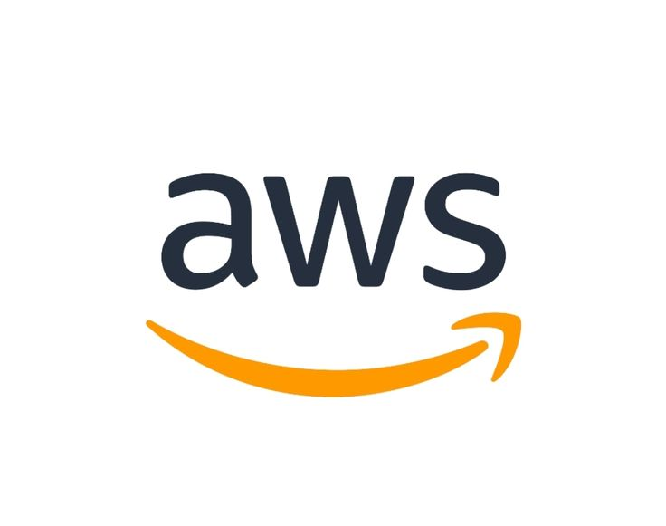

<h1 align="center">Async Activity - AWS Cloud Foundation   
</h1>

<i>Este repositório reúne as anotações da atividade assíncrona do curso <strong>AWS Academy Cloud Foundations</strong>. O objetivo da atividade é consolidar, de forma escrita e organizada, os conceitos fundamentais de computação em nuvem estudados em cada módulo — desde os modelos de serviço e implantação, passando pelas vantagens da nuvem e pela introdução à Amazon Web Services, até o AWS Cloud Adoption Framework (AWS CAF). Registrar o conteúdo seção por seção, acompanhado dos slides de apoio, ajuda a fixar o aprendizado, cria um material de revisão para a certificação <strong>AWS Certified Cloud Practitioner</strong> e serve como referência rápida para consultas futuras.</i>

<h2 align="center" id="tecnologias"> ⛏️💻 Tecnologias Utilizadas:  
</h2>

    
  
  
  
    
    
  
  
   

<h2 align="center" id="arquitetura">🏰 Arquitetura do Repositório  

</h2>
<pre>
RSD-AWS-Cloud-Foundation☁️/
├── MÓDULO 1 /
│   ├── Seção 1 - Introdução à computação em nuvem.md  
│   ├── Seção 2 - Vantagens da Computação em Nuvem.md  
│   ├── Seção 3 - Introdução à Amazon Web Services (AWS).md  
│   ├── Seção 4 - Mudança para a Nuvem AWS – AWS Cloud Adoption Framework (AWS CAF).md  
│   └── Seção 5 - Conclusão do Módulo 1.md  
├── MÓDULO 2 /
│   ├── Seção 1 - Fundamentos da definição de preço.md  
│   ├── Seção 2 - Custo total de propriedade.md  
│   ├── Seção 3 - AWS Organizations.md  
│   ├── Seção 4 - AWS Billing and Cost Management.md  
│   ├── Seção 5 - Suporte Técnico.md  
│   ├── Seção 6 - Conclusão do Módulo 2.md  
│   ├── Seção Bônus - Atividade: Calculadora Mensal.md  
│   └── Seção Bônus2 - Demonstração - Painel de cobrança.md  
├── MÓDULO 3 /
│   ├── Seção 1 - Infraestrutura global da AWS.md  
│   ├── Seção 2 - Visão geral dos serviços e das categorias de serviços da AWS.md  
│   └── Seção 3 - Conclusão do Módulo 3.md  
├── MÓDULO 4 /
│   ├── Seção 1 - Modelo de responsabilidade compartilhada da AWS.md  
│   ├── Seção 2 - AWS Identity and Access Management (IAM).md  
│   ├── Seção Bônus - Demonstração - IAM.md  
│   ├── Seção 3 - Proteção de uma nova conta da AWS.md  
│   ├── Seção 4 - Proteção de contas.md  
│   ├── Seção 5 - Proteção de dados na AWS.md  
│   ├── Seção 6 - Trabalhar para garantir a conformidade.md  
│   └── Seção 7 - Conclusão do Módulo 4.md  
├── MÓDULO 5 /
│   ├── Seção 1 - Noções básicas de redes.md  
│   ├── Seção 2 - Amazon VPC.md  
│   ├── Seção 3 - Redes VPC.md  
│   ├── Seção Bônus - Demonstração - Amazon VPC.md  
│   ├── Seção Bônus2 - Laboratório 2 - Crie sua VPC e execute um servidor web.md  
│   ├── Seção 4 - Segurança da VPC.md  
│   ├── Seção 5 - Amazon Route 53.md  
│   ├── Seção 6 - Amazon CloudFront.md  
│   └── Seção 7 - Conclusão do Módulo 5.md  
│
├── img /
│   ├── aws.jpg 
│   └── mN-secaoN-*.png 
│
└── README.md 
</pre>
